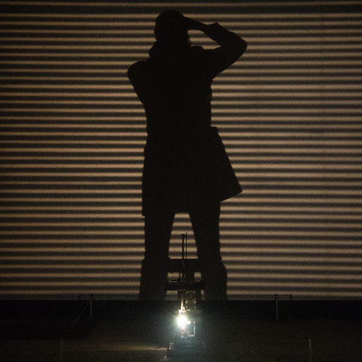

Christophe Seyve
================

Développeur C/C++ en traitement d'images temps-réel, j'ai toujours travaillé en environnement UNIX/Open Source/Logiciels Libres. Je suis entre autres l'initateur du projet Piaf, environnement pour le prototypage d'applications de traitement d'images : http://piaf.googlecode.com/, pour lequel je cherche des utilisateurs et des contributeurs ! 

Photographe amateur, bricoleur, un peu touche à tout donc ne finalisant pas grand chose, j'ai toutefois décidé de meubler mon appartement avec des meubles et objets fait à partir des matériaux que je récupère dans la rue les jours des encombrants. Avec comme objectif d'obtenir un design simple, sobre, élégant et efficace. A mon tableau de chasse : table basse, lampe de chevet, séchoir à chemises, "organiseur" de bureau. 

* Contact : cseyve@free.fr

