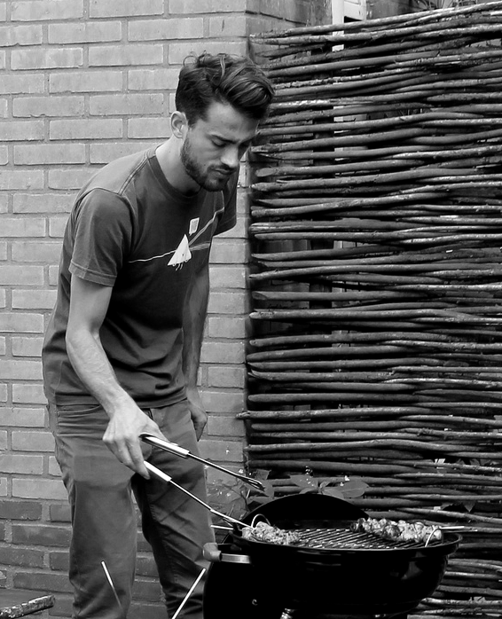

Fritz van Deventer
==================

Fabriqué en 1987, je suis Fritz. J'ai exploré dans mes études la gestion de l'eau
et de la terre, la sociologie, la communication, la philosophie et les
systèmes d'information géographique.

Je travaille dans le domaine géographique en tant que dévelopeur web Django/Javascript
à `Nelen & Schuurmans <http://nelen-schuurmans.nl>`_. Je touche à tout, de la
base de donnée à l'interface utilisateur.

Je suis aussi un membre actif du groupe
`Cheeses of Mexico <http://cheesesofmexico.nl>`_.

* Contact: `@fritzvd <http://twitter.com/fritzvd>`_
