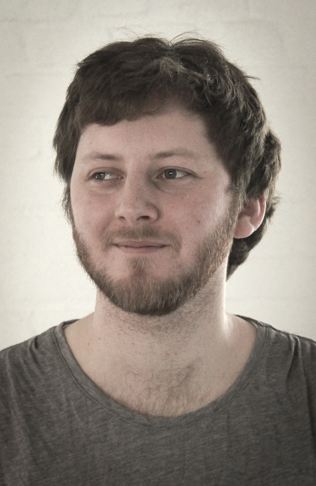

Marcin Ignac
============

   Marcin Ignac

Marcin Ignac est un artiste et un designer qui se concentre sur
les systèmes génératifs et l'animation graphique prodécurale.

Il perçoit son art comme la visualisation d'une idée en constante
évolution. Même si l'inspiration d'origine peut venir de la nature,
d'une série de nombres ou d'une situation particulière dans sa
vie, le résultat final est toujours issu d'un travail sur
la matière et le souhait de la comprendre.

Dans son travail, Marcin est à la recherche l'esthetisme en combinant
simplicité et complexité. Il trouve ses sources d'inspiration et
de beauté dans la structure des organismes biologiques, dans
les schémas qui peuvent emerger des données et enfin dans
la complexité des algorithmes de traitements.

Il a fait des études d'informatique (PUT/PL) et de design interactif (CIID/DK).

Son travail a été présenté dans plusieurs lieux et évènements:

- Mediations Biennale (Poznan/PL)
- Computational Aesthetics (Vancouver/CA)
- Generative Art show (Moscow/RU)

Ainsi que dans le projet de publication de livre génératif Written Images.

Marcin vient de s'installer à Londres où il démarre un nouveau studio
de design spécialisé dans le design génératif et la visualisation de
données: Variable.

Dans son travail, il utilise la programmation pour expérimenter
et découvrir de nouveaux esthetismes émergeants des données, des processus
et des algorithmes.

Liens:

- http://variable.io
- http://marcinignac.com
