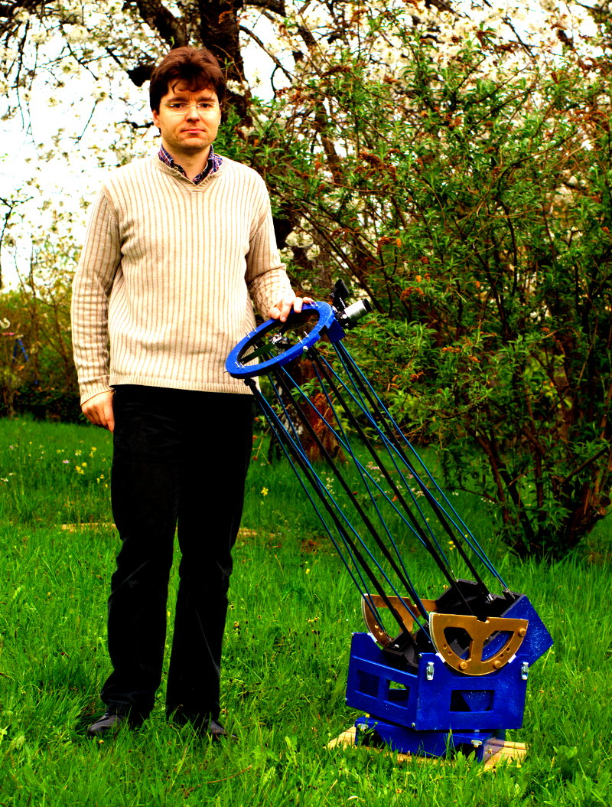

Vincent Becker
==============

Né et élevé dans le bricolage, Vincent Becker poursuit une tradition familiale
qui veut que tout est améliorable, surtout si c'est inutile.

Quand il ne fabrique pas des télescopes, il touche en amateur à l'électronique
et la programmation, notamment avec Arduino et le Raspberry Pi.

Vous pouvez le retrouver sur `Twitter <https://twitter.com/prof_shadoko>`_,
`Facebook <https://www.facebook.com/bricobidules>`_, `Google+
<https://plus.google.com/u/0/b/101120520908479862231/101120520908479862231/posts>`_
et `YouTube <http://www.youtube.com/user/vincentbecker42>`_ ou sur son blog
`Brico Bidules <http://www.bricobidules.com>`_.
