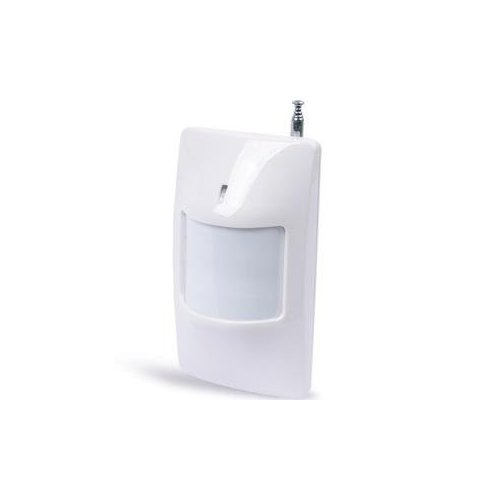
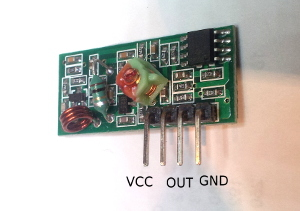
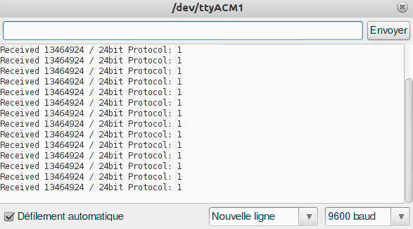
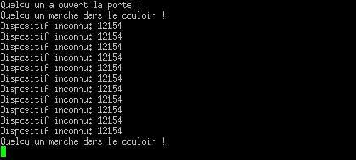

Piloter des dispositifs sans fil
::::::::::::::::::::::::::::::::

:date: 2012-12-12
:category: electronique,informatique
:level: avancé
:author: Jonathan Schemoul

.. image:: leonardo_montage.jpg
   :alt: Montage avec la Leonardo

Partie 1: Réception en 433 MHz
==============================

Vous avez sans doute entendu parler ou vu des détecteurs de fumée, d'ouverture
de porte, des télécommandes, des prises murales, etc. sans fil ?

Que ce soit les modèles chers que vous trouvez en magasin ou les modèles
chinois bon marché, la plupart, s'ils ne sont pas avancés, utilisent la bande
de fréquence 433 MHz (n'essayez pas ceux en 315, ils sont illégaux en France).
Certains autres sont en 2.4 ghz, mais nous les laisserons de coté pour
l'instant.

En ce qui concerne ces capteurs en 433 MHz, il se trouve qu'ils utilisent pour
la plupart un protocole très simple, introduit par des circuits intégrés
chinois à bas coût, les PT2262 côté émission et les PT2272 côté réception
(d'autres plus exotiques comme les SC5262 / SC5272, HX2262 / HX2272, EV1527,
RT1527, FP1527 ou encore HS1527 peuvent être trouvés et fonctionneront aussi).

Plutôt que de nous lancer dans l'acquisition de ces chips, on va utiliser notre
microcontrôleur, plus que capable de le faire, pour décoder et encoder les
signaux, grâce à la librairie RC-Switch pour Arduino, ou RCSwitch-pi pour la
Raspberry Pi.

----

Regardons de plus près ce que nous avons à disposition :

- Un Arduino (ici un Leonardo, mais un Uno ou un clone
  quelconque fera l'affaire)
- Une breadboard
- Un 433 MHz RF link kit (un émetteur, un récepteur)
- Des fils à breadboard

.. image:: composants1.jpg
   :alt: Montage détaillé

Niveau détecteurs :

- Un détecteur d'ouverture de porte
- Un détecteur PIR

.. image:: doorswitch.jpg
   :alt: Détecteur d'ouverture de porte
   :scale: 25

Regardons ce détecteur d'ouverture de porte de plus près :

.. image:: doorswitch-grosplan.jpg
   :alt: Gros plan sur le détecteur d'ouverture de porte
   :scale: 25

On voit bien le PT2262 pour l'encodage et à gauche des jumper pour choisir le
code (ainsi chaque émetteur aura un code différent). Pas besoin de déduire le
code de ces jumpers, on va faire un petit programme Arduino qui nous les dira
au fur et à mesure de leur activation.

Installation de la librairie RC Switch
======================================

Télécharger `RCswitch_2.3.zip <https://code.google.com/p/rc-switch/downloads/detail?name=RCswitch_2.3.zip&can=2&q=>`_
et extraire le contenu dans le sous-repertoire "libraries"
(s'il n'existe pas, créez le) de votre répertoire "sketchbook", pour que cela donne :

- sous Mac, ``/Users/VOTRE_UTILISATEUR/Documents/Arduino/libraries/RCswitch``
- sous Linux, ``/home/VOTRE_UTILISATEUR/sketchbook/libraries/RCswitch``
- sous Windows, ``C:\Users\VOTRE_UTILISATEUR\Documents\Arduino\libraries\RCswitch``

Connexion du récepteur
======================

Le récepteur est simple, il suffit de le connecter au courant (+5v et GND) et à
un pin de l'Arduino ayant une interruption.

Voici un petit tableau des interruptions :

+---------------+-------+-------+-------+-------+-------+-------+
| Carte         | int.0 | int.1 | int.2 | int.3 | int.4 | int.5 |
+===============+=======+=======+=======+=======+=======+=======+
| Uno, Ethernet | 2     | 3     |       |       |       |       |
+---------------+-------+-------+-------+-------+-------+-------+
| Mega2560      | 2     | 3     | 21    | 20    | 19    | 18    |
+---------------+-------+-------+-------+-------+-------+-------+
| Leonardo      | 3     | 2     | 0     | 1     |       |       |
+---------------+-------+-------+-------+-------+-------+-------+

Sur notre Leonardo, si nous voulons connecter notre récepteur sur l'interrupt
0, il nous faut le connecter sur le pin 3 :

.. image:: leonardo_montage.jpg
   :alt: Montage

Recevoir des codes
==================

Pour cela, nous allons lancer l'IDE Arduino et charger l'exemple de RCSwitch,
"ReceiveDemo_Simple".

Pour le Leonardo, il faut ajouter "while (!Serial) ;" avant d'écrire sur le
port série (lié à l'utilisation de l'USB après le lancement) :

.. image:: sketch_demo.png
   :alt: Le code dans Arduino IDE
   :scale: 50

Envoyons le croquis sur la carte, et lancons le moniteur série (Outils >
Moniteur Série, après avoir vérifié que le port était le bon dans Outils > Port
série).

Actionnez votre senseur (ici le détecteur d'ouverture de porte, en écartant les
deux parties) :

.. image:: montage.jpg
   :alt: Montage

Et magie, des codes s'affichent dans le moniteur série :

Ce code, 13464924 dans cette capture d'écran, est l'id unique de votre senseur,
24bit est la taille de celui-ci et 1 le protocole utilisé (ici celui du
PT2262).

Si l'on active un autre senseur (le capteur de mouvement ici, il s'allume en
rouge lorsqu'il détecte un mouvement) :

.. image:: capteur_move.jpg
   :alt: Détéction de moouvement
   :scale: 25

.. image:: deux_codes.jpg
   :alt: Deux codes

On voit que l'on reçoit un nouveau code : **12449942**.

Note : si vous ne voyez rien dans la console avec un Leonardo, c'est quelque
chose qui arrive souvent, n'hésitez pas à ouvrir un autre moniteur série que
celui livré avec l'IDE Arduino. Par exemple, putty fait très bien l'affaire
même sous Linux. La commande "putty -serial /dev/ttyACM2 -sercfg 9600" permet
d'ouvrir ttyACM2 en 9600 baud. (remplacer /dev/ttyACMx par COMx sous windows
:))

Interprétation
==============

De là à garder ces codes et à donner une information humainement
compréhensible, il n'y a qu'un pas.

Essayons d'envoyer une information utile sur le port série

.. code-block:: c

    #include <RCSwitch.h>
    #define couloir 12449942
    #define porte 13464924

    RCSwitch mySwitch = RCSwitch();

    void setup() {
        Serial.begin(9600);
        mySwitch.enableReceive(0);
    }

    void loop() {
      if (mySwitch.available()) {

        int value = mySwitch.getReceivedValue();

        while (!Serial) ;

        switch (value) {
            case porte:
                Serial.println("Quelqu'un a ouvert la porte
    !");
                break;

            case couloir:
                Serial.println("Quelqu'un marche dans le couloir !");
                break;

            default:
                Serial.print("Dispositif inconnu: ");
                Serial.println(value);
                break;
        }

        mySwitch.resetAvailable();
      }
    }

D'abord dans setup() on initialise mySwitch sur l'interrupt 0, ensuite, dans le
loop() lorsque l'on reçoit un message, on agit selon ce qui est reçu. On envoie
un message simple "Quelqu'un a ouvert la porte !" ou "Quelqu'un marche dans le
couloir !" selon le cas.

Voici ce que l'on reçoit sur le port série :

.. image:: Capture-du-2012-12-17-140454.jpg
   :alt: Capture du port série
   :scale: 50

Comme vous pouvez le voir, on a l'information, mais elle se répète. C'est dû à
la nature du protocole, qui ne permet pas de vérifier la réception de
l'information. Du coup, elle est envoyée plusieurs fois pour être sûr de sa
réception.

Pour régler ce problème, il suffit d'ajouter un timer sur la réception, pour ne
l'avoir qu'une seule fois :

.. code-block:: c

    #include <RCSwitch.h>
    #define couloir 12449942
    #define porte 13464924

    RCSwitch mySwitch = RCSwitch();

    // On limite à un évènement par seconde long
    #define debounceDelay 1000

    // On a deux détecteurs, donc on a deux timers.
    last_times[2] = {0,0};

    void setup() {
        Serial.begin(9600);
        mySwitch.enableReceive(0);
    }

    bool debounce(int number) {
        if ((last_times[number] == 0) ||
            ((millis() - last_times[number]) > debounceDelay)) {
            last_times[number] = millis();
            return true;
        }
        return false;
    }

    void loop() {
      if (mySwitch.available()) {

        int value = mySwitch.getReceivedValue();

        // on remet à zero le timer
        while (!Serial) ;

        switch (value) {
            case porte:
                if (debounce(0))
                    Serial.println("Quelqu'un a ouvert la porte !");
                break;
            case couloir:
                if (debounce(1))
                    Serial.println("Quelqu'un marche dans le couloir !");
                break;
            default:
                Serial.print("Dispositif inconnu: ");
                Serial.println(value);
                break;
        }

        mySwitch.resetAvailable();
      }
    }

Notre fonction debounce permet, pour un détecteur donné (de 0 à 1 ici), de dire
si c'est un nouvel événement ou pas. Voici ce que cela donne si j'ouvre la
porte, marche jusqu'à une autre porte puis ouvre cette autre porte inconnue :

Comme vous pouvez le voir, nous n'avons pas de timer sur l'émetteur inconnu
mais on en a un sur ceux qui sont connus.

La suite ?
==========

Dans la deuxième partie nous verrons comment envoyer des signaux à une prise en
433 MHz, et envoyer et recevoir des signaux entre Arduino selon le même
principe.

