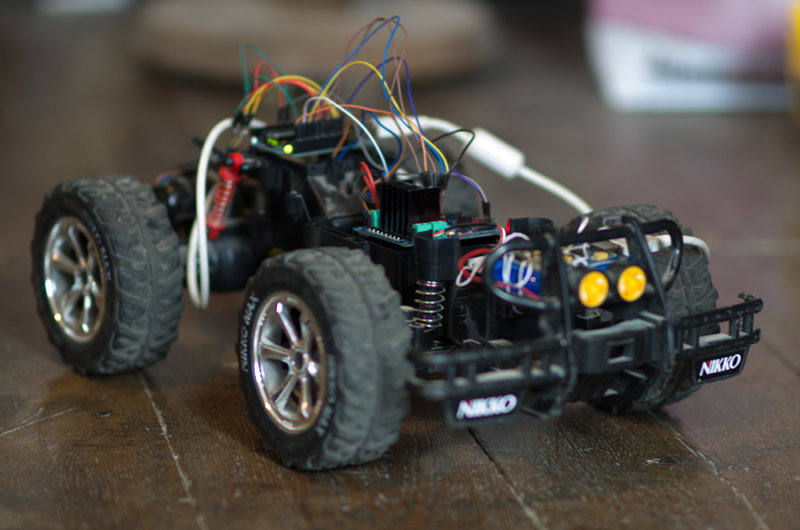

Edito Janvier 2013
==================

Vous affichez sur votre écran le tout premier numéro de *Fait Main*,
un magazine en ligne qui couvre plusieurs sujets, à savoir :

- l'informatique,
- l'électronique,
- la cuisine
- l'art,
- et enfin l'écologie.

Certains de ces sujets peuvent paraitrent éloignés les uns des autres,
comme l'écologie de l'électronique — mais en y réfléchissant les
projets les plus originaux et intéressants sont souvent à la croisée
de plusieurs domaines.

Un projet à base d'`Arduino <http://arduino.cc/>`_ pour contrôler un fumoir
à saumon ou de la cuisine sous vide, un logiciel de domotique pour diminuer
la facture d'électricité, un script Python de génération de musique, sont
autant d'applications très concrètes de savoir faire en informatique,
éléctronique.

Nous entrons dans l'époque reine du **Do It Yourself**, où, pour un budget
raisonnable, n'importe lequel d'entre nous peut réaliser un
projet avancé — que ce soit en soudant quelques composants sur
un Arduino ou un `Raspberry Pi <http://raspberrypi.org>`_, ou en commandant
l'usinage de 10 pièces moulées sur un service en ligne.

*Fait Main* a pour objectif de montrer à travers ses articles
ce qu'il est possible de faire avec les outils d'aujourd'hui et sans
dépenser des sommes folles. *Fait Main* a envie d'éveiller la créativité
de chaque lectrice et lecteur, et peut-être de lui donner l'envie de se lancer
dans son propre projet DIY.

----

Le magazine qui se rapproche finalement le plus de ce que je souhaite
faire avec *Fait Main* est le magazine américain `Make <http://makezine.com>`_.

*Fait Main* sera dans un premier temps trimestriel et à chaque numéro, nous
présenterons une série d'articles qui pourront être lus sur mobiles, tablettes
et ordinateurs, dans une mise en page très épurée et sans chichi.

Chaque article essayera de toucher au moins deux des domaines cités,
et nous chercherons sans cesse de nouveaux auteurs qui auront envie de
participer à un numéro.

L'objectif à terme est de faire de *Fait Main* un magazine participatif
où chacun puisse venir proposer un article et être relu par d'autre
passionés, puis édité.

*Fait Main* est entièrement gratuit et son contenu est distribué sous
licence `CC-By-NC-SA <https://creativecommons.org/licenses/by-nc-sa/2.0/>`_,
et l'auteur(e) de chaque article conserve tous ses droits.

L'objectif de cette licence est de protéger le contenu des auteur(e)s afin
qu'il ne puisse pas être réutilisé sur le web à des fins commerciales.

Le magazine est conçu sur **github** à cette adresse : https://github.com/faitmain

Si vous souhaitez participer à ce projet, la page http://faitmain.org/apropos.html
regroupe toutes les informations nécessaires.

Contenu du Numéro de Janvier
::::::::::::::::::::::::::::

Le premier article présente une application de reconnaissance de
feuille écrite pendant un Hackathon.

C'est l'application qui a été écrite
en 24 heures par Olivier, Ronan & Tarek lors du dernier **AngelHack** à Paris.

On y parle de machine learning
au service des plantes, des *hackathons* de programmation & de *responsive design*.
`Lire l'article <http://faitmain.org/janvier-2013/wtf.html>`__

Le deuxième article présente le travail de Marcin Ignac: des méduses
animées en 3D. Des captures d'écran de ces méduses ont ensuite été utilisées
faire partie d'un projet de livre génératif.

On y parle d'**animation procédurale**, de **processing.js** & d'hachurage.
`Lire l'article <http://faitmain.org/janvier-2013/cindermedusae.html>`__

Le troisième article parle de **domotique** et vous explique comment
piloter des dispositifs sans fils - portails, détecteurs de mouvements etc.

On y parle d'**Arduino**, de **Raspberry-PI** et de signal en **433 mhz**.
`Lire l'article <http://faitmain.org/janvier-2013/dispositifs.html>`__

Bonne Lecture!

Equipe
::::::

Le projet *FaitMain* est monté par `Tarek Ziadé <http://ziade.org>`__ mais
est surtout possible grâce aux créateurs d'articles et aux relecteurs.

Ont participé à ce numéro :

- Yannick Jost, Xavier Fernandez, Mathieu Agopian - relectures
- `Tarek Ziadé </auteurs/tarek.html>`__ - Article "What The Feuille",
  Traduction "Cindermedusae"
- `Marcin Ignac </auteurs/marcin_ignac.html>`_ - Article "Cindermedusae".
- `Jonathan Schemoul </auteurs/jonathan_schemoul.html>`_ - Article "Dispositifs sans fils"

