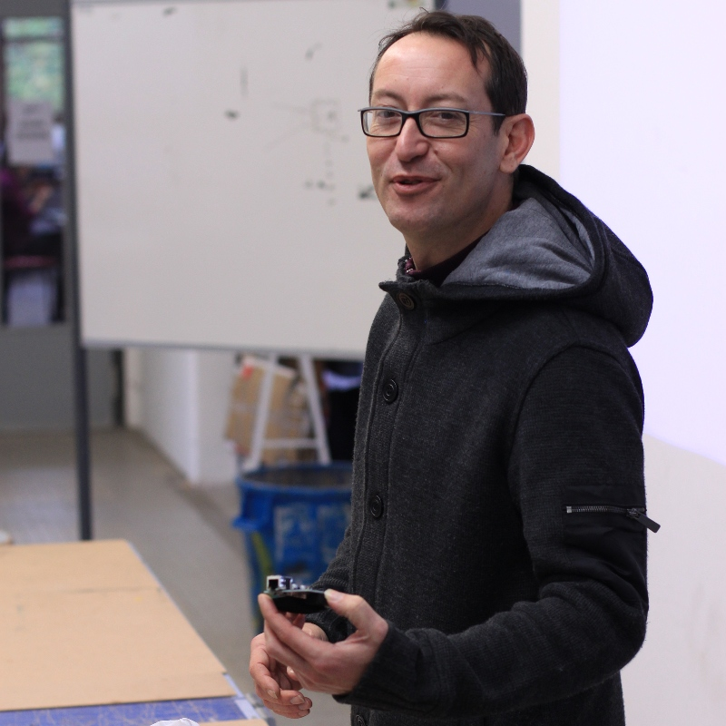

Rencontre au LabFab de Rennes
=============================

:date: 2013-01-13
:category: electronique,informatique,art
:level: vulgarisation
:author: Florian Strzelecki

         du LabFab

Depuis que je fréquente Hugues Aubin aka 
`@Hugobiwan <https://twitter.com/Hugobiwan>`_ sur Twitter, je suis chaque fois
surpris non seulement par ses projets et par les nouvelles qu'il apporte, mais
aussi (et surtout) par la ferveur et l'énergie qui l'anime.

Rencontre avec le porteur du projet "LabFab", un *FabLab* à Rennes, qui
a ouvert ses portes l'année dernière, et qui va bientôt employer à temps plein
une personne pour accueillir le public.

----

Petite introduction
:::::::::::::::::::

Lorsque je lui demande de se présenter en quelques mots, il me tend sa carte :
Hugues Aubin, "Chargé de Mission TIC", sous les logos de Rennes Métropole et de
la Mairie de Rennes. Sa situation est assez exceptionnelle pour être notée, car
elle lui permet de faire le pont entre des activités de la ville, et les
activités de toute l'agglomération.

Son lien avec le LabFab ? Il l'a mis en place, en contactant les bonnes
personnes, et en réunissant des acteurs locaux qui se posaient déjà les mêmes
questions sur les LabFab, les Hackerspaces, et tous ces lieux qui proposent des
espaces de fabrication au plus proche des gens.

Parce que le LabFab ne s'est pas fait tout seul ! D'abord, il y a 
`l'Ecole européenne supérieure d'Art de Bretagne <http://www.erba-rennes.fr/>`_,
qui prête des locaux pour le LabFab. Et tout comme
`Telecom Bretagne <http://www.telecom-bretagne.eu/>`_, l'intérêt pour eux
est ce qu'un LabFab apporte aux étudiants.

Il y a la ville de Rennes, ainsi que
`Rennes Métropole <http://metropole.rennes.fr/>`_, qui s'intéressent tout
deux à ce qu'un LabFab peut apporter à ses habitants. Et n'oublions pas non plus
la région `Bretagne <http://www.bretagne.fr/>`_, qui participe pour des raisons
similaires.

Enfin il y a les associations `BUG <http://www.asso-bug.org/>`_ et la
`Cantine Numérique Rennaise <http://www.lacantine-rennes.net/>`_, (CNR) centrés
sur les communautés et les nouvelles technologies, ce que représente
parfaitement un LabFab.

L'expérience du LabFab à Rennes
:::::::::::::::::::::::::::::::

La question qui revient souvent, me dit-il, c'est comment apprivoiser ces
espaces ? Comment les inclure dans la société et dans ses projets ? Parce que
même s'il ne fait pas de doute que ces lieux ouverts sont très intéressants, il
reste à savoir comment les mettre en place.

À l'origine, le but de l'expérience est d'essayer quelque chose, et d'essayer
vite, en investissant peu de moyen d'un part, mais surtout sans attendre
quelque chose en retour : ni objectif, ni réussite, ni résultat particulier.
Le but est justement de savoir comment ça va se passer, comment l'espace
est pris en main, et qui s'y intéresse.

----

Alors avec juste quelques hommes, des locaux et un peu de matériel, le LabFab
est mis en place, avec différents axes de recherche.

Tout d'abord, que le lieu soit utile aux gens qui viennent. Qu'il serve
à l'éducation populaire pour accéder au numérique, et aux objets qui touchent
à ces technologies. Hugues insiste d'ailleurs sur l'approche de consommation
actuelle de la technologie, qui amène selon lui peu d'innovation, et qui bloque
l'émergence de nouveaux usages, notamment démocratiques.

    Aujourd'hui, Internet sort des PCs, mais il reste l'apanage des
    spécialistes et de ceux qui savent.

L'école des Beaux Arts formant des étudiants au design, elle cherche à obtenir
plus d'intégration dans la fabrique de nouveaux usages, avec les technologies
de l'information (réseau, électronique, communication inter-objets, etc.), dans
les savoirs dispensés.

    Ils veulent générer une dynamique entre les étudiants et l'usage du LabFab.

On retrouve aussi cette notion de mixité que ce soit pour la ville ou Télécom
Bretagne : comment faire venir autant des professionnels que Monsieur et
Madame tout le monde ? Comment intéresser à la fois des ingénieurs, des
chercheurs et des spécialistes ? Des jeunes, vieux, amateurs, néophytes et tous
les curieux ?

    Il y a une réelle volontée d'attirer tout le monde en même temps.

Les axes de recherche ne manquent décidément pas, et Hugues est intarissable
sur le sujet. Il me raconte pêle-mêle que ce projet apporte un tas de
questions, que les gens se posent un tas de question : quel va être le regard
des experts auprès des amateurs ? Quelles questions est-ce que cela pose, de
fabriquer des choses sans brevet, sans règles sur la "propriété intellectuelle" ?

Sans compter que si le LabFab s'inscrit dans un environnement local, il y à une
volontée d'essemer, de faire qu'un écosystème international se développe.

    En 2012 à Monréal lors du MakerFair, ce qui se voyait le plus c'était
    "tout le monde monte son FabLab" !

Le public et le réseau des FabLab
:::::::::::::::::::::::::::::::::

Parce que le LabFab de Rennes, ce n'est qu'un tout petit élément finalement.
Depuis début 2012, c'est un véritable réseau de lieux qui est en train de se
développer : Hugues me parle du Vietnam, de Québec, de Dakar, ou encore du
Burkina Faso, bref, tout un ensemble de pays avec des communautés francophones.

    Le problème rencontré aujourd'hui en Afrique, c'est qu'ils apprennent
    éventuellement leur langue maternelle et le français, mais rarement
    l'anglais. Alors que les documentations techniques, elles, sont toutes en
    anglais.

La traduction des documents et le partage de ces traductions, est devenu l'un
des objectifs du LabFab.

Parce que le public aujourd'hui est vraiment très hétérogène : j'ai pu
moi-même m'en rendre compte avec une petite scéance photo lors d'un atelier sur
Arduino.

    Nous avons des artites, des vieux bricoleurs, etc. L'année dernière avec la
    CNR, c'est 26 ateliers que nous avons fait. Et ils ont tous été complet en
    moins de 48h ! Ça représente plus de 450 débutants qui ont été formés !

Le succès est au rendez-vous, parce qu'outre les ateliers fréquents, il
y a les différents salons auxquels est invité Hugues pour parler du FabLab
Rennais :

    Entre Laval Virtual et le forum des usages à Brest, Vivacité, nous avons
    aussi reçu des invitations pour aller à l'étranger. Ce n'était pas prévu
    du tout à l'origine.

----

         Arduino.

Hugues ayant un emploi du temps de ministre, l'entretien touche bientôt à sa
fin, et il y a encore une question ou deux que je me pose. La première, c'est
"comment peut-on utiliser le LabFab ?".

    Il n'y a pas de règles très précises. Les gens doivent venir avec un
    projet, c'est à dire une phrase qui présente le projet et éventuellement un
    dessin de ce que c'est censé faire, et c'est tout. On ne juge pas des
    projets, chacun peut faire ce qu'il a envie, et chacun a accès au matériel
    du LabFab (kit Arduino pour du prototypage, une MakerBot, etc.). On demande
    seulement à ce que le porteur du projet partage quelque chose en échange.

Intrigué, je lui demande pourquoi cette règle : pourquoi ne pas simplement
imposer une licence ou proposer des licences libres - puisque c'est le but.

    Les gens qui viennent n'ont pas forcément la culture du logiciel libre ou
    de Creative Commons. Parfois ils ne savent même pas que ça existe. Alors
    on leur demande de partager quelque chose : leur produit, une compétence,
    un savoir ou une petite partie de leur projet. Certains arrivent et savent
    tout de suite quelle licence utiliser, mais la majorité découvrent le
    concept en venant ici.

Ça laisse songeur…

Le futur du LabFab
::::::::::::::::::

Le succès étant au rendez-vous, Hugues est serein pour l'avenir. Il a présenté
un rapport d'activité à Rennes Métropole le 21 Décembre dernier, un bilan d'une
quarantaine de pages qu'il m'invite à télécharger sur le site du LabFab une fois
publié.

Il est plein d'espoir pour 2013, surtout qu'il a obtenu la création d'un poste
à temps plein pour l'année. Et puis il y a tellement de projets, et tellement
d'expériences à tenter.

Le lendemain de notre entretien, je suis passé à un atelier sur "Arduino
connecté", où j'en ai profité pour faire quelques photos. Il y avait quelque
chose de magique à voir autour de cette table toutes ces personnes : plusieurs
étudiants, un vieux pépé qui a fait de l'électronique, un couple qui vient en
apprendre plus, et tous avec des connaissances et compétences très variés.

Si seulement j'avais un peu plus de temps… En tout cas, je vous invite à
franchir les portes de ce FabLab, il y a plein de bonnes choses.
