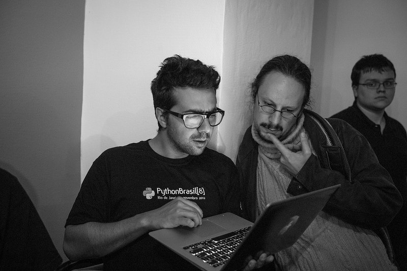
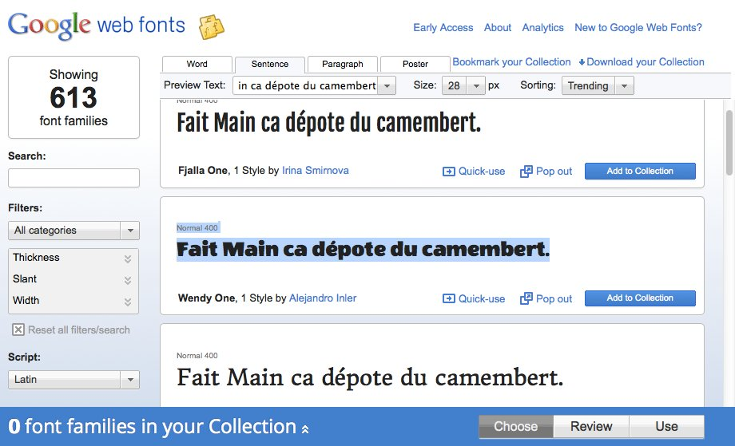

What The Feuille ?
==================

:date: 2012-12-12
:category: ecologie,informatique
:level: vulgarisation
:author: Tarek Ziadé

Le `Hackathon <https://fr.wikipedia.org/wiki/Hackathon>`_ est un mot-valise,
m'apprend Wikipédia — contraction de *hacking* et de *marathon*. Un
*marathon de hacking* est un évènement durant lequel des
développeurs vont travailler ensemble pour tenter d'accélérer le développement
d'un projet en se concentrant dessus le temps d'un week-end ou parfois
d'une semaine.

Dans la communauté Python, on parlera plus de *sprints*, terme inventé par
Tres Seaver pour décrire les réunions de 2-3 jours pendant lesquelles
des paires de programmeurs bossaient sur Zope 3 — un logiciel écrit
en Python.

Les *Hackatons* organisés par `AngelHack <http://www.angelhack.com/>`_ sont
encore une autre variante : vous avez 24 heures pour produire un projet de A à Z
dans des locaux où tous les participants se réunissent et restent éveillés
toute la nuit — soignés à coup de pizzas et Red Bull par les organisateurs.

A la clé, la possibilité de gagner un A/R à San Francisco pour pitcher
des Angel Investors de la Silicon Valley.

La plupart des projets sont des applications web. Plus rarement des applications
desktop ou du hardware.

Il ne faut pas se leurrer, à mon avis, derrière la plupart des équipes participantes
se cachent des startups en devenir qui planchent sur leur sujet depuis des
mois voir des années — pour elles, un concours comme AngelHack est une opportunité
de s'exposer aux investisseurs, voire d'avoir la chance d'aller leur rendre
visite en Californie.

----

De mon coté — la partie startup/pitch ne présentait aucun intéret. Mais
l'idée d'essayer d'écrire une appli fonctionnelle et moderne en
24h par contre...

On s'est donc inscrit avec Olivier & Ronan et on a participé au concours
sans carte de visite, ni rien à vendre — juste l'envie de hacker une appli.

What The Feuille
::::::::::::::::

*What The Feuille* c'est l'excellent nom trouvé par Olivier pour l'application
que l'on a décidé de construire pendant le hackathon.

Le but de cette application est de deviner de quelle plante ou quel arbre provient
une feuille que l'on vient de prendre en photo depuis son mobile ou sa tablette.

.. note::

    Oui, j'ai déjà vu des promeneurs prendre des photos avec une tablette en forêt.

On a choisi assez rapidement d'écrire cette application web entièrement en
Javascript et HTML5 pour le coté utilisateur, sans passer par des dévelopements
spécifiques à la plateforme iOS ou Android pour plusieurs raisons :

- même si des outils comme `PhoneGap <http://www.phonegap.com/>`_ permettent de
  développer une application mobile qui est ensuite compilée pour chaque plateforme
  native, le principe de subir une modération sur l'app store d'Apple ou Google Play
  nous rebute profondément.

- le HTML5 et le Javascript sont compris par *tous* les périphériques, et notre
  application n'a pas besoin d'accéder à des fonctionnalités avancées des mobiles
  ou tablettes, comme l'envoi de texto.

- le HTML5 et le Javascript pour les applications mobile, c'est l'avenir !

- avec un peu de *responsive design*, la même interface marchera aussi sur les
  ordinateurs de bureau ou laptop. Cette technique consiste à adapter la mise
  en page en fonction du périphérique qui se connecte sur le site : téléphone,
  tablette, ou ordinateur. En fonction de la taille de l'écran, le serveur
  essayera d'optimiser l'affichage.

Côté serveur, l'application web n'a pas grand chose à faire : servir 2 ou 3 écrans,
récupérer les photos et les stocker, et enfin lancer l'algo d'apprentissage
automatique - ou *machine learning* en anglais.

Mais mine de rien, ce genre d'application touche à pas mal de domaines de programmation :

- du `responsive design <https://fr.wikipedia.org/wiki/Responsive_Web_Design>`_, de
  manière à pouvoir afficher l'application sur une tablette, un téléphone, etc ;

- du stockage d'images et de méta-données associées, avec potentiellement
  beaucoup, beaucoup d'entrées ;

- une bonne dose de Javascript pour les interactions avec l'utilisateur ;

- du `machine learning <https://fr.wikipedia.org/wiki/Machine_learning>`_ pour
  toute la partie intelligente ;

- de la programmation web pour lier le tout, avec les composantes classiques
  comme l'identification, le templating, etc.

----

Pour résumer le fonctionnement dans un schéma simple :

.. image:: wtf-schema.jpg
   :alt: C'est pas compliqué...
   :scale: 50

L'utilisateur trouve une feuille — où l'arrache discrètement, puis
dégaine son portable pour prendre un cliché, et demande à notre
serveur de reconnaître la feuille.

En détail, le *flow* est le suivant :

1. La page principale permet d'uploader une photo géolocalisée.
2. La photo est stockée sous un nom unique sur le disque dur du serveur.
3. L'utilisateur *édite* la photo en indiquant au doigt (ou à la souris)
   le haut et le bas de la feuille.
4. Les informations de positionnement sont envoyées au serveur, qui
   redimensionne la photo.
5. La photo est mise à jour et affichée pour que l'utilisateur valide
   l'édition.
6. L'algorithme de reconnaissance de feuilles cherche ensuite
   dans la base les feuilles considérées comme similaires.
7. Une liste de suggestions d'arbres/plantes est ensuite proposée,
   et l'utilisateur peut en choisir une.
8. Enfin, toutes les informations sur la photo sont stockées dans
   la base de données.

Le va-et-vient entre 3. et 4. est dû au fait que toutes les transformations
de l'image de la feuille se font sur le serveur, car à moins d'écrire une
application native à chaque périphérique, Javascript est assez limité
sur ce genre de fonctionnalités.

.. image:: wtf-edition.jpg
   :alt: Edition de la feuille

D'autres fonctionalitées mineures que nous avons ajoutées au fil de la nuit
sont un *plantopedia* — une page qui liste les plantes et arbres avec
les feuilles correspondantes trouvées dans la base ; une page d'accueil
qui affiche les dernières photos uploadées et enfin un système
d'authentification basé
sur `Mozilla Persona <https://fr.wikipedia.org/wiki/Mozilla_Persona>`_

Responsive ?
::::::::::::

Créer un joli design *responsive* en 24 heures est impossible sans utiliser
un toolkit qui mâche le travail. Le plus souple et le plus
puissant est `Bootstrap <http://twitter.github.com/bootstrap/>`_, qui permet
très rapidement de créer un design propre et qui s'adaptera tout seul comme
un grand à n'importe quel type de périphérique.

L'autre grande qualité de Bootstrap est de permettre à des développeurs
comme moi qui n'ont aucune notion de design, de faire une application
web à peu près jolie, avec des boîtes qui s'alignent bien, un rendu
moderne et standard.

C'est aussi le gros défaut de Bootstrap finalement : rien ne ressemble plus
à un site fait avec Bootstrap qu'un autre site fait avec Bootstrap, souvent
car les intégrateurs se sont contentés de copier-coller les mises en page
fournies en exemple, et aussi parce que il y a un *Bootstrap look and feel*.

Mais pour notre hackathon, c'est parfait !

Si vous avez envie de tester Bootstrap, je vous conseille de tester
`Bootswatch <http://bootswatch.com/>`_ qui offre plusieurs thèmes pour
Bootstrap. C'est un excellent moyen de démarrer son propre thème.

La *killer feature* de Bootswatch c'est son *Bookmarklet* en bas de la page.
Un lien à déposer dans Firefox dans la barre des bookmarks et *hop !*, un
menu déroulant permet d'essayer les thèmes fournis par le projet
en live sur n'importe quel site fait avec Bootstrap !

.. image:: bootswatch.jpg
   :target: http://bootswatch.com
   :alt: Le bookmarklet de bootswatch en plein action

----

L'autre outil indispensable pour un design propre en 24 heures, c'est
`Google Web Fonts <https://www.google.com/webfonts>`_.

En quelques minutes, on trouve forcément une police qui nous plait,
et il suffit d'ajouter un lien vers la CSS fournie par Google.

En deux heures, les premières pages de What The Feuille étaient
affichées sur notre navigateur, et correctement retaillées sur
nos téléphones.

Il a quand même fallu par la suite tout le talent de Ronan pour ajouter
un logo, une texture de fond de page sympa et tous les petits réglages
qui ont donné à notre appli web un vrai look pro.

Du Javascript
:::::::::::::

Pour toutes les interactions avec l'utilisateur — et les petits effets
spéciaux, `jQuery <http://jquery.com>`_ est incontournable. De toute
façon, il est disponible d'office dans un environnement Bootstrap.

On s'est servi de jQuery pour le positionnement interactif des feuilles
par exemple. L'utilisateur *clique* sur la feuille pour indiquer le
haut et le bas, avec son doigt sur un écran tactile ou sa souris.
Les coordonnées sur l'image sont envoyées au serveur, qui applique
une rotation de l'image.

.. image:: editeur.jpg
   :alt: Tape ta feuille.
   :scale: 50

On est loin de la barre d'outils de Photoshop, mais l'idée est là :
l'utilisateur peaufine son image avant de demander au serveur de faire
une reconnaissance de la plante ou l'arbre.

Ce genre de fonctionnalité n'est pas dure à ajouter mais prouve
qu'il est possible d'écrire des applications mobiles un minimum interactives
basées sur HTML5 et Javascript.

Elastic Search
::::::::::::::

Les photos uploadées dans l'application sont stockées sur le disque
dur, ainsi que les différents thumbnails, générés à la demande.

`Elastic Search <http://elasticsearch.org>`_ est le système que
nous avons choisi pour stocker toutes les autres informations.

Ce n'est pas une base de données dans le sens strict du terme,
mais un moteur de recherche basé sur le très performant
`Apache Lucene <https://lucene.apache.org/>`_.

Au vu des données que nous stockons, et au vu des requêtes à
réaliser — comme par exemple une liste de feuilles correspondant
à une plante donnée, en batch — Elastic Search est l'outil idéal.

----

Elastic Search ajoute au dessus de Lucène un service web
qui permet d'indexer et de rechercher en utilisant des messages
*JSON*, ce qui nous permet de ne pas avoir à manipuler du *XML*,
qui est le format d'échange natif de Lucene — et assez laborieux.

Mais Elastic Search c'est bien plus que ça. Les données indexées
sont *schemaless*, c'est-à-dire qu'il n'est pas nécessaire comme
la plupart des moteurs de recherche de définir pour chaque type
de document les valeurs à indexer. On passe un dictionnaire
JSON à Elastic Search et il se débrouille comme un grand pour
créer ou mettre à jour le schéma.

L'autre intérêt d'Elastic Search est la possibilité de déployer
plusieurs serveurs et de le laisser *sharder*
les données de manière redondante — c'est-à-dire de distribuer
les données sur au moins deux serveurs de manière à ne rien
perdre si un des serveurs tombe.

Pour le hackathon, on ne déploie qu'une machine avec tous les
élements, mais potentiellement, si on prend en photo toutes
les feuilles de la planète, le sharding devient indispensable.

Le Cloud
::::::::

En parlant de déploiement, nous avons choisi de mettre l'application
sur un serveur `Amazon EC2 <https://aws.amazon.com/ec2/>`_ de
type `Spot Instance <https://aws.amazon.com/ec2/spot-instances/>`_
pour minimiser les coûts au maximum pour ce premier prototype.

Les *Spot Instance* sont des serveurs chez Amazon qui ne sont pas
attribués à des clients fixes et dont le prix de location fluctue
en fonction de l'offre et de la demande.

C'est un système malin pour réduire le parc de machines non utilisées :
Amazon met à jour en temps réel son prix de location, et pour
obtenir une *Spot Instance* il faut faire une enchère dont le
montant est supérieur au prix fixé.

L'avantage est que l'on peut avoir une machine à un prix
très avantageux, comme l'explique `cet article <http://cloudcomments.net/2011/05/16/dont-forget-spot-instances-on-aws/>`_.

Le gros inconvénient est que si le prix fixé par Amazon dépasse
le prix de votre enchère, vous perdez brutalement la machine.

Pour notre démo, ce n'est pas très grave — et même à terme, on
peut très bien imaginer une architecture ou des machines
Spot Instance sont utilisées comme noeuds pour Elastic
Search — du moment que l'ensemble est tolérant à la disparition
d'un des noeuds.

Les données sont stockées dans un volume `EBS (Elastic Block Store) <https://aws.amazon.com/ebs/>`_,
qui est complètement indépendant des instances. Un EBS est simplement
monté comme volume supplémentaire au démarrage d'une ou plusieurs
instances. Les EBS sont *hautement disponibles*, contrairement aux
spot instances, si bien qu'il est possible de déployer des projets
dont les bases de données sont stockées sur un EBS et dont toutes les
applications exécutées sur des instances plus ou moins fiables.

Il existe d'autres *cloud providers* comme `Rackspace <https://www.rackspace.com/>`_,
qui offrent encore d'autres solutions — mais Amazon est probablement le provider
qui offre le plus d'options et de souplesse, et permet de s'adapter à tout
type de projet.

Bien sûr, toute cette belle technologie déployée sur http://whatthefeuille.com
n'avait aucun intérêt pour notre démo — puisque le WiFi était trop mauvais :
les manipulations ont été présentées sur une version locale |thumbsup|.

La partie web
:::::::::::::

Pour ce projet la partie web a pour principaux objectifs :

- l'authentification des utilisateurs
- le requêtage de la base Elastic Search
- le calcul et l'affichage de pages HTML

Il existe une pléthore de frameworks qui permettent de fournir ces fonctionalités,
et nous avons choisi `Pyramid <http://www.pylonsproject.org/>`_ pour pouvoir
recycler une petit application existante qui une fois dépouillée de son contenu, nous
a fourni un squelette avec tout les outils nécessaires.

Sans cette application de départ, nous aurions probablement choisi
un outil plus léger, comme le *micro-framework*
`Bottle <http://bottlepy.org/docs/dev/>`_ ou
`Flask <http://flask.pocoo.org/>`_ qui permettent de monter une application
web en Python en quelques lignes.

La définition de *micro-framework* est vague, mais dans le monde
Python, elle regroupe les outils dont le principal objectif est
de simplifier au maximum la création d'une application web, au
détriment des fonctionnalités secondaires habituellements fournies
dans les frameworks web. Il est rare par exemple de retrouver des
fonctionnalités de permissions très avancées, ou des systèmes de
schémas de base de donnés.

Bottle par exemple est un framework distribué dans un seul module
Python - et il est nécessaire d'intégrer des librairies externes
pour la plupart des fonctionnalités avancées.

Pyramid reste malgrès tout un bon choix, même en partant de zéro. Même
si démarrer une application avec ce framework est un exerice plus contraignant,
c'est en général un choix gagnant à moyen terme. En effet, il est assez
fréquent de voir les projets qui grossissent abandonner les micro-frameworks
pour passer à des outils qui fournissent plus de fonctionnalités de base.

Voici un exemple de code Pyramid dans notre application :

.. code-block:: python

    @view_config(route_name='plants', request_method='GET',
                 renderer='plants.mako')
    def plants(request):
        """Plants page."""
        query = StringQuery('*')
        plants = request.db.search(query, size=10, indices=['plants'],
                                  sort='name')

        data = {'messages': request.session.pop_flash(),
                'user': request.user,
                'gravatar': gravatar_image_url,
                'came_from': request.path_qs,
                'plants': plants,
                'format_date': format_es_date}

        return data

Cette fonction est appelée quand l'utilisateur visite l'URL **/plants**.
*request.db.search* lance une recherche sur la base Elastic Search pour
récuperer les 10 premières plantes. *data* est un dictionnaire qui contient
toutes les données nécessaires à l'affichage. Dans ce cas, la liste des
plantes, et quelques données annexes comme l'utilisateur (*user*).

La fonction renvoie à Pyramid le dictionnaire et indique le nom
du template a utiliser : *plants.mako*. Le rendu est automatiquement généré
et renvoyé par le framework.

Le reste de l'application est construit sur le même modèle : une fonction
par URL.

L'authentification est gérée par `Mozilla Persona <https://fr.wikipedia.org/wiki/Mozilla_Persona>`_,
l'affichage des pages est obtenue via le moteur de template `Mako <http://docs.makotemplates.org/>`_
et les formulaires validés via `FormEncode <http://www.formencode.org>`_.

Enfin le requêtage d'Elastic Search est fait par la librairie `pyes <http://packages.python.org/pyes/>`_.

La partie intelligente
::::::::::::::::::::::

.. image:: scikit-image.jpg
  :target: http://scikit-image.org/
  :alt: Scikit-image en action.
  :scale: 50

La partie la plus intéressante est la reconnaissance des feuilles bien sûr,
et pour la mettre en oeuvre, nous avons utilisé la librairie Python
`scikit-image <http://scikit-image.org/>`_
qui fournit un ensemble d'algorithmes pour la vision artificielle.

Chaque feuille entrée dans l'application subit d'abord une rotation et
une normalisation de taille, afin d'avoir un jeu de données le plus
homogène possible. La rotation consiste à positionner avec l'aide de
l'utilisateur le haut de la feuille en haut au milieu de l'image
et le bas de la feuille, sans compter la tige, en bas au milieu.

Ces étapes de normalisation améliorent grandement les résultats
puisque l'algorithme de reconnaissance ne sait pas qu'il manipule
des feuilles. Il se contente d'essayer de détecter sur chaque photo
le maximum de *zones d'intérêt*, ou **features** en anglais.

Il existe plusieurs algorithmes d'extractions de features, celui que nous
avons choisi d'expérimenter est le `HOG <https://fr.wikipedia.org/wiki/HOG>`_
(histogramme de gradient orienté).

HOG extrait des histogrammes de gradients sur des blocs carrés de
pixels contigus.

Cet algorithme est très efficace pour détecter des personnes sur une
photo, et par extension tous types d'objets comme des voitures, des
chiens, des chats, etc. Pour que l'algorithme soit efficace sur une
classe d'objets donnée, comme les feuilles, il convient
de faire varier certains paramètres comme les tailles de blocs.

Nous ne savons pas si les paramètres que nous utilisons sont optimaux
pour la détection de feuilles, et nous ne le saurons pas tant que
la base de données ne sera pas plus fournie.

----

Une fois que chaque feuille de la base est transformée en son
histogramme, il devient possible de suggérer pour une nouvelle
feuille les feuilles qui s'en rapprochent le plus et donc
par extension la plante ou l'arbre d'appartenance.

Pour faire cette suggestion, notre application calcule la
`distance euclidienne <https://fr.wikipedia.org/wiki/Distance_euclidienne>`_
entre l'histogramme de la feuille et l'intégralité des histogrammes
de la base.

Dans le prototype actuel, tous ces calculs sont faits à la volée.
Mais comme cette opération de comparaison est de complexité *O(n)*,
elle ralentira au fur et à mesure que la base de feuilles grossit.

Une solution potentielle consisterait en la construction d'un
vocabulaire de taille limitée de 1000 à 10000 images *prototypiques*
qu'ont appelle des **mots visuels**. Ce vocabulaire peut etre construit
par l'utilisation d'un algorithme de clustering sur les features
extraites de la base d'images existantes.

Chaque image de la base sera ensuite approximativement encodée dans ce
vocabulaire en lui attribuant les 10 ou 100 mots visuels les plus
représentatifs pour cette image. On utilise alors ces mots pour
indexer les images de la base dans l'index Elastic Search.

On parle de représentation creuse (*sparse* en Anglais) car chaque image
est encodée en utilisant moins de 10% du vocabulaire possible. Cette
technique permet de faire des requetes de suggestion qui fonctionnent
mieux sur une base de données très large

En effet quand une nouvelle image normalisée arrive, on extrait ses
features, on cherche et on fait une requete de similarité
(*"MoreLikeThis"*) dans l'index Elastic Search avec les identifiants des
mots visuels les plus représentatif de la nouvelle image.

L'utilisation de l'index Elastic Search permet ainsi de pre-filtrer de
manière efficace les 1000 candidats les plus probables.

Pour trouver la suggestion finale on calcule la distance euclidienne sur
les features de ces 1000 candidats au lieu de la base complète.

Quoi qu'il en soit, toute la partie intelligente de l'application
ne prouvera son efficacité que lorsque la base sera suffisamment
riche en plantes et en arbres.

Conclusion
::::::::::

On était pas très jolis à voir le lendemain matin, mais le pari a été tenu —
et la démo a fonctionné pendant les 3 minutes sur scène. Les retours étaient
assez positifs dans l'ensemble, et l'application va devenir un bon terrain
de jeu pour Olivier, qui va pouvoir peaufiner son algorithme de pattern matching.

.. image:: wtf-winners.jpg
   :target: https://secure.flickr.com/photos/kennethreitz/8239979675/sizes/c/in/set-72157632156365245/
   :alt: Des heu-reux gagnants du AngelHack (by Kenneth Reitz)

Ce hackathon m'a fait réaliser la différence majeure entre les moyens
que nous avions il y a 5 ans et aujourd'hui — nous autres petits développeurs.

Il n'y a plus besoin d'un budget conséquent et d'une équipe complète pour
développer une idée d'application qui peut potentiellement s'adresser
à des centaines de milliers d'utilisateurs.

Pour un budget de moins de 50 euros et un petit week-end de travail,
nous avons pu mettre en ligne, dans le *cloud* une application mobile qui
ressemble à quelque chose.

Le code source est ici : https://github.com/whatthefeuille/whatthefeuille
et l'application `en ligne <http://whatthefeuille.com>`_.

.. image:: Platane.jpg
   :alt: Du platane. C'est du platane je vous dis.
   :scale: 50
