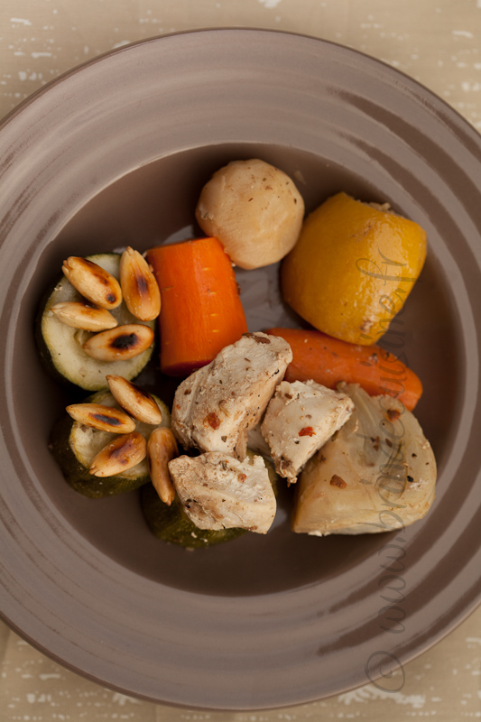
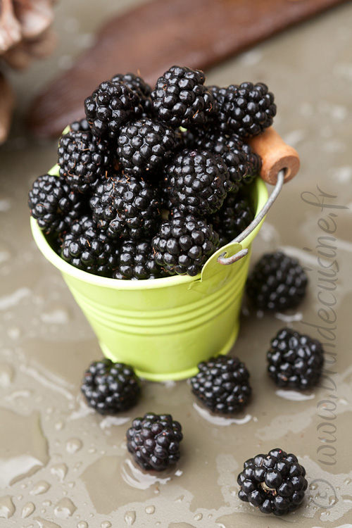
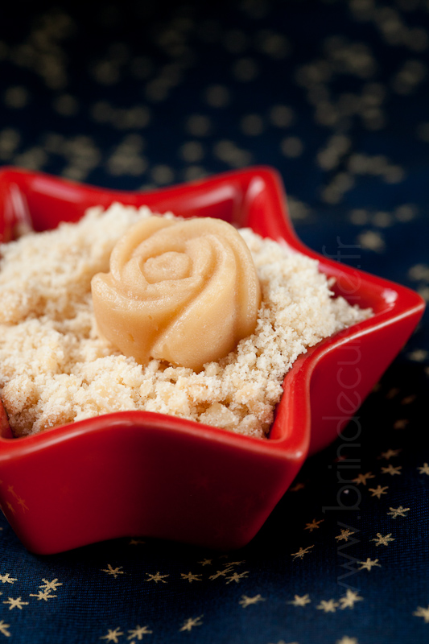

5 petits trucs sur la photographie culinaire
============================================

:date: 2013-01-19
:category: cuisine,art
:level: vulgarisation
:author: Brin de cuisine

Contrairement à ce qu'on croit, réaliser une jolie photo culinaire nécessite de
la préparation. D'abord, imaginer, et cette étape doit avoir lieu avant même
d'avoir réalisé la recette ! Ensuite, si l'on est tout seul à revêtir à la fois
la toque de cuisinier, les gants des assistants lumière et la casquette de
photographe, mieux vaut s'organiser. C'est bien plus facile à plusieurs ...

.. note::

   Retrouvez toutes les recettes sur http://www.brindecuisine.fr

1. Scénariser
:::::::::::::

Certains plats délicieux ne sont pas forcement présentables, il est donc
nécessaire d'en tenir compte. Par exemple, pour un plat mijoté, il vous sera
nécessaire de veiller à soigner le découpage de votre viande, ainsi que le
parage de vos légumes, pour pouvoir les présenter d'une manière agréable à
l'œil.

   Le tajine est un bon exemple. Pour le rendre appétissant, j'ai disposé
   les morceaux dans une assiette, en otant le jus de cuisson

Penser aussi dès cette étape à l'harmonisation du plat avec la vaisselle et le
décor, que vous pouvez choisir neutre ou signifiant.

+---------------------------------------------------+--------------------------------------------------+
| .. figure:: brindecuisine-caramel-de-fruits.jpg   | .. figure:: spareribs.jpg                        |
+---------------------------------------------------+--------------------------------------------------+
| Un fond blanc et un voilage très simple           | Un décor signifiant donne aussi                  |
| sont un exemple de décor neutre.                  | beaucoup d'ambiance à une photo.                 |
+---------------------------------------------------+--------------------------------------------------+

2. Éclairer
:::::::::::

Privilégiez autant que possible la lumière naturelle, c'est elle qui donne les
couleurs les plus appétissantes. Dehors ou derrière une fenêtre, le soleil
permet de multiples éclairages. Un voilage servira de diffuseur. Attention à la
lumière directe, qui donne des ombres dures.

+---------------------------------------------------+--------------------------------------------------+
| .. figure:: brindecuisine-rasante.jpg             | .. figure:: chow-colat-cha-mallow.jpg            |
+---------------------------------------------------+--------------------------------------------------+
| Une lumière du jour rasante donne de la           | La lumière artificielle est plus difficile       |
| profondeur à l'image                              | à gérer. Mais parfois, on n'a pas le choix,      |
|                                                   | notamment en hiver, lorsque le jour est de       |
|                                                   | courte durée.                                    |
+---------------------------------------------------+--------------------------------------------------+

   Les nuages forment le meilleur des diffuseurs.

3. Préparer
:::::::::::

Avant de réaliser votre photo, faites votre mise en scène avec la vaisselle et
accessoires, sans le plat. Cela vous permettra de vérifier quelle prise de vues
est la plus adaptée. Variez la focale, les angles et l'orientation de la
lumière, la distance de prise de vues, et si votre appareil se débraye, la
profondeur de champ : ces paramètres ne donnent pas du tout les mêmes effets.

   La macro donne toute sa place au sujet de la photo

4. Cadrer
:::::::::

La photo culinaire se prête à de nombreux styles photographiques. Clair ou
sombre, en plan rapproché ou  plus éloigné, en nature morte ou avec présence
humaine, à vous de trouver votre préféré. Ou bien
de varier selon les recettes. Voici quelques exemples :

+-------------------------------------------------+----------------------------------------------+
| .. figure:: brindecuisine-Gtovinblanc-1-2.jpg   | .. figure:: brindecuisine-ketchup-vert.jpg   |
+-------------------------------------------------+----------------------------------------------+
|   Lifestyle, c'est-à-dire prise de vue          |  Style "nature", lumière du jour et          |
|   intégrant la présence humaine                 |  ingrédients frais                           |
+-------------------------------------------------+----------------------------------------------+

+-------------------------------------------------+--------------------------------------------------+
| .. figure:: brindecuisine-macaron-1-5.jpg       | .. figure:: brindecuisine-courge-sucrine-1.jpg   |
+-------------------------------------------------+--------------------------------------------------+
| Plan rapproché en studio, double éclairage      |  Clair-obscur.                                   |
| latéral de même puissance.                      |                                                  |
+-------------------------------------------------+--------------------------------------------------+

+-------------------------------------------------+-----------------------------------------------------------+
| .. figure:: brindecuisine-vue-plongeante.jpg    | .. figure:: recette-avril-3.jpg                           |
+-------------------------------------------------+-----------------------------------------------------------+
|    La vue plongeante est adaptée aux recettes   | Le high key consiste à éclairer fortement le sujet,       |
|    familiales, réalisées dans de grands plats.  | et à légèrement surexposer afin qu'il n'y ait aucune      |
|                                                 | zone de couleur noire, et le moins possible d'ombre grise.|
+-------------------------------------------------+-----------------------------------------------------------+

5. Planifier
::::::::::::

Les préparations froides permettent évidemment de prendre tout son temps, mais
ce n'est pas le cas des plats chauds dont l'aspect se matifie en refroidissant,
le rendant moins appétissant. Il faut donc que tout soit prêt avant de mettre
votre préparation dans le cadre de la photo. Je vous conseille de poser votre
appareil sur pied, l'allumer, cadrer, et d'ensuite seulement disposer les
éléments.

.. figure:: brindecuisine-soupe-ortie.jpg
   :target: http://www.brindecuisine.fr/veloute-aux-orties/

`Réagissez sur cet article <http://forums.faitmain.org/viewtopic.php?id=7>`_.
