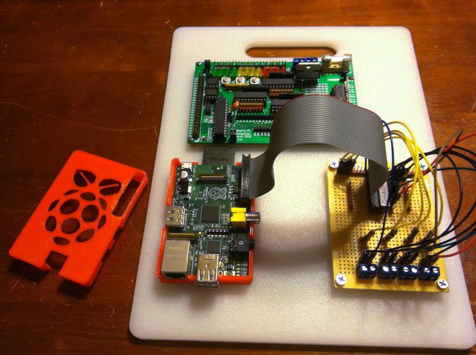
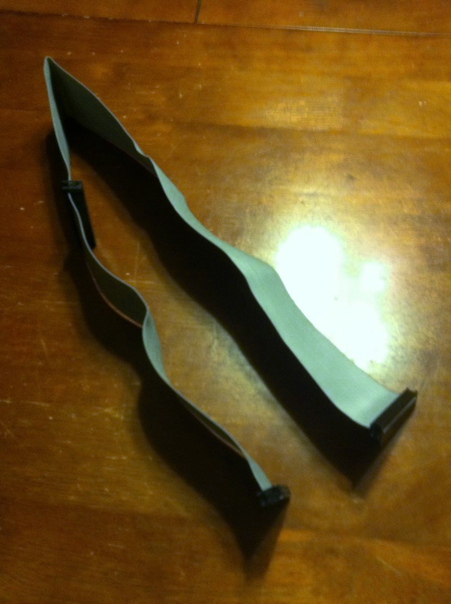
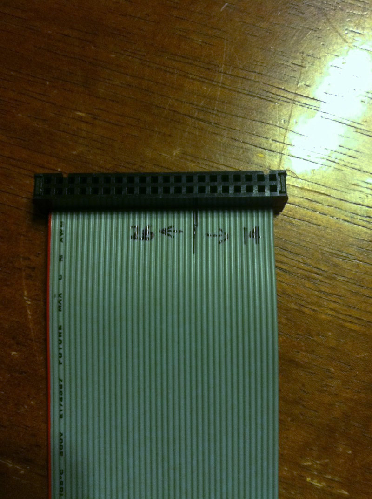
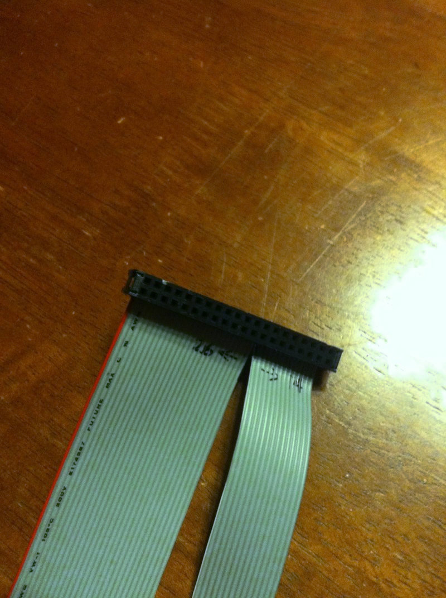
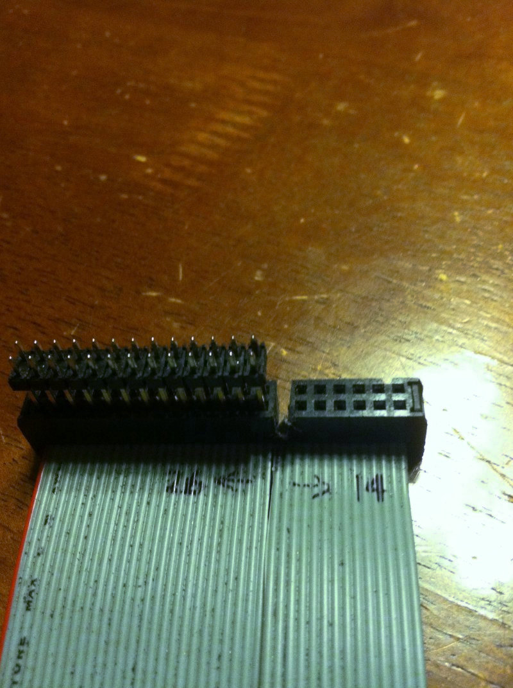
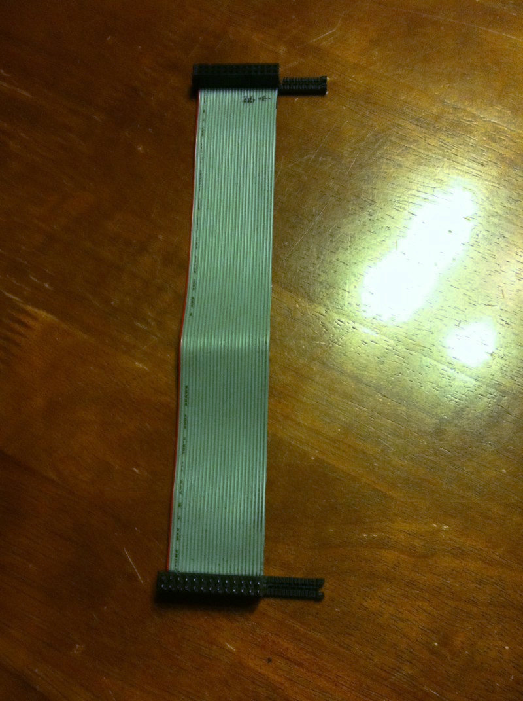
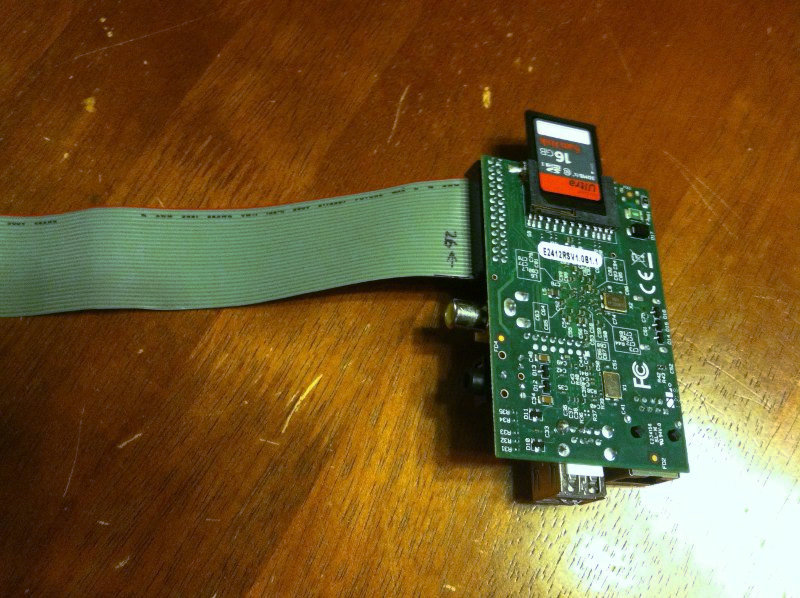
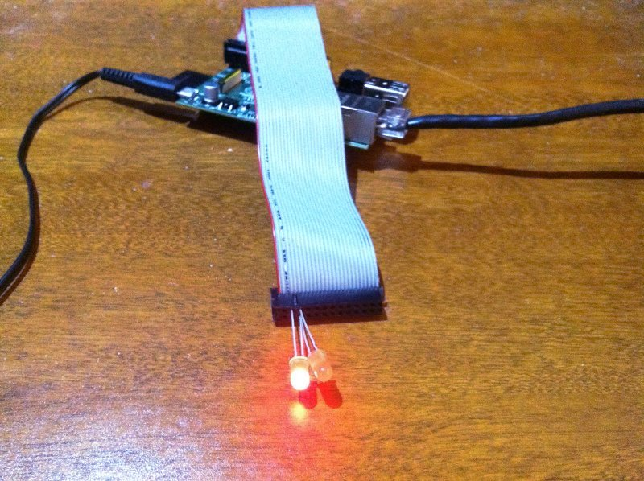

Cable d'interface pour Raspberry Pi
===================================

:date: 2013-01-19
:category: informatique,electronique
:level: vulgarisation
:author: François Dion

   Exemple de circuit fait main relié a un Raspberry Pi, avec un cable fait main.

Une des fonctions qui ont contribuées au succès du Raspberry Pi, c'est la
possibilité d'interface avec le monde extérieur. On parle ici des 
`GPIO <http://fr.wikipedia.org/wiki/GPIO>`_ (en anglais les General Purpose
Input and Output – entrées et sorties pour tout usage), qui se retrouvent au
connecteur P1. En fabricant notre propre câble, on pourra se connecter à des 
`DELs <http://fr.wikipedia.org/wiki/Diode_%C3%A9lectroluminescente>`_ (diodes
electroluminescente), des moteurs ou autres composantes physiques.

----

Comment faire un cable d'interface GPIO
:::::::::::::::::::::::::::::::::::::::

Nous allons faire du recyclage, aujourd'hui. En effet, le type de câble que
l'on va faire, soit un câble plat a 26 conducteurs, est très près d'un câble
très commun que l'on peut retrouver un peu partout, soit dans le fond d'un
tiroir, dans une boite de vieux composantes d'ordinateur. Il suffit de fouiller
un peu, il y en a des dizaines de millions qui ne demandent qu'à se rendre
utile une autre fois.

De quoi s'agit t'il? D'une nappe pour disque dur IDE (ou 
`ATA <http://fr.wikipedia.org/wiki/Advanced_Technology_Attachment>`_) à 40
conducteurs. Bien que l'on peut aussi utiliser un câble ATA66/133 à 80
conducteurs, c'est beaucoup plus de boulot, et c'est possible que l'on se
retrouve avec un câble qui ne fonctionne pas, du à un court-circuit entre la
mise à la masse et notre signal. Je recommande donc plutôt les câbles à 40
conducteurs, plus vieux et très commun:

   Cable IDE pour disque dur, 40 conducteurs.

Au boulot
:::::::::

Nous aurons besoin de 2 connecteurs, et pas de 3. Avec un câble comme celui de
la photo, on coupe une section avec des ciseaux:

.. figure:: couper.jpg
   :scale: 50

   On coupe l'extra avec des ciseaux.

Maintenant, on doit faire une division du câble. En effet, on n'a besoin que de
26 conducteurs, et on en a 40. Avec le fil rouge a gauche, on compte 26 fils et
on marque avec un feutre permanent la division. On compte du cote droit pour
s'assurer que l'on a bien 14 fils, pas un de plus ou de moins.

   Marquer au feutre une ligne qui délimite 26 et 14 conducteurs.

La prochaine étape consiste a faire une incision avec un couteau genre X-acto
ou un scalpel, dans la rainure entre les 2 fils, et sans endommager l'isolation
des fils. Le plus simple c'est de commencer l'incision au couteau et la finir à
la main, en tirant de chaque cote de l'incision.

   Faire l'incision et séparer les 2 parties.

Il faut maintenant couper le connecteur exactement sur la septième rangée de
trous, partant de la droite. On peut le faire avec une petite scie a découper
le métal, ou encore avec une meule a découper, dans le genre Dremel.

   Faire la découpe. Ici, on a mis un connecteur male de 2x13 pour s'assurer de ne pas se tromper d'endroit.

On enlève la partie du dessus, puis la section de câble à 14 conducteurs, et
puis finalement, après avoir fait une entaille, on enlève la partie de dessous.

   On enlève la portion de droite.

On est prêt à connecter notre câble à notre Raspberry Pi. Le fil rouge marque
la position #1 sur le connecteur P1. Il faut donc insérer le câble pour que ce
fil rouge soit du cote de la carte SD, et non pas du cote du connecteur RCA /
video composite (jaune):

   Conducteur rouge sur position #1, pres de la carte SD.

Connections
:::::::::::

Question de vérifier le fonctionnement de notre câble, on va faire une
connexion de 2 DELs, une rouge et une verte. Pas besoin de fil ou soudure car
on va simplement insérer les DELs dans les trous du câble.

En suivant le diagramme ci dessous:

- La patte courte de la DEL rouge et de la DEL verte vont se connecter au troisième trou du cote gauche
- La patte longue de la DEL rouge au deuxième trou du cote droit
- La patte longue de la DEL verte au troisième trou du cote droit

.. figure:: 2leds.jpg
   :scale: 50

----

Le Python
:::::::::

Avant toute chose, on doit se procurer un module Python du nom de 
`RPi.GPIO <http://pypi.python.org/pypi/RPi.GPIO>`_. C'est un module qui
permet de controler les GPIO sur un Raspberry Pi. Sur Raspbian, il est
maintenant inclus, mais si on utilise une autre version de Linux, on peut
l'installer grâce a *easy_install RPi.GPIO*, ou bien par *apt-get*:

.. code-block:: sh

   $ sudo apt-get install python-rpi.gpio

On met le code dans un fichier portant le nom flashled.py

.. code-block:: python

   #!/usr/bin/env python
   """ 2 DEL qui s'allument en alternance """
   import RPi.GPIO as gpio
   import time

   PINR = 0  # on utilisera 2 sur un RPi V2
   PING = 1  # on utilisera 3 sur un RPi V2

   gpio.setmode(gpio.BCM)  # mode Broadcom
   gpio.setup(PINR, gpio.OUT)  # DEL rouge en mode sortie (OUT)
   gpio.setup(PING, gpio.OUT)  # DEL verte en mode sortie (OUT)

   #On alterne pour l'eternite
   try:
       while True:
           gpio.output(PINR, gpio.HIGH)
           gpio.output(PING, gpio.LOW)
           time.sleep(1)
           gpio.output(PINR, gpio.LOW)
           gpio.output(PING, gpio.HIGH)
           time.sleep(1)
   except KeyboardInterrupt:
       gpio.cleanup()

- PINR est le GPIO pour la DEL rouge (0 pour un Rpi V1 et 2 pour un V2)
- PING est le GPIO pour la DEL verte (1 pour un Rpi V1 et 3 pour un V2)

On sélectionne le mode Broadcom (BCM), et on active les 2 GPIO comme sorties (OUT).
La boucle va alterner entre DEL rouge allumée / DEL verte éteinte durant 1 seconde,
et DEL rouge éteinte / DEL verte allumée durant une seconde (*time.sleep(1)*).
Si on fait un CTRL-C durant l'exécution, le programme termine après avoir
fait le ménage, par l'entremise de *gpio.cleanup()*.

On y va
:::::::

Normalement, on doit toujours protéger une DEL avec une résistance, pour
limiter le courant. Toutefois, comme les GPIO ne peuvent fournir que 20mA et
que dans ce test on allume les DELs de façon intermittente, dans ce cas ci, on
peut ignorer cette résistance, sans risque.

Pour un usage prolongé, on va devoir ajouter une résistance en série de 220 a
360 Ohm.

Pour lancer le script que l'on vient de sauver, on doit le rendre exécutable,
et le lancer avec permission root (sudo), à cause du module RPi.GPIO qui a
besoin d'accéder en écriture à /dev/mem:

.. code-block:: sh

   $ chmod +x flashled.py
   $ sudo ./flashled.py

CTRL-C interrompt l'exécution.

   DEL rouge

.. figure:: del-vert.jpg
   :scale: 50

   DEL vert

Ceci conclut notre petit article. Dans un prochain numéro, nous allons
fabriquer un adaptateur pour plaque de prototypage.

