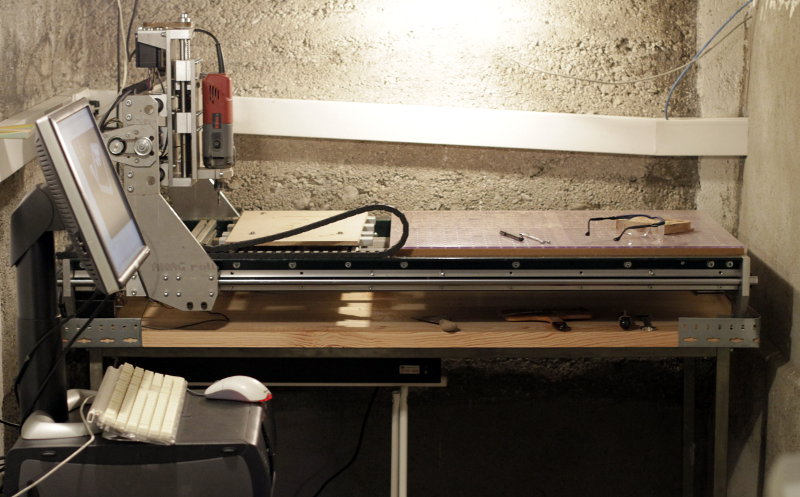
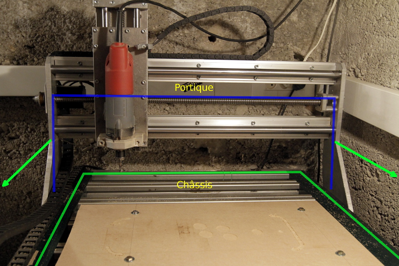
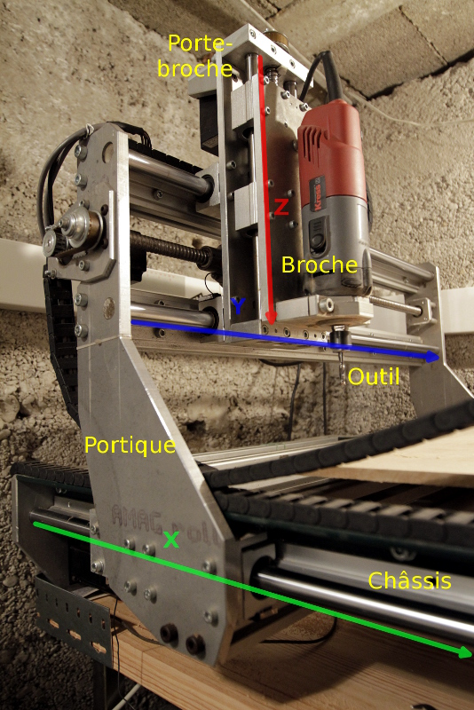
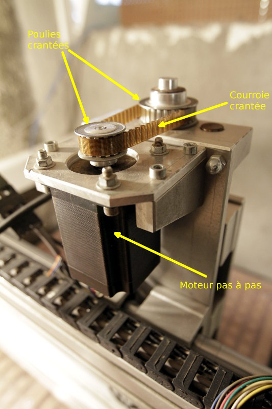
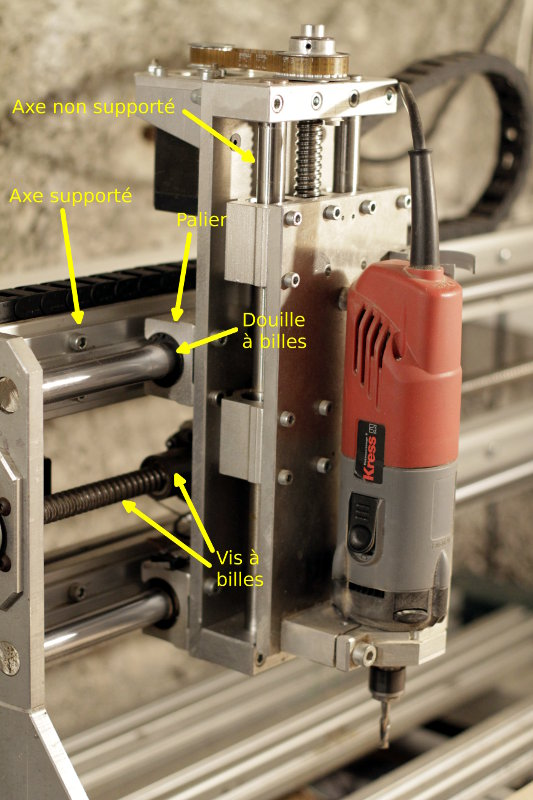
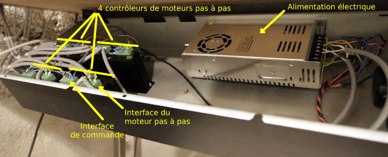
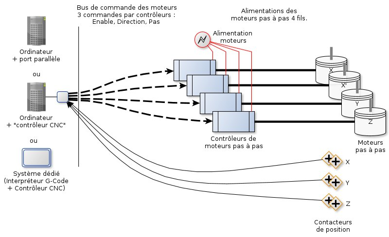
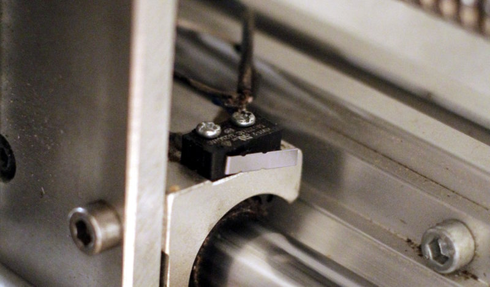

Le monde merveilleux des CNCs
=============================

:date: 2013-02-01
:category: électronique,informatique
:level: moyen
:author: Alcor Walter

2012 a vu l'impression 3D devenir un sujet qui n'intéresse plus uniquement les
blogs spécialisés et certains geeks au fond de leur garage ; on entend dire que
"monsieur tout le monde" aura bientôt une imprimante 3D à coté de son
imprimante-jet-d'encre-A4-photo-wifi. L'effet "nouveauté" est réel même si on
ne sait pas encore l'avenir d'un tel produit. C'est également l'image
industrielle de ses semblables (découpe laser, découpe plasma, tours
numériques, CNCs etc) qui s'estompe ; on s'imagine possible d'utiliser, voire
de construire ou d'acheter ces outils. D'ailleurs on vient de s'y mettre et
voici ce qu'on peut vous dire pour vous accompagner lors de votre lancement :

   Ce que nous allons apprendre de la CNC qui est dans ma cave

Un peu d'histoire pour mieux comprendre
:::::::::::::::::::::::::::::::::::::::

L'histoire de la machine-outil à commande numérique n'est pas récente, on
trouve la première *machine-outil* en 1751 (`Jacques de Vaucanson
<https://fr.wikipedia.org/wiki/Vaucanson>`_ invente le tour à charioter), les
premières *machines-outils automatisées* (par cames) au XIXème siècle et c'est
vraisemblablement en 1942 que l'histoire de la *machine-outil à commande
numérique* débute, grâce à `John T. Parsons
<https://en.wikipedia.org/wiki/John_T._Parsons>`_.

La programmation se faisait avec des cartes perforées, tout d'abord pour les
calculs et quelques années plus tard - lorsque les servomoteurs ont été mis au
point - pour le contrôle. Cependant, les coûts et les usages réservent de
telles machines à l'industrie de pointe, à l'armement, etc et ne sortent que
rarement des laboratoires de recherche.

La technologie va continuer de se perfectionner mais aussi devenir plus
abordable et va rejoindre les bureaux d'études et les chaînes de production de
produits destinés au grand public. À tel point que depuis deux ou trois
décennies cette technologie devient accessible aux petites entreprises et aux
passionnés avertis ; demain elle arrivera peut-être dans le grand public sous
la forme d'une imprimante 3D, qui sait ?

Définition
::::::::::

Une CNC *(Computer Numerical Control)* ou MOCN *(Machine-Outil à Commande
Numérique)* est donc tout d'abord une machine-outil : elle permet selon ses
caractéristiques d'effectuer diverses opérations - percer, scier, rectifier,
découper, fraiser, plier, graver, tarauder, souder, visser, déposer un
matériau, etc - nécessitant des gestes précis et/ou répétitifs, sur des
matériaux divers. Dans le cas d'une CNC, ces opérations seront donc commandées
par un ordinateur ou un dispositif numérique.

.. note::

   Sous la dénomination "CNC" se retrouvent de nombreux dispositifs qui
   diffèrent entre eux principalement par l'outil qui est utilisé. Je
   présenterai ici le principe d'une CNC permettant d'usiner par retrait de
   matière à l'aide de fraises, forets, etc. Cette CNC a été imaginée et
   construite par un particulier à qui nous l'avons achetée récemment. Enfin,
   ma connaissance du domaine est très récente et surtout autodidacte ; je n'ai
   jamais suivi de formation et n'ai aucun diplôme de technicien d'usinage ou
   autre.

Possibilités
::::::::::::

Les matériaux qui peuvent être usinés sont très divers, la caractéristique
principale qui les différencie est la dureté. Plus le matériau est dur, plus il
faudra que la CNC, ainsi que l'outil qui l'équipe aient la qualité et la
puissance nécessaires pour usiner le matériau. Cependant pour commencer à
usiner sans forcément aller rapidement, c'est principalement l'outil et la
vitesse de rotation de celui-ci qui vont influer.

Voici une liste non exhaustive de matériaux que l'on peut usiner :

- acier
- aluminium
- laiton
- polycarbonate
- bois massif
- contreplaqué
- résine
- `mdf <https://fr.wikipedia.org/wiki/Panneau_de_fibres_%C3%A0_densit%C3%A9_moyenne>`_
- mousse

Dans certains cas, l'usinage requiert de l'huile de coupe, de l'air sous
pression, ou autre. Le but recherché est de refroidir le matériau et l'outil,
mais également de lubrifier pour réduire les frottements et l'usure prématurée.
L'air comprimé est plus adapté lors de la découpe du polycarbonate par exemple
pour éviter que le matériau fonde et vienne se recoller sur l'outil ou le
matériau. Attention à ne pas utiliser n'importe quel produit, pensez d'abord à
votre sécurité et à votre santé. Dans tous les cas, avec ou sans huile de
coupe, le port d'un masque, de lunettes de protection et de bouchons d'oreille
est obligatoire si la CNC n'a pas d'équipement vous protégeant des nuisances
(projections de copeaux, de fluide de coupe, fumées, casse, bruit, etc).

En dehors de l'industrie, les domaines d'utilisation d'une CNC sont nombreux,
voici quelques exemples : Le modélisme (ailes et panneaux d'avions, châssis de
voiture, éléments de bâtiments), l'électronique (circuits imprimés, boîtier
pour montages), la réparation (poignées, butées, guides, engrenages), la
décoration, l'ébénisterie, la lutherie, la mécanique, etc.

L'imagination, l’expérimentation et la recherche de chacun amèneront leur part
de nouveauté dans ce domaine.

Structure
:::::::::

Observons techniquement de quoi est composée une CNC, en partant de la table
qui accueillera le matériau à usiner. La base est similaire à ce qu'on aurait
dans le cas d'un usinage manuel : le matériau doit être solidement fixé à une
table d'usinage à l'aide d'un étau, de butées, de pinces, ou collée, etc, selon
les besoins. Parfois la table d'usinage peut-être une table aspirante ou un
"martyr".

+-------------------------------------+----------------------------------------+
| .. figure:: cnc1_table_martyr.jpg   | .. figure:: cnc1_table_aspirante.jpg   |
+-------------------------------------+----------------------------------------+
|   Table d'usinage *"martyr"*        |    Table aspirante                     |
+-------------------------------------+----------------------------------------+

L'usinage du matériau peut se faire avec un outil (une fraise, un foret, une
lame, une pointe à graver, etc) dont les caractéristiques sont adaptées au
matériau et à l'opération à réaliser. Cet outil est monté sur ce qu'on appelle
une broche, c'est-à-dire, l'ensemble formé par le système de fixation de
l'outil et le moteur permettant la rotation à l'origine de l'usinage.

Tout cela est très proche de ce qui est mis en place lors d'une opération
manuelle. Maintenant voyons comment l'action de l'homme a été remplacée par la
commande d'une machine :

Si on usine avec un outil en position verticale, 3 axes (X, Y et Z) suffisent
pour le déplacer dans l'espace. Et pour se repérer dans cet espace orthonormé,
on utilisera l'unité de mesure du système international ou l'unité du
système anglo-saxon.

De nombreuses CNC ont pour base un châssis rigide sur lequel les différents
organes de la machine reposent pour opérer. Essentiellement deux catégories de
structures existent : la *table mobile* et le *portique mobile*. Dans le
premier cas, le portique est fixé sur le châssis en son centre et c'est la
table d'usinage qui se déplace sur un axe (X). Dans le deuxième cas, plus
courant, c'est l'inverse : la table est fixée au châssis et le portique se
déplace sur l'axe (X) pour parcourir la table d'usinage. Ce dispositif est
moins coûteux en espace et se révèle plus versatile, c'est le cas de notre CNC.

    Le portique est mobile sur toute la longueur du châssis.

Le portique quant à lui sert de base pour le déplacement sur l'axe Y du porte broche.
Le porte broche enfin sert de base pour le déplacement sur l'axe Z de la broche.

    L'ensemble des axes X, Y et Z permet de déplacer l'outil de coupe verticalement.

Dans certaines situations, il est pratique d'avoir un quatrième, cinquième ou
énième axe pour orienter l'outil et/ou orienter le matériau ; ainsi des
opérations peuvent s'appliquer sur des faces du matériau non accessibles sur
une CNC 3 axes.

Mécanique
:::::::::

La liberté de mouvement est donc gérée par ces axes mais il faut encore assurer
le déplacement avec force et précision ; ceci est possible grâce à de
nombreuses solutions mais je vais expliquer ici la plus populaire : les moteurs
pas à pas, les vis à billes et les axes supportés.

Le moteur pas à pas est un moteur dont le fonctionnement est relativement
fiable, puissant, précis mais pas très rapide. Lorsque les moyens le
permettent, des servomoteurs pas à pas sont utilisés, permettant d'avoir une
correction en cas d'erreur - le servomécanisme permettant l'asservissement et
la rétroaction (on donne une commande et on vérifie qu'elle se réalise). Un ou
parfois plusieurs moteurs pas à pas peuvent être utilisés pour mouvoir chaque
axe.

    Le moteur pas à pas de l'axe Z, couplé indirectement à la vis à billes

La vis à billes permet de convertir la rotation du moteur en translation
(comme lorsqu'on visse une vis !). Les billes remplacent les pas de l'écrou,
limitant ainsi les frottements et augmentant considérablement la précision. Le
couplage entre le moteur et la vis à billes peut être :

- direct, au moyen d'un *coupleur d'axe* spécifique qui protégera de la casse le moteur et la vis,
- ou indirect, au moyen de poulies et de courroies qui permettront une démultiplication de l'effort tout en gardant une certaine souplesse de mouvement.

Pour finir, un *axe supporté* est un axe rond en acier trempé monté sur un
support en aluminium permettant ainsi de fixer et soutenir l'axe sur toute sa
longueur. Ces axes sont donc très utiles pour des axes longs qui pourraient
fléchir s'il n'étaient pas supportés. La partie mobile glisse sur l'axe grâce à
des *paliers* montés sur des *douilles à billes*. On conserve ainsi une grande
stabilité lors du déplacement.

    Un peu de mécanique ...

D'autres solutions existent :

- les vis trapézoïdales (meilleures que le pas de vis classique) et les axes
  non supportés sont bon marché mais sont plus sensibles à l'usure et sont
  moins précis que la solution vis à billes et axes supportés.

- les rails guidés à billes sont coûteux mais remplacent avantageusement les
  axes supportés et douilles à billes, offrant encore plus de précision et de
  stabilité.

- les vis à rouleaux satellites offrent également un niveau supérieur de
  puissance, de durabilité et de précision par rapport aux vis à billes. On les
  trouve sur des machines dont les conditions de mise en œuvre sont soumises à
  de fortes contraintes ce qui explique leur coût élevé.

Les moteurs pas à pas et les contrôleurs
::::::::::::::::::::::::::::::::::::::::

Pour comprendre le pilotage d'une CNC, il faut d'abord connaître un peu le
fonctionnement d'un moteur pas à pas :

Un moteur pas à pas est conçu pour effectuer un tour complet en un certain
nombre de pas. Cette caractéristique est indiquée sur le moteur sous la forme
*1,8°/step* ou *200 steps/rotation*. Le pas correspond donc à l'unité de
mouvement du moteur. Cette rotation peut se faire dans le sens des aiguilles
d'une montre ou inversement.

Le moteur pas à pas est généralement alimenté sur 4 fils, reliés deux à deux à
des bobines. C'est en alimentant ces bobines et en tenant compte de la polarité
d'alimentation, que le moteur tournera d'un pas dans un sens ou dans l'autre ;
en alternant cette alimentation dans un ordre précis, on fait faire plusieurs
pas au moteur. Sans rentrer dans le détail du fonctionnement, cela signifie
qu'il faut être capable d'alimenter le moteur avec un courant de forte
intensité en alternant très rapidement les bobines et les polarités, tout en
conservant une qualité d'alimentation. Pour cela, on peut utiliser un
*contrôleur de moteur*, sur lequel on branche directement le moteur pas à pas
et une alimentation électrique. Ce contrôleur peut être paramétré pour limiter
le courant fourni aux bobines afin de ne pas abîmer le moteur.

.. sidebar:: Alimentation du contrôleur de moteur pas à pas

   Le contrôleur de moteur limite le courant fourni aux bobines par `hachage
   <https://fr.wikipedia.org/wiki/Hacheur>`_ ; il est par conséquent possible
   d'utiliser une alimentation fournissant une tension supérieure à ce que peut
   supporter le moteur. Le hacheur limite le courant en fonction du réglage
   disponible sur le contrôleur de moteur. Sachant que la vitesse de montée du
   courant à la valeur nominale décroit à l'approche de celle-ci, il est
   intéressant d'utiliser une alimentation capable de fournir plusieurs fois la
   tension dont on à besoin : le hachage du courant empêchera de toute manière
   qu'on dépasse les valeurs désirées et on profitera d'une vitesse de montée
   du courant bien meilleure ce qui permettra une réponse optimale des moteurs.

Le contrôleur de moteur pas à pas possède également une interface de commande
composée de 3 fils prenant en charge une commande chacun, sous forme de niveau
logique binaire (0 ou 5V) :

- **[ENABLE]** moteur allumé ou éteint,
- **[DIRECTION]** direction de rotation horaire ou anti-horaire,
- **[STEP]** rotation de l'axe du moteur d'un pas.

Le moteur peut donc être :

- éteint (ENABLE à 0V) : aucune autre commande n'est interprétée et l'axe du
  moteur est en rotation libre (on peut le positionner à la main),

- ou allumé (ENABLE à 5V) : en l'absence de commande de rotation, le moteur
  maintient une position (on ne peut pas le bouger manuellement) ; lorsqu'une
  commande de rotation arrive (passage de 0 à 5V sur le fil [STEP]), le
  moteur effectue une unité de rotation dans le sens qui lui est commandé pas
  le fil de direction.

La vitesse de rotation du moteur dépend au final de la fréquence des commandes
sur le fil [STEP]. La documentation du contrôleur est importante pour connaître
la durée des impulsions et leur séquencement afin de bien optimiser le contrôle
du moteur.

    Un peu d'électronique ...

.. sidebar:: Calculer la précision de la CNC

   En connaissant l'angle d'un pas du moteur pas à pas, ainsi que le pas de vis
   à billes et le rapport de couplage, on peut calculer la précision théorique
   de la CNC. Par exemple, pour l'axe X :

   - notre moteur pas à pas peut effectuer un angle minimum de 1.8°, soient 200 pas par tour,
   - la poulie crantée sur l'axe du moteur a 15 dents ,
   - la poulie crantée sur la vis à billes a 20 dents,
   - la vis à bille a un pas de 5mm (1 tour de vis déplace l'écrou de 5mm).

   La précision théorique de l'axe X de la CNC est donc de :

    ::

        (5 mm / 200 pas) * ( 15 / 20) = 0,025 * 0,75 = 0,01875 mm

   La précision de cet axe est ici théorique puisqu'aucune mesure du jeu des
   différentes parties mécaniques n'a été faite. Bien qu'un soin important ait
   été apporté aux technologies utilisées, il existera toujours une marge
   d'erreur lors de l'usinage dans laquelle intervient également le type
   d'opération, sa vitesse d'exécution, la nature du matériau, l'usure de
   l'outil, etc. Une autre source éventuelle d'imprécision est à évaluer
   également, même si aujourd'hui les chances sont faibles d'avoir ce
   problème, c'est la capacité électronique et surtout informatique à traiter
   des informations avec une grande précision, tant pour le calcul que pour la
   commande.

   Dans notre cas, il reste possible d'augmenter la précision sans trop de
   difficulté, soit en augmentant le rapport du couplage moteur/vis à billes, soit
   en remplaçant le moteur par un moteur plus précis (attention de conserver des
   caractéristiques suffisantes - couple moteur, vitesse), ou plus simplement, si
   les moteurs pas à pas le permettent, en adaptant l'électronique de contrôle
   pour permettre d'augmenter le nombre de pas par rotation.

La commande numérique
:::::::::::::::::::::

On comprend que le moteur pas à pas répond à l'impératif de précision, mais le
principe de commande est trop basique pour pouvoir être programmé directement
par l'homme.

Dès lors, l'interface de commande de chaque contrôleur de moteur pas à pas sera
reliée à un dispositif numérique afin de permettre un contrôle intelligible et
programmable par l'homme.

Ce rôle sera tenu soit par l'ordinateur, soit par des systèmes dédiés à cette
tâche. Une troisième solution intermédiaire consiste à utiliser un ordinateur
pour les calculs et l'affichage, couplé à un contrôleur de CNC pour le
pilotage. La principale contrainte est d'être capable de délivrer les commandes
au contrôleur de moteur (enable/step/direction) de manière très rapide et
synchrone. L'ordinateur seul ne présente pas une solution idéale ; seul le port
parallèle permet de répondre en partie à ces impératifs mais l'architecture
matérielle n'est pas optimisée pour ce type d'utilisation et un ralentissement
de quelques microsecondes ne peut être toléré. Compléter ou remplacer
l'ordinateur par du matériel dédié est un peu plus coûteux mais permet un
contrôle plus adapté aux contraintes des CNCs.

    Schéma théorique d'une CNC 3 axes avec 2 moteurs sur l'axe X

Ce système de commande envoie donc des informations de contrôle des moteurs,
mais peut aussi gérer l'activation et le réglage de la vitesse du moteur de la
broche, l'aspiration des copeaux, l'adjonction d'eau ou d'huile de coupe, la
ventilation des fumées, le changement d'outil automatique, etc. Le système de
commande nécessite cependant d'être informé de certains événements, par
exemple, la prise d'origine des axes (calibration du repère orthonormé). Cette
opération requiert l'utilisation de contacteurs de position sur chaque axe,
informant de manière précise le bout de course des axes. Autre exemple,
lorsqu'un outil est fixé à la broche, la hauteur de celui-ci doit être mesurée
à l'aide d'un contacteur pour que la commande ajuste le parcours d'outil.
Certains servomoteurs peuvent également envoyer un retour au système de
commande.

    Un des deux contacteurs de position de l'axe Y

Toutes ces possibilités peuvent être gérées par l'homme en utilisant un langage
de programmation spécifique. Le langage le plus populaire aujourd'hui pour le
contrôle des CNCs est le G-Code ; le dispositif numérique sera donc en mesure
d'interpréter ce langage pour commander, entre autres, les contrôleurs de
moteurs pas à pas. Ce langage met à disposition des instructions de déplacement
de l'outil de coupe, de vitesse de coupe, de gestion de chemins, etc.

Le langage peut-être écrit directement par l'homme d'après les dessins
techniques du projet, en effectuant un certain nombre de calculs - pas toujours
évidents - pour prévoir le passage des outils. Mais cette tache de calcul du
passage d'outils, ainsi que la création des dessins techniques sont aujourd'hui
assistés par ordinateur.

Les outils informatiques qui interviennent dans le domaine des CNCs sont rangés dans les catégories suivantes :

- CAO (= CAD en anglais) : Conception Assistée par Ordinateur. Permet de
  concevoir et d'élaborer les dessins techniques des pièces à réaliser. Les
  fichiers sont souvent des formats propriétaires contenant des informations de
  plans 2D ou de volumes 3D.

- FAO (= CAM en anglais) : Fabrication Assistée par Ordinateur. Permet de
  calculer les chemins des opérations d'usinages sous forme de parcours-outils.
  Les fichiers sont également propriétaires mais les outils permettent pour la
  plupart d'exporter ces parcours-outils en G-Code.

- Interpréteurs G-Code et contrôleurs de CNCs (G-Code parser and CNCs
  controller en anglais) : Permet d'interpréter le G-Code et de commander les
  contrôleurs de moteurs de la CNC.

.. note::

    La norme décrivant le G-Code est cependant rarement implémentée en sa
    totalité, ni toujours conformément, et ce pour plusieurs raisons :

    - d'une part, le langage a été standardisé en 1980 après 20 ans
      d'utilisation, et cette norme n'a pas évoluée depuis 1980 ; depuis, de
      nombreux fabricants de machines ont donc adapté le langage à leurs
      besoins.

    - d'autre part, l'automatisation des tâches de conception et de fabrication
      a rendu certaines instructions moins utiles, voir inutiles.

Voici la chaîne de logiciels que j'utilise ; ces logiciels ont été choisis spécifiquement dans le domaine du libre :

CAO
---

FreeCAD gère de nombreux formats de fichiers en importation et en exportation.
L'outil est assez facile à prendre en main : un certain nombre "d'ateliers"
permettent de gérer la modélisation 3D à différentes étapes et en fonction des
besoins. Un système de graphe permet de revenir sur les étapes de modélisation
sans utiliser d'historique linéaire. L'approche globale est la modélisation
paramétrable basée sur des contraintes. Beaucoup plus facile à prendre en main
qu'à expliquer !

LibreCAD gère la modélisation 2D avec une approche traditionnelle, un peu comme
si vous êtiez sur une table à dessin, avec rapporteur, équerre, papier
millimétré, calques, etc.

FAO
---

HeeksCAD + plugin HeeksCNC. Ce plugin permet le calcul de passages d'outils en
partant de modèles 2D ou 3D. La prise en main est plutôt ergonomique et le
novice s'y retrouve facilement après avoir regardé un ou deux tutoriaux vidéos.
Les opérations d'usinage de poche, de profil, de perçage, d'ébauche en zigzag,
etc sont disponibles mais il reste des bugs et il manque des opérations.
Dommage que le développement semble en pause parce que le plugin est fort
intéressant et il n'y a pas beaucoup de concurrent dans le monde libre sur ce
créneau. Voir également PyCam.

Interpréteurs G-Code et contrôleurs de CNC
------------------------------------------

LinuxCNC, anciennement EMC2 est incontournable et presque seul dans ce domaine.
L'outil possède plusieurs interfaces graphiques bien pratiques. Il gère le port
parallèle de votre ordinateur mais peut aussi gérer plusieurs types de cartes
dédiées au contrôle de cnc. Il accepte le G-Code le plus couramment utilisé. Il
est livré par défaut sur une distribution Ubuntu 10.04 LTS spécialement
optimisée pour LinuxCNC.

Il existe de nombreux autres logiciels libres de CAO et des scripts et petits
outils de FAO très pratiques (voir notamment le plugin de génération de G-Code
pour Inkscape, F-Engrave, etc). Et dans la catégorie interpréteur
G-Code/contrôleur de CNCs, l'arrivée de solutions embarquées (`Grbl <https://github.com/grbl/grbl>`_
sur Arduino et son portage `SmoothieWare <http://smoothieware.org/>`_ sur mbed,
Smoothieboard et autres) sont à tester rapidement ! Elles permettront à terme
de ne plus utiliser le port parallèle et d'obtenir de meilleures performances.

.. sidebar:: Port parallèle et CNC

    Comme je l'indiquais plus haut, un ordinateur seul n'est pas vraiment conçu
    pour répondre aux contraintes de commande numérique. Lors du paramétrage de
    LinuxCNC, un programme permet d'effectuer un test de latence un peu
    empirique mais fonctionnel, dont le résultat permettra de régler le débit
    du port parallèle de votre ordinateur. Pour optimiser la réponse de
    l'ordinateur et gérer au mieux l'envoi des données sur le port parallèle,
    LinuxCNC utilise le noyau linux temps réel RTAI dont le développement
    semble ne pas évoluer rapidement. De ce fait, il est difficile de l'adapter
    à un environnement logiciel et du matériel récents. Il est d'ailleurs
    recommandé d'installer le CD de LinuxCNC 2.5.1 (Ubuntu 10.04 LTS compilée
    avec RTAI) sur un ordinateur simple cœur et dont la configuration mémoire
    ne dépasse pas 1Go. Ces recommandations vont devenir rapidement
    problématiques pour les utilisateurs, même si le logiciel n'est
    effectivement pas gourmand en puissance, il deviendra de plus en plus
    difficile de trouver ce type de matériel d'occasion. Le développement est
    cependant toujours très actif et tente justement de se séparer de noyau
    temps réel RTAI.

Et maintenant ?
:::::::::::::::

Cet article aborde les bases du fonctionnement d'une CNC 3 axes pour
hobbyiste ; il reste ensuite à apprendre les techniques d'usinage ainsi que la
conception et la fabrication assistés par ordinateur. Ne pas oublier que c'est
un métier avant tout, ce qui n'empèche pas, avec du sérieux et des précautions,
d'attaquer le sujet sous divers angles. Sur internet on trouve assez facilement
des informations et de l'aide :

Plusieurs communautés existent, comme par exemple `usinages.com
<http://www.usinages.com/>`_ ou pour les anglophones : `cnczone.com
<http://www.cnczone.com/>`_.

Les sites des fabricants d'outils et des logiciels de CAO/FAO (principalement
dans la communauté du libre) ont souvent des ressources très bien faites et
complètes. Consultez la `documentation de LinuxCNC
<http://linuxcnc.org/index.php/english/documentation>`_, qui va bien au delà de
l'utilisation du logiciel et donne de nombreuses références, explications et
exemples.

Enfin, le détournement d'un tel outil est bien sûr possible, jetez un oeil sur
`hackaday.com <http://hackaday.com/?s=cnc>`_ par exemple !

`Réagissez sur cet article <http://forums.faitmain.org/viewtopic.php?id=2>`_.
