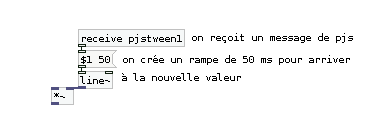
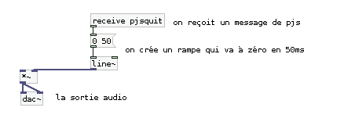
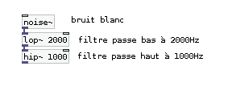
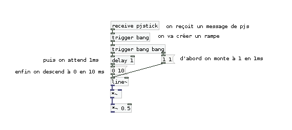
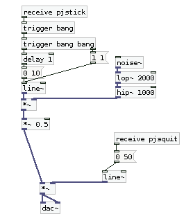
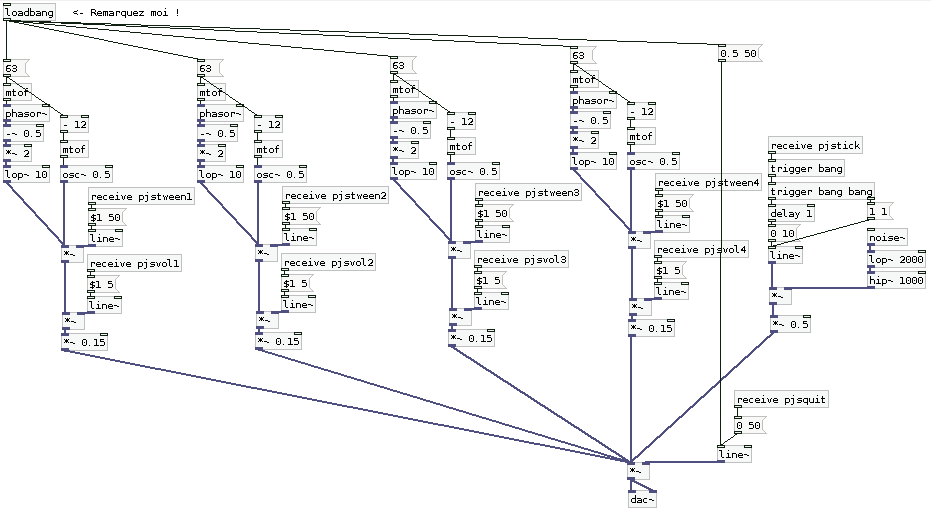

The Midst ?
===========

:date: 2013-01-23
:category: art, informatique
:level: vulgarisation
:author: Bérenger Recoules

.. figure:: midst_title.png
  :target: http://weblab.pagesperso-orange.fr/

  Un arbre récursif

The Midst est un projet de *art-game* se jouant en ligne : comme cela arrive
souvent aux personnages principaux de jeux vidéo, la petite-amie de Héro s'est
fait enlever ; cette fois ci ce sont de méchants pixels blancs qui ont fait le
coup (the white meanies) ; en conséquence Héro est condamné à errer dans un
labyrinthe de fenêtres pop-up en noir et blanc truffé d'obstacles, dans le but
de dénicher une sortie et d'alors pouvoir peut-être retrouver sa dulcinée.

Ce jeu se décline aussi en un atelier et une série de ressources en ligne
permettant de découvrir les technologies à l’œuvre : beaucoup de `processing.js
<http://processingjs.org/>`_ pour la création graphique et l'animation, une
généreuse portion de `Webpd <https://github.com/sebpiq/WebPd>`_ pour la
synthèse sonore en temps réel, un soupçon de HTML5 et une pincée de `jQuery
<http://jquery.com/>`_ pour faire en sorte que tout cela fonctionne dans une
page web. C'est du coup l'occasion de comprendre comment implémenter une
succession de petits jeux simples allant du `pong
<http://fr.wikipedia.org/wiki/Pong>`_ au `casse-brique
<http://fr.wikipedia.org/wiki/Casse_brique>`_...

Le code complet du jeu est disponible et consultable en ligne à cette adresse :
https://github.com/b2renger/TheMidst

Au programme et en vrac : système à particules, physique et vecteurs pour
l'animation, interaction, `tweening <http://fr.wikipedia.org/wiki/Tweening>`_,
collisions non orthogonales, synthèse sonore, musique générative...

Du point de vue des technologies on utilise des outils libres et gratuits et
qui disposent d'une large communauté d'acteurs internationaux. Cet article va
se concentrer sur webpd qui n'est pas encore complètement documenté alors que
*processing.js*, lui, dispose déjà d'une communauté vibrante et d'une multitude
d'exemples de code en ligne.

Pour rappel, `Processing <http://www.processing.org/>`_ est un langage de
programmation apparu en 2001 au MIT, qui a pour vocation de faciliter
l'apprentissage de la programmation objet en l'appliquant au dessin, à
l'animation, à l'interaction et à la visualisation de données. Aujourd'hui il y
a une très large communauté internationale et le langage permet aussi bien de
développer pour des ordinateurs, que pour des téléphones Android ou encore des
navigateurs web.

`Pure Data <http://crca.ucsd.edu/~msp/software.html>`_ est un langage de
programmation visuelle né en 1996, il est la résultante d'une partie des
travaux de Miller Puckette à l'IRCAM : c'est le petit frère libre et gratuit de
MAX/MSP. Il permet de créer du code en reliant des boîtes entre elles à l'aide
de fils : c'est un langage de programmation très utilisé pour la création
sonore, mais aussi graphique ainsi que pour l'interaction.

La Structure du jeu et du code
::::::::::::::::::::::::::::::

Le code du jeu est structuré de manière assez simple. Pour chaque fenêtre nous
avons recours à un canvas html qui va exécuter un sketch processing ainsi qu'un
patch Pure Data. Deux pages html sont présentes, *index.html* et
*level-template.html* qui font appel a différents scripts JavaScript
permettant d'aller chercher les fichiers *level\*.pde* (pour l'animation) et
*level\*.pd* (pour le son).

.. figure:: midst_title.png

  Écran d'accueil

Lorsqu'on clique sur le bouton "start" une fenêtre pop-up va s'ouvrir : c'est
le premier niveau incarné par la fenêtre "level-template.html" : à partir de ce
moment là toutes les ressources seront chargées dans cette même fenêtre de
200x200 pixels. On se déplace ainsi de niveau en niveau en cherchant où sont
les murs et où sont les passages vers les cases adjacentes.

.. figure:: midst_level01.png
  :scale: 50%

  La case de début du jeu.

La base de code produite au niveau un permet d'avoir une ellipse (notre
personnage principal), qui est animée de deux façons : la première consiste à
modifier la largeur et la hauteur de cette ellipse en fonction de son
éloignement de la souris et la seconde animation consiste à permettre à ce
personnage de se déplacer dans l'espace de chaque case à l'aide de
l'application de lois physiques.

Le personnage à une masse, une position, une vélocité ainsi qu'une
accélération. Une force de friction a aussi été implémentée. Lorsque l'on
clique quelque part, le personnage va alors subir une modification de son
accélération qui va donc se répercuter sur sa vitesse puis sur sa position. La
relation est tout simplement une addition de vecteurs : pour obtenir le nouveau
vecteur de vélocité on lui ajoute le vecteur accélération; pour obtenir le
nouveau vecteur de position on y ajoute le vecteur de vélocité etc.

A partir de là tout est permis. L'avantage d'utiliser Processing dans ce
contexte se situe dans le fait que l'on peut avoir accès à des notions de
programmation objets, il est donc possible de structurer sont code à l'aide de
classes et du coup de gagner une certaine flexibilité. De plus procession offre
tout un tas de primitives de dessin dont la syntaxe est grandement simplifiée.

Le moteur audio : webpd
:::::::::::::::::::::::

Webpd est une librairie JavaScript qui permet de faire de la synthèse audio en
temps réel. Pour ceux qui connaissent déjà Pure-Data, s'en est un port partiel
pour JavaScript : cela veut dire que vous pouvez faire tourner certains patchs
directement dans votre navigateur. Pour ceux qui ne connaissent pas Pure-Data
je vous invite à lire la suite...

  Le hello world de Pure Data.

*The midst* présente une particularité au niveau du *gameplay* et de
l'implémentation du moteur audio. J'ai choisi volontairement de conserver la
même fenêtre pour tous les niveaux, cela signifie qu'à chaque fois qu'on l'on
quittera une case une nouvelle page va se charger (un canvas avec un sketch
Processing et un patch Pure Data). J'ai donc choisit de créer l'ambiance sonore
de chaque case à l'aide d'un "drone" audio, c'est à dire un accord tenu le
temps que l'on reste dans la case, mais cet accord est modulé par la position
du héros dans sa case ainsi que par son animation.

  La source audio.

L'accord est formé de deux sons : un oscillateur, et un *phasor* (forme d'onde
en triangle), on utilise la convention MIDI pour choisir la fréquence à
laquelle vont osciller ces deux sources, l'objet *[mtof]* permet la conversion
de notes midi en fréquences.

  Une première enveloppe contrôlée par l'animation du personnage.

  Une seconde enveloppe contrôlée par la position du personnage dans la case.

  La sortie audio : l'objet [dac~] représente les haut-parleurs de votre
  ordinateur.

Il reste maintenant à dupliquer ce code quatre fois (et changer la valeur de la
note midi jouée à chaque fois pour former un accord) puis à interfacer le code
de notre ambiance sonore avec notre code processing.js qui régit l'animation de
notre personnage principal, c'est à dire permettre à notre code processing.js
d'envoyer des messages à webpd pour moduler le son de notre synthétiseur en
temps réel.

.. figure:: midst_interfacage.png
  :scale: 50

  L’interfaçage d'un seul drone avec processing JS.

En ce qui concerne le son de collision on peut se servir d'un bruit blanc qui
va être modulé par une enveloppe maison.

  La source sonore est cette fois un bruit blanc [noise~].

  L'enveloppe "maison" : un enveloppe attack (1ms) decay (10ms).

  Les deux parties assemblées.

Pour jouer ce son, on pourra maintenant envoyer un message de type :

::

    patch.send("pjstick","bang");

Il ne nous reste alors plus qu'à tout assembler, pour obtenir la base du moteur
audio du jeu :

  Le moteur audio au complet

Nous ne sommes bien sûr pas du tout obligés de synthétiser tous les sons ! Il
est possible de charger des sons et de les jouer comme on le souhaite (une
fois, en boucle, ou alors juste des bouts à droite à gauche). Si vous y
arrivez, le dernier niveau vous permettra de découvrir une première approche de
la musique générative pour le web. L'avantage de Pure Data et qu'il existe une
large communauté de musiciens qui l'utilisent, ceux-ci seront à même de mettre
en place un moteur audio complet et interactifs pour le web.

The Midst ...
:::::::::::::

Comme je le mentionnais au début ce jeu est aussi un atelier dont la première
édition aura lieu du 16 janvier au 20 février à `Stereolux à Nantes
<http://www.stereolux.org>`_, sous forme de six séances de deux heures, qui
permettront à leurs participants de se familiariser avec ces technologies mais
aussi de développer une case du jeu. J'espère qu'avec le temps le jeu
s'étoffera que le labyrinthe s'étendra... alors si vous souhaitez contribuer
n'hésitez pas à me contacter !

`Réagissez sur cet article <http://forums.faitmain.org/viewtopic.php?id=11>`_.
