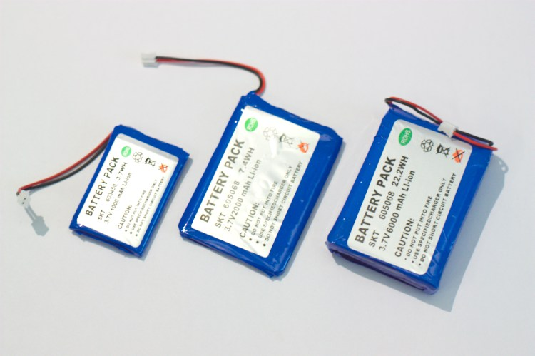
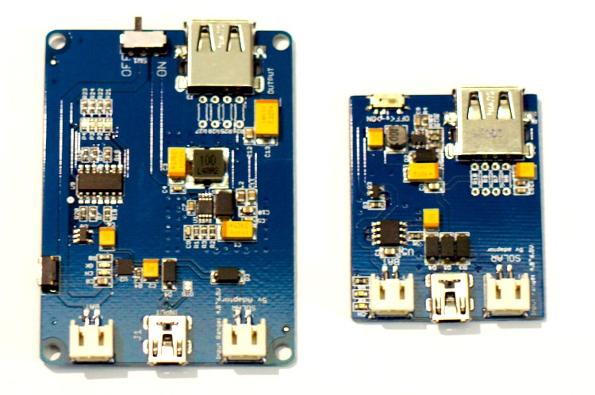
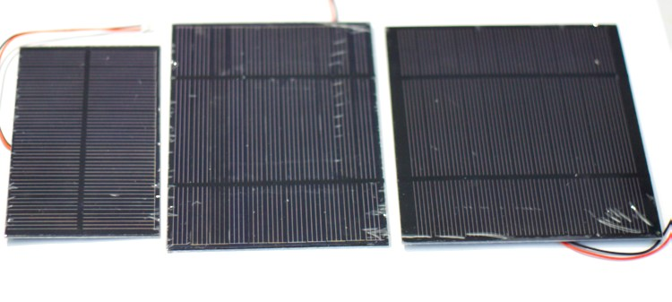
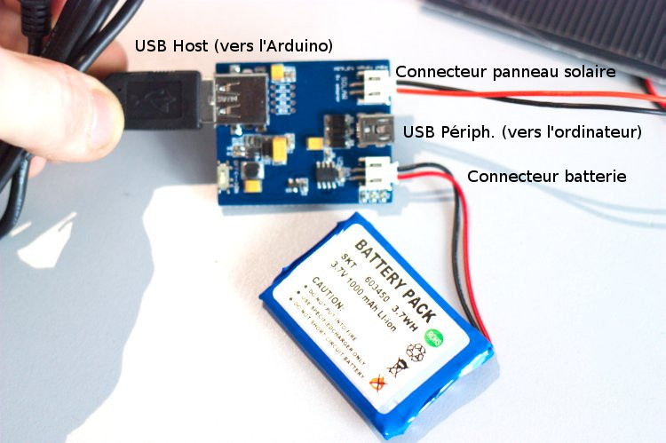
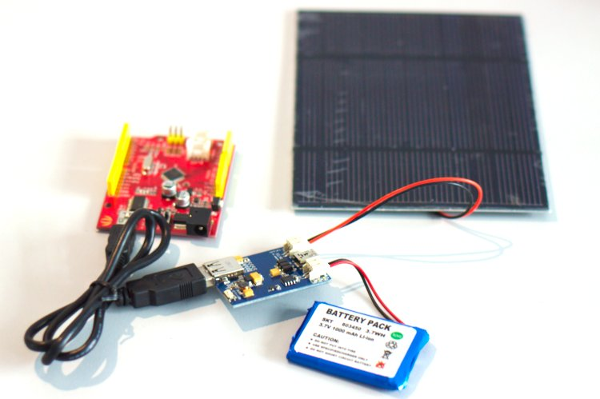

Passer un projet sur batterie
=============================

:date: 2013-05-01
:category: electronique
:level: debutant
:author: Jonathan Schemoul

Vous venez de finir votre projet, il est tout beau, tout propre.
Oui, mais est-il transportable ? S'il y a une coupure de courant, que se passe-t-il ?

Il existe plusieurs solutions pour mettre un projet sur batterie :

- Utiliser des bêtes piles, on a plusieurs réceptacles pour cela... mais la
  recharge doit être séparée ou les piles changées régulièrement. Pas génial.
- Utiliser une pile 12V de voiture ou d'onduleur, lourd et pas forcément efficace.

- Notre solution préferée, et c'est celle que nous allons étudier ici, utiliser
  des batteries lithium polymer (li-poly) protégées avec un module de charge usb.

Dans le cas d'une solution à base de li-poly, il y a plusieurs choses à prendre
en compte : la batterie en elle-même (combien allons-nous consommer), le module
de charge en lui-même (combien allons nous consommer en pic) et la recharge
(usb ? énergie solaire ? eau qui coule ? roue de vélo ? etc.)

Quelle batterie ?
:::::::::::::::::

   Batteries 3.7v à 1000, 2000 et 6000 mAh

Supposons que nous ayons un projet avec un Arduino Uno, quelques senseurs, une ou
deux leds et une carte SD, ça nous fait pas beaucoup d'énergie au final (5V
200mA environ). Si on veut être alimenté tout le temps sauf de temps en temps
et continuer à marcher lorsque l'on est débranché (continuer en cas de coupure
de courant), on pourra prendre une petite batterie 1000mAh. Pour tenir un petit
moment une batterie 2000mAh (en 3.7v, ça équivaut à environ 1500mAh en 5v soit
7h30 environ).

Si l'on veut tenir plus longtemps ou que notre projet consomme plus (utilisant
une carte Raspberry Pi par exemple), on peut opter pour une batterie de 6000mAh
(donnant environ 22h d'autonomie à notre exemple précédent, 12 à 16h à un RPi
modèle A et 7 à 10h à un RPi modèle B, selon l'utilisation du cpu et de l'usb).

Quel module de charge ?
:::::::::::::::::::::::

   Modules de charge LiPo Rider Pro et LiPo Rider côte à côte

Avoir une batterie, c'est bien, mais autant faut il pouvoir l'utiliser.

Certaines cartes vendues ici proposent un port permettant d'en raccorder une en
direct (la seeeduino mega par exemple), mais autant prendre une solution
générique.

Pour cela, on en a choisi deux.

La carte LiPo Rider est un bon choix car elle permet de brancher n'importe
quel périphérique en usb et l'alimenter à partir de la batterie. Dès que vous
branchez le lipo rider à l'ordinateur, vous accédez de façon transparente au
device alimenté (votre arduino pour l'exemple précédent, et ainsi le programmer
pendant que vous le chargez) tout en rechargeant la batterie. L'autre avantage
est qu'il supporte l'adjonction d'une source externe comme un panneau solaire,
une dynamo ou un générateur hydro. Petit bémol, sa sortie d'énergie en pointe
est de 350mA en 5V, donc ce sera suffisant pour un arduino avec quelques
capteurs, mais si vous voulez alimenter une matrice de leds, un moteur ou autre
chose, passez à la carte suivante.

La carte LiPo Rider Pro a les memes fonctionnalités que sa petite soeur, mais
permet de sortir 1A en 5V, de quoi alimenter un raspberry pi avec sa clé wifi,
un arduino avec des petits moteurs, etc. Vous pourrez même l'utiliser pour
charger votre téléphone portable en fait.

Quelle source d'énergie ?
:::::::::::::::::::::::::

Lorsque l'on peut être branché au secteur ou à un ordinateur, pas de soucis, on
se recharge lorsque l'on est branché en USB, et on utilise la batterie lorsque
l'on ne l'est pas. Pas besoin d'une source annexe.

En revanche, pour des projets nomades ou devant rester à l'extérieur, nous
avons plusieurs sources d'énergie à notre disposition, que ce soit une dynamo
sur un vélo, un générateur hydro ou des panneaux solaires. Pour notre exemple,
nous allons nous intéresser plus particulièrement aux panneaux solaires, en
particulier les panneaux photo-voltaïques. On les classe selon la puissance
restituée, ceux proposés sur HackSpark sont en 3.7v et proposent des puissances
allant de 1.5 à 3W.

   Panneaux solaires 1.5W, 2W et 3W

Dans le cas de l'Arduino avec des capteurs, le projet consomme 200mA à 5V, soit
1W. Un panneau de 1.5W est donc suffisant en source d'énergie d'appoint, mais
devient limité lorsque l'on doit tenir toute une nuit par exemple.

Si l'on utilisait un MSP 430 Launchpad à la place d'un Arduino, on pourrait
consommer beaucoup moins, 50 à 100mA environ et encore, uniquement lors des
réveils (le msp430 peut entrer en veille quasi-complète pendant de longues
périodes); Dans ce cas le 1.5W serait parfait.

Revenons à notre exemple, on prendrait plutôt un panneau solaire 2.5W, laissant
1.5W à la charge d'une batterie lors des périodes ensoleillées.

Dans le cas d'un Raspberry Pi, le Type B consomme environ 350mA en activité
moyenne et jusqu'à 700mA lors des pics de cpu. Prenons la valeur moyenne de
300mA, cela nous fait 0.4x5 => 2W, un panneau de 2.5W sera tout juste suffisant
alors qu'un panneau de 3W sera adapté. Un Raspberry Pi type A en revanche,
consomme beaucoup moins, et pourra être opéré avec un panneau de 2.5W sans trop
de soucis.

Connectons tout ça...
:::::::::::::::::::::

   Connexion

Tout d'abord, il faut relier la batterie au LiPo Rider, grâce à la prise prévue
à cet effet.

Si vous avez choisi d'utiliser un panneau solaire pour augmenter l'autonomie de
votre projet, c'est le moment de le connecter également.

Maintenant, connectez votre dispositif (Arduino, Raspberry Pi, etc.) avec la
prise USB host femelle (comme celle d'un ordinateur).

Pour finir, allumez le dispositif à l'aide du sélecteur on/off sur le Lipo
Rider. Et voilà, vous avez un dispositif autonome. Ce n'était pas très
compliqué :)

   Exemple de montage.

Et ensuite ?
------------

Faire marcher c'est une chose, avoir de l'autonomie c'en est une autre, et vous
devrez tôt ou tard penser à optimiser votre projet pour l'économie d'énergie.

Avec un Raspberry Pi la solution facile est de passer au Raspberry Pi modèle A
qui est beaucoup moins gourmand en énergie.

Avec un Arduino, une solution est de passer aux MSP430 qui ont un IDE
équivalent à Arduino disponible sur internet, vous permettant de continuer à
utiliser votre code, l'autre, plus simple et aidant un peu (moins) est de
passer à une carte Arduino supportant l'exécution en 3.3v comme la Seeeduino
des photos ci-dessus ou l'iTeaduino.

Chacun a ses solutions pour moins consommer, l'essentiel étant d'arriver à
équilibrer la consommation électrique avec la vitesse de charge et/ou
l'autonomie désirée.
