Faire de la peinture sans support et sans tâche, avec de la lumière
===================================================================

:date: 2013-05-01
:category: électronique,informatique,art
:level: facile
:author: Fabien Batteix

C'est un fait tout le monde aiment les spectacles de son et lumière, qu'on soit
petit ou grand. Alors si comme moi vous aimez bricoler, photographier et
programmer l'article qui suit devrait vous intéresser ;)

Dans cet article je vais vous présenter une méthode de dessin, ou de
photographie, c'est une question de point de vue. Cette méthode s'appelle le
« light painting », « peinture de lumière » en français.

Qu'est-ce que le « Light Painting » ?
:::::::::::::::::::::::::::::::::::::

Le light painting, qu'on pourrait traduire par « peinture de lumière » en
français est une technique de photographie consistant à réaliser une image avec
de la lumière comme seul outil de dessin. D'un point de vue technique cela se
résume à utiliser un appareil photo en exposition manuelle.

Traditionnellement on prend une photo en exposition « courte », dans un
environnement bien éclairé. Si on manque de lumière la photo sera sombre et le
sujet masqué par l'obscurité. En light painting c'est tout le contraire ! On
prend une photo … dans l'ombre, voir même dans l'obscurité la plus totale.
Comme l'on utilise une exposition manuelle, pouvant aller jusqu'à 30 voir même
60 secondes (cela dépend bien sûr de l'appareil photo utilisé) toute « trace »
de lumière vue par l’appareil photo durant ce lapse de temps sera reproduite
sur la photo finale. Donnant ainsi une image constituée d'un « historique »,
par couches successives, des traces lumineuses observées.

.. figure:: light/example.jpg

   Exemple de light painting en étant face à l'objectif (source : wikipedia)

Il existe deux techniques de light painting, celles-ci pouvant être utilisées
seules ou en duo. Dans les deux cas une simple lampe de poche ou un pointeur
laser peut suffire à donner un résultat impressionnant. La première technique
est la plus classique : on pointe une source lumineuse vers l'objectif pour
« dessiner » un tracé (en effet miroir) avec la lumière. Une variante de cette
technique consiste à pointer un laser de couleur sur un mur et de dessiner avec
le faisceau, cette variante à l’avantage de ne pas donner un résultat en
« miroir ».

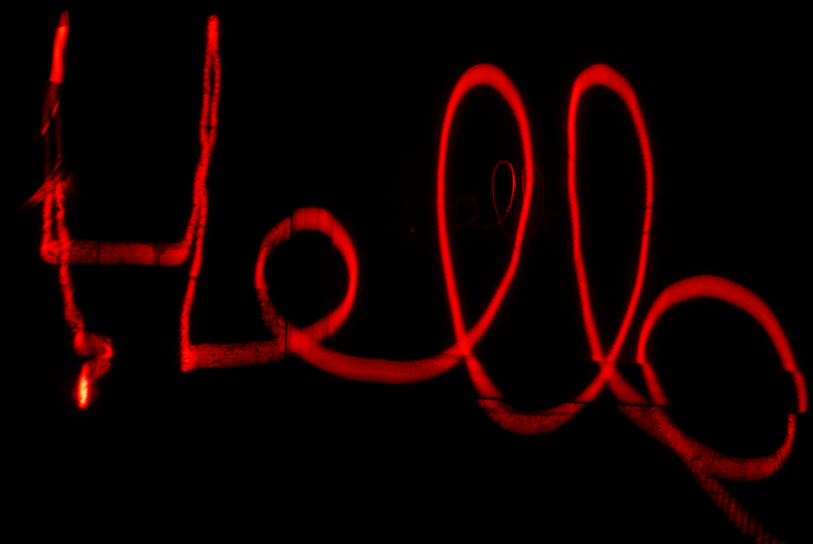

   Exemple de light painting basique en étant derrière l’appareil photo avec un
   pointeur laser

Une seconde technique consiste à éclairer, ou non, des zones d'une pièce ou
d'un objet. Le jeu de lumière ainsi obtenu donnant un certain effet « non
naturel » à l'image.

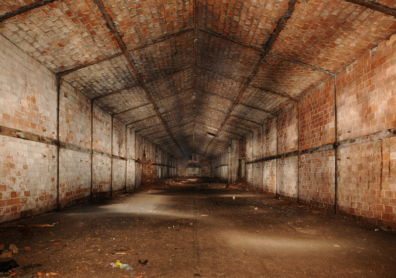

   Exemple de light painting utilisant des jeux d'ombre et de lumière (source :
   wikipedia)

Seulement comme vous pouvez le remarquer il n'est pas possible de dessiner
quelque chose de précis. Certes il est possible de faire des choses vraiment
impressionnantes moyennant un peu d'imagination (et de pratique, chose que je
n'ai pas malheureusement) mais il est impossible par exemple de dessiner un
texte « propre » ou un pixel-art, du moins à la main.

La technologie au secours du light painting
:::::::::::::::::::::::::::::::::::::::::::

Dans cet article je ne vais pas vous expliquer comment dessiner, ou comment
utiliser un appareil photo, je vous laisse chercher dans le manuel de celui-ci
comment utiliser l'exposition manuelle ;)

Ce que je vais vous expliquer c'est
comment - au moyen de matériels simples et facilement disponible - fabriquer
une « digital light wand » (« baguette lumineuse numérique » en français, c'est
tout de suite moins glamour), l'outil ultime du « light painter ».

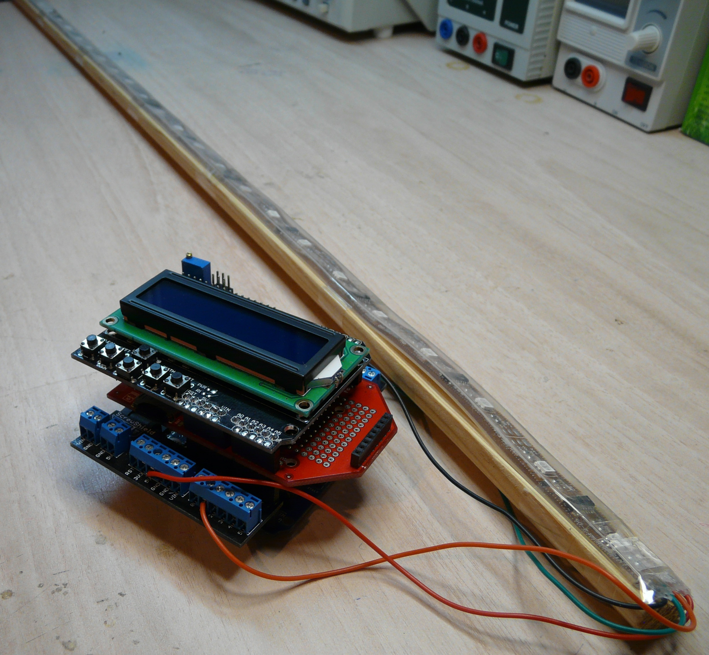

   L'outil magique du parfait light painter

Le principe est simple : un humain ne peut pas dessiner quelque chose de précis
et encore moins en plusieurs couleurs. Pour cela il faudrait une précision dans
les mouvements et une notion de position dans l'espace sur-humaine !

Un microcontrôleur par contre n'a pas ce problème. Un microcontrôleur peut sans
problème contrôler des leds RGB (leds tri-colores permettant de générer
n'importe quelle autre couleur), respecter des timings précis et même utiliser
des périphériques de stockage !

C'est justement ce qu'est une « digital light
wand », un microcontrôleur, un ruban de led RGB et (accessoirement) un lecteur
pour carte SD.

Les leds RGB étant principalement vendus en ruban il suffit de
déplacer la ligne de « pixels lumineux » ainsi formée de manière rectiligne
devant l'appareil photo pour obtenir une image parfaite. La gestion des pixels
et des timings étant laissé à la charge du microcontrôleur, la seule action
humaine nécessaire est de déplacer le ruban de manière rectiligne le plus
régulièrement possible.

Le matériel nécessaire
::::::::::::::::::::::

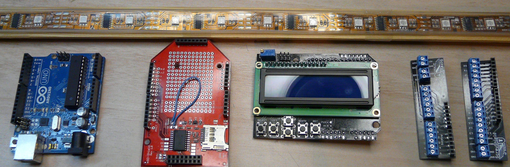

   Pour un total d'une centaine d'euro environ cela reste un projet
   relativement abordable

Comme précisé précédemment le matériel nécessaire est très limité et est
facilement disponible. Pour fabriquer votre propre « digital light wand » il
vous faut :

* une carte arduino « classique » (ici une carte Arduino UNO)
* une shield possédant un support pour carte SD
* une shield lcd avec boutons de DFRobots (ou compatible)
* et bien sûr, un ruban de leds RGB

(la shield avec les borniers n'est pas obligatoire mais facilite grandement le câblage)

.. note::

   Pour ce projet il est obligatoire d'utiliser un ruban de leds RGB
   bien précis : le LPD8806, vendu par Adafruit. Celui-ci a la particularité de
   posséder des contrôleurs de led indépendants au sein même du ruban. Il est donc
   possible de contrôler chaque led indépendamment et d'avoir un profondeur de
   couleur de 21 bits (7 bits par composante R, G et B).

Assemblage des composants
:::::::::::::::::::::::::

L'assemblage des composants est l'étape la plus facile du projet, si vous avez
choisi d'utiliser une carte arduino classique et des shields du commerce cette
étape se résumera à empiler les shields sur l'arduino.

Si vous avez choisi de
faire votre propre montage avec des composants séparés (arduino pro mini +
lecteur de carte SD + écran par exemple) il faudra sortir le fer à souder, les
fils et assembler le tout ;)

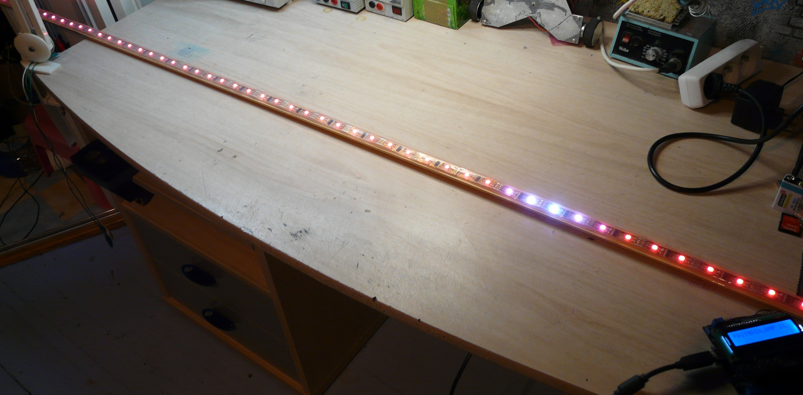

   Mon précieux

Petite modification hardware
::::::::::::::::::::::::::::

Durant le montage de mes composants j'ai remarqué un problème au niveau du
câblage de la shield « support pour carte SD » et de la shield lcd de DFRobots.
La shield pour carte SD utilisait la broche D4 pour le « chip select » (choix
du périphérique actif en communication SPI) de même que la shield lcd pour
l'afficheur !

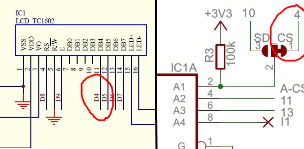

   Une simple broche aurait pu tout faire capoter …

Il y avait donc conflit entre ces deux shields, la solution : un fils et un
coup de cutter (léger) pour « re-router » la broche « chip select » de la carte
SD sur la broche D3 de l'arduino.

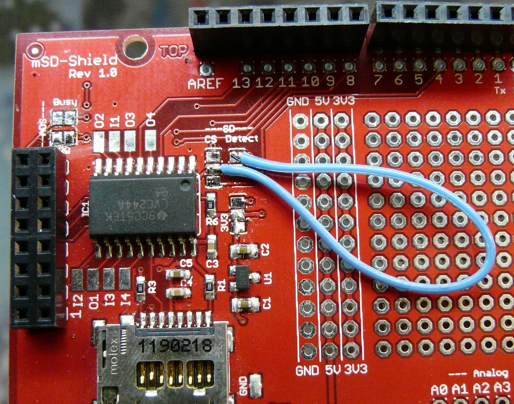

   Un bon bricoleur ne se laisse pas faire aussi facilement

Derniers détails techniques
:::::::::::::::::::::::::::

Tenir un ruban de leds (flexible) droit, à la main, n'est pas une chose facile
… Si en plus il faut manipuler le contrôleur pour choisir quelle image dessiner
cela deviens impossible ... à moins d'avoir trois bras.

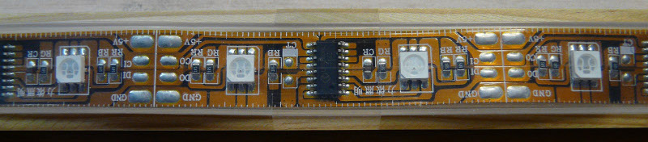

   Simple mais efficace

Pour résoudre le problème rien ne vaut une bonne baguette de bois rigide et du
scotch transparent. Ainsi la prise en main du système devient un jeu d'enfant.

Le logiciel
:::::::::::

C'est ici que les choses se corsent.

Pour le logiciel j'ai choisi de découper mon code en 5 parties, chacune ayant
une fonctionnalité bien précise :

- digital_light_wand.ino : le code principal, gérant le choix du fichier et du
  délai entre chaque colonne de l'image source

- bitmap.ino : gérant l'ouverture de fichiers au format Bitmap et la
  récupération des couleurs de chaque pixel de l'image

- lpd8806.ino : gérant l'affichage sur le ruban de leds des pixels de couleurs
  et de la communication bas niveau avec les contrôleurs LPD8806 du ruban.

- keys.ino : gérant les boutons de la shield lcd

- screen.ino : gérant l'affichage sur l'écran lcd

Comme vous pouvez le voir cela fait beaucoup de choses !

Le principe de fonctionnement « haut niveau » lui reste très simple :

Setup() :

1. Initialisation du matériel
2. Ouverture du dossier « root » de la carte SD

loop() :

1. Choix du fichier
2. Choix du délai entre chaque colonne de pixels
3. Début du dessin
4. Arrêt des leds du ruban

La majeure partie du code se trouve en réalité dans les différents codes « de
contrôle » du matériel.

L'interface homme / machine lui se résume à de simple messages textuels :

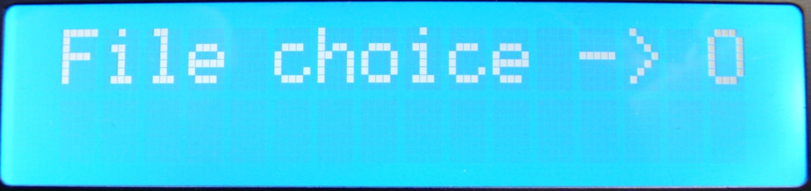

   Premier écran de choix du fichier

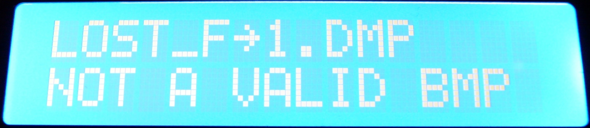

   Le choix du fichier s'effectue au moyen des touches droite, gauche et
   sélection

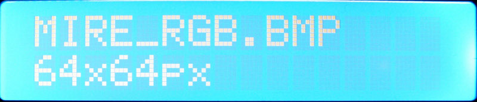

   Un fichier bitmap a été détecté, les informations de tailles s'affichent

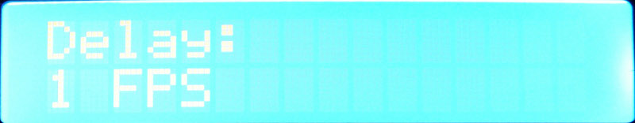

   Plus de fichiers dans le dossier courant, retour au début de la liste des
   fichiers

.. figure:: light/LCD-5.JPG

   Le choix du délai s'effectue au moyen des touches haut, bas et sélection

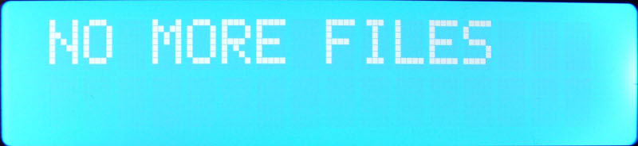

   Le nom du fichier, le pourcentage de progression et une barre de progression
   permettent de savoir instantanément où en est le dessin de l'image. Et ainsi
   d'ajuster la vitesse de déplacement du ruban en conséquence.

Le code source complet est disponible sous licence GPLv3 sur mon compte GitHub :
https://github.com/skywodd/digital_light_wand

Je vous invite à regarder les commentaires présent dans le code source pour
mieux comprendre le principe de fonctionnement du programme. Détailler ici
point par point chaque fonction, algorithme et structure de données demanderait
plusieurs jours et des centaines de pages de texte …

Je souhaiterai cependant détailler deux points en particulier concernant la
gestion des fichiers bitmap et des couleurs.

→ Contrairement aux idées reçu un fichier Bitmap peut être compresser !

Gérer la décompression nécessiterait l'implémentation de l'algorithme de codage
de Huffman, très coûteux en ressources. C'est pourquoi le programme rejettera
tout fichier Bitmap compressé. De même afin de faciliter la gestion des
couleurs celui-ci rejettera aussi tout fichier Bitmap dont les couleurs ne
seraient pas codées sur 24 bits (3 octets).

→ Le contrôleur LPD8806 travaille avec des couleurs codées sur 21 bits, le
fichier Bitmap lui travaille avec des couleurs codées sur 24 bits !

Deux solutions sont implémentées dans le programme, le choix se fait au moyen
d'un #define dans le fichier principal :

- Correction linéaire : chaque couleur (R, G, B) est décalée d'un bit vers la
  droite, cela a pour effet de diviser la valeur de chaque couleur par deux et
  ainsi passer de 8 bits par couleur (0 ~ 255) à 7 bits par couleur (0 ~ 127)
  soit 21 bits au total.

- Correction gamma : chaque couleur est passée dans une table de correction
  prenant en entrée une valeur sur 8 bits et générant en sortie une valeur sur 7
  bits suivant la courbe de réponse de l’œil humain. C'est cette deuxième
  solution qui est appliquée par défaut dans le programme, c'est celle-ci qui
  permet d'avoir un résultat finale au plus proche des couleurs voulus.

Remarque : les fichiers Bitmap doivent être retournés de 90° avant d'être
copiés sur la carte SD. De même ils ne devront pas dépasser 64 pixels de
largeur sinon la partie droite de l'image sera tronquée.

Le résultat
:::::::::::

Après
toute cette lecture il est grand temps de prendre un peu de repos devant
quelques belles photos vous ne trouvez pas ?

– PHOTO : todo
