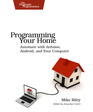

Quelques livres
===============

:date: 2013-05-01
:category: electronique,informatique
:level: decouverte
:author: Tarek Ziadé

Voici une petite sélection de livres qui m'ont paru intéressants à lire
pour vous en fournir une petite critique. Ils ne sont pas tous en français
mais lorsqu'ils sont en anglais, restent très abordables.

Programming Your Home
:::::::::::::::::::::

   Programming Your Home (Mike Riley)

J'ai acheté ce livre au stand O'Reilly pendant le FOSDEM 2013, pour
le lire dans l'avion que je prenais le lendemain. En feuilletant rapidement
la table des matières, il m'a paru très bien.

La liste des projets est bien variée. On y parle par exemple d'un détecteur
de colis qui envoie un mail lors de l'arrivé d'un colis ou un courrier,
un faux chien de garde qui aboie lorsqu'un intrus essaye de pénétrer la maison
ou encore une maison interactive qui répond aux ordres oraux via de
la synthèse vocale. Programme alléchant.

Seulement voila: je m'attendais pour un livre consacré à de la domotique
un minimum d'information sur les systèmes et protocoles existants dans
le domaine. Il y a moins d'une page sur le sujet: l'auteur parle furtivement
du protocole X10 dans l'introduction et puis c'est tout.

Le livre n'est finalement qu'un regroupement de petits projets Arduinos
qui ne forment pas un ensemble cohérent.

Par exemple, pourquoi ne pas avoir expliqué comment créer une centrale de
domotique, puis developpé les petits projets autour de cette centrale ?

Si j'automatise ma maison, je ne vais pas m'amuser à developper plusieurs
petits systèmes indépendants. Je vais vouloir centraliser l'ensemble.

L'autre souci est le choix de la puce radio `X-Bee <http://hackspark.fr/fr/zigbee-xbee-2-4ghz-1mw.html>`_.
A 20 euros par puce en moyenne, le prix de chaque projet monte très vite.

Pourquoi ne pas avoir choisi des puces radios low-cost en 433 mhz ?
A moins de faire un projet point-à-point complexe, elles permettent de
faire la même chose que les puces X-Bee, pour quelques euros seulement.

Enfin, **Le** projet phare du livre, un système de verrouillage de porte,
est complètement tiré par les cheveux. Il faut carrément installer un
Android pour prendre des photos des personnes qui sonnent, pour envoyer
une photo via internet et demander à une autre personne de déverouiller
à distance. Cette technique n'est évidemment pas sûr du tout, en plus
du prix prohibitif du projet.

Quelques points positifs tout de même: ce livre touche à beaucoup
de composants et donne de bonne idées - ca reste une lecture intéressante
pour découvrir des techniques d'interaction avec l'environnement,
mais c'est tout.

