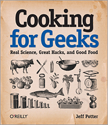
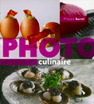
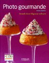

Quelques livres
===============

:date: 2013-05-01
:category: cuisine,électronique,informatique
:level: decouverte
:author: Tarek Ziadé

Voici une petite sélection de livres qui m'ont paru intéressants à lire
pour vous en fournir une petite critique. Ils ne sont pas tous en français
mais lorsqu'ils sont en anglais, restent très abordables.

Programming Your Home
:::::::::::::::::::::

.. figure:: livres/programming_home.jpg
   :figclass: pull-right margin-left
   :target: http://www.amazon.fr/Programming-Your-Home-Automate-ebook/dp/B00AYQNR64
   :scale: 75
   :align: right

   Mike Riley / Pragmatic Bookshelf

J'ai acheté ce livre au stand O'Reilly pendant le FOSDEM 2013, pour
le lire dans l'avion que je prenais le lendemain. En feuilletant rapidement
la table des matières, il m'avait paru très bien.

La liste des projets est variée et intéressante. On y parle par exemple d'un détecteur
de colis qui envoie un mail lors de l'arrivé d'un colis ou un courrier,
un faux chien de garde qui aboie lorsqu'un intrus essaye de pénétrer la maison
ou encore une *maison interactive* qui répond aux ordres oraux via de
la synthèse vocale. Programme alléchant.

Seulement voila: je m'attendais pour un livre consacré à de la domotique
à un minimum d'information sur les systèmes et protocoles existants dans
le domaine. Il y a moins d'une page sur le sujet: l'auteur parle furtivement
du protocole `X10 <https://fr.wikipedia.org/wiki/X10_%28informatique%29>`_
dans l'introduction et puis l'utilise dans un projet de lumière pilotée
par le web - mais il y a très peu de détails sur le matériel et les usages
existants dans la communauté des domoticiens, ce qui est dommage.

Le livre n'est finalement qu'un regroupement de petits projets Arduino
qui ne forment pas un ensemble cohérent.

Par exemple, pourquoi ne pas avoir expliqué comment créer une centrale de
domotique, puis developpé les petits projets autour de cette centrale ?

Si j'automatise ma maison, je ne vais pas m'amuser à developper plusieurs
petits systèmes indépendants. Je vais vouloir centraliser l'ensemble.

L'autre souci est le choix exclusif de la puce radio
`X-Bee <http://hackspark.fr/fr/zigbee-xbee-2-4ghz-1mw.html>`_,
pour tous les projets sans fils, qui forment la grande majorité du livre.
Même si cette puce et son protocole Zigbee (lire notre dossier
`Xbee </volume-2/xbee-arduino.html>`_) sont très intéressants,
à 20 euros par puce en moyenne, le prix de chaque projet monte très vite.

Pourquoi ne pas avoir aussi exploré des puces radios low-cost en 433 mhz,
comme ce que nous a montré Jonathan au
`numéro précedent <http://faitmain.org/volume-1/dispositifs.html>`_?
A moins de faire un projet point-à-point complexe, elles permettent de
faire la même chose que les puces X-Bee, pour quelques euros seulement.

Enfin, *le* projet phare du livre, un système de verrouillage de porte,
est complètement tiré par les cheveux. Il faut carrément installer un
téléphone Android pour prendre des photos des personnes qui sonnent, pour
envoyer une photo via internet et demander à une autre personne de déverouiller
à distance. Cette technique n'est évidemment pas très sûre de l'aveu même de
l'auteur, qui suggère des pistes dans la conclusion.

Une solution à base de `RFID <https://fr.wikipedia.org/wiki/Rfid>`_ ou
un digicode à mot de passe unique auraient été plus réalistes.

Le prix prohibitif du projet est aussi rédhibitoire: pourquoi ne pas avoir opté
pour une simple web cam voir une board de type Raspberry-PI (ou une
une autre board vu que le livre est sorti la même année que le Raspberry).

A vouloir montrer un maximum de techniques et périphériques différents,
l'auteur fini par faire quelques projets un peu bizarres.

Je vais arrêter de critiquer ce projet en particulier, vous l'aurez compris
le livre m'a un peu déçu.

Quelques points positifs tout de même: ce livre touche à beaucoup
de composants et donne de bonnes idées et j'ai bien aimé le volet éléctrique
automatique.

**Programming Your Home** reste une lecture intéressante pour découvrir
des techniques d'interaction avec l'environnement, mais vous ne ne construirez
pas la maison du future avec ce livre là.

Cooking For Geeks
:::::::::::::::::

   Jeff Potter / O'Reilly Media

La première fois que j'ai entendu parler de ce livre, c'est lorsque j'ai vu la vidéo
de Jeff Potter `en train de faire de la glace avec de l'azote liquide
<https://www.youtube.com/watch?v=3WbvTV9rUFA>`_. Il y a même un glacier
à San Francisco - `Smitten <http://smittenicecream.com>`_ qui vend des glaces
faites devant les clients avec de l'azote. Vu que le processus ne prend que
quelques secondes, l'eau n'a pas le temps de cristalliser et les fruits
frais et la crème fraîche expriment complètement leurs saveurs.

C'est un peu la même idée pour la cuisine sous vide: les aliments sont
emballés dans un sac plastique et cuits à basse température pendant des heures.
Un steak sera uniformément cuit et ses cellules ne seront pas éclatées par
une chaleur excessive.

Pour en revenir au livre, il est tout bonnement incroyable. Il traite de
la cuisine comme on peut traiter de la conception logicielle: l'outillage
et la préparation de la cuisine sont passés en revue, puis les principes
chimiques et physiques sont expliqués: du goût à l'odeur, en passant
par les textures, puis la cuisson, la température et les différentes
techniques pour enfermer de l'air dans les mousses, pates et autres
soufflés.

Ce livre a deux lectures: on peut lire chaque chapitre et apprendre
des techniques de cuisine, appuyées par des explications scientifiques -
puis tomber de temps à autre sur des recettes d'applications. *Ou*
simplement se rendre à l'index des recettes et en faire une.

J'aurais plus tendance à regarder la liste des recettes et en faire une qui me
plaît, puis lire les explications techniques et scientifiques qui
l'entourent.

On oublie par contre les recettes basées sur de l'azote liquide car ce
n'est pas vraiment à la portée de tous - les précautions de sécurité
sont assez drastiques et le matériel très onéreux.

Pour conclure, j'ai trouvé **Cooking For Geeks** absolument génial.

Photo Culinaire & Gourmande
:::::::::::::::::::::::::::

   Philippe Barret / Eyrolles

`L'article du numéro 1 </volume-1/5-trucs.html>`_ sur la photographie
culinaire m'a donné envie de pousser un peu plus dans l'exploration
de ce domaine.

Les Éditions Eyrolles proposent deux ouvrages dans la photo culinaire:
`Photo Culinaire <http://www.editions-eyrolles.com/Livre/9782212673371/photo-culinaire>`_
de Philippe Barret et `Photo Gourmande <http://www.editions-eyrolles.com/Livre/9782212134315/photo-gourmande>`_
de Mouni Abdelli.

Deux ouvrages écrits par deux auteurs différents: Philippe Barret est
un photographe culinaire professionel et illustre des recettes dans
de nombreux ouvrages. Mouni Addelli est quant à elle bloggueuse
et photographe amateure. Elle tient le blog
`Rdv Aux Mignardises <http://www.mignardise.fr/>`_.

Les Éditions Eyrolles m'ont gentiment envoyé les deux livres
pour que je puisse les étudier et les présenter ici.

Le livre *Photo Culinaire* est une belle édition au format
22x24 - un A4 un peu écrasé en quelque sorte, ce qui laisse la part
belle aux clichés.

Au niveau du contenu, on retrouve les principes de base de la
photographie et un passage en revue du matériel nécessaire, que ce
le matériel d'éclairage aux décors et accessoires.

Rassurez vous, il n'y a pas besoin d'un studio onéreux pour
faire des photos culinaires - mais pour une bonne maîtrise de la
lumière, quelques spots deviennent vite indispensable si vous
ne pouvez pas prendre des photos en extérieur.

Le chapitre 2 sur les rappels techniques est très bien fait et
détaille les paramètres à prendre en compte lorsque l'on prend
des photos culinaire. Une dizaine de pages bien utiles.

Le reste du livre détail les techniques propres à chaque
domaine de la photographie numérique - de la méthode employée
pour prendre les photos à la post-production: les photos
d'emballage & de catalogue, les photos pour les livres et
la photographie avec les chefs.

Cette dernière catégorie est en fait l'art et la manière
de photographier des *créations* de plat. Autant dire que si
vous n'avez pas un Paul Bocuse sous la main vous avez le
droit de photographier vos propres créations :)

Ce qui m'a le plus intêressé c'est la réalisation des recettes
en mode pas à pas et l'ouvrage donne de bonnes indications

Le clou du livre, page 73 - c'est les carottes qui se jettent
dans un plat avec un effet d'animation pour le mouvement.

Un petit détail que j'ai trouvé gênant est l'utilisation
du `bokeh <https://fr.wikipedia.org/wiki/Bokeh>`_ à outrance
sur de nombreux clichés. Sur certaines photos, le bokeh qui est
utilisé pour mettre en valeur un sujet, floute une partie
du sujet lui même et j'ai trouvé ca génant.

Il existe une technique appelée le
`Focus Stacking <https://fr.wikipedia.org/wiki/Focus_stacking>`_
pour maîtriser parfaitement la profondeur de champ sur
des sujets ou l'on souhaite flouter l'arrière plan.

Mais mis à part ce détail, j'ai trouvé l'ouvrage très bien,
même pour les photographe avertis: il donne de bonne idées.

   Mouni Abdelli / Eyrolles

XXX

