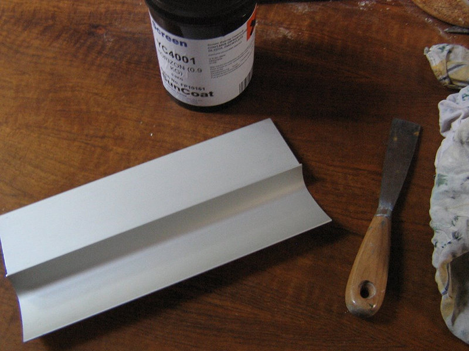
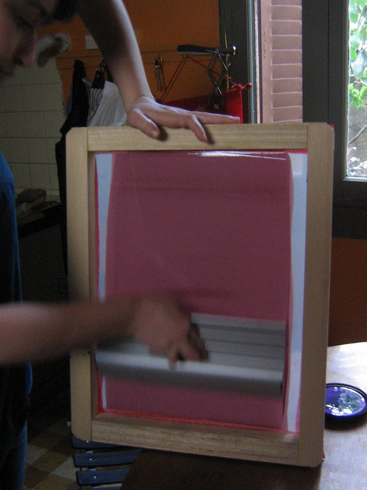
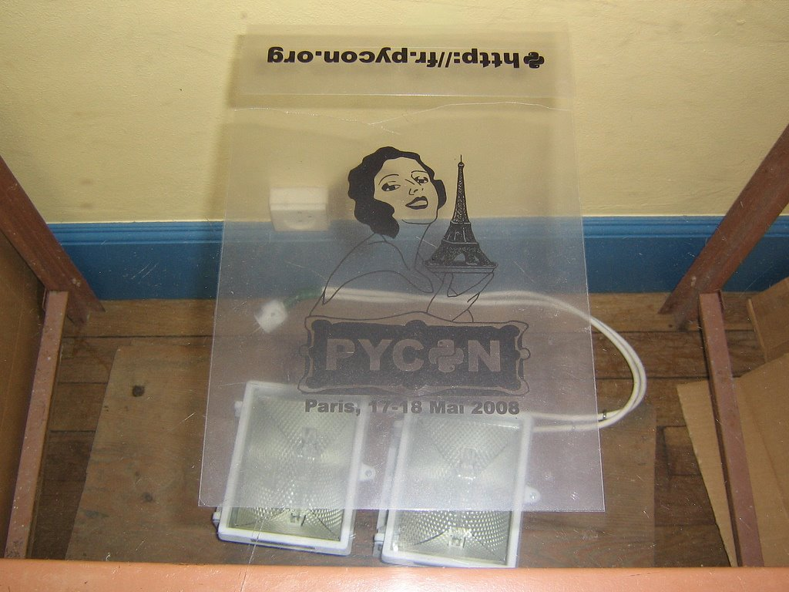
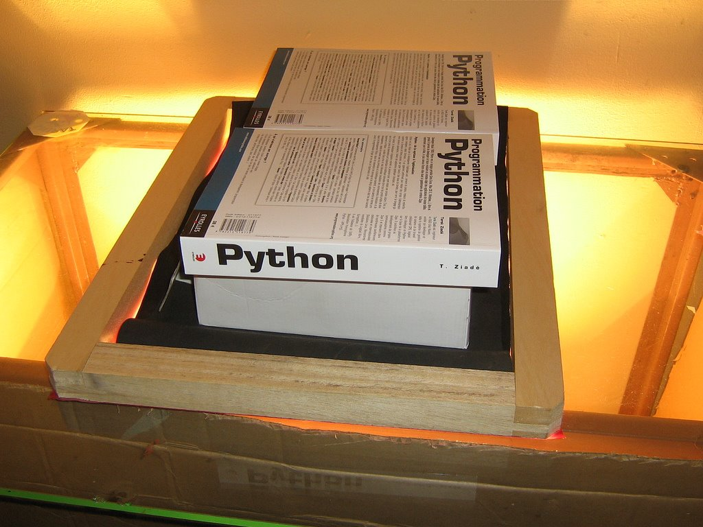
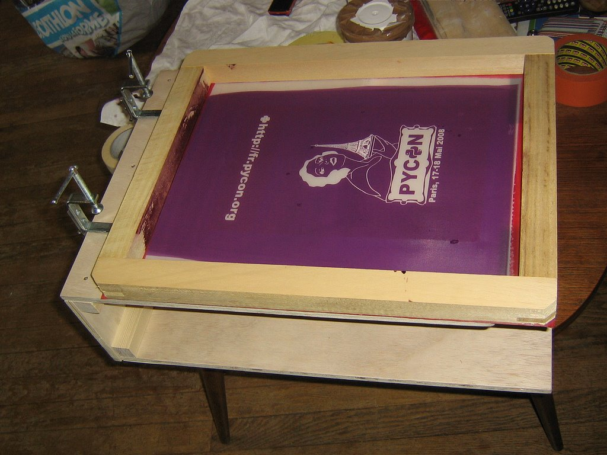
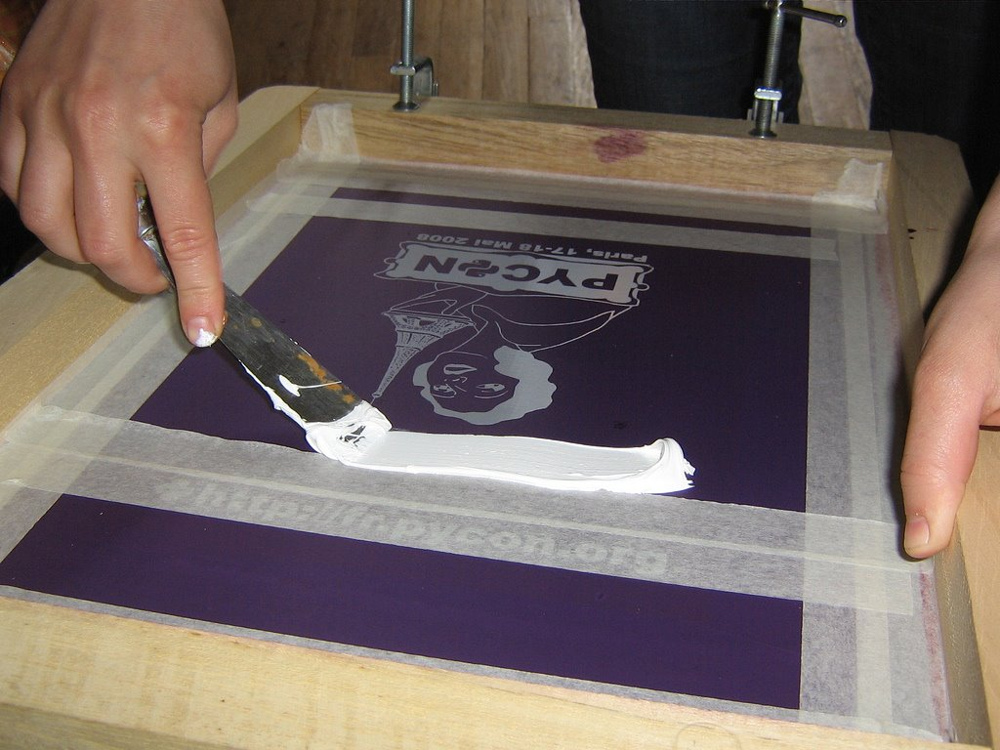
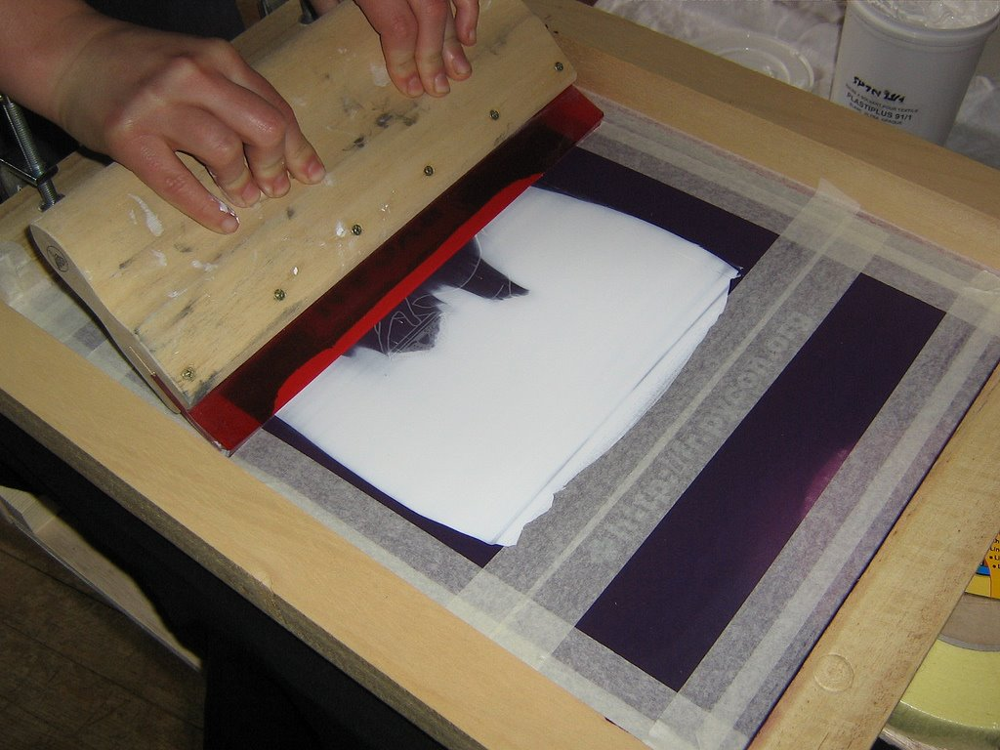
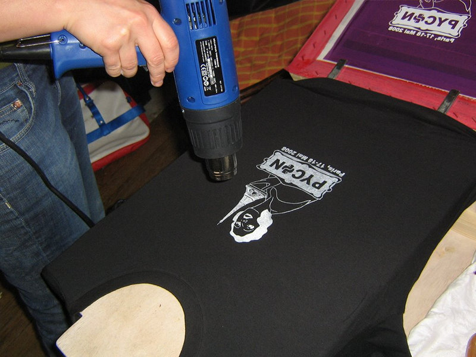
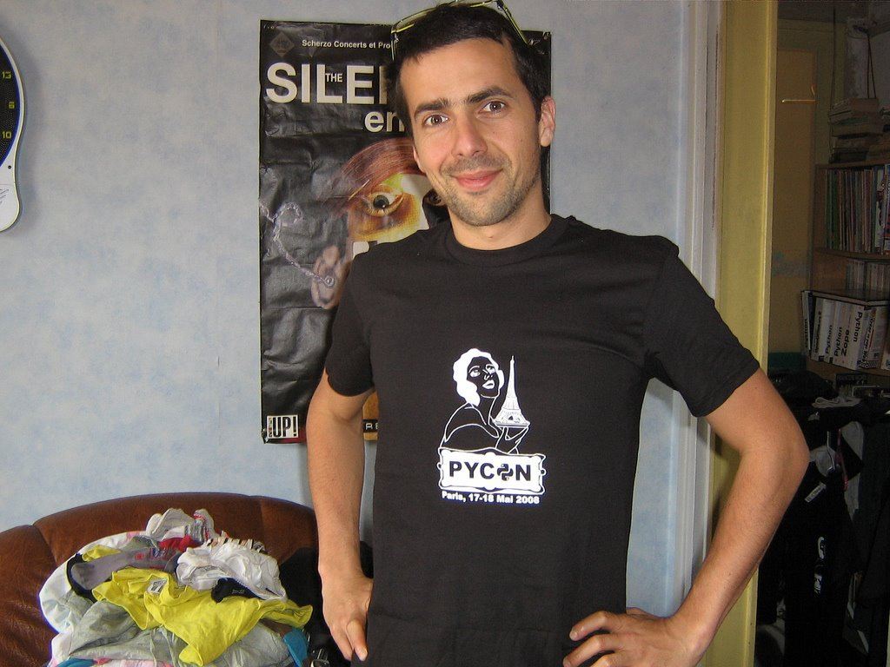

Sérigraphie sur textile
=======================

:date: 2013-05-01
:category: art
:level: decouverte
:author: Amina El Kamel

Cet article explique les techniques de base de la sérigraphie,
qui vont nous permettre de réaliser une jolie impression
monochrome sur un T-shirt.

En France le matériel reste difficile à trouver et cher. Je m'équipe
chez `a.buisine <http://www.abuisine.fr/>`_, et pour ceux qui ne veulent
pas de grosse quantité, `whe <http://www.whe.fr/store/fr/>`_ vend des
packs pour débutant.

La sérigraphie se passe en trois temps:

1. Enduction
2. Insolation
3. Impression

1. Enduction
::::::::::::

L'écran est enduit avec une émulsion photosensible, c'est ce produit qui après
séchage et insolation deviendra le pochoir de notre T-shirt.

.. figure:: serigraphie/nettoyage-ecran.jpg

   Nettoyage de l'écran

Nettoyer, l'écran avec un dégraissant ménager, rincer, laisser sécher.

   Matériel

Pour l'enduction, il faut une racle à enduction et de l'émulsion
photo-sensible. Mettre le produit dans la racle, ne pas avoir peur d'en mettre
trop, on pourra remettre le surplus dans le pot.

   Étalage de l'enduction.

Tenir l'écran verticalement et faire glisser la racle contre l'écran pour
déposer l'émulsion, 2 fois chaque côté : une fois a l'extérieur, une fois à
l'intérieur et recommencer, toujours finir par l'intérieur pour pousser
l'émulsion sur la partie extérieure. Laisser sécher à plat sur 2 cales, face
extérieur vers le bas à l'abri de la lumière, pendant au moins une journée,
mais cela peut varier d'une sorte d'émulsion à l'autre. Bien nettoyer les
outils juste après, et conserver le pot d'émulsion au frigo, il se gardera plus
longtemps.

2. Insolation
:::::::::::::

Sous l'action de la lumière, l'émulsion durcit, les parties masquées, elles, se
disolvent sous l'eau. Et voilà comment on obtient un joli pochoir!

   Préparation pochoir.

Imprimer le dessin à l'encre noire sur un transparent ou dessiner directement
dessus avec un feutre adéquat, le transparent servira de typon.

Installer une vitre à 1m20 du sol et poser 2 halogènes de chantier.

Poser le typon sur la vitre et caler l'écran dessus, couvrir avec un objet qui
coupe la lumière de la taille de l'écran, il faut qu'il soit noir pour éviter
les reflets. Poser un poids dessus et allumer les halogènes. Laisser 18 minutes
en moyenne.

   Flashage.

Rincer à l'eau des deux côtés, l'émulsion part aux endroits où se trouvait le
dessin. Laisser sécher à la lumière.

3. Impression
:::::::::::::

L'encre pour textile est étalée sur l'écran avec une racle, puis poussée à
travers les mailles de l'écran aux endroits où il n'y a pas d'émulsion.

   Mis en place du cadre.

Vous pouvez utiliser une presse à sérigraphie pour les T-shirts, j'utilise la
presse print box de `whe <http://www.whe.fr/store/fr/>`_. Mais il est
possible de faire sans.

   Placement de l'encre.

Coller le T-shirt à la table ou à la jeannette avec de la colle repositionnable. Pour le moment,
l'écran ne doit pas être en contact avec le T-shirt. Etaler l'encre à la
spatule sur le haut de l'écran. Avec une racle étaler l'encre sur tout le
dessin.

   Étalage de l'encre.

Poser l'écran sur le T-Shirt, repasser la racle sur tout le dessin pour
faire passer l'encre à travers le pochoir.

   Séchage de l'encre.

L'encre est maintenant sur le
T-Shirt, il faut la faire sécher avec un décapeur thermique, sécher pendant 3
minutes en faisant des petits ronds comme avec un sèche cheveux.

   Résultat final.

Et voilà, le beau T-Shirt.

