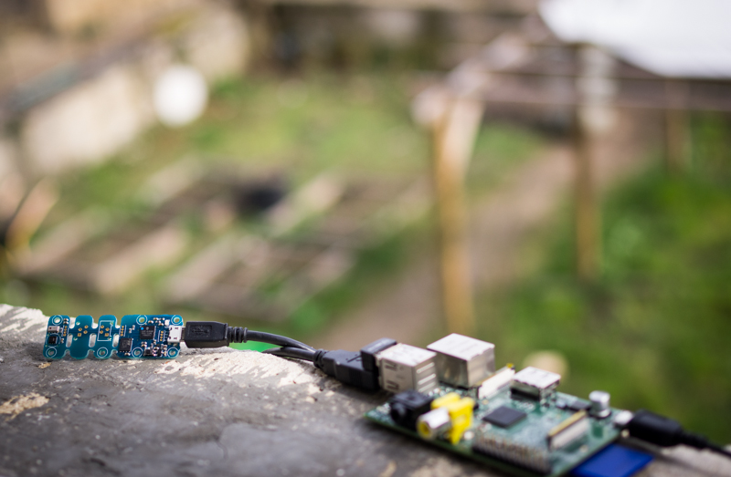
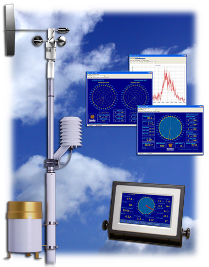
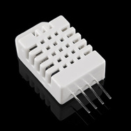
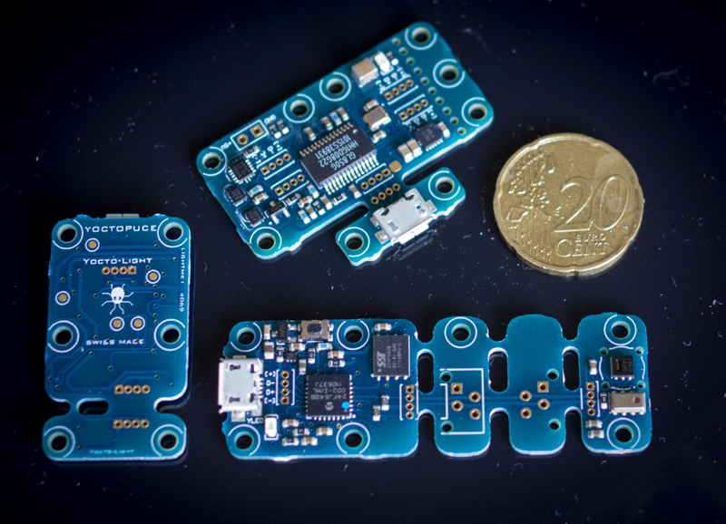
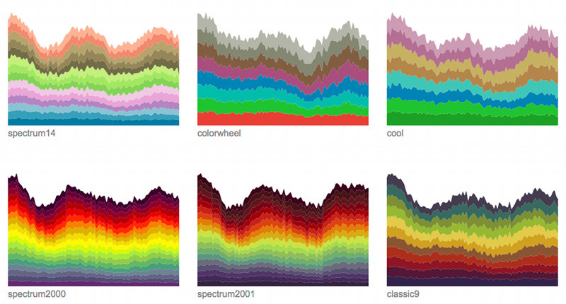
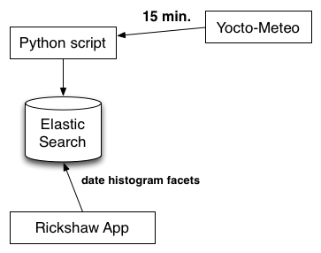
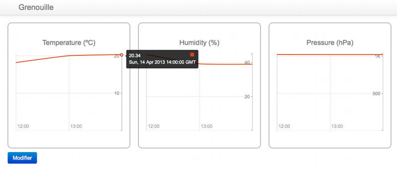

Station météo USB
=================

:date: 2013-05-01
:category: électronique,informatique,ecologie
:level: vulgarisation, moyen
:author: Tarek Ziadé

   Surveillance de mon Jardin avec Yocto-Meteo & Raspberry-Pi

.. note::

   Article élaboré en partenariat avec Yoctopuce.
   Voir la page `partenariats </partenariat.html>`_ pour plus de
   détails.

Après la sortie du premier numéro de FaitMain, j'ai été
contacté par `Yoctopuce <http://yoctopuce.com>`__ qui
m'a proposé de tester son matériel dans un article.

Ca tombait plutôt bien puisque dans la (volumineuse) pile
des projets en attente de réalisation il y a la conception
d'une station météo.

Publier les courbes de température, pression atmosphérique
et humidité de mon jardin en Bourgogne, ne va intéresser que
ma mère qui vient de temps en temps jardiner chez moi.
Mais d'un point de vue réalisation technique c'est un projet
intéressant à conçevoir, surtout du coté logiciel.

Cet article ne va pas trop s'attarder sur le coté hardware
et va surtout vous expliquer comment on peut traiter et visualiser
un stream continu de données.

Station météo
:::::::::::::

Une station météo est composée d'une ensemble de senseurs qui
relèvent des informations comme la température, la pression
atmosphérique ou encore l'humidité, et les transmettent à un
afficheur ou à un autre périphérique de traitement.

Les stations météos vendues dans le commerce sont en générale des boîtes
noires. Pour les plus basiques, elles affichent sur un écran LCD les
informations des senseurs.

Les stations un peu plus haut de gamme conservent un historique des
données ou proposent un afficheur sans fil déporté, mais on grimpe
très vite dans les prix.

Et il faut compter 2000 euros pour les stations haut de gamme comme
la station Capricorn 2000EX qui à défaut de faire le café,
possède les senseurs de base ainsi qu'un pluviomètre et un
anénomètre.

   Station Capricorn 2000EX - Columbia Weather System

Les stations haut de gamme sont par contre communicantes, et
donc programmables, que ce soit par USB, Wifi ou tout autre moyen
de communication que le fabricant a fourni.

Le gros interêt de communiquer avec une station est de pouvoir
conçevoir sa propre application avec les données collectées ou
de les transmettre à une application existante.

Un exemple très intéressant est le projet `Wunderground <http://www.wunderground.com/weatherstation/about.asp>`_
qui centralise toutes les informations envoyées par des particuliers
pour fournir une carte météo assez précise.

Wunderground reste un projet commercial, et je n'ai pas trouvé de projet
libre basé sur un protocole ouvert (je cherche encore..) c'est dommage

Les stations du commerce de toute façon sont en général basées sur
des protocoles et/ou des logiciels propriétaires. Quand on connaît
le prix des senseurs seuls, c'est assez rageant.

   RHT03 - Senseur humidité + température (Sparkfun, $9.95)

Dans l'idéal, on peut fabriquer soi-même sa station météo complète en
achetant les senseurs séparément et en fabriquant une board connectée
à un Arduino ou un Raspberry-Pi.

En feuilletant le catalogue Sparkfun, on trouve tous les senseurs
nécessaires montés sur des petites breakout boards, comme le
`MPL3115A2 <https://www.sparkfun.com/products/11084>`_ qui permet une
interaction en `I2C <https://fr.wikipedia.org/wiki/I2C>`_ avec
un Arduino. Ou encore la puce *RHT03* qui fournit une interface
digitale basique.

Ces puces ne sont pas chers mais nécessitent pas mal de travail
d'intégration pour construire sa station météo.

Les puces Yoctopuce
:::::::::::::::::::

Les puces `Yoctopuce <http://www.yoctopuce.com/>`__ sont un bon compromis
entre les stations clef-en-main et les senseurs de base: ce sont de
petites boards USB plug'n'play qui peuvent être pilotées très
simplement depuis n'importe quel ordinateur.

Aucun driver n'est nécessaire, et le fabriquant fournit une librairie
dans `plusieurs languages <http://www.yoctopuce.com/EN/libraries.php>`_
et une documentation exhaustive des API.

Le code source des librairies est livré sous une license BSD-like
avec une restriction sur une utilisation exclusive sur le matériel
Yoctopuce. Le firmware est quant à lui propriétaire.

La puce `Yocto-Meteo <http://www.yoctopuce.com/FR/products/usb-sensors/yocto-meteo>`_
fournit les trois senseurs de base qui nous
intéressent, à savoir la température, l'humidité et la pression.

   Les puce Yocto-Meteo, Yocto-Light & le mini-hub USB

Les valeures de pression fournies sont relatives au niveau de la mer.
Elles doivent donc être ajustées en fonction de l'altitude à laquelle
on se trouve. Il faut donc connaître son altitude, ce qui n'est
pas forcément toujours évident.

Une solution élégante consiste à géolocaliser la station
météo via internet et retrouver l'altitude via des bases de données
de géolocalisation open source. Mais laissons ce problème
de côté pour l'instant.

Après quelques échanges avec la sympatique équipe suisse de Yoctopuce,
je les ais convaincus en bon Pythonneur qu'il fallait absolument
que la librairie soit accessible sur le
`Python Package Index (PyPI) <https://pypi.python.org/pypi>`_
pour que les projets Python autour de ce matériel puissent très
facilement installer la librairie dans l'environnement d'exécution.

C'est chose faite et installer la librairie Python est aussi simple que:

.. code-block:: bash

   $ pip install yoctopuce

`Pip <http://www.pip-installer.org>`_ est l'outil standard pour installer
des extensions Python.

Un fois la puce branchée, sur le port USB, la lecture des données
est très simple.

Voici un script en Python, inspiré de l'exemple
fourni par Yoctopuce:

.. code-block:: python

    # -* encoding: utf8 -*-
    #
    import time

    from yoctopuce.yocto_api import YAPI, YModule, YRefParam
    from yoctopuce.yocto_humidity import YHumidity
    from yoctopuce.yocto_temperature import YTemperature
    from yoctopuce.yocto_pressure import YPressure

    TURCEY = 374.

    def convert_pressure(value, altitude=TURCEY):
        return value + 1013.25 * (1 - (((288.15 - 0.0065 * altitude) / 288.15) ** 5.255))

    def format_value(sensor):
        value = sensor.get_currentValue()
        name = sensor.get_friendlyName()

        if isinstance(sensor, YHumidity):
            return name, value, u'%.2f %%' % value
        elif isinstance(sensor, YPressure):
            value = convert_pressure(value)
            return name, value, u'%4.0f mb' % value
        else:
            return name, value, u'%2.1f ºC' % value

    def get_info():
        errmsg = YRefParam()

        if YAPI.RegisterHub("usb", errmsg) != YAPI.SUCCESS:
            raise IOError("init error" + errmsg.value)

        sensor = YHumidity.FirstHumidity()
        if sensor is None:
            raise IOError('No module connected')

        module = sensor.get_module()
        target = module.get_serialNumber()

        sensors = [YHumidity.FindHumidity(target+'.humidity'),
                   YPressure.FindPressure(target+'.pressure'),
                   YTemperature.FindTemperature(target+'.temperature')]

        while True:
            if not module.isOnline():
                raise IOError('Device not connected')

            for sensor in sensors:
                name, value, formatted = format_value(sensor)
                print '%s %s' % (name, formatted)

            time.sleep(5.)

    if __name__ == '__main__':
        get_info()

Et l'exécution donne::

    $ bin/python test.py
    METEOMK1-0A918.humidity 47.00 %
    METEOMK1-0A918.pressure 1096 mb
    METEOMK1-0A918.temperature 15.8 ºC

Le script paraît compliqué à premier abord car j'ai ajouté des
fonctionnalités d'affichage dans **format_value()** et quelques
autres automatismes en vue de son intégration dans le projet.

Mais le coeur de la fonctionnalité est simple: une board
Yoctopuce est définie par un objet **module** qui possède
un numéro de série correspondant à celui du matériel.

Une fois ce numéro obtenu, **METEOMK1-0A918** dans mon cas,
les API Yoctopuce fournissent des classes pour récupérer
la valeur en cours du senseur:

.. code-block:: python

    humidity = YHumidity.FindHumidity('METEOMK1-0A918.humidity')
    print humidity.get_currentValue()

    pressure = YPressure.FindPressure('METEOMK1-0A918.pressure')
    print pressure.get_currentValue()

    temperature = YTemperature.FindTemperature('METEOMK1-0A918.temperature')
    print temperature.get_currentValue()

Enfin, pour corriger la valeur de la pression, il convient
d'appliquer la `formule du nivellement barométrique <https://fr.wikipedia.org/wiki/Formule_du_nivellement_barom%C3%A9trique>`_
sur la valeur renvoyée par la sonde.

Traduite en Python, la formule donne:

.. code-block:: python

    TURCEY = 374.

    def convert_pressure(value, altitude=TURCEY):
        return value + 1013.25 * (1 - (((288.15 - 0.0065 * altitude) / 288.15) ** 5.255))

Ma maison est à 374 mètres au dessus du niveau de l'eau.

Le projet Grenouille
::::::::::::::::::::

Ce n'est pas un nom très original mais je n'ai pas trouvé mieux. Le
projet **Grenouille** utilise la sonde Yocto-Meteo pour remplir une
base de données qui sert ensuite à afficher les informations dans
des séries temporelles.

Pour la base de données, j'ai choisi `Elastic Search <http://www.elasticsearch.org>`_.

Elastic Search est un service de recherche au dessus de `Apache Lucene <https://lucene.apache.org/>`_
qui permet d'indexer des données en continu et qui fournit une interface
`REST <https://fr.wikipedia.org/wiki/Rest>`_ pour faire des recherches,

Les performances d'Elastic Search sont assez bluffantes. Ce système est par
exemple utilisé par `FourSquare <https://foursquare.com/>`_
pour son moteur de recherche de lieux qui
compte plus de 50 millions d'entrées.

Ce qui est intéressant pour un projet comme Grenouille est qu'Elastic Search
permet de faire des recherches par
`facettes <http://www.elasticsearch.org/guide/reference/api/search/facets/>`_.
Les facettes permettent de faire des recherches puis d'aggréger les
occurences de résultats en fonction d'un ou plusieurs champs pour avoir
par exemple une moyenne. Dans notre cas par minute, heure, jour, semaine,
mois ou année. Cette fonctionnalité est un peu équivalente à un
*SELECT AVG(TEMPERATURE) GROUP BY HOUR* en sql.

En stockant continuellement les relevés de température, pression
et humidité dans cette base, il devient donc possible de faire des requêtes pour
récupérer toute sorte de *séries temporelles*.

Elastic Search offre aussi le support de `CORS <https://en.wikipedia.org/wiki/Cross-origin_resource_sharing>`_
(Cross-origin resource sharing) qui permet de construire une application
Javascript qui va faire directement des requêtes sur le moteur même si
ce dernier n'est pas déployé sur le même nom de domaine.

L'interface web de Grenouille n'est donc pas une application web
qui s'exécute coté serveur, mais du code Javascript qui se charge
dans le naviguateur et interagit avec ElasticSearch.

Pour l'affichage, Grenouille utilise `RickShaw <http://code.shutterstock.com/rickshaw/>`_
qui est une librairie Javascript spécialisée dans l'affichage
de séries temporelles.

RickShaw est elle-même basée sur `d3.js <http://d3js.org/>`_ un moteur de
visualisation de données qui est beaucoup utilisé dans la communauté
open source.

   Rickshaw en action

Pour résumer, RickShaw permet de faire de *jolis* diagrammes en temps
réel sans difficultés.

Fonctionnement de Grenouille
::::::::::::::::::::::::::::

Grenouille est organisé en deux parties:

1. un script Python qui interroge la sonde et qui indexe le résultat dans
   ElastiSearch.

2. Une application Javascript qui interroge ElasticSearch et affiche
   les informations.

   Organisation de Grenouille

La partie indexation du script Python est basée sur la librairie
`pyelasticsearch <https://pyelasticsearch.readthedocs.org>`_ qui permet
d'indexer très simplement n'importe quel dictionnaire de données Python.

Le code d'indexation ressemble à cet extrait:

.. code-block:: python

    from pyelasticsearch import ElasticSearch
    import datetime

    data = {'date': datetime.now(),
            'humidity': 45,
            'pressure': 1080,
            'temperature': 17.3}

    server = ElasticSearch('http://0.0.0.0:9901')
    server.index('weather', 'sensor', data)

Ce code est appelé toute les 15 minutes.

La partie affichage est quant à elle un peu plus complexe, je ne vais
pas la détailler ici.

La partie la plus intéressante est la fonction qui envoie une requête
au serveur ElasticSearch, En voici un extrait qui permet d'afficher
la temperature par heure pour le 1 et 2 mai 2013:

.. code-block:: javascript

    // construction de la requête
   [...]

    var match = {'match_all': {}};
    var query = {"query": match,
        "facets": {
            "facet_histo" : {"date_histogram" : {
                "key_field" : "date",
                "value_field": "temperature",
                "interval": "hour"},
                "facet_filter": {
                          "range": {"date": {"gte": "2013/05/01",
                                             "lte": "2013/05/02"}
                          }
                }
            }
        },
        "sort": [{"date": {"order" : "asc"}}],
        "size": 0
    };

    // appel asynchrone
    query = JSON.stringify(query);
    this._async(query);

   [...]
   // recuperation des resultats et affichage
   _async_receive: function(json, chart, fields) {
      var name;
      var data = [];
      var series = chart.series;

      $.each(json.facets.facet_histo.entries, function(i, item) {
        var date = new Date(item.time);
        var hour = date.getHours();
        var mean = Number((item.mean).toFixed(2));
        var line = {x: item.time / 1000, y: mean, hour: hour};
        data.push(line);
      });

      data.sort(sortbyx);
      console.log(data);
      series[0].data = data;
      chart.render();
    }

Raspberry-PI
::::::::::::

Passer tout le système sur le Raspberry-Pi est très simple. Je l'ai configuré
comme pour `le projet de JukeBox <http://faitmain.org/volume-1/raspberry-jukebox.html>`_
du mois dernier, puis j'ai installé Java.

Oracle fourni une version spéciale embarqué et un
`guide <http://www.oracle.com/technetwork/articles/java/raspberrypi-1704896.html>`_ d'installation.

Un peu refroidi par le besoin de donner mes infos personnelles pour
récupérer le logiciel, j'ai décidé d'utiliser le paquet `OpenJDK <http://openjdk.java.net/>`_
disponible dans les repositories de Raspbian. *OpenJDK* fait tourner ElasticSearch sans
erreurs, mais il est un peu plus lent.

Enfin, j'ai déployé un server `NGinx <http://nginx.org/>`_ qui se contente d'afficher la
page html statique qui contient les diagrammes Javascript.

Pour le reste de l'installation je fournis
un `Makefile <https://github.com/tarekziade/grenouille/blob/master/Makefile>`_
dans le code de Grenouille qui s'occupe d'installer ElasticSearch et
toutes les dépendances Python.

Extraits:

.. code-block:: make

    build: $(PYTHON) elasticsearch
           $(PYTHON) setup.py develop

    elasticsearch:
        curl -C - --progress-bar http://download.elasticsearch.org/elasticsearch/elasticsearch/elasticsearch-$(ES_VERSION).tar.gz | tar -zx
        mv elasticsearch-$(ES_VERSION) elasticsearch
        chmod a+x elasticsearch/bin/elasticsearch
        mv elasticsearch/config/elasticsearch.yml elasticsearch/config/elasticsearch.in.yml
        cp elasticsearch.yml elasticsearch/config/elasticsearch.yml

Une fois ElasticSearch et le script Python lancé sur le Raspberry-Pi, les
diagrammes vont commencer à se remplir.

   Grenouilles en action

Et voila une première version d'une station météo tournant sur un Raspberry-Pi!

Tout le code source décrit dans cet article est disponible ici: https://github.com/tarekziade/grenouille

La fonctionnalité que je n'ai pas encore ajoutée pour rendre le code plus
générique est la récupération automatique de l'altitude
`en fonction de l'addresse IP <https://fr.wikipedia.org/wiki/G%C3%A9olocalisation#G.C3.A9olocalisation_par_adresse_IP_.28sur_internet.29>`_,
en utilisant une base de données de Géolocalisation.

Il en existe plusieurs, la plus connue étant celle de `MaxMind <http://www.maxmind.com>`_.

Limites & Evolutions
::::::::::::::::::::

Le principal problème d'une station météo basé sur un Raspberry-PI et la
Yocto-Meteo est la consommation d'énergie. L'USB est un port très gourmand en
énergie et en branchant mon système complet sur une batterie lithium 3.7v en
6000 mAh et un panneau solaire censé charger la batterie la journée pour qu'elle
tienne le coup toute la nuit - je n'ai tenu que quelques heures...

Les puces Yoctopuce peuvent être coupées en deux afin de déporter les sondes
du port USB de quelques dizaines, voir centaines de mètre, mais ça n'enlève pas
la dépendance à une source d'énergie fixe.

Une évolution possible pour limiter la consommation serait de déporter la
base ElasticSearch sur un ordinateur dans la maison ou sur internet, et
de suspendre les ports USB pour ne les utiliser que toutes les 15 minutes
pour la récupération des valeurs.

Jonathan a écrit un article très intéressant à ce sujet dans ce numéro:
`Passer un projet sur batterie </volume-2/batterie.html>`_

Pour ma station météo, je reste quand même sur l'objectif de créér un
système autonome en énergie, qui puisse être interrogé sans fil -
donc la prochaine version de la station sera peut être réalisée avec
du matériel plus low-level. Donc peut être un Arduino, une puce radio
433mhz et une base déportée...

Dans tout les cas, pour une application indoor ou proche de la maison,
cette board est très simple à mettre en oeuvre et parfaite pour mettre
rapidement en place un projet sans avoir à jouer du fer à souder.

