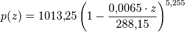

Station météo USB
=================

:date: 2013-04-01
:category: electronique,informatique,ecologie
:level: vulgarisation, moyen
:author: Tarek Ziadé

.. figure:: station/jardin.jpg

   Surveillance de mon Jardin avec Yocto-Meteo & Raspberry-Pi

Après la sortie du premier numéro de FaitMain, j'ai été
contacté par `Yoctopuce <http://yoctopuce.com>`_ qui
m'a proposé de tester son matériel dans un article.

Ca tombait plutôt bien puisque dans la (volumineuse) pile
des projets en attente de réalisation il y a avait la conception
d'une station météo connectée sur internet.

Publier sur internet les courbes de température, pression atmosphérique
et humidité de mon jardin en Bourgogne, ne vont interesser que
ma mère qui vient de temps en temps jardiner chez moi.
Mais d'un point de vue réalisation technique c'est un projet
intéressant à réaliser, surtout du coté logiciel.

Cet article ne va pas trop s'attarder sur le coté hardware
et va surtout vous expliquer comment on peut traiter et visualiser
un stream continu de données.

Station météo
-------------

Une station météo est composée d'une ensemble de senseurs qui
relèvent des informations comme la température, la pression
atmosphérique ou encore l'humidité et les transmettent à un
afficheur ou à un autre périphérique de traitement.

Les stations météos vendues dans le commerce sont en générale des boîtes
noires. Pour les plus basiques, elles affichent sur un écran LCD les
informations des senseurs.

Les stations un peu plus haut de gamme conservent un historique des
données ou proposent un afficheur sans fil déporté, mais on grimpe
très vite dans les prix.

Et il faut compter 2000 euros pour les stations haut de gamme comme
la station Capricorn 2000EX qui à défaut de faire le café,
possède les senseurs de base ainsi qu'un pluviomètre et un
anénomètre.

.. figure:: station/Cap2000EX-web.jpg
   :scale: 50

   Station Capricorn 2000EX - Columbia Weather System

Les stations haut de gamme sont par contre communicantes, et
donc programmables, que ce soit par USB, Wifi ou tout autre moyen
de communication que le fabricant a fourni.

Le gros interêt de communiquer avec une station est de pouvoir
conçevoir sa propre application avec les données collectées ou
de les transmettre à une application existante.

Un exemple très intéressant est le projet `Wunderground <http://www.wunderground.com/weatherstation/about.asp>`_
qui centralise toutes les informations envoyées par des particuliers
pour fournir une carte météo assez précise.

Wunderground reste un projet commercial, et je n'ai pas trouvé de projet
libre basé sur un protocol ouvert (je cherche encore..) c'est dommage

Les stations du commerce de toute façon sont en général basées sur
des protocoles et/ou des logiciels propriétaires. Quand on connaît
le prix des senseurs seuls, c'est assez rageant.

.. figure:: station/RHT03.jpg
   :target: https://www.sparkfun.com/products/10167
   :scale: 12
   :figclass: pull-right margin-left
   :align: right

   RHT03 - Senseur humidité + température (Sparkfun, $9.95)

Dans l'idéal, on peut fabriquer soi-même sa station météo complète en
achetant les senseurs séparément et en fabriquant une board connectée
à un Arduino ou un Raspberry-PI.

En feuilletant le catalogue Sparkfun, on trouve tous les senseurs
nécessaires montés sur des petites breakout boards, comme le
`MPL3115A2 <https://www.sparkfun.com/products/11084>`_ qui permet une
interaction en `I2C <https://fr.wikipedia.org/wiki/I2C>`_ avec
un Arduino. Ou encore la puce *RHT03* qui fournit une interface
digitale basique.

Ces puces ne sont pas chers mais nécessitent pas mal de travail
d'intégration pour construire sa station météo.

Les puces Yoctopuce
-------------------

Les puces `Yoctopuce <http://www.yoctopuce.com/>`_ sont un bon compromis
entre les stations clef-en-main et les senseurs de base: ce sont de
petites boards USB plug'n'play qui peuvent être pilotées très
simplement depuis n'importe quel ordinateur.

Le fabriquant fournit une librairie dans `plusieurs languages <http://www.yoctopuce.com/EN/libraries.php>`_
et une documentation exhaustive des API.

La puce Yocto-Meteo fournit les trois senseurs de base qui nous
interessent, à savoir la température, l'humidité et la pression.

.. figure:: station/yoctopuces.jpg

   Les puce Yocto-Meteo, Yocto-Light & le mini-hub USB

Le seul défaut de cette board est de ne pas fournir un altimètre,
du coup les valeurs de pression fournies qui sont relatives au niveau de
la mer doivent être corrigées en fonction de l'altitude du lieu
- qu'il faut connaitre

   Formule du nivellement barométrique.

Mais ce problème peut être contourné en géolocalisant la station
météo via internet et retrouver l'altitude via des bases de données.

Après quelques échanges avec la sympatique équipe suisse de Yoctopuce,
je les ais convaincus en bon Pythonneur qu'il fallait absolument
que la librairie soit accessible sur le Python Package Index (PyPI)
pour que les projets Python autour de ce matériel puissent très
facilement installer la librairie dans l'environnement d'exécution.

C'est chose faite et installer la librairie Python est aussi simple que:

.. code-block:: bash

   $ pip install yoctopuce

`Pip <http://www.pip-installer.org>`_ est l'outil standard pour installer
des extensions Python.

Un fois la puce branchée, sur le port USB, la lecture des données
est très simple.

Voici un script en Python, inspiré de l'exemple
fourni par Yoctopuce:

.. code-block:: python

    # -* encoding: utf8 -*-
    #
    import time

    from yoctopuce.yocto_api import YAPI, YModule, YRefParam
    from yoctopuce.yocto_humidity import YHumidity
    from yoctopuce.yocto_temperature import YTemperature
    from yoctopuce.yocto_pressure import YPressure

    TURCEY = 374.

    def convert_pressure(value, altitude=TURCEY):
        return 1013.25 * (1 - ((0.0065 * altitude / 288.15) ** 5.255))

    def format_value(sensor):
        value = sensor.get_currentValue()
        name = sensor.get_friendlyName()

        if isinstance(sensor, YHumidity):
            return name, value, u'%.2f %%' % value
        elif isinstance(sensor, YPressure):
            value = convert_pressure(value)
            return name, value, u'%4.0f mb' % value
        else:
            return name, value, u'%2.1f ºC' % value

    def get_info():
        errmsg = YRefParam()

        if YAPI.RegisterHub("usb", errmsg) != YAPI.SUCCESS:
            raise IOError("init error" + errmsg.value)

        sensor = YHumidity.FirstHumidity()
        if sensor is None:
            raise IOError('No module connected')

        module = sensor.get_module()
        target = module.get_serialNumber()

        sensors = [YHumidity.FindHumidity(target+'.humidity'),
                   YPressure.FindPressure(target+'.pressure'),
                   YTemperature.FindTemperature(target+'.temperature')]

        while True:
            if not module.isOnline():
                raise IOError('Device not connected')

            for sensor in sensors:
                name, value, formatted = format_value(sensor)
                print '%s %s' % (name, formatted)

            time.sleep(5.)

    if __name__ == '__main__':
        get_info()

Et l'exécution donne::

    $ bin/python test.py
    METEOMK1-0A918.humidity 47.00 %
    METEOMK1-0A918.pressure 1096 mb
    METEOMK1-0A918.temperature 15.8 ºC

Le script paraît compliqué à premier abord car j'ai ajouté des
fonctionnalités d'affichage dans **format_value()** et quelques
autres automatismes en vue de son intégration dans le projet.

Mais le coeur de la fonctionnalité est simple: une board
Yoctopuce est définie par un objet **module** qui possède
un numéro de série correspondant à celui du matériel.

Une fois ce numéro obtenu, **METEOMK1-0A918** dans mon cas,
les API Yoctopuce fournissent des classes pour récuperer
la valeur en cours du senseur:

.. code-block:: python

    humidity = YHumidity.FindHumidity('METEOMK1-0A918.humidity')
    print humidity.get_currentValue()

    pressure = YPressure.FindPressure('METEOMK1-0A918.pressure')
    print pressure.get_currentValue()

    temperature = YTemperature.FindTemperature('METEOMK1-0A918.temperature')
    print temperature.get_currentValue()

Enfin, pour corriger la valeur de la pression, il convient
d'appliquer la `formule du nivellement barométrique <https://fr.wikipedia.org/wiki/Formule_du_nivellement_barom%C3%A9trique>`_
sur la valeur renvoyé par la sonde.

Traduite en Python, la formule donne:

.. code-block:: python

    TURCEY = 374.

    def convert_pressure(value, altitude=TURCEY):
        return 1013.25 * (1 - ((0.0065 * altitude / 288.15) ** 5.255))

Ma maison est à 374 mètres au dessus du niveau de l'eau.

Le projet
---------

Decrire le projet logiciel XXX

Limites
-------

Parler du pb de batteries  USB etc.

Conclusion
----------

XXX
Trucs pas fait : soudure hub usb etc

oeut etre plus adapter a du indorr etc

