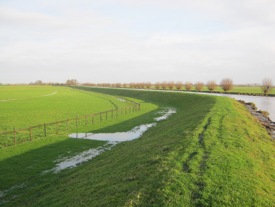
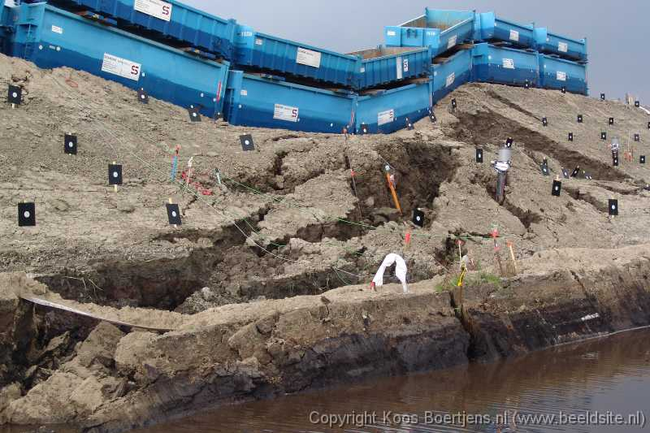
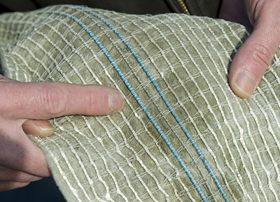
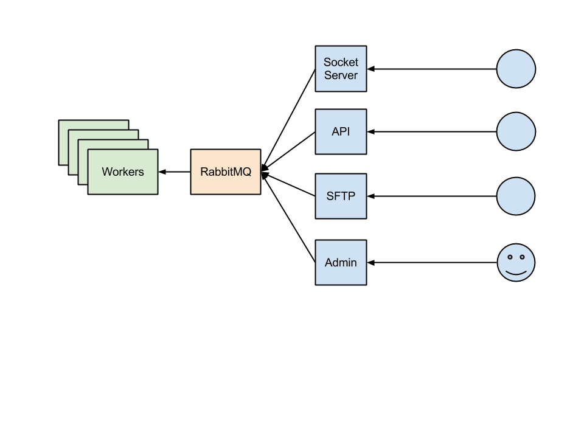
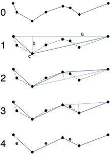

Surveillance de digues
======================

:date: 2013-05-01
:category: écologie,informatique,électronique
:level: découverte
:author: Fritz van Deventer
:translator: Tarek Ziadé

.. note::

   Article conçu en Anglais pour Fait Main par Fritz van Deventer,
   ingénieur chez Nelen & Schuurmans, et traduit librement
   par Tarek Ziadé.

En Hollande, la sécurité relative au niveau de l'eau est probablement
un des problèmes majeurs auquel le pays doit faire face. En effet, 26%
du pays est en dessous du niveau de la mer, et cette surface hébèrge
60% de la population.

Ce problème est devenu un problème de sécurité national.

   source: http://www.ijkdijk.nl/nl/livedijken/livedijk-utrecht

Les digues sont les principales protections du pays contre l'eau.

En 2013, mon entreprise `Nelen & Schuurmans <http://nelen-schuurmans.nl>`_
et l'association `Ijkdijk <http://www.ijkdijk.nl/en/>`_
(qui signifie *Digue de calibration* en Hollandais) ont collaboré
pour mettre au point un système de surveillance automatisé.

L'objectif est de rendre les digues communicantes.

Description du système
::::::::::::::::::::::

Une digue témoin a été construite par l'association *IJkdijk* et a
été submergée volontairement pour qu'elle cède sous la pression
de l'eau.

Cette simulation a permis de récolter des mesures qui ont servi de
calibration pour mettre au point un système d'alerte qui
est capable de prévenir qu'une digue va céder *bien avant*
que l'incident ne se produise.

   source: http://www.ijkdijk.nl/en/experiments/macrostability

L'objectif est d'équiper toutes les digues du pays avec des senseurs
et de récolter en continu et en temps réel les informations. Au jour
d'aujourd'hui, nous avons quatre digues déployées en production
en plus de la digue de test.

*IJkdijk* a placé dans chaque digue une multitudes de senseurs différents:
température, taux d'humidité du sol, acidité du sol, etc.
Ces senseurs sont gérés par le le *Centre de données des digues*  ou *DDSC*
et vous trouverez plus de détails techniques sur leur site web: http://www.ijkdijk.nl/en

   Fibres de mesure de l'humidité du sol.

Mais ce système pose un défi en terme de passage à l'échelle. Chaque digue produit
une quantité astronomique de données à traiter.

A *Nelen & Schuurmans* nous avons tenté de résoudre partiellement ce problème.
Avec le *DDSC*, nous avons construit un système pour stocker et afficher toutes
les données provenants des senseurs.

Nos serveurs de traitement peuvent réceptionner les données par plusieurs
moyens: un classique serveur FTP, un serveur TCP avec des connections
persistentes, ou encore via des importations de
fichiers XML. Pour résumer, nous acceptons toutes formes de transport en
fonction des contraintes, du moment que nous recevons des valeures avec des
*timestamps*.

   Récupération des donées

Les données sont réceptionées et traitées via `RabbitMQ <http://www.rabbitmq.com/>`_
puis stockées dans un cluster `Cassandra <http://cassandra.apache.org>`_ et nous
utilisons une base de données `PostGIS <http://postgis.net/>`_
pour mettre en cache les dernières valeurs reçues pour chaque digue.

Nous fournissons ensuite des services web `REST <https://fr.wikipedia.org/wiki/Rest>`_
que nous avons construit avec Python et `Django <https://www.djangoproject.com/>`_.

Utiliser Django pour des services web n'est peut être pas le meilleur choix,
mais comme ce framework est maîtrisé et apprécié par tout le monde dans
ce projet, nous sommes restés avec.

Comme nos API dépendent beaucoup de Django, nous avons aussi opté
pour `django-haystack <http://haystacksearch.org>`_ combiné
avec `Apache Solr <https://lucene.apache.org/solr>`_ pour offrir
un moteur de recherche.

Interface Web
:::::::::::::

Notre interface web récupère les données avec les API Rest de l'application
Django - et le plus gros travail consistait à trouver une bonne représentation
visuelle des données.

Réussir à synthétiser des millions de chiffres pour en faire une information
utile et simple n'a pas été une mince affaire, vu que les données sont
étalées dans le temps et l'espace.

Nous avons opté pour les visualisations suivantes:

- Avertissements en cas de dépassement de seuils
- Diagrammes temporels et cartes
- Recherche dans les données via Solr.

Les diagrammes temporels avaient le potentiel de devenir très denses,
étant donnée la quantité d'information pour chaque fenêtre de temps.

Nous avons utilisé l'algorithme de
`Douglas-Peucker <https://fr.wikipedia.org/wiki/Algorithme_de_Douglas-Peucker>`_
pour simplifier les courbes sur des écrans basses résolutions.
Le code du client envoit sa résolution et la fenêtre de temps souhaitée au
serveur, qui lui retourne une liste de point à afficher.

   Ramer-Douglas-Peucker (source: Wikipedia)

L'affichage de la carte a été complexe a mettre au point à cause de
la concentration de différents senseurs sur chaque digue.

Comment les classifier ? Comment réussir à naviguer sur cette carte
en comprenant ce qu'il s'y passe ?

Nous avons décidé de différencier les utilisateurs techniques
et non-techniques qui utilisent l'interface. La carte a des modes
d'affichages prédéfinis en fonction de l'utilisateur connecté.

Certains modes prédéfinis offrent même un affichage carte/diagramme
qui permet de faciliter certaines lectures et interprétations.

Le client web a été écrit avec `Backbone.js <http://backbonejs.org/>`_
et l'extension `Marionette.js <http://marionettejs.com>`_

Ces outils ont été une découverte pour notre équipe puisque nous avions
l'habitude de faire tout le templating et le rendu des pages coté
serveur jusqu'ici.

Mais ce projet était l'occasion d'apprendre et de capitaliser sur
ces nouvelles techniques. Les appels asynchrones en JSON et l'architecture
`MVC <https://en.wikipedia.org/wiki/MVC>`_ de Backbone.js nous ont vraiment
beaucoup aidé, en particulier
sur toutes les vues d'affichage de séries temporelles.

Malgré tout, le débat sur ce qui appartient au coté client et ce qui doit
rester coté serveur fait encore rage dans notre équipe et est loin d'être
terminé. Surtout que Backbone est un framework très verbeux.

Peut être qu'`Angular.js <http://angularjs.org/>`_ aurait été un choix plus judicieux.

Conclusion
::::::::::

Nous sommes toujours en train de chercher la solution la plus *simple* pour
l'affichage de données temps réel dans une application web - que ce soit
pour nos utilisateurs techniques ou non techniques.

Mais nous avons déjà fait de grandes avancées:

- l'introduction de diagrammes prédéfinis au lieu du chaos que peut
  représenter un *"Nous voulons un Excel dans notre navigateur"*;
- l'introduction de *Douglas-Peucker* qui nous a permis de limiter le
  nombre de points à afficher au nombre de pixels disponibles sur l'écran;
- n'afficher que l'information nécessaire.

Retrouvez des informations sur ces projets à http://github.com/ddsc et http://dijkdata.nl
Tout notre code est sous la licence `MIT <https://fr.wikipedia.org/wiki/Licence_MIT>`_.

Vous pouvez aussi regarder une
`vidéo qui montre la digue de tests en action <http://vimeo.com/55620328>`_.

