Table basse pliante
===================

:date: 2013-04-06
:category: bricolage
:level: vulgarisation
:author: Christophe Seyve

Introduction : une table basse escamotable
::::::::::::::::::::::::::::::::::::::::::

J'avais pour idée de faire une petite table basse pliante, en table d'appoint
pour prendre l'apéro, faire manger les enfants, ... le tout avec des matériaux
de récupération, glanés dans les rues le mardi soir, veille du ramassage des
encombrants dans mon quartier.

Dans mon idée, une fois pliée, la table devait pouvoir être glissée derrière le
canapé, donc avoir un plateau désolidarisable des pieds, et les pieds
"compactables". De fait, le casse-tête était comment avoir des pieds à la fois
stables, une structure pliable et qu'elle soit un minimum design.

Les matériaux et le matériel
::::::::::::::::::::::::::::

En mode "DIY" (Do-It-Yourself, Fais-Le-Toi-Même pour les non anglophones) donc,
de A à Z, de la conception à la réalisation. Avec une contrainte importante :
je n'avais comme "outils électroportatifs" qu'une perceuse et une
scie-sauteuse. J'ai complété par une ponceuse excentrique quand j'ai découvert
l'ampleur du travail de ponçage à faire sur le plateau trouvé dans la rue...

L'idée était d'utiliser des grosses lattes de sommier pour lit simple,
trouvées dans la rue. Chacune mesurait 800 x 69 x 18 mm.

Et un plateau trouvé dans la rue, de dimensions 75x60 cm.

A compléter par des petites fournitures : vis, équerres, ... vernis.

Le concept
::::::::::

C'est en feuilletant un magazine de mobilier design que le déclic est venu :
faire rejoindre les pieds au centre, formant la grande barre d'un "y", la
petite assurant le support du plateau. Un arc-boutant en bois.

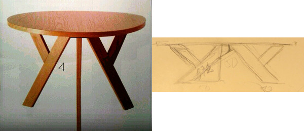

	De l'idée au schéma initial

Ce qui avec une configuration à 4 pieds donnera ça :

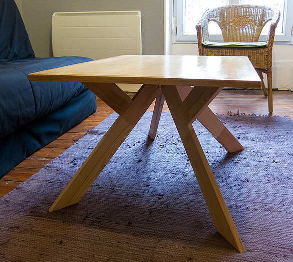

	Résultat final

Et du coup, on peut avoir un axe diagonal avec deux pieds opposés fixés entre
eux, et les deux autres qui se rabattent vers les deux fixes pour les ranger.

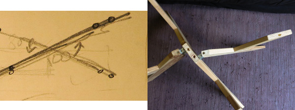

	Deux pieds formant l'axe central + 2 pieds pivotants

Vu que le plateau est amovible, et et que deux pieds pivotent, il faut
solidariser le tout quand la table est en place, sinon le plateau peut glisser
et les pieds se refermer. Et c'est la cata.

La solution consiste à faire des trous dans les pieds : un sur chaque pied
pivotant, et deux sur les pieds fixes, au centre, puis à mettre des têtes de
vis dépassant sous le plateau. Les têtes viennent s'encastrer dans les trous
des pieds : le plateau ne peut plus glisser, et les pieds ne peuvent plus
pivoter.

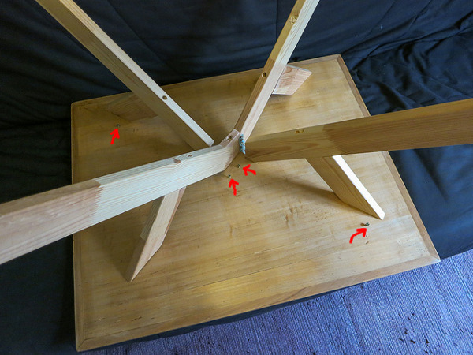

	Les têtes de vis à aligner avec les trous des pieds

Pas la peine d'en mettre sur les contre-forts, cela ne ferait qu'ajouter des
contraintes à l'ensemble.

Y'a plus qu'à remonter ses manches...

----

La réalisation
::::::::::::::

Matériel et matériaux
---------------------

Donc au final, on a besoin de :

* Matériel : une scie (-sauteuse pour ma part, mais manuelle ou circulaire doivent marcher de même, voire mieux), une perceuse et des mèches de 3, 8 et 10mm, une ponceuse, papier de verre, paille de fer, et pinceau pour vernir.

* Matériaux : 4 lattes de sommier de 80cm, 4 petites équerres, des vis (auto-taraudeuses pour éviter de prépercer) de 20mm, 40mm et 75mm, et en fonction du plateau : vernis, huile ou vitrificateur.

Séparer les planches
--------------------

Les planches étaient fixées à deux rubans de tissus par des agrafes, donc à
enlever avec un tournevis plat, et de la patience. Les agrafes et l'opération
ont tendance à marquer le bois, donc il faut faire attention.

Les découpes
------------

La coupe en 'y' permet de réutiliser le bout coupé, quel que soit l'angle de
coupe. Après quelques mesures, il fallait que j'utilise un angle de près de 45
degrés pour avoir une table suffisamment haute pour l'usage. 45°, ça tombe
bien, c'est plus facile à mesurer !

Et donc voici les découpes :

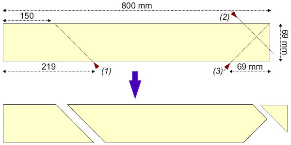

   Découpe pour les 2 pieds fixes

.. figure:: table_basse/Plans_table_basse-pieds_pivotants_w600.jpg

   Découpe pour les 2 pieds pivotants

---------------------
Assemblage
---------------------

*Fixation des contre-forts*

Difficile de percer droit sans perceuse à colonne, donc pour fixer le petit
bras du 'y' sur le grand, un pré-trou petit (3mm) puis un plus large (diamètre
de la tête de vis) qui le rejoint depuis l'autre côté. Puis des chevilles pour
l'empêcher de pivoter. Au final, je n'ai pas trouvé de cheville de récup', mais
ça tient bien quand même comme ça !

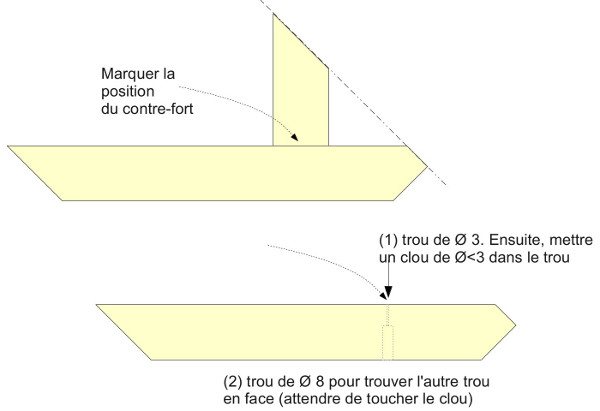

   Pré-trous.

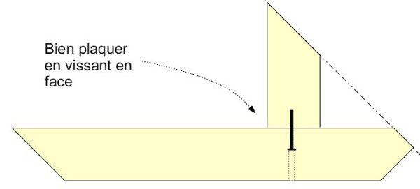

   Assemblage.

*Axe diagonal = pieds fixes*

Pour fixer les deux pieds de l'axe fixe diagonal, j'ai réutilisé une chute, en
découpant un petit morceau triangulaire, dans lequel j'ai mis deux vis de part
et d'autre (traits noirs) pour figer le bas. Elles sont complétées par une
troisième vis plus longue passée par le côté.

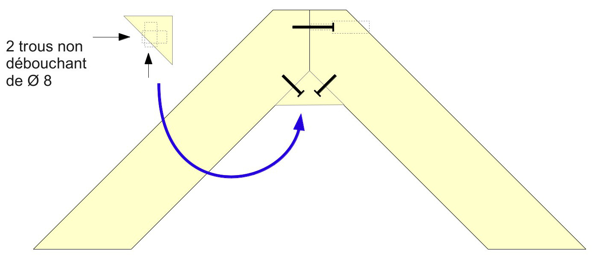

   Bidouille mais assez esthétique finalement.

*Pivots des pieds mobiles*

Pour le pliage des deux pieds mobiles, je n'ai pas trouvé de charnière adéquate
au magasin de bricolage du coin, du coup j'ai utilisé des petites équerres
(encore moins cher !) :

Du coup, c'est pas très symétrique, elle ne sera pas parfaite une fois pliée !

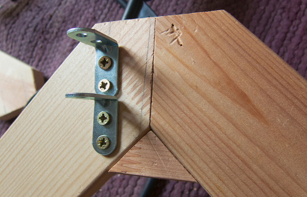

   Equerres

Sur le pied, il faut faire deux fentes à la scie-sauteuse, puis les élargir
(salement, à la scie sauteuse aussi), puis un pré-trou et une grande vis pour
passer dans les trous des équerres. C'est pas très beau dans le principe, mais
ça marche !

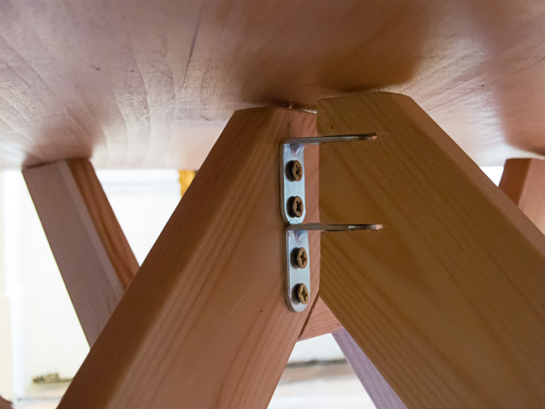

   Pieds sur l'axe des équerres

*Plateau*

Le plateau est aussi de récupération, poncé (il en avait bien besoin !!) puis
vitrifié. Commencer par faire les trous sur les pieds : 2 au centre de l'axe
fixe, de part et d'autre de la séparation, puis un sur chaque contre-fort des
pieds pivotants.

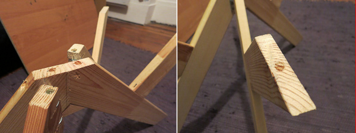

   Pieds sur l'axe des équerres

Pour positionner les vis, dessiner au crayon les deux diagonales sous le
plateau, puis le centre. Placer les pieds à l'envers sur la table, positionner
les vis en face des trous.

	*Astuce :* faire dépasser les vis au centre du plateau plus que celles sur les bords, cela permet de soulever un coin du plateau sans déboîter le centre.

On peut ajouter des petites cales au besoin, comme des patins de chaise en
feutre, pour éviter les jeux dûs aux usinages et assemblages approximatifs.

Pour monter la table, il n'y a plus qu'à aligner vis et trous, et ainsi le
plateau ne glisse plus, et les pieds ne se referment pas.

Très peu de chutes à la fin : il ne reste que les coins et les morceaux rognés
sur les pieds mobiles. Optimisation maximale.

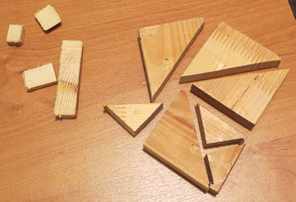

   Même pas de quoi faire un Tangram !

Et voilà le résultat final :

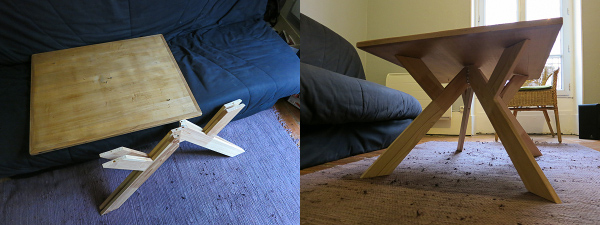

   Avant/après montage

Il n'y a plus qu'à prendre l'apéro ou un petit café !

