XBee & Arduino
==============

:date: 2013-04-01
:category: electronique,informatique
:level: vulgarisation,moyen
:author: Jérôme Abel

Quand il s'agit de concevoir des systèmes embarqués, interactifs ou bien quand
des objets doivent communiquer entre eux, plusieurs techniques de communication
sont envisageables. Nous explorerons ici le protocole `Zigbee
<http://fr.wikipedia.org/wiki/ZigBee>`_ qui permet de communiquer par ondes
radio, c'est-à-dire sans fil. Je m'efforcerais dans un premier temps de
présenter les caractéristiques de ce protocole et d'éviter certaines
confusions. Ensuite je présenterais des cas pratiques avec et sans la carte
Arduino. Pour en savoir plus sur la carte Arduino, vous pouvez consulter ma
page `Arduino <http://jeromeabel.net/ressources/arduino>`_. À noter que ces cas
pratiques ne concernent pour l'instant (01/2013) que la série 1 du module XBee.
Nous aborderons des domaines variés faisant appel à des notions plus ou moins
avancées en réseaux informatiques. Loin d'être un obstacle, ce sera l'occasion
d'apporter quelques éléments de compréhension dans l'apprentissage classique
des systèmes informatiques. N'hésitez pas à me `contacter
<http://jeromeabel.net/infos/contact>`_ pour me faire part de vos remarques,
améliorer ce document, rectifier certaines erreurs.

Cet article est une version un peu réduite de celui-ci :
http://jeromeabel.net/ressources/xbee-arduino. La `partie 2
<http://jeromeabel.net/ressources/xbee-arduino#toc11>`_ notamment, concernant
les réseaux informatiques, ne sera pas retranscrite ici pour alléger l'article.

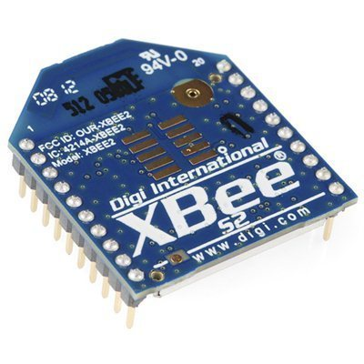

  Le module XBee

Présentation du XBee
::::::::::::::::::::

Les produits MaxStream XBee™ sont des modules de communication sans fil très
populaires fabriqués par l'entreprise `Digi International
<http://www.digi.com>`_. Ils ont été `certifiés
<http://www.digi.com/fr/news/pressrelease?prid=368>`_ par la communauté
industrielle `ZigBee Alliance <http://www.zigbee.org>`_ en 2006 après le
`rachat de MaxStream <http://www.digi.com/news/pressrelease?prid=267>`_ par
Digi International. La certification `Zigbee
<http://fr.wikipedia.org/wiki/ZigBee>`_ se base sur le standard `IEEE 802.15.4
<http://fr.wikipedia.org/wiki/802.15.4>`_ qui définit les fonctionnalités et
spécifications des réseaux sans fil à dimension personnelle (Wireless Personal
Area Networks : WPANs). Nous verrons plus loin chacun des termes qui peuvent
poser problème.

Les principales caractéristiques du XBee :

- fréquence porteuse : 2.4Ghz
- portées variées : assez faible pour les XBee 1 et 2 (10 - 100m), grande pour le XBee Pro (1000m)
- faible débit : 250kbps
- faible consommation : 3.3V @ 50mA
- entrées/sorties : 6 10-bit ADC input pins, 8 digital IO pins
- sécurité : communication fiable avec une clé de chiffrement de 128-bits
- faible coût : ~ 25€
- simplicité d'utilisation : communication via le port série
- ensemble de commandes AT et API
- flexibilité du réseau : sa capacité à faire face à un nœud hors service ou à
  intégrer de nouveaux nœuds rapidement
- grand nombre de nœuds dans le réseau : 65000
- topologies de réseaux variées : maillé, point à point, point à multipoint

Applications
------------

Le ZigBee semble avoir été conçu pour réaliser ce qu'on appelle l'`Internet des
objets <http://fr.wikipedia.org/wiki/Internet_des_objets>`_, un ensemble
d'objets communiquants voir "autonomes", une extension d'Internet aux objets
physiques. La `domotique <http://fr.wikipedia.org/wiki/Domotique>`_ est
l'exemple le plus parlant.

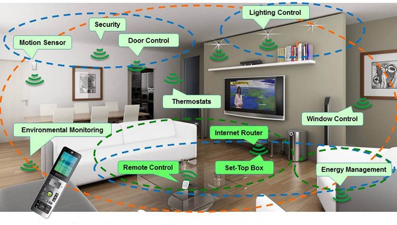

  Exemple d'une maison utilisant la domotique

S'en entrer dans les détails car ce n'est pas le propos ici, la vision d'un
monde où tout doit être connecté, du frigo aux enfants, se rapproche pour ma
part plus du cauchemar que du rêve. Les technologies de communication peuvent
en effet être utilisées par des groupes mercantiles et cyniques qui font
reculer les principes démocratiques. Heureusement, des artistes s'approprient
ces technologies et les utilisent à des fins plus poétiques.

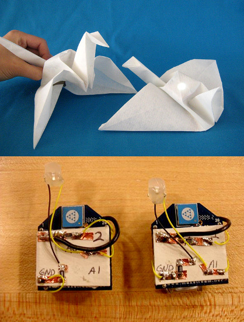

  Ici un couple d'oiseaux de papier communiquent ensemble. Quand l'un est
  manipulé, l'autre s'allume (`Jie Qi messenger
  <http://technolojie.com/xbee-messenger-doves/>`_).

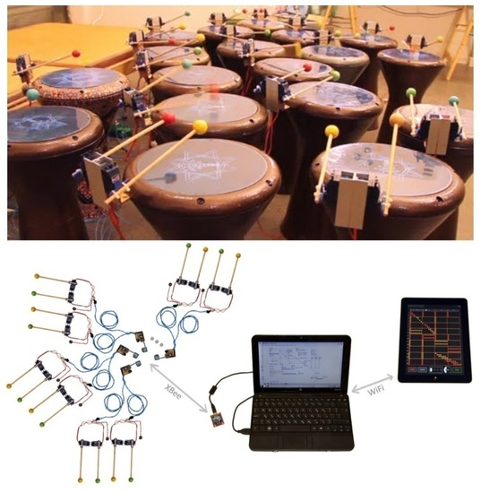

Dans `Robotics drums <http://www.sweet-tech-studio.com/2010/09/robotic-drums.html>`_,
des servo-moteurs contrôlés à distance tapent sur 18 percussions Darbukas pour
créer des rythmes inédits dans la ville.

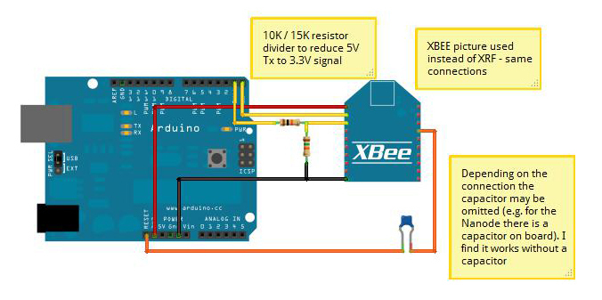

  Programmer une Arduino à distance

Une autre application peut s'avérer très utile : programmer à distance une
carte Arduino. En effet, d'habitude on relie sa carte avec câble USB, mais
comment faire quand la carte est située à trois mètres de hauteur comme c'est
le cas dans mon projet `Chimères Orchestra
<http://jeromeabel.net/art/chimeres-orchestra>`_ ? La programmation à distance
est donc la solution : `programming Arduino Wirelessly
<http://www.faludi.com/itp_coursework/meshnetworking/xbee/XBee_program_Arduino_wireless.html>`_.

Pourquoi choisir le sans fil ?
------------------------------

À première vue, le sans fil présente bien des avantages. Il permet de ne pas
encombrer un espace de travail, d'équiper des appareils mouvants, de
communiquer dans des endroits innacessibles. Cependant, il faut aussi prendre
en considération d'autres paramètres :

- La communication sans fil ne sera jamais aussi fiable qu'une communication
  filaire. Le signal peut être déformé par d'autres ondes et par des obstacles.
- Par conséquent, commencez toujours à tester votre système avec une
  communication filaire.
- À moins de récupérer l'énergie des ondes électromagnétiques ambiantes (`Free
  Energy <http://peswiki.com/index.php/PowerPedia:Free_energy>`_), vous aurez
  toujours besoin d'un fil pour alimenter votre module.
- L'environnement semble aujourd'hui saturé d'ondes électromagnétiques, on
  parle de `pollution électromagnétique
  <http://fr.wikipedia.org/wiki/Pollution_%C3%A9lectromagn%C3%A9tique>`_. Le
  XBee génère des radiations électromagnétiques alors pourquoi en rajouter ?
- La communication n'est pas 1-1 entre l'émetteur et le récepteur. En effet les
  ondes radio rayonnent en cercle autour de l'émetteur. Seuls les appareils
  décryptant le bon protocole peuvent différencier les informations provenant
  d'un module Zigbee, d'un module Bluetooth ou de routeurs Wi-Fi, pourtant tous
  modulés par la même fréquence de 2,4Ghz.

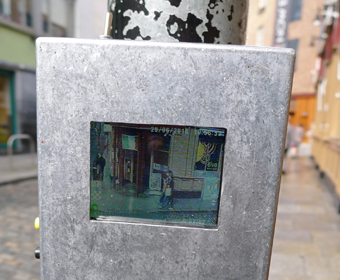

  Projet 2.4Ghz de Banjamin Gaulon

Par exemple, l'artiste Benjamin Gaulon démontre dans son projet `2.4Ghz
<http://www.recyclism.com/twopointfour.php>`_ qu'il est possible de recevoir
dans l'espace public le signal des vidéos de surveillance sensé rester privé..

//Note : certains éléments de cette rubrique s'inspirent de la page 178 du
livre `Making Things Talk <http://shop.oreilly.com/product/9780596510510.do>`_
de Tom Igoe.//

Wi-Fi / Bluetooth / ZigBee
--------------------------

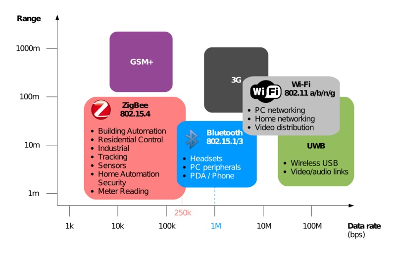

  Comparaisons des principaux protocoles de communication sans fils

XBee ou Zigbee ?
----------------

  "Bee" pour abeille

**Bee** signifiant "abeille", le choix du nom donne l'image qu'il peut y avoir
plusieurs petits modules connectés ensemble comme une colonie d'abeilles. Au
début, on peut confondre les termes XBee et ZigBee. En fait, comme expliqué au
début de l'article, le **ZigBee** est un protocole de communication qui
s'appuie sur le travail du groupe IEEE 802.15.4 et définit par le groupe de
professionnels *ZigBee Alliance*. Le **XBee** est une marque, un produit qui
utilise le protocole ZigBee. Do you bien compris ?

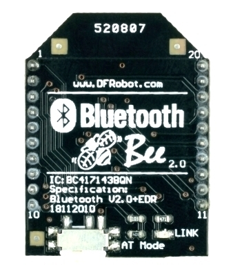

  Exemple d'un module Bluetooth utilisant la même forme que les modules XBee

Le XBee étant devenu populaire, sa forme si particulière est aujourd'hui
reprise par des fabricants de puces Bluetooth. Comme il existe beaucoup de
shields arduinos et d'adaptateurs XBee, cela sera sans doute compatible avec
les puces Bluetooth.

ZigBee et 802.15
----------------

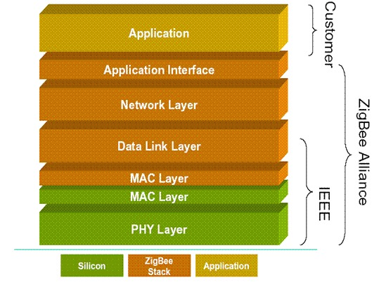

  Architecture du XBee

Dans cette image, on voit bien la répartition des rôles entre le standard
802.15 et le protocole ZigBee. Tout cela est expliqué dans la partie qui traite
des réseaux, des protocoles et des couches du modèle OSI, sur `mon site
<http://jeromeabel.net/ressources/xbee-arduino#toc11>`_.

Séries 1 et 2 ?
----------------

Plusieurs produits XBee existent, ce qui peut créer quelques confusions. Il
faut retenir qu'il y a deux catégories de XBee : **la série 1 et la série 2**.
Les modules de la série 1 ont souvent un "802.15.4" qui s'adossent à leurs
noms. Les modules de la série 2 sont disponibles en plusieurs versions : **XBee
ZNet 2.5** (obsolète), le **ZB** (l'actuel) et le **2B** (le plus récent). Vous
avez aussi des **XBee Pro**, qui font la même chose, mais avec de plus grandes
capacités, notamment la portée qui semble pouvoir aller jusqu'à 1000 mètres !
Pour en savoir plus, télécharger le tableau de comparaison des modules XBee :
http://www.digi.com/pdf/chart_XBee_rf_features.pdf.

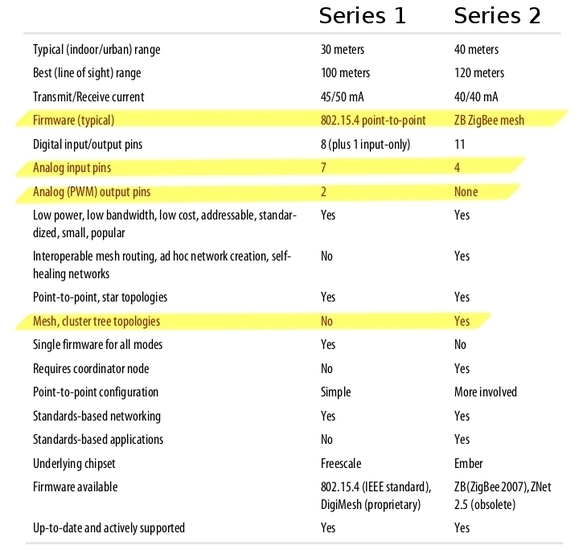

  Tableau de comparaison des séries 1 et 2

Ce qu'il faut retenir :

- **les modules des séries 1 et 2 ne sont pas compatibles entre eux** ;
- la portée et la consommation sont sensiblement les mêmes ;
- le nombre
  d'entrées et sorties est différent et surtout **la série 2 ne possède pas de
  sorties analogiques PWM** ;
- les `topologies de réseaux
  <http://fr.wikipedia.org/wiki/Topologie_de_reseau>`_ possibles ne sont pas
  les mêmes. Avec la série 1, l'architecture est simple : point à point
  (//pair//) ou multipoint (//star//). La **série 2 permet en plus de créer des
  réseaux plus complexes** : maillés (//mesh//) ou en "arbre" (//cluster
  tree//).

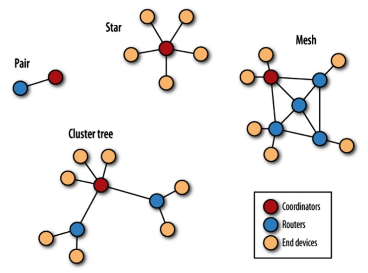

  Topologies des réseaux XBee

Antennes
--------

Vous aurez aussi à choisir le type d'antennes du module. En effet, les ondes radios ont besoin d'antennes pour émettre et recevoir les signaux.

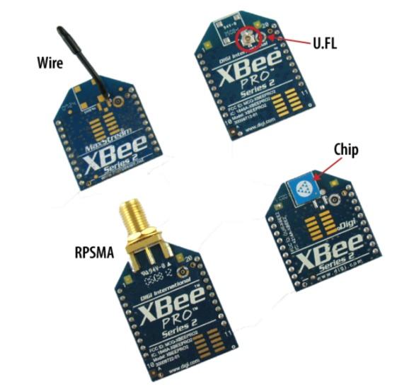

  Les différents types d'antennes

Ce qu'il faut retenir :

- **wire** : simple, radiations omnidirectionnelles ; - **chip** : puce plate
  en céramique, petite, transportable (pas de risques de casser l'antenne),
  radiations cardioïdes (le signal est atténué dans certaines directions) ; -
  **U.FL** : une antenne externe n'est pas toujours nécessaire; - **RPSMA** :
  plus gros que le connecteur *U.FL*, permet de placer son antenne à
  l'extérieur d'un boîtier.

Communication avec l'ordinateur
-------------------------------

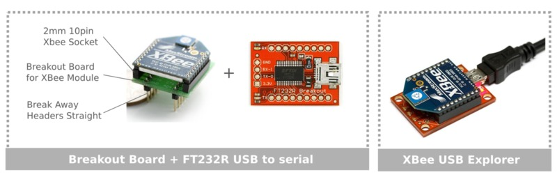

  Connecter le XBee à l'ordinateur

Pour établir une communication avec l'ordinateur, il y a deux options :
l'assemblage de différents éléments comme sur l'image ou le XBee USB Explorer.
J'ai choisi la première option car un peu moins cher et plus flexible.
L'inconvénient est que ça nécessite un peu de soudure (3 minutes) et un petit
montage sur plaque à essais. Bref, cela revient au même.

La communication en direct sans passer par une Arduino vous permet de
configurer rapidement votre XBee. On verra plus loin dans les cas pratiques
qu'on peut aussi configurer le module en le branchant à l'Arduino. Donc se
procurer un explorateur n'est pas indispensable, mais c'est à conseiller pour
débuter car c'est tout de même plus simple.

La communication entre l'ordinateur et le XBee se fait via une liaison série,
que je détaille dans la `partie 2
<http://jeromeabel.net/ressources/xbee-arduino#toc11>`_.

Alimentation
------------

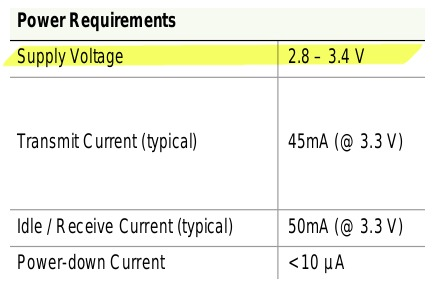

  Alimentation du XBee

L'alimentation doit être comprise entre 2,8V et 3,4V. Dans mes montages
j'utilise l'alimentation stabilisée 3.3V. Dans d'autres `exemples
<http://examples.digi.com/sensors/802-15-4-digital-input-with-a-button/2/>`_,
il semblerait qu'assembler deux piles 1,5V ensemble soit suffisant.

Pour être plus autonome, on peut trouver des montages sur le Web avec le
régulateur de tension LM7833 qui sort directement une tension de 3,3V ou bien
avec le LM317 qui permettrait avec des valeurs de résistances adaptées
d'obtenir ce que l'on souhaite, mais je ne l'ai pas testé.

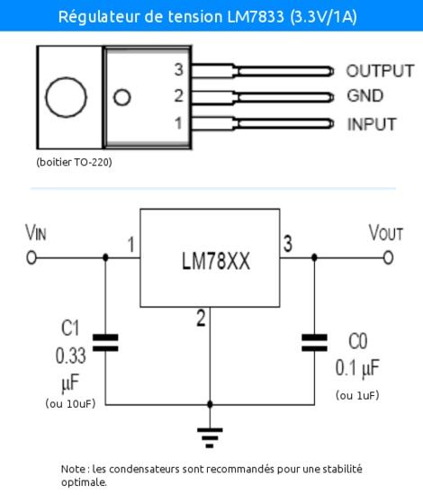

  Régulateur LM7833

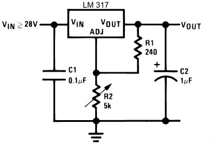

  Régulateur LM317

Matériel nécessaire
-------------------

Vous trouverez une liste intéressante de magasins en ligne sur `codelab.fr/177
<http://codelab.fr/177>`_. Je vous conseille de prendre tout dans le même
magasin pour limiter les frais de transports et en France ou en Europe pour
éviter les taxes (TVA) qui ne sont pas incluses dans certains pays, je pense
surtout aux magasins situés aux États-Unis. En gros, essayez d'éviter Sparkfun.

Synthèse de ce dont nous aurons besoin :

- `Modules XBee <https://www.sparkfun.com/products/11215>`_ x 2 (au moins 2 pour créer une connection !) : série 1 ou 2, antennes filaire ou à puce
- `XBee Explorer USB <https://www.sparkfun.com/products/8687>`_ (Platine d'interface USB pour modules "XBee") : en option si vous choisissez la carte FT232
- `Breakout Board for FT232RL USB to Serial <http://www.sparkfun.com/products/718>`_ (Module "FTDI Basic Breakout" - 3,3V)
- Câble mini-USB/USB
- `Breakout board XBee <https://www.sparkfun.com/products/8276>`_ x 2 (Platine d'interface pour modules "XBee")
- `2mm XBee socket <https://www.sparkfun.com/products/8272>`_ x 2
- `Break away headers <http://www.gotronic.fr/art-connecteur-he14-mh100-4457.htm>`_ x 1
- `Fils prédécoupés de prototypages <http://www.gotronic.fr/art-boite-de-140-ponts-de-connexion-6864.htm>`_ x 1
- Plaques à essais x 2 (solderless boards)
- Potentiomètres 10K
- LEDs x 4 (n'importe lesquelles)
- Bouton poussoir x 1
- Résistances : 10K, 330 Ohms
- `Coupleurs deux piles 1.5V <http://www.gotronic.fr/art-coupleur-2-piles-lr6-em2p-5707.htm>`_  x 2
- `Breadboard Power Supply 5V/3.3V  <http://www.sparkfun.com/products/114>`_ (si besoin)
- `Connecteur embase jack/T pour pile 9V <http://www.gotronic.fr/art-cordon-alimentation-pile-9v-19414.htm>`_
- Pile 9V
- Piles 1.5V x 2
- Cartes Arduino x 2
- `XBee Shield <https://www.sparkfun.com/products/10854>`_ (si besoin)

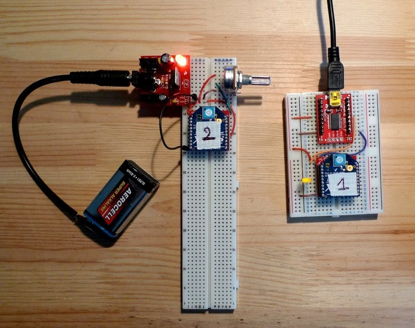

  Exemple de réalisation pour voir comment tout cela s'articule

------

Configuration
:::::::::::::

Une fois le matériel acheté, il ne reste plus qu'à assembler notre premier
montage, à établir une connection avec l'ordinateur et connaître la syntaxe
pour configurer le module XBee.

Montage
-------

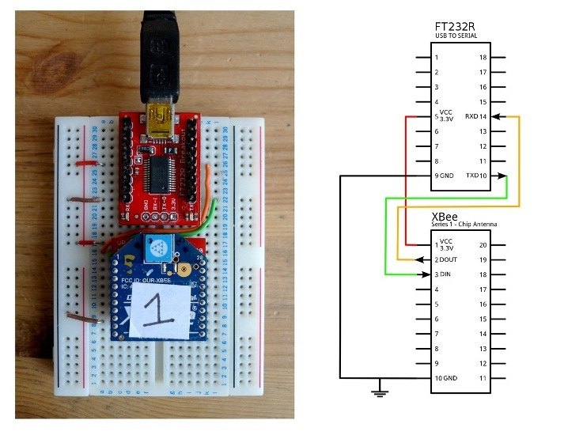

  Montage XBee et FTDI

Souder l'adaptateur XBee, il permet juste d'avoir des contacteurs avec le bon
espacement pour pouvoir enfoncer le module dans une platine d'essais. Placer la
carte FTDI. Connecter l'ensemble suivant le schéma.

Connaître son matériel
----------------------

Sous Linux et Mac OSX, en ouvrant un Terminal, on peut taper quelques commandes
pour savoir si le module est bien reconnu par votre ordinateur : *dmesg | tail
, lsusb, ls /dev/tty*

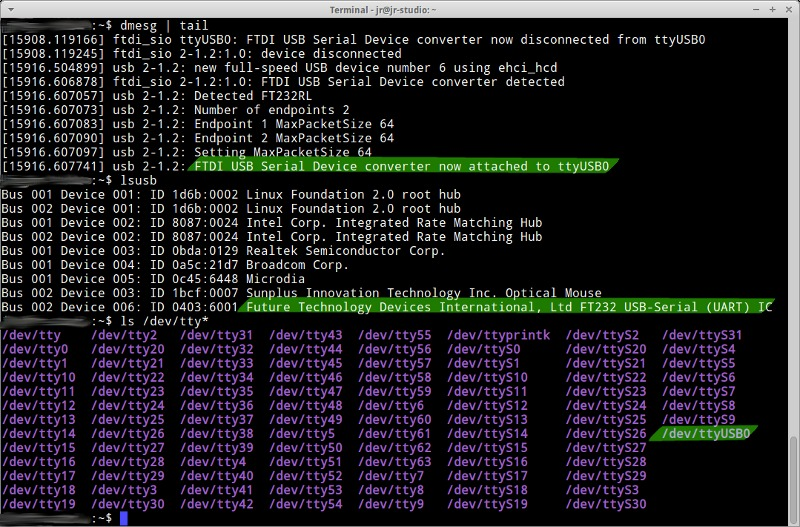

  Commandes utiles

Les réponses du terminal à ces commandes indiquent que l'adaptateur série est
bien connecté à l'ordinateur, vous voyez **FTDI USB Serial Device** ou **FT232
USB-Serial**, son identifiant est **ttyUSB0**.

Terminal
--------

L'idée maintenant est de pouvoir envoyer des commandes au module et de recevoir
ses retours. Pour cela il faut utiliser un programme, appelé Terminal ou plus
précisément `émulateur de terminal
<https://fr.wikipedia.org/wiki/%C3%89mulateur_de_terminal>`_. On l'utilise dans
notre cas pour communiquer en série avec le port ouvert par le contrôleur USB.
Des spécifités existent entre les systèmes d'exploitation que je ne peux
répertorier (pour Windows : programme Putty et Xctu à télécharger).

Trois possibilités :

- dans le logiciel Arduino, il y a **un moniteur série**

- sur Linux, installer le logiciel screen pour avoir un utilitaire ultra simple
  : sudo apt-get install screen. Et ensuite, vous avez accès au port série avec
  la commande : **screen /dev/ttyUSB0 9600**. Le logiciel screen se connecte au
  port série de notre adaptateur FTDI. Si vous avez lu la partie concernant la
  communication en série, vous ne serez pas surpris de voir le chiffre 9600. En
  effet, comme il s'agit d'une communication asynchrone, il faut se mettre
  d'accord sur le débit en binaire (bits/seconde). Commandes utiles de screen :
  Ctl-A ? : help et Ctl-A \ : quit (en tapant "y" pour "yes")

- Une autre solution, sans doute la meilleure, car très agréable à utiliser et
  multi-plateforme : télécharger le programme de Tom Igoe
    - **xbeeSerialTerminal** : http://www.itp.nyu.edu/physcomp/uploads/xbeeSerialTerminal.zip
    - ce programme est écrit avec le logiciel `Processing
      <http://processing.org/download/>`_ (à télécharger aussi si vous ne
      l'avez pas). Ouvrez-le avec et lancer-le, ou mieux, exportez-le en une
      application java pour un confort d'utilisation optimale.
    - il permet de visualiser les commandes et les retours les uns à la suite
      des autres, contrairement au logiciel screen qui n'utilise qu'une seule
      ligne pour l'envoi et la réception, ce qui est une source de confusion.
    - faire attention, le programme ouvre par défaut le premier port série
      ouvert. Donc si deux modules séries sont connectés (une Arduino en est
      un), seul un, que l'on ne peut pas choisir (sauf en modifiant le
      programme de Tom Igoe) est accessible.

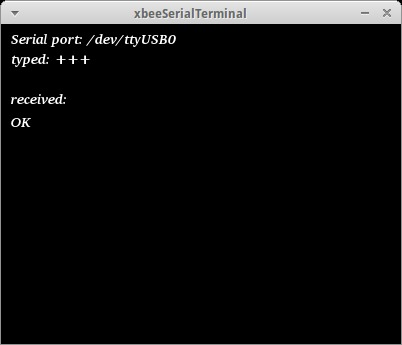

  Exemple de communication avec le programme de Tom Igoe.

Modes
-----

Le XBee possède trois modes : **TRANSPARENT**, **COMMAND** et **API**. Le mode
TRANSPARENT est le mode par défaut à la mise en marche du module, celui qui
reçoit et envoie les données. Le mode COMMAND permet de configurer le module,
ses entrées, ses sorties, son adresse, l'adresse de destination de ses
messages, etc.

Le mode API est un peu plus compliqué et pour dire vrai, je n'ai pas encore pu
l'expérimenter avec succès. Une `API
<http://fr.wikipedia.org/wiki/Interface_de_programmation>`_ (//Application
programming interface//) est un terme bien connu en informatique. Il désigne
une interface fournie par un programme informatique, c'est-à-dire un ensemble
de fonctions qui facilitent la programmation d'un côté et qui de l'autre
communique en langage binaire pour le XBee, sous forme de paquets. Je crois
comprendre que ce mode devient utile quand il s'agit de construire des messages
au format XBee à partir d'un ordinateur ou d'un microcontrôleur comme Arduino.
Le mode API n'est possible qu'avec une connection locale en série et filaire
avec l'ordinateur ou la Arduino, pas entre modules XBee.

Commandes AT
------------

**MODE COMMAND**

Ouvrez le terminal choisi. Avant tout, il faut dire au XBee que l'on veut
quitter le mode TRANSPARENT pour entrer dans le mode COMMAND. Pour cela il faut
prendre le coup de main, suivez bien ces instructions à la lettre :

- Taper **+++** et attendre 1 seconde sans appuyer sur aucune autres touches,
  le message **OK** devrait alors s'afficher comme sur l'image du terminal
  juste en haut. Par ce OK, le XBee nous signale qu'il passe en mode COMMAND et
  qu'il est prêt à recevoir les messages de configuration.

- Si vous attendez
  plus de 10 secondes sans appuyer sur une touche, le XBee revient en mode
  TRANSPARENT. Vous devez alors retaper **+++** pour revenir en mode COMMAND.

**COMMAND AT**

Dans les télécommunications, l'ensemble de commandes Hayes est un langage de
commandes spécifiques développé pour le modem Hayes SmartModem 300 en 1981. Les
commandes sont une série de mots courts qui permettent de contrôler le modem
avec un langage simple : composer un numéro de téléphone, connaître l'état de
la ligne, régler le volume sonore, etc. Ce jeu de commandes s'est ensuite
retrouvé dans tous les modems produits (sources :
http://fr.wikipedia.org/wiki/Commandes_Hayes,
http://en.wikipedia.org/wiki/Hayes_command_set).

Pour avoir un aperçu rapide des commandes disponibles pour le XBee, télécharger
le `guide de référence des commandes AT de Sparkfun
<http://www.sparkfun.com/datasheets/Cellular%20Modules/AT_Commands_Reference_Guide_r0.pdf>`_.

**TEST**

La syntaxe est simple, il faut taper **AT**, puis le nom de la commande, les options si besoin et appuyer sur la touche <Entrée>. Essayez donc ces commandes pour faire vos premiers tests :

- +++ (attendre OK)
- > OK
- ATMY1234 <Enter>
- > OK
- ATMY <Enter>
- > 1234

Vous avez défini ici l'adresse du module à 1234 (ATMY 1234) puis demander quelle était votre adresse (ATMY).

Adressage
---------

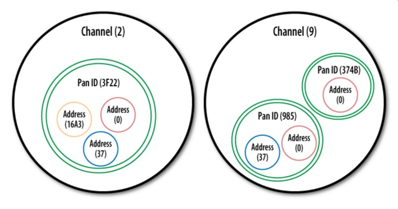

  Les différents types d'adresses

Pour tout XBee, il faut impérativement définir l'adresse du réseau **ATID**,
son adresse personnelle **ATMY** et si besoin, l'adresse de destination des
paquets **ATDL**.

Entrées / sorties
-----------------

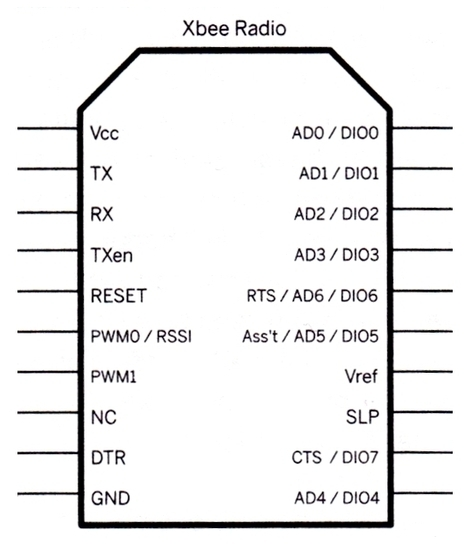

  Entrées et sorties

Le XBee series 1 possède un certain nombre d'entrées et sorties. Les sorties
analogiques sont PWM0 et PWM1. Les entrées et sorties numériques sont DIO1,
DIO2, DIO3, DIO4, DIO5, DIO6, DIO7 ("DIO" pour Digital Input Output). Les
entrées analogiques sont : AD1, AD2, AD3, AD4, AD5 ("AD" pour Analog Digital,
l'échantillonnage des tensions analogiques converties en numérique). Pour
trouver la bonne commande AT, on peut se référer au pages 12, 31, 39 et 43 du
`manuel (.pdf) <http://ftp1.digi.com/support/documentation/90000982_B.pdf>`_ ou
à l'image ci-dessous.

.. figure:: xbee/xbee-IO-configurations.jpg

  Configuration des entrées et sorties

Par exemple, si l'on veut configurer le XBee pour qu'il capte un bouton
poussoir sur l'entrée numérique 1, il faudrait écrire **ATD1 3**. D1 pour pin19
(DIO1, AD1) et 3 pour Digital Input.

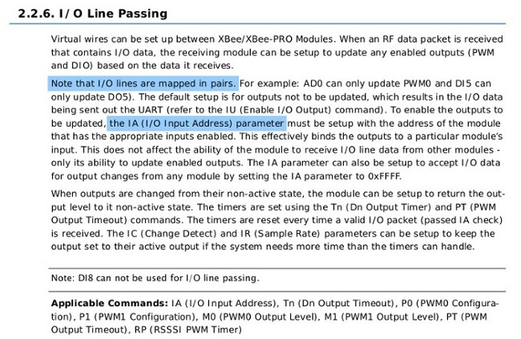

  Explications concernant le *line passing*

Il faut savoir que les entrées fonctionnent par paire, c'est la notion de
"**line passing**". L'entrée 0 du XBee#2 correspond à la sortie 0 du XBee#1.
Comme il y a deux sorties 0 (PWM0, DIO0), alors si on veut avoir deux sorties
différentes il faut choisir une autre sortie DIO1 pour l'autre LED.

Mode API
--------

En mode API, on peut reconstituer la trame ZigBee pour communiquer directement en binaire avec le module.

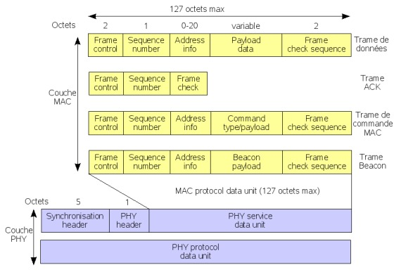

  Trame ZigBee

Voilà, ce que ça pourrait donner en langage Arduino, pris sur http://www.faludi.com/classes/sociableobjects/code/XBee_Analog_Duplex_Sender.pde.

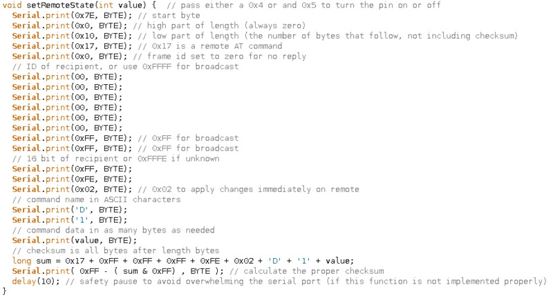

  Mode Api et Arduino

Une autre solution, au lieu de reconstituer la trame, utiliser une bibliothèque spéciale :

- http://code.google.com/p/xbee-api/wiki/WhyApiMode
- http://www.instructables.com/id/Configuring-XBees-for-API-Mode/
- http://rubenlaguna.com/wp/2009/03/12/example-of-xbee-api-frames/

D'autres infos :

- http://domotique.benchi.fr/domotique/definition-des-trames-du-reseau-zigbee/
- http://domotique.benchi.fr/domotique/zigbee-oem-rf-modules-trame-complete/

------

Montages
::::::::

XBee > XBee
-----------

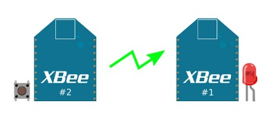

  Montage en direct

On peut faire un montage très simple, le montage direct entre deux modules
XBee. On met deux capteurs sur le XBee#2, un bouton poussoir et un
potentiomètre et deux actionneurs sur le XBee#1, deux LEDs. Le bouton allume et
éteint une LED en on/off (//digital//), le potentiomètre allume et éteint
l'autre LED de façon progressive (en PWM).

**XBee#2 : émetteur (INPUT)**

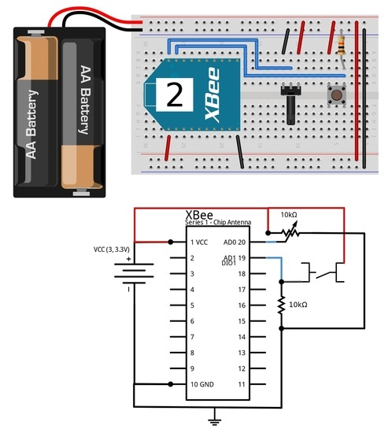

  Montage émetteur

**XBee#1 : receveur (OUTPUT)**

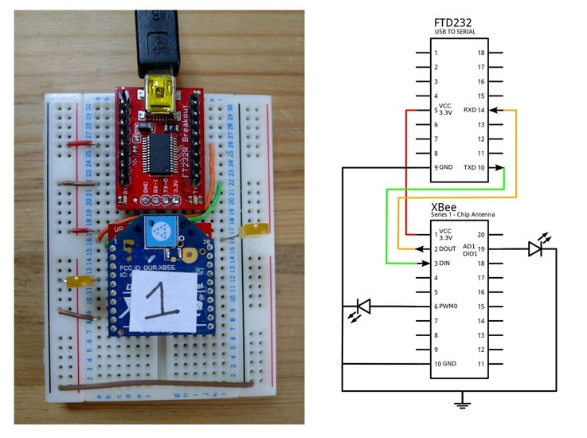

  Montage récepteur

**Configuration**

+------------+------------+-----------+------------------------------------------------------------------------+
| COMMAND    | INPUT      | OUTPUT    | DESCRIPTION                                                            |
+============+============+===========+========================================================================+
| +++        |            |           | Entrer dans le mode COMMAND                                            |
+------------+------------+-----------+------------------------------------------------------------------------+
| ATRE       |            |           | Restaure les paramètres par défaut                                     |
+------------+------------+-----------+------------------------------------------------------------------------+
| ATID       | 1111       | 1111      | Adresse du réseau                                                      |
+------------+------------+-----------+------------------------------------------------------------------------+
| ATMY       | 1          | 0         | Adresse du module dans le réseau                                       |
+------------+------------+-----------+------------------------------------------------------------------------+
| ATDL       | 0          | 1         | Adresse du destinataire dans le réseau                                 |
+------------+------------+-----------+------------------------------------------------------------------------+
| ATIR       | 14         |           | Taux d'échantillonnage 20ms (14 en hexadecimal) (p.43 du manuel)       |
+------------+------------+-----------+------------------------------------------------------------------------+
| ATIT       | 5          |           | Nombre d'échantillons à effectuer avant l'envoi des données            |
+------------+------------+-----------+------------------------------------------------------------------------+
| ATIU       | 1          |           | I/O output enabled : autoriser émission des I/O sans passer par l'UART |
+------------+------------+-----------+------------------------------------------------------------------------+
| ATIA       |            | 1         | I/O input from address 1                                               |
+------------+------------+-----------+------------------------------------------------------------------------+
| ATD0       | 2          |           | POTENTIOMETRE : D0 pour pin20 (DIO0, AD0) et 2 pour ADC (p.12, p.39)   |
+------------+------------+-----------+------------------------------------------------------------------------+
| ATP0       |            | 2         | LED : P0 pour PWM 0 et 2 pour PWM mode (p.31)                          |
+------------+------------+-----------+------------------------------------------------------------------------+
| ATD1       | 3          |           | BOUTON : D1 pour pin19 (DIO1, AD1) et 3 pour Digital Input             |
+------------+------------+-----------+------------------------------------------------------------------------+
| ATD1       |            | 4         | LED : D1 pour pin19 (DIO1, AD1) et 4 pour Digital Out Low Support      |
+------------+------------+-----------+------------------------------------------------------------------------+
| ATWR       |            |           | Écrit la nouvelle configuration dans la mémoire flash du module        |
+------------+------------+-----------+------------------------------------------------------------------------+
| ATCN       |            |           | Sort du mode configuration                                             |
+------------+------------+-----------+------------------------------------------------------------------------+

XBee > XBee/ordinateur
----------------------

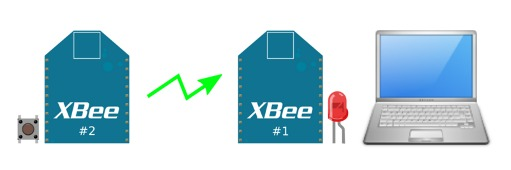

  Communication XBee vers un ordinateur

Avec le même montage, on peut visualiser dans le terminal, les informations
reçues par le XBee#1 avec le convertisseur relié à l'ordinateur. Ces
informations ne sont cependant pas tout à fait compréhensibles dans le
terminal, on ne voit pas de chiffres par exemple car il s'agit de paquet
ZigBee.

XBee/Arduino > XBee/ordinateur
------------------------------

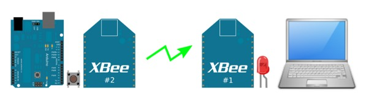

  Communication entre l'Arduino et l'ordinateur

L'Arduino capte un bouton poussoir et envoie un message tout ou rien au XBee#1
pour allumer la LED. Cette fois, on peut voir dans le terminal les informations
de façon compréhénsible.

**Montage émetteur**

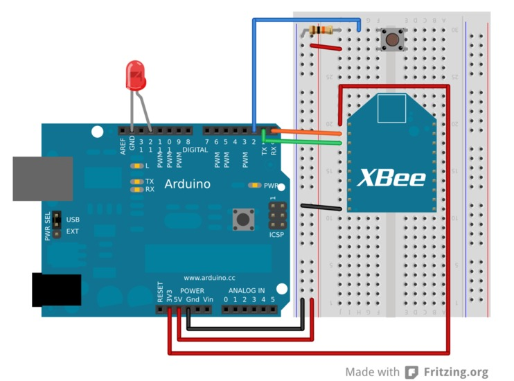

  Montage émetteur

**Code émetteur**

- Téléchargement : http://jeromeabel.net/files/ressources/xbee-arduino/code/arduino_xbee_bouton/arduino_xbee_bouton.ino.
- Simplification du code de Robert Faludi : http://www.faludi.com/classes/sociableobjects/code/XBee_Analog_Duplex_Sender.pde.

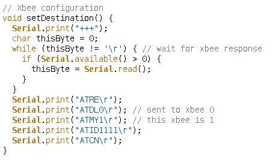

  Code émetteur

Le code n'a rien de compliqué. Tout d'abord on configure le module XBee
connecté avec RX et TX comme indiqué ci-dessus. On écrit "+++" en communication
série, on attend la réponse du XBee avec le caractère '\r' qui marque la fin
d'une ligne et ensuite on écrit seulement cinq commandes pour configurer
uniquement l'adressage du module comme vu dans la partie précédente. On
récupère ensuite les informations numérique de l'entrée numérique de l'Arduino
et on envoie le chiffre reçu en série, donc au module XBee.

XBee/Arduino > XBee/Arduino
---------------------------

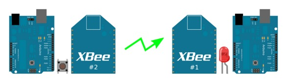

  Communication Arduino vers Arduino

L'émetteur est le même que précédemment, une Arduino avec un bouton poussoir et le XBee#2.

**Montage récepteur**

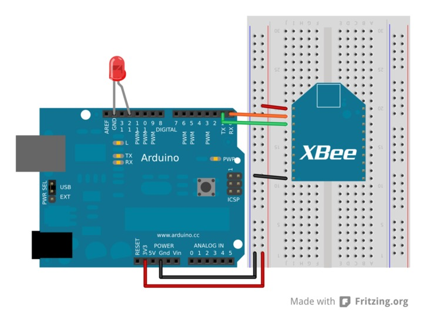

  Montage récepteur

**Code récepteur**

- Téléchargement : http://jeromeabel.net/files/ressources/xbee-arduino/code/arduino_XBee_led/arduino_XBee_led.ino.
- Simplification du code de Robert Faludi http://www.faludi.com/classes/sociableobjects/code/XBee_Analog_Duplex_Sender.pde.

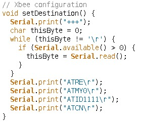

  Code récepteur

On configure tout d'abord le module XBee#1 pour qu'il reçoive les données de l'autre XBee.

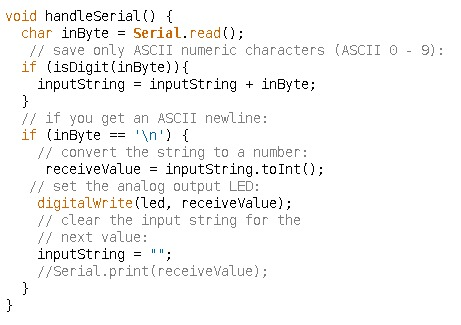

 Code récepteur (suite)

Et on récupère les données du port Série. Ce bout de code est un peu plus
compliqué. **Pour l'instant il ne permet de recevoir qu'une donnée à la fois**.

**Limites**

En pratique, on voudrait avoir la possibilité d'envoyer plusieurs données
différentes provenant de plusieurs capteurs et d'actionner plusieurs sorties.
Les méthodes présentées ici ne le font pas. Pour cela, deux options semblent
envisageable : construire des messages série plus compliqués avec un
identifiant (comme `ici
<http://kiilo.org/tiki/tiki-index.php?page=Arduino-PureData-MessageSystem>`_)
ou bien utiliser l'API XBee pour Arduino.

------

Ressources
::::::::::

Livres
------

- `Building Wireless Sensor Networks
  <http://shop.oreilly.com/product/9780596807740.do>`_, de Robert Faludi. Cet
  ouvrage se consacre uniquement au XBee de la série 2 pour la mise en place de
  réseaux maillés.
- `Making Things Talk <http://shop.oreilly.com/product/9780596510510.do>`_, de Tom Igoe. Le livre
  présente les communications Ethernet, infra-rouge, radio, XBee, GPS.
  Attention, le XBee utilisé est de la série 1 et un seul montage XBee est
  disponible, ce qui est décevant. Il faut plutôt choisir ce livre pour le
  support d'informations concernant l'ensemble des techniques de communication.

Manuels et références
---------------------

- Le manuel du XBee 802.15.4 (Series 1) : http://ftp1.digi.com/support/documentation/90000982_B.pdf
- Series 1 : http://www.sparkfun.com/datasheets/Wireless/Zigbee/xbee-Datasheet.pdf
- XBee Znet 2.5 (old Series 2) : http://www.sparkfun.com/datasheets/Wireless/Zigbee/xbee-2.5-Manual.pdf
- ZB (current Series 2) : http://ftp1.digi.com/support/documentation/90000976_G.pdf
- Guide de référence des commandes AT : http://www.sparkfun.com/datasheets/Cellular%20Modules/AT_Commands_Reference_Guide_r0.pdf
- Comparaisons des modules : http://www.digi.com/pdf/chart_XBee_rf_features.pdf

Téléchargements
---------------

- XBee Serial Terminal (processing) : http://www.itp.nyu.edu/physcomp/uploads/XBeeSerialTerminal.zip
- Code Arduino : http://www.faludi.com/classes/sociableobjects/code/XBee_Analog_Duplex_Sender.pde
- Codes Arduino de mes exemples : http://jeromeabel.net/files/ressources/xbee-arduino/code/
- Schémas électroniques - Fritzing : http://fritzing.org/
- Schémas électroniques - Eagle : http://www.cadsoftusa.com/download-eagle/?language=en

Sites
-----

- Magasins d'électronique : http://codelab.fr/177
- Quelques astuces pour bien choisir le XBee : `XBee buying guide <https://www.sparkfun.com/pages/XBee_guide>`_
- http://www.faludi.com/projects/common-xbee-mistakes/
- http://www.faludi.com/bwsn/xbee-level-shifting/
- http://wiki.labomedia.org/index.php/XBee
- http://www.kobakant.at/DIY/?p=1215
- http://bildr.org/2011/04/arduino-xbee-wireless/
- http://itp.nyu.edu/physcomp/Tutorials/XBeeBasics
- http://examples.digi.com/
- http://www.csquad.org/tag/xbee/
- http://iris.appert44.org/~plegal/index.php/ZigBee-doc-travail
- http://www.pobot.org/-Reseaux-ZigBee-.html
- http://veille-techno.blogs.ec-nantes.fr/index.php/2012/01/06/wi-fi-bluetooth-zigbee-et-la-domotique/
- http://fisherinnovation.com/simple-xbee-communication-with-arduino/
- http://www.instructables.com/id/Configuring-XBees-for-API-Mode/
- http://www.cooking-hacks.com/index.php/documentation/tutorials/arduino-xbee-shield
- http://www.johnhenryshammer.com/WOW2/mainPage.php
- http://djynet.net/?p=96
- http://www.ucopia.com/uploads/newsletters/01/part3.htm
- http://homewireless.org/wp/2010/05/antennas-part-1/
- http://john.crouchley.com/blog/archives/750
- http://domotique.benchi.fr/domotique/zigbee-2/

En savoir plus sur les réseaux :

- `Liaisons série et parallèle <http://www.courstechinfo.be/Techno/LiaisonsSP.htm>`_
- `Bauds et bps <http://www.journaldunet.com/developpeur/ressource/howtos/Serial-HOWTO-12.shtml#ss12.2>`_
- `Transport de l'Information <http://sitelec.org/cours/abati/domo/transport.htm>`_
- Notion de `valence <http://fr.wikipedia.org/wiki/Valence_%28r%C3%A9seau%29>`_.
- http://www.siteduzero.com/informatique/tutoriels/les-reseaux-de-zero
- http://sebsauvage.net/comprendre/tcpip/
- http://www.software-engineer-training.com/higher-layer-network-protocols/transmission-control-protocol-tcp/
- http://www.zeitoun.net/articles/les_protocoles_reseaux/start

