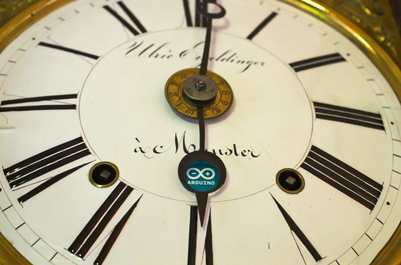
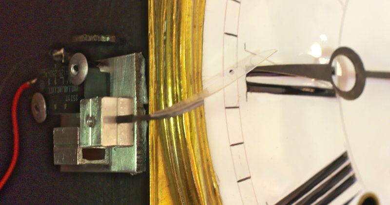
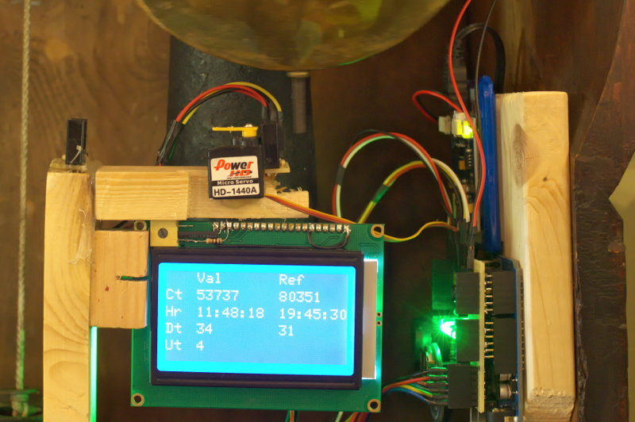

Horloge Arducomtoise
====================

:date: 2013-08-01
:category: électronique,informatique
:level: vulgarisation, moyen
:author: Vincent Becker
:licence: By-Sa-3.0

  ArduComtoise, l'horloge comtoise la plus précise du monde

Je possède dans ma cuisine une très belle horloge comtoise héritée de mes
grands-parents. Si la précision de la mécanique est déjà assez épatante au
départ, j'ai chargé une Arduino de l'améliorer encore. Au vu de ses
caractéristiques techniques (balancier sur l'avant typique de la deuxième
moitié du XIXe siècle mais échappement à couronne et non à ancre typique de la
première moitié), cette horloge doit dater du milieu du XIXe siècle.

Elle possède un mouvement situé assez haut (environ 2m10) avec comme
garde-temps un balancier d'environ 1m20. Deux poids assurent la réserve
d'énergie, l'un pour le mouvement, l'autre pour la sonnerie. Elle sonne les
heures pleine avec répétition et les demi-heures. Il faut la remonter une fois
par semaine.

Le balancier est de type lenticulaire, monté sur un ruban métallique simple
avec un petit jeton de réglage permettant de faire varier la hauteur, et donc
la période, du pendule. Ce type de monture a l'inconvénient, du fait de la
dilatation, de rendre la période du balancier sensible à la température,
problème qui sera corrigé sur les modèles plus tardifs avec des montures plus
complexes auto-compensées. Dans des conditions de température bien stables, la
tenue de l'heure est très bonne, avec une dérive de quelques secondes par jour.

Mais on peut faire mieux ! C'est une Arduino qui va s'en charger.

ArduComtoise
------------

Vidéo : <iframe width="800" height="450" src="//www.youtube.com/embed/96fAYLu30QA" frameborder="0" allowfullscreen></iframe>

Pas question, dans ce projet, de toucher à la mécanique très sensible de
l'horloge elle-même. Tout se passe sans contact ou presque.

Un module Chronodot sert de garde-temps, avec une dérive typique de moins de 2s
par mois. La comtoise est réglée pour avancer légèrement (environ 30 secondes
par jour). Il suffit dès lors de retenir le balancier le temps nécessaire grâce
à un servo une fois par 24h pour conserver la précision de l'horloge
indéfiniment. Cela implique de déterminer précisément quand l'horloge a fait
deux tours complets (soit 24h).

Première approche : et Arduino comptait, comptait...
----------------------------------------------------

Dans un premier temps, j'ai voulu faire en sorte que le système soit totalement
invisible de l'extérieur : pas question donc de mettre un feedback sur les
aiguilles. Je suis parti sur une première solution consistant à compter le
nombre de passages de balancier effectués par l'horloge en 24h, le tout sans
contact.

En bas de la caisse de l'horloge, un capteur optique (un couple
émetteur/récepteur IR) compte les passages du balancier. Ce dernier effectue 80
350 passages en 24h, soit une période d'environ 1,07 secondes.

Lorsque les 80 350 passages de balancier ont été comptés et donc que 24h ont
passé sur l'horloge, l'Arduino fait pivoter un servo de 90° pour bloquer le
balancier. Comme l'horloge avance, l'Arduino maintient le balancier bloqué
jusqu'à ce que 24h aient passé sur le Chronodot puis le relâche en faisant
pivoter le servo en sens inverse.

Il est important de bloquer le balancier en bout de course afin qu'il reprenne
suffisamment d'élan pour repartir. Un deuxième capteur se charge de détecter ce
moment. On ne peut pas utiliser ce même capteur pour compter car lorsque le
balancier vient d'être relâché, sa course est trop courte pour qu'il revienne
jusqu'à ce capteur ; on raterait donc des passages et toute la précision du
montage repose sur un comptage précis.

Il arrive, sans que j'arrive à savoir pourquoi, que le détecteur rate un
passage. C'est rare, mais le bon comptage est vraiment critique pour le
fonctionnement du système. Le temps écoulé entre deux passages est donc calculé
et, s'il est supérieur à 2 secondes, c'est qu'on en a raté un et un passage est
rajouté "artificiellement".

Limites du système
::::::::::::::::::

Ce système marche parfaitement entre deux remontages. Mais il se heurte à un
problème insoluble : lors du remontage, l'horloge recule aléatoirement de 10 à
15 secondes du fait des divers jeux internes de la mécanique.

On pourrait
intégrer un temps moyen dans la calibration pour compenser, mais
c'est loin d'être idéal. J'ai donc changé d'approche.

Deuxième approche: feedback
---------------------------

   Le capteur de feedback

J'ai dû me résoudre à employer la solution rejetée en première instance mais
qui semble la seule parfaitement fiable, à savoir un feedback sur les
aiguilles.

Celui-ci est constitué d'un micro-switch actionné par une came elle-même
actionnée par le passage de la grande aiguille qui appuie sur une palette en
plastique transparent rigide (un morceau de blister d'emballage de piles) pour
être aussi invisible que possible.

Après tests, le micro-switch se déclenche à 45 minutes et 30 secondes de chaque
heure, plus ou moins 3 secondes compte tenu de l'élasticité des divers éléments
(palette transparente et micro-switch lui-même). Ce n'est pas gênant, car ce
petit décalage n'est par définition pas cumulatif.

Une fois toutes les 24h (un peu avant 19h45), l'Arduino passe en mode réglage,
c'est à dire qu'elle va bloquer le balancier dès que le micro-switch va se
déclencher (donc quand l'horloge indiquera 19:45:30) pour le relâcher au bon
moment. L'horloge étant réglée pour avancer de 30s par jour, le système relâche
le balancier avec environ 15 secondes de retard sur l'heure juste : en tenant
compte de toutes les incertitudes, l'heure indiquée par l'horloge est donc
indéfiniment décalée au maximum de 20s par rapport à l'heure du Chronodot.

Indicateurs et accessoires
--------------------------

   Le montage

Histoire de ne pas tout faire à l'aveugle, des indicateurs permettent de
monitorer le bon fonctionnement du système.

L'écran LCD
:::::::::::

Pour suivre un peu ce qui se passe, un écran LCD est connecté à l'Arduino. Il
s'agit d'un écran rétro-éclairé de 128x64 pixels acheté moins de 15 euros sur
Dealextreme, sur les bons conseils de Skywodd qui nous fait en plus la grâce
d'`un tuto complet sur son utilisation
<http://skyduino.wordpress.com/2012/05/25/arduino-ecran-lcd12864-dealextreme-pas-chere-et-puissant/>`_.

L'affichage se divise en 2 colonnes : les valeurs courantes et les valeurs de
référence.

- La première ligne indique le nombre de passages de balanciers comptés depuis
  le dernier réglage et le nombre moyen par 24h depuis le lancement du système.
- La deuxième ligne indique l'heure courante et l'heure de  référence.
- La troisième ligne indique l'avance de l'horloge en secondes et la moyenne
  depuis la mise en route du système.
- La dernière ligne indique le nombre de jours écoulés depuis la mise  en route
  (uptime).

Le premier jour de fonctionnement est ignoré dans les statistiques puisqu'il
est forcément partiel.

L'indicateur lumineux
:::::::::::::::::::::

Un indicateur lumineux constitué de LEDs permet en outre de surveiller la
dérive de l'horloge. Lorsque celle-ci est dans la "zone acceptable" (de 20 à 40
secondes) une diode verte s'allume. De 0 à 20 secondes ou de 40 à 60 secondes,
une diode orange signale la dérive. En cas de retard, ou d'avance supérieure à
60 secondes, une diode rouge signale le problème.

L'avantage de l'indicateur lumineux est que, contrairement à l'écran LCD, il
est visible en permanence par la vitre de la caisse, il n'est donc pas
nécessaire d'ouvrir l'horloge pour le consulter.

Le remontage
::::::::::::

Le remontage des poids doit s'effectuer chaque semaine (enfin plutôt tous les 6
jours et demi, je pense que la caisse de l'horloge a été raccourcie au cours de
son histoire pour passer sous un plafond trop bas).

Pour ne pas rater ce moment, un détecteur de proximité (un `mini télémètre
infrarouge
<http://www.gotronic.fr/art-capteur-de-distance-sen0042-19371.htm>`_) détecte
quand le poids arrive en bas de l'horloge, environ 24h avant qu'il ne touche le
sol et que l'horloge s'arrête.

Sitôt le poids détecté, des Leds rouges s'allument sur l'indicateur lumineux.
Enfin, un buzzer piézo-électrique émet des bips pendant 2 minutes avant le
blocage du balancier.

L'alimentation
::::::::::::::

Lors de ma première approche qui impliquait le comptage des passages de
balancier, il était très important que l'Arduino ne se remette pas à zéro en
cas de coupure de courant par exemple.

J'ai donc intercalé un module `LipoRider
<faitmain.org/volume-2/batterie.html>`_ qui permet à une batterie de 2000 mAh
de prendre momentanément le relais en cas de défaillance de l'alimentation
principale. Avec le capteur sur aiguille de la deuxième aproche cette
précaution se justifie moins, mais je l'ai tout de même laissée.

Evolution
---------

Parmi les évolutions possibles, j'envisage l'ajout d'une connexion à un serveur
NTP via un shield Ethernet pour recaler le Chronodot périodiquement sur une horloge atomique. On aura
ainsi l'horloge comtoise la plus précise de l'Univers.

Le code
:::::::

Je vous livre enfin le code du système. Ma formation universitaire étant
l'Histoire, je compte sur l'indulgence des développeurs professionnels!

`Télécharger le code de l'ArduComtoise <comtoise/arduComtoiseFinal.ino>`_

