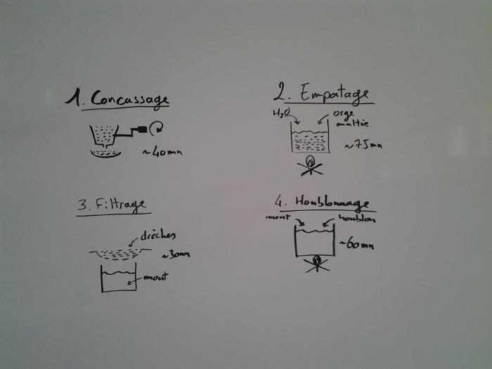
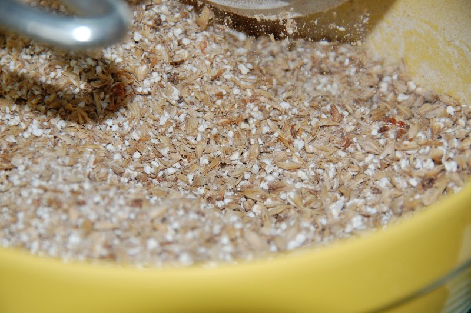
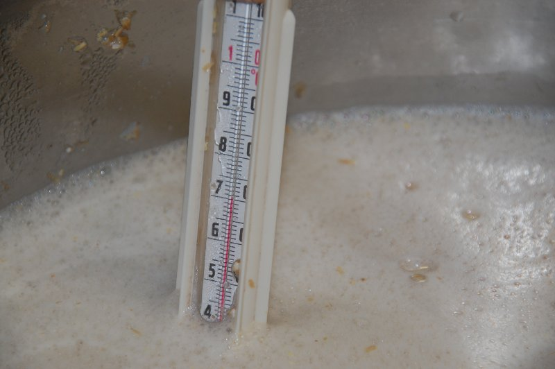
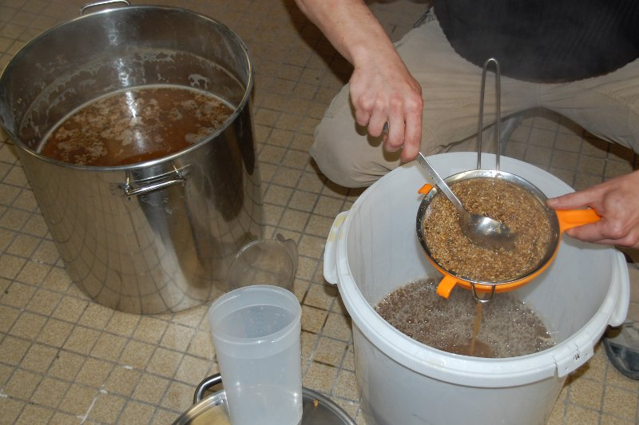
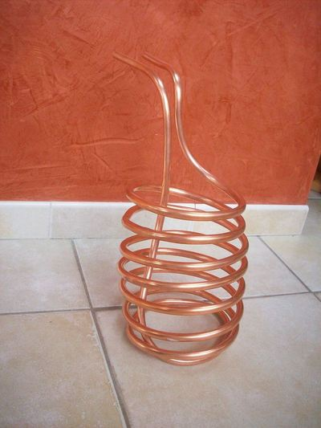
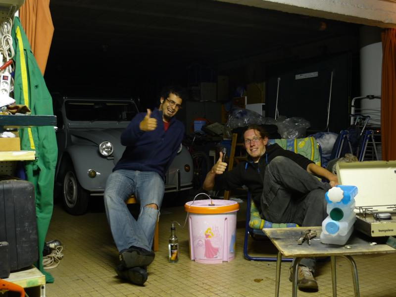

Faire de la bière maison (ou comment transformer l'eau en bière)
================================================================

:date: 2013-08-01
:category: cuisine,écologie
:author: Frédéric Sureau, Alexis Métaireau
:level: moyen
:licence: BY-NC-SA-3.0

On en boit tout le temps, mais on ne prend pas souvent le temps de comprendre
comment elle est fabriquée, et encore moins de la fabriquer soi même. Et c'est
bien dommage, parce que fabriquer de la bière soi-même est à la portée de
n'importe quel assoiffé (s'il est un peu patient) !

Mais d'abord, pourquoi faire de la bière soi-même ?

Il y a plein de bonnes raisons en fait, mais en ce qui nous concerne, c'est
principalement qu'on aime bien fabriquer les produits qu'on consomme (et, ça
serait mentir que de dire qu'on ne consomme pas de bière !).

Ingrédients
:::::::::::

Pour cette recette, il vous faudra :

De l'eau
  Vous savez, ce truc liquide et transparent.

Du malt
  Des grains d'orge germés puis séchés voire grillés. Il est responsable de la couleur et du gout de la bière.

Du houblon
  Des fleurs pour aromatiser et donner de l'amertume.

Des levures
  Pour transformer le sucre en alcool et faire des bulles.

Tous les ingrédients y compris l'eau ont leur influence sur le goût final de la
bière par leur qualité et leur caractéristique, région d'origine, etc.

Matériel
::::::::

Les grandes brasseries utilisent une cuve spéciale pour chaque étape, mais quand
on est pauvres/débutants et que l'on fait des petites quantités, on peut très
bien s'en sortir avec très peu de matériel.
Dans notre cas, nous faisons des brassins de 20L ce qui est un bon rapport
risque/plaisir : si on rate, ce n'est pas si grave, et si elle est bonne il y a
quand même de quoi déguster ;)

L'essentiel :
-------------

Une source de chaleur réglable
  Un trépied à gaz pour les paëlla est parfait, sinon une plaque de cuisson
  quelconque.

Une cuve de brassage
  Une grande casserole/marmite de minimum 30L. 50L c'est plus confort.
  En inox ou émaillée, mais surtout pas d'aluminium car il ne réagit pas très
  bien avec la bière paraît-il…
  Le mieux est de la récupérer chez Tatie Jacqueline car ça coûte très cher (à
  partir de 50€ et 150€ facilement selon la qualité)

Une cuve de fermentation
  Un seau en plastique avec couvercle hermétique de minimum 30L.
  Utiliser de préférence du plastique alimentaire, sinon la bière développe un
  goût de pétrole très caractéristique (on a testé pour vous)
  On trouve chez les distributeurs spécialisés des cuves de fermentation de
  30L avec barboteur et robinet pour une dizaine d'euros.

Une touillette
  Une grande cuillère quoi…

Un thermomètre
  De cuisine, gradué entre 50°C et 100°C.

Une passoire
  Très grande si possible.

Recommandé fortement :
----------------------

Un moulin à malt
  Du genre de ce qu'il y a dans les fermes pour concasser les céréales qu'on
  donne aux bêtes, ou un moulin à malt spécial (environ 50€ les premiers prix)
  Si vous n'en avez pas sous la main, il y a les techniques torchon/marteau
  (long), rouleau à pâtisserie (fastidieux) ou encore le mixeur (de quoi être
  radié à vie de l'ordre des brasseurs)

Refroidisseur
  On peut s'en bricoler un pour pas cher avec des tuyaux de cuivres pour
  canalisation. Il suffit de le tordre en forme de serpentin et de faire des
  jolis raccords. Sans cet ustensile, l'étape de refroidissement est longue et
  risquée pour la qualité de la bière.

Facultatif (mais quand même sympa) :
------------------------------------

Un densimètre
  Pour faire des mesures et savoir au bout de combien de pintes on ne peut
  plus conduire. Accessoirement c'est pratique pour connaître le moment idéal
  pour la mise en bouteille.

Un tuyau pour siphonner
  Lors de la mise en bouteille. Prévoir un bon diamètre (environ 1cm) pour ne
  pas y passer des plombes.

----

Processus de fabrication
::::::::::::::::::::::::

Cet article explique comment fabriquer une IPA (Indian Pale Ale, une bière un
peu plus amère que celle qu'on à l'habitude de trouver en France), mais le
principe reste sensiblement le même pour d'autre types de bière.  La première
étape consiste à concasser le malt. Ce malt est ensuite mélangé à de l'eau. On
obtient ainsi un mélange appelé *la maische*. Ce mélange est porté à plusieurs
paliers de température.

Ensuite on filtre les grains utilisés (les drèches) et on ne garde que le jus,
appelé le moût. Le moût est porté à ébullition en compagnie de houblon dont on
extrait l'amertume et les arômes. Le houblon est ensuite retiré du moût.
Celui-ci est refroidit à 25°C, la température de prédilection pour les levures
qui se font un plaisir de le fermenter pendant 2 à 3 semaines. En fût d'abord,
puis en bouteilles où le gaz généré n'aura d'autre solution que de se dissoudre
dans la bière pour lui donner ses propriétés bulleuses.

   Les étapes de fabrication

Concassage
----------

La première étape est **le concassage**. On avait 6kg d'orge maltée à concasser (plus
exactement 6kg de malt pâle *7EDC* et 500g de malt cara *50EDC*).

   Concassage de l'orge

Attention, pas trop fin dis donc !

On ne veut pas de la poudre, on veut
simplement permettre à l'amidon de se dissoudre dans l'eau.

Si on concasse le malt trop fin, on se retrouve avec un dépôt dégeulasse au
fond de toutes les bouteilles.

Empâtage et brassage
--------------------

La seconde étape est **l'empâtage**. Il s'agit de faire chauffer notre moût à
différents paliers de température.

* ~50°C : Transformation des protéines de l'orge malté pour que la bière ne soit pas trouble (protéinase) ;
* ~60-65°C : Création des sucres fermentescibles (dextrose et maltose) ;
* ~68-75°C : Création de sucres non-fermentescibles (Dextrine) ;
* ~78°C : Destruction des enzymes et arrêt des transformations (parce que c'est bon hein).

Les paliers indiqués pour la création des sucres sont les températures idéales,
mais ils se créent également à d'autres températures.
Il est donc envisageable de n'avoir qu'un palier pour la création des sucres.

Rinçage
-------

La troisième étape, c'est **le rinçage**, l'idée est de récupérer l'amidon qui
s'est dissout dans l'eau et de mettre de côté l'orge maltée (la partie solide).

Pour ça, il faut faire chauffer de l'eau de rinçage. On a utilisé 10L d'eau de
rinçage qu'on a fait chauffer à 78°C, en comptant sur le fait qu'elle perdra de
sa température (20°C à peu près) en étant utilisée. On a filtré deux fois pour
être sûr de ne rien perdre.

Les drèches (résidus du grain) sont données aux poules pour leur procurer un
plumage soyeux.

Houblonnage
-----------

L'étape d'après (la quatrième, vous suivez), c'est **le houblonnage**.
L'idée c'est de faire infuser notre mout avec du houblon.
On fait bouillir le moût pendant 1h.

Lorsqu'on ajoute le houblon dès le début, on extrait l'amertume.
Lorsqu'on ajoute le houblon dans les dernière minutes, on extrait ses arômes.

Une troisième technique consiste a ajouter du houblon directement dans la cuve
pendant la fermentation, c'est ce qu'on appelle le houblonnage à cru.

Dans notre cas (une bière amère) nous avons mis beaucoup de houblon amer
à infuser et également pratiqué le houblonnage à cru.

Refroidissement
---------------

Étape suivante: **le refroidissement**.

On dirait que c'est facile comme ça, mais en fait ça ne l'est pas tant que ça :
il faut réussir à faire tomber la température de notre liquide en ébullition
jusqu'à 25°C en un temps acceptable.

Pour ça, on a utilisé un serpentin confectionné par nos petites mains.

Ce refroidisseur nous a permis d'atteindre la température souhaitée en 35 minutes !

Sans le refroidisseur, il faut compter au moins le double et on s'expose à des
risques de contamination par les méchantes bactéries qui peuplent nos garages,
squats, cuisines ou autres lieux de brassage.

Fermentation
------------

Dernière étape, haha !

Il faut rajouter les levures qui vont faire tout le travail et transformer le
moût en bière, pendant que nous nous reposons, une bonne bouteille de Chimay à
la main.

Dans notre cas, on ajoute aussi dans la cuve de fermentation du houblon pour le
houblonage à froid.

C'est à cette étape qu'on mesure la densité du liquide. Cette densité
représente la quantité de sucre extraite du malt, et donc la quantité d'alcool
potentielle dans la bière.

On ferme la cuve de fermentation avec un barboteur pour laisser le gaz
s'echapper de son « bloup bloup » caractéristique.

La première fermentation durera approximativement 15 jours, jusqu'à atteindre
une densité finale stable (fin de la fermentation).

Notre bière avait une densité initiale de 1046, et une densité finale de 1008
ce qui veut dire environ 5° d'alcool grâce à des 
`calculs scientifiques super compliqués <http://univers-biere.net/mesur_dens.php>`_
.

----

Mise en bouteille
:::::::::::::::::

Une fois ces deux semaines passées, il faut mettre en bouteille. Dans notre cas
nous avons récupéré des bouteilles à bouchon mécanique (vous savez, les
bouteilles de limonades) qu'on a bien rincé et nettoyé.

On s'équipe de notre siphon et après avoir ajouté du sucre dans le mélange
(pour réactiver les levures), on remplit les bouteilles.

Cette seconde fermentation en bouteille donnera son effervescence à la bière
grâce à la dissolution du gaz carbonique dans le liquide. Et voilà ! Il ne
reste plus qu'à mettre les bouteilles de coté durant deux semaines de plus
(oui, c'est long) et… à déguster le moment venu.

Dégustation !
:::::::::::::

La bière en question ne moussait pas trop et avait un goût un peu amer. Pas
assez à notre goût, cependant.

En comparaison à nos précédents essais, c'est plutôt positif : la première était
ratée puisque trop de pression et trop de dépôt (et donc un fort goût de
levures) alors que la seconde (on avait tenté d'ajouter de la lavande) avait un
goût de lavande amère, pour ne pas dire de savon.

Celle-ci a un goût de… de bière ! Il nous reste encore à comprendre comment
faire pour lui donner la saveur que l'on souhaite.

Conseils/Anecdotes
::::::::::::::::::

On a fait quelques petites erreurs en cours de route, voilà rien que pour vous
une petite compilation :

* par peur de la contamination bactérienne, on a décidé de faire bouillir
  nos 26L d'eau pour être sur que les bactéries s'enfuient en courant. Je dis
  erreur parce que ça nous a pris pas loin de 3h30 pour réussir à chauffer et
  refroidir ce volume d'eau. Inertie quand tu nous tiens !
* lorsque vous ajoutez le malt dans l'eau, pensez bien qu'il va refroidir la
  température de l'eau. Comptez perdre approximativement 4°C ;
* lors de l'ébullition, vous allez surement perdre un peu d'eau, pensez à en
  mettre un peu plus (même si vous couvrez).

Mais alors, c'est quoi les bières brunes, blondes, les stout, etc. ?
::::::::::::::::::::::::::::::::::::::::::::::::::::::::::::::::::::

La couleur de la bière est déterminée par le mélange de malts choisis. Il
existe ainsi des malts bruns, chocolat, noirs, caramel, pâles, etc.

Pour une bière blonde, on utilisera quasiment uniquement du malt pâle. Une
bière ambrée sera composé de malts plus foncés, une bière brune sera composée
de malts bruns etc. Cependant, quelle que soit la recette, le mélange sera
composé d'au moins 80% de malt pâle, même pour une bière stout !

Les bières blanches sont un cas particulier, elles ne sont pas composées
uniquement de malt d'orge, mais on leur ajoute également du blé en petite
quantité, des épices, et autres secrets bien gardés.

    Nous deux après notre premier brassin.
    (admirez la superbe cuve « princesse »)
