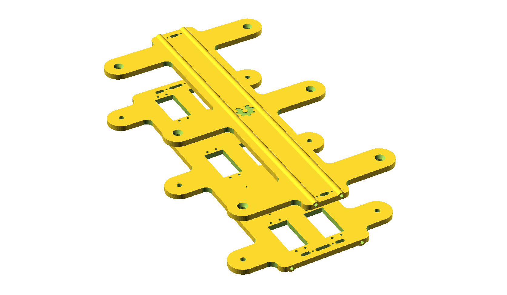
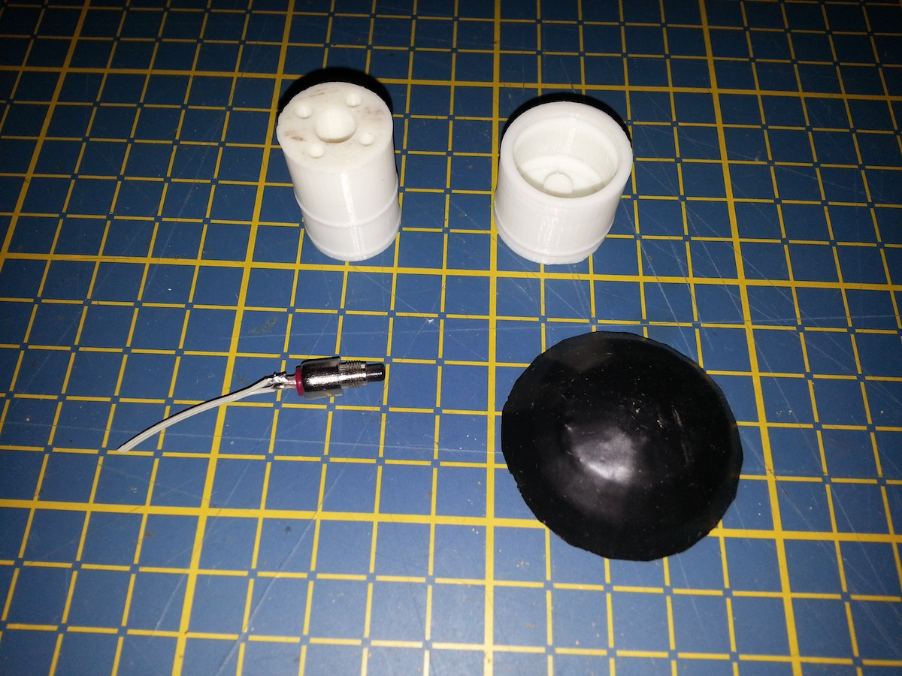

L'hexapode Bleuette
===================

:date: 2013-06-03
:category: informatique, électronique
:level: vulgarisation
:author: Charles Rincheval
:licence: By-Sa-3.0

Introduction
::::::::::::

Bleuette est un robot hexapode (6 pattes) entièrement libre, c'est à dire
que tous les plans, programmes, informations permettant de le fabriquer sont
libres : jouez avec, modifiez les, redistribuez les comme bon vous semble...

Il est encore en stade de développement mais est déjà parfaitement fonctionnel
en terme de déplacement. Son développement se poursuit activement afin de le
rendre plus autonome grâce à des capteurs divers.

Histoire
::::::::

Pour certain d'entres vous, le nom “Bleuette” vous est peut être familier,
en fait, c'est une féminisation de Bleuet, le robot de la série
FX, Effet spéciaux, nous nous sommes dit que le pauvre Bleuet devait se sentir seul
et qu'il faudrait lui fabriquer un congénère et puis tant qu'à faire femelle… :)

Dans ses premières versions, Bleuette était réalisé en Plexiglas,
découpé à la scie sauteuse, un vrai boulot, long et pénible avant de nous
rendre compte des limites de cette matière : elle est cassante et se raye
trop facilement.
Une seconde version à été faite en Lexan, une matière avec des propriétés déjà
plus intéressantes...

Quelques années se sont écoulées et, depuis, l'impression 3D s'est
considérablement développée, au point d'être devenue attractive pour
les particuliers et intéressante pour un projet comme Bleuette, l'achat
d'une l'Ultimaker à été guidé par l'arrière pensée de faire Bleuette
entièrement en plastique.

 - Les tout premiers pas de Bleuette en Plexiglas : http://vimeo.com/1912189
 - Quelques années plus tard, Bleuette imprimé en 3D : http://vimeo.com/58307246

Tous les plans de Bleuette ont été refait à l'aide de OpenSCAD
(http://openscad.org/), un logiciel permettant de modéliser des pièces de
manière paramétrique, un dépôt GitHub à été créé à l'occasion pour partager
tous les documents inérant à la fabrication du robot :
http://github.com/hugokernel/Bleuette/

Construction
::::::::::::

Toute la mécanique de Bleuette est entièrement faite en plastique réalisable
avec une imprimante 3D, vous n'avez besoin que de très peu d'éléments autres
(vis, écrous, tiges métal).

*Il est même parfaitement envisageable avec quelques légères adaptations de
découper les pièces avec une fraiseuse ou une découpe laser.*

Le corps
--------

Le corps de Bleuette étant trop grand pour être imprimé en une seule fois, il
est fait en plusieurs parties assemblées par des queues d'arondes,
une librairie OpenSCAD à été créée pour l'occasion (http://github.com/hugokernel/OpenSCAD_Dovetail)

Une fois les différentes parties imprimées, il suffit des les emboiter en force, les jeux étant très
faibles, c'est très rigide.

Les pattes
----------

Bleuette possède 6 pattes animées chacune par 2 servos standard (Futaba S3003),
un qui permet de lever la patte et un autre qui permet de faire pivoter horizontalement
la patte.

Voici une patte montée sur une structure de test pendant la conception :

Détail d'une liaison de patte et vue de l'assemblage : on emboite l'entretoise, on la
pivote de 90 degrés et ça ne bouge plus, aussi simple que des Lego !

Une patte entière :

Les palonniers
--------------

Les palonniers de servos, une pièce relativement complexe à imprimer car
nécessitant une grande précision est aussi réalisée grâce à l'Ultimaker et
une librairie OpenSCAD à été créée à l'occasion http://www.thingiverse.com/thing:28566,
grâce à elle, on peut créer des palonniers à 1, 2, 4 bras, voir plus et de
tailles diverses.

Les capteurs de sol
-------------------

Le bout de chaque patte de Bleuette est équipé d'un capteur capable de détecter
via un interrupteur une pression verticale correspondant au contact de la patte
avec le sol, ainsi, notre hexapode est capable de détecter une absence de sol
et donc, par exemple, d'éviter de tomber dans un escalier...

La surface du capteur en contact avec le sol est imprimé en PLA Flex, qui comme
son nom l'indique très bien est en PLA mais avec la particularité d'être flexible.

Sur la première photo ci-dessous, nous voyons la différence entre la pièce brut
et la pièce trempée dans du PlastiDip pour obtenir plus de grip et meilleure finition.

Sur la seconde photo de droite, on peut voir tous les éléments d'un capteur de sol :

Tous les éléments du capteur sont assemblés :

Bleuette et ses capteurs :

Le cerveau
::::::::::

Version Arduino
---------------

Le cerveau de Bleuette est une carte Arduino avec une shield spécialement
conçue pour Bleuette (Bleuette Shield : http://github.com/hugokernel/Bleuette/wiki/Bleuette-Shield)
qui sert, entre autre à piloter les 12 servos des pattes.

Cette carte possède les caractéristiques suivantes :

- Génération de la tension de 5V pour l'Arduino
- Mesure du courant consommé par les servos
- Surveillance de la tension de la batterie
- Gestion synchrone de la commande des 12 servos des pattes
  + 2 servos optionnels (basé sur un PIC18F452 et http://github.com/hugokernel/Pic24Servos)

Voici son schéma de principe :

Plus d'informations sur la Bleuette Shield : http://github.com/hugokernel/Bleuette/wiki/Bleuette-Shield

Une autre carte fille (shield) pour Arduino à été créée, il s'agit
de Bleuette Sensor Shield qui dispose des caractéristiques suivantes :

- 8 entrées supplémentaires multiplexées utilisant que 4 entrées / sorties (3 d'adressage et une sortie)
- Connection pour une carte GY-27 contenant un accéléromètre et un compas
- Un module Bluetooth JY-MCU
- Une connection pour une guirlande de led RGB à base de LPD8806
- Un mosfet pour pouvoir piloter un élément de puissance (je ne sais pas vraiment quoi pour le moment...)

Plus d'informations sur cette carte par ici : http://github.com/hugokernel/Bleuette/wiki/Bleuette-Sensor-Shield

Version RaspberryPi
-------------------

Piloter Bleuette via un Arduino est plutôt aisé mais on se retrouve assez vite limité
en place, en puissance est en facilité pour développer.
J'ai donc décidé de faire une carte fille pour RaspberryPi, cette carte fille nommée simplement
BleuettePi propose tout ce que fait la shield Arduino avec plein de chose en plus !

Voici ses caractéristiques :

- Gestion de **14 servos** (toujours de manière synchrone)
- **Mesure du courant** consommé par les servos
- **Mesure de la tension** de la batterie
- Connexion pour une carte GY-27 contenant un **accéléromètre et un compas** (via I2C)
- **16 entrées / sorties** compatibles 5V avec 2 lignes d'interruption,
  le tout commandé en I2C
- **6 entrées analogiques**
- **Amplificateur audio** pour ajouter le son à votre Raspberry Pi (à base de LM386)
- **5 entrées / sorties généralistes compatibles 5V** direct Raspberry +
  5 autres entrées / sorties disponible si le bus SPI n'est pas utilisé
- Toutes les broches du SPI sont disponibles sur un connecteur et compatible 5V
- Un module **horloge temps réel (RTC)** pour garder votre Raspberry Pi à l'heure !
- **4 lignes d'interruptions physiques**

Son schéma de principe :

Toutes les informations sur cette carte sont disponibles sur le wiki : http://github.com/hugokernel/Bleuette/wiki/BleuettePi

BleuettePi montée sur un RaspberryPi (on aperçoit une petite carte bleue, c'est le GY-27
c'est une combinaison d'un accéléromètre et d'un compas) :

Exemple de code en Python
-------------------------

Pour animer les pattes de Bleuette, il faut créer une séquence qui n'est rien
d'autre qu'une classe, voici un exemple qui fait faire une pompe à Bleuette : ::

    class Seq_PushUp:
        # On donne un nom à notre séquence
        name = "Push Up"

        # La séquence de mouvement
        sequence = [
            [
                # Délai de 0.5 seconde
                0.5,
                [
                    FRONT, FRONT, MID, MID, BACK, BACK,     # Positions des servos de pattes horizontales
                    UP, UP, UP, UP, UP, UP                  # On place les pattes en haut
                ],
                # Ici, on peut définir une callback qui sera appelée à chaque fois que les pattes
                # seront placées dans leur position voulue
                None
            ],
            [
                0.5,
                [
                    __, __, __, __, __, __,                 # On ne touche pas à la position des pattes
                    DOWN, DOWN, DOWN, DOWN, DOWN, DOWN      # On place les pattes en bas
                ],
                None
            ]
        ]

Maintenant, pour exécuter la séquence ci-dessus, il suffit du bout de code suivant : ::

    from Bleuette import Bleuette

    B = Bleuette()

    # Fait faire 4 pompes à Bleuette
    B.Sequencer.forward(Sequences['pushup'], 4)

Voilà, c'est aussi simple que ça !

Sur les nouvelles versions du code, j'ai ajouté un thread qui s'occupe uniquement d'envoyer
les ordres aux servos, ainsi, il est possible de faire d'autres tâches pendant ce temps.

Tout le code pour jouer avec Bleuette se trouve par ici : http://github.com/hugokernel/Bleuette/tree/master/src/BleuettePi/Python

Une vidéo des premiers mouvements de pattes de Bleuette piloté par une RaspberryPi.

<iframe width="800" height="450" src="//www.youtube.com/embed/_7C_EJtj_3M" frameborder="0" allowfullscreen></iframe>

Fabriquer
:::::::::

Pour fabriquer votre propre Bleuette, il vous faudra :

Une CNC
-------

Pour les pièces du corps de Bleuette, il vous faudra avoir accès à une imprimante 3D
ou une découpe CNC, inutile d'en posséder une, il vous suffira de trouver le fablab
le plus proche de chez vous qui pourra vous orienter et vous aider dans leur réalisation.

Fabriquer les pièces en platique : http://github.com/hugokernel/Bleuette/wiki/Fabriquer

L'électronique
--------------

Selon la version choisie, vous devrez vous procurer :

- 1 carte Arduino Leonardo + la Shield Bleuette
- 1 RaspberryPi + la carte fille BleuettePi

Pour la Shield Bleuette ou la carte fille BleuettePi,  2 solutions :

- Fabriquer l'électronique : http://github.com/hugokernel/Bleuette/wiki/%C3%89lectronique
- Ou vous les procurer sur cette page http://github.com/hugokernel/Bleuette/wiki/Commander

Pièces diverses
---------------

- 12 servos standard (type Futaba S3003)
- Visserie, tiges, clips, pièces mécaniques diverses
- Batterie, divers...

Tout se matériel doit couter au maximum 250€, ce qui fait de Bleuette un robot hexapode très abordable,
notez que l'on trouve dans le commerce des équivalents à plus de 900€...

Participez !
::::::::::::

Bleuette est en perpétuel développement, vous pouvez suivre le dépôt GitHub pour
vous en rendre compte, le développement se poursuit sur différents axes :

- Logiciel : Poursuite du développement en Python sur Raspberry, gestion de la webcam du RaspberryPi avec OpenCV
- Mécanique : développemement d'une tourelle 2 axes pour la webcam
- Électronique : ajout d'un watchdog sur la carte BleuettePi et développement de la carte de puissance

Chacun peut apporter ses propres compétences dans un domaine particulier !

 - Le blog de développement : http://www.digitalspirit.org/
 - Toutes les sources de Bleuette : http://github.com/hugokernel/Bleuette/
 - Le wiki en français : http://github.com/hugokernel/Bleuette/wiki/Accueil

