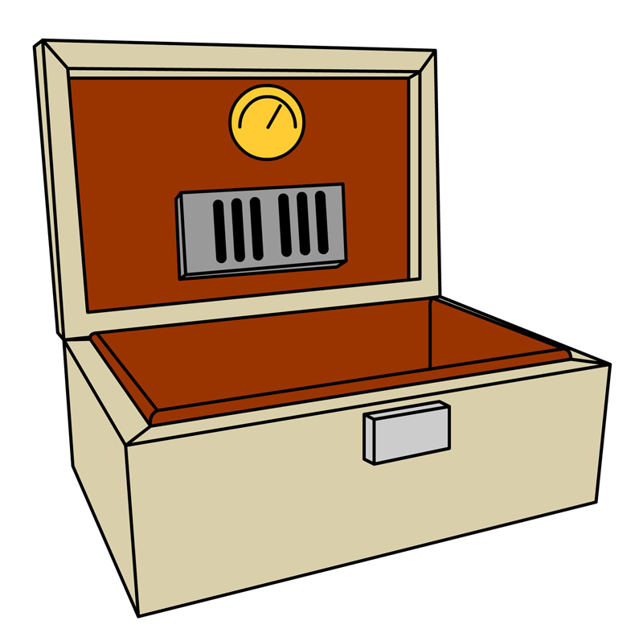
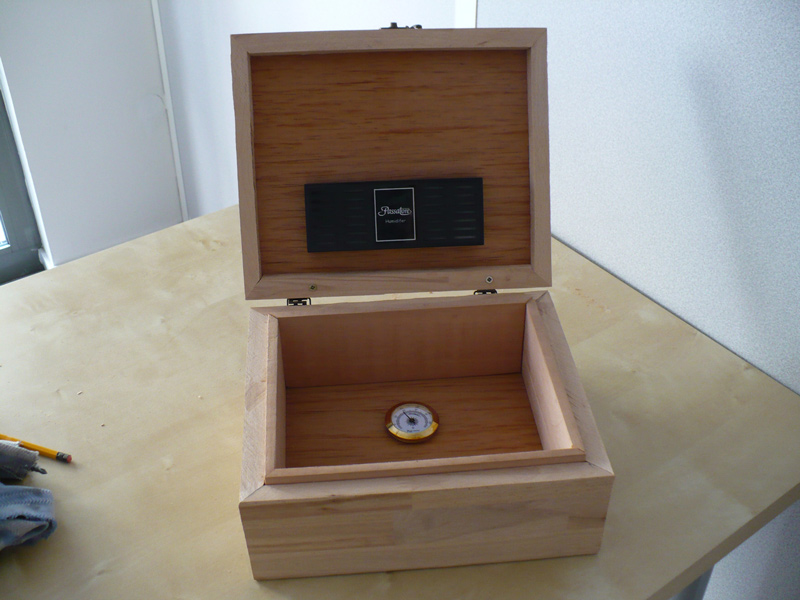
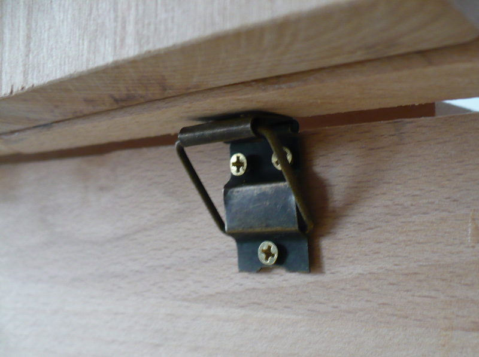
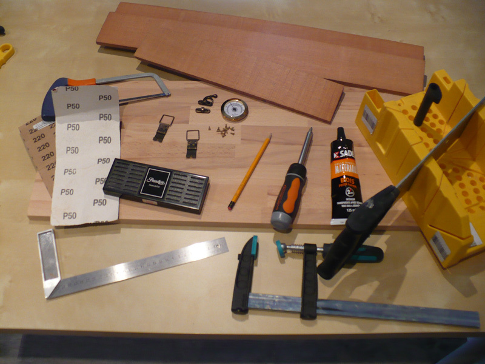
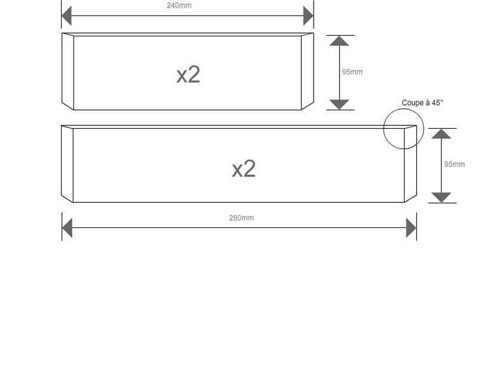
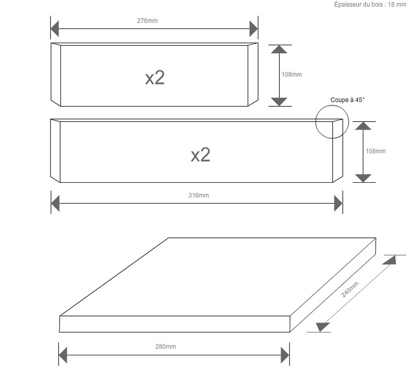
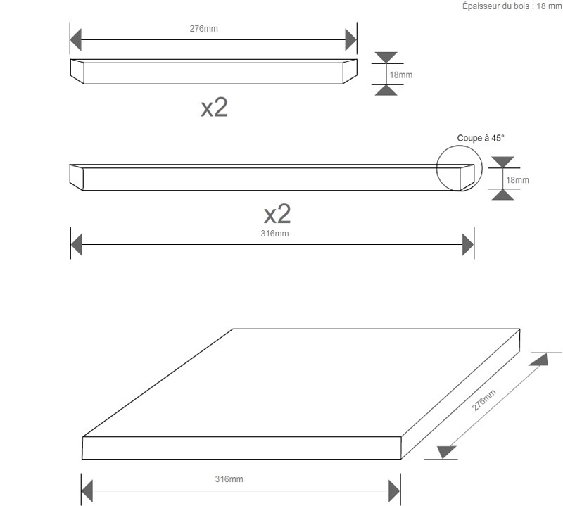
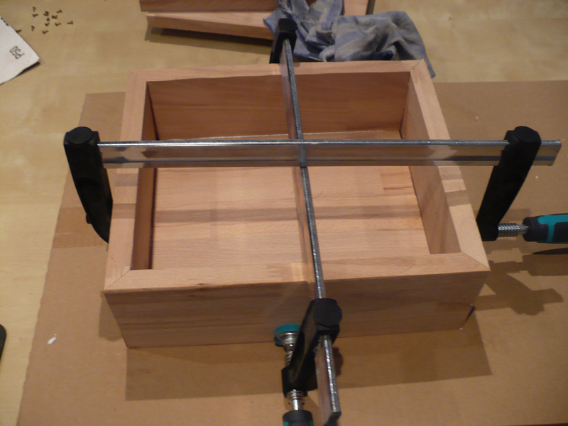
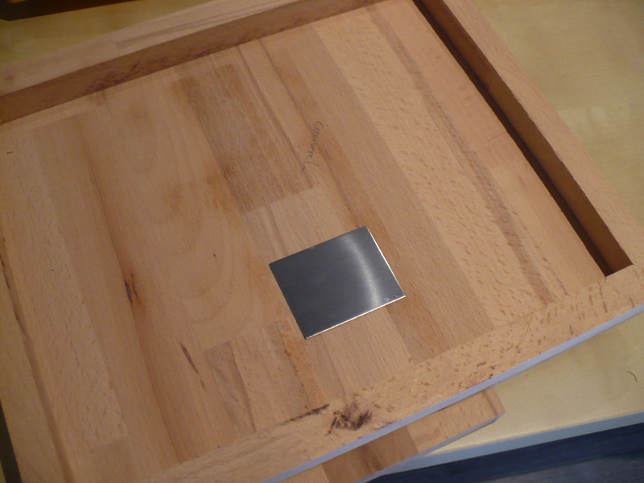
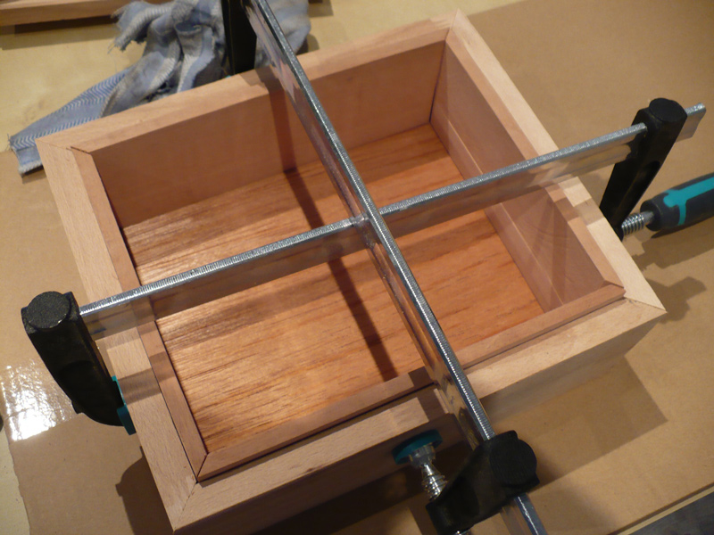

Cave à cigares
==============

:date: 2013-07-07
:category: bricolage
:level: vulgarisation
:author: Sébastien Riguet
:licence: By-Sa-3.0

Introduction : une cave à cigares DIY
:::::::::::::::::::::::::::::::::::::

Devenu amateur de cigares après un cadeau insolite pour un Noël, j'ai voulu, comme pour le bon vin,
conserver mes acquisitions (de plus en plus nombreuses), dans les meilleures
conditions possibles. Je me suis donc affairé à trouver une solution de
conservation optimale.

Après quelques recherches sur Internet, j'ai trouvé plusieurs types de cave
à cigares, une large fourchette budgétaire (de 20 à plus de 1 000 euros...) et
différents design.

Ne voulant pas y mettre un montant pharamineux, mais voulant toutefois que mes
cigares soient conservés dans de bonnes conditions, je me suis donc lancé dans
une réalisation "fait main" d'une cave à cigares.

Les pré-requis d'une bonne cave à cigares
:::::::::::::::::::::::::::::::::::::::::

Commençons par les fondamentaux pour sa conception.

La priorité pour une cave à cigares est l'humidité constante
qui doit être maintenue à 70%. Pour arriver à un tel résultat, 3 choses essentielles :

* du cèdre d'Espagne pour le doublage intérieur de la cave,
* un humidificateur (dépendant principalement de la capacité de la cave),
* un hygromètre pour mesurer avec précision le taux d'humidité.

Les autres points sont plus subjectifs car liés à la capacité et au design attendus.

Les matériaux
:::::::::::::

Nous aurons donc besoin de bois de cèdre d'Espagne, qui sera sans doute la plus grosse
difficulté de cette réalisation. En effet malgré son nom, ce bois ne vient pas d'Espagne,
mais d'Amérique latine, d'où il tire ses propriétés de régulateur d'humidité. Ce bois,
très caractéristique et reconnaissable pas sa forte odeur poivrée, est notamment utilisé
pour la fabrication des manches de guitare. Pour une cave à cigares de faible contenance,
il est possible d'utiliser uniquement du placage en cèdre d'Espagne, plus facilement achetable en France.

Bien que le cèdre d'Espagne soit conseillé pour la doublure interne, il est préférable
de ne pas l'utiliser pour la structure externe. Sa tendance à "gonfler" (un peu)
à force de réguler l'humidité entrainerait une déformation disgracieuse.

Plusieurs solutions esthétiques sont possibles pour le rendu extérieur, notamment
le rendu en bois massif ou le rendu en MDF plaqué. Personnellement, et n'étant
pas un pro du plaquage, je me suis tourné vers une structure en hêtre massif abouté, tout
simplement pour son rendu que j'apprécie.

Le concept
::::::::::

En parcourant les nombreux modèles et déclinaisons des caves à cigares du marché,
j'ai pu réaliser assez rapidement et facilement des plans de base. Le principe
est relativement simple, il s'agit d'un coffret en bois avec un intérieur doublé.

    Les plans de base

En optant pour un style simple et naturel, et pour une capacité
d'environ 40 cigares, cela donnera :

    Résultat final

Le petit plus qui peut être bien pratique : des charnières qui se bloquent à 95°
environ pour maintenir le couvercle ouvert sans risquer de faire basculer la cave
à cigares en arrière.

    Les charnières auto-bloquantes à 95° environ

----

La réalisation
::::::::::::::

Matériel et matériaux
---------------------

Pour réaliser notre cave à cigares, nous aurons besoin de :

* planches en cèdre d'Espagne (95mm de haut, 9mm de large et 900mm de long environ)
* plaquage en cèdre d'Espagne (2 morceaux de 290x250mm)
* un humidificateur
* un hygromètre
* du bois (massif ou MDF) pour la structure de la cave
* deux charnières
* un fermoir (facultatif)

Au niveau matériel, il nous faudra, électroportatif ou non :

* une scie (à main, sauteuse ou circulaire)
* de la colle à bois
* un tournevis
* du papier abrasif ou une ponceuse

    Le matériel nécessaire

Les découpes
------------

Pour la réalisation des coffrets en bois, plusieurs concepts sont possibles,
avec plus ou moins de facilité et avec différents design :

* l'assemblage en onglet (angle à 45° au niveau des jointures) : esthétique et relativement simple à réaliser, il faut néanmoins couper avec une grande précision à 45° pour avoir de jolies jointures,
* l'assemblage queue droite (ou d'aronde) : style particulier et très fini, mais très long à préparer,
* l'assemblage à plat joint : le moins esthétique mais également le plus simple, on colle les planches champ contre plat,
* l'assemblage à feuillure : assez esthétique, mais nécessite un travail de rabotage assez minutieux.

J'ai choisi un assemblage en onglet pour ma cave à cigares.

Voici les découpes pour l'assemblage en onglet :

   Découpe de la doublure intérieure en cèdre d'Espagne

   Découpe de la structure extérieure et du socle

   Découpe du couvercle

Pour les mesures, je me suis basé sur les dimensions de la doublure intérieure puis j'ai tout simplement
rajouté l'épaisseur du bois extérieur (dans mon cas, 18mm) pour obtenir les mesures des découpes.

---------------------
Assemblage
---------------------

*Assemblage de la structure de base*

Après avoir vérifié que mes découpes étaient correctes avec un assemblage à blanc de la structure
extérieure et de la doublure en cèdre d'Espagne, j'ai réalisé l'assemblage définitif de la
structure de base. Pour cela, il faut coller les bords extérieurs (sur les champs à 45°) et le socle
de la cave à cigares avec de la colle à bois.

   Assemblage de la structure de base avec le socle

Il faut bien laisser sécher cette structure, celle-ci étant la base qui tiendra l'ensemble consolidé.

*Assemblage du couvercle*

De la même manière, j'assemble le couvercle avec la colle. Je renforce la partie
qui supportera les charnières avec quelques vis afin de ne pas avoir de surprise, particulièrement
avec les charnières auto-bloquantes qui infligeront un choc à chaque ouverture. Pour la 'final touch'
esthétique, j'ai directement intégré le plaquage en cèdre d'Espagne au niveau du couvercle.

   Assemblage du couvercle

*Mise en place de la doublure intérieure*

Si les découpes ont été suffisamment précises, on devrait pouvoir intégrer facilement les planches
de cèdre d'Espagne découpées dans la structure de base (à vérifier à blanc avant collage).

Une fois toutes les retouches éventuelles effectuées, on colle le plaquage en cèdre d'Espagne
sur le socle, puis on intégre la doublure intérieure.

   Intégration de la doublure intérieure

*Assemblage de la cave*

Une fois les différents temps de séchage terminés (ne pas hésiter à laisser plus de temps qu'indiqué),
on réalise l'assemblage de la base et du couvercle en vissant les charnières sur l'arrière
de la cave.

   Mise en place des charnières

Il ne reste plus qu'à mettre en place le fermoir qui donnera la touche finale esthétique à la cave.

*Mise en place des éléments d'humidification*

La structure de la cave à cigares étant maintenant terminée, il faut positionner
l'humidificateur et l'hygromètre. Pour cela, on fixe, selon les modèles, avec :

* du collant double face
* un système magnétique (prévoir éventuellement la pose invisible au moment de fixer le plaquage du couvercle)

Et voilà le résultat final :

   La cave à cigares terminée et fonctionnelle

Je n'ai plus qu'à disposer les cigares et attendre (pas trop longtemps !) la prochaine dégustation :)

Ce projet pourrait être (va être ?) poursuivi et amélioré ! Je pourrais le compléter par un système
de surveillance du taux d'humidité créé avec Arduino, voire d'un humidificateur électronique, piloté également
par Arduino ou système similaire.

*Astuce :* étalonner son hygromètre.
Il est nécessaire, au moins une fois par an de ré-étalonner son hygromètre afin de s'assurer que celui-ci
ne s'est pas déréglé. Pour cela, il suffit de l'enfermer dans un sac hermétique avec un bouchon (type bouteille d'eau)
de sel humecté (attention, le sel doit faire une pâte et non se liquéfier). Au bout de 8 heures environ, l'hygrométre doit
afficher 75% d'humidité relative.

Bonne conception / fabrication !

