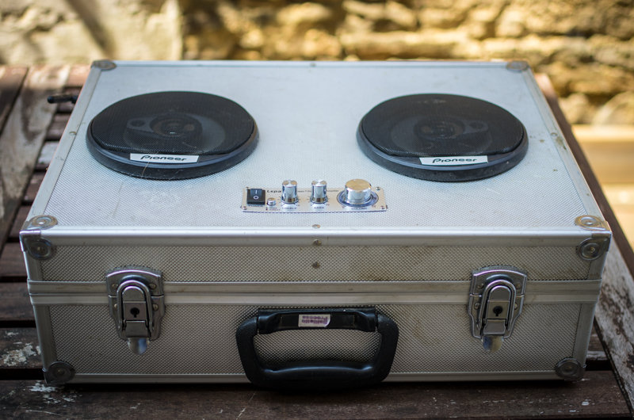
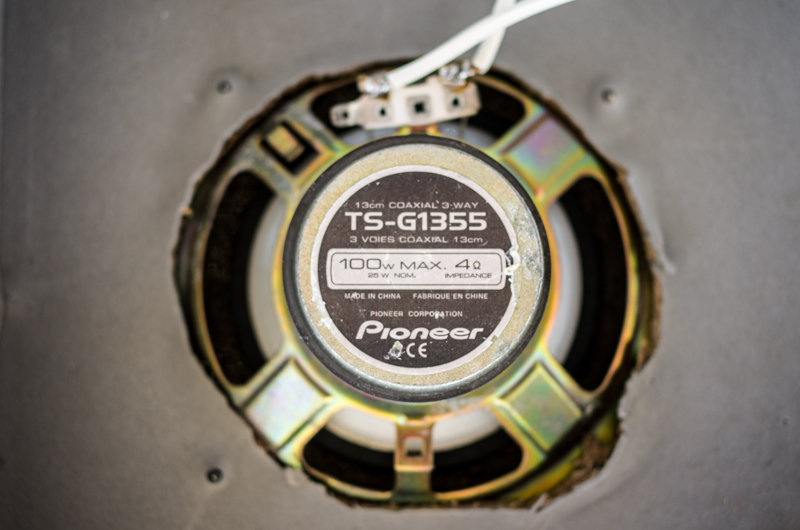
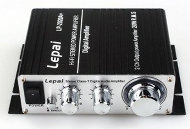
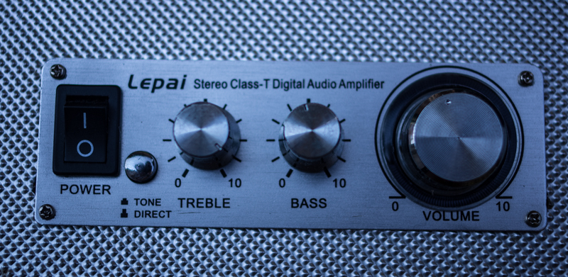
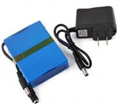
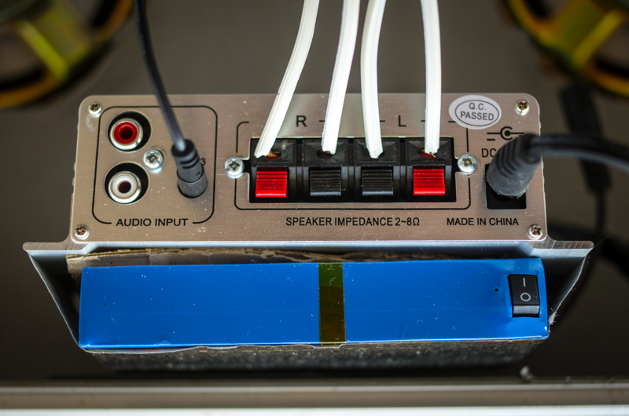
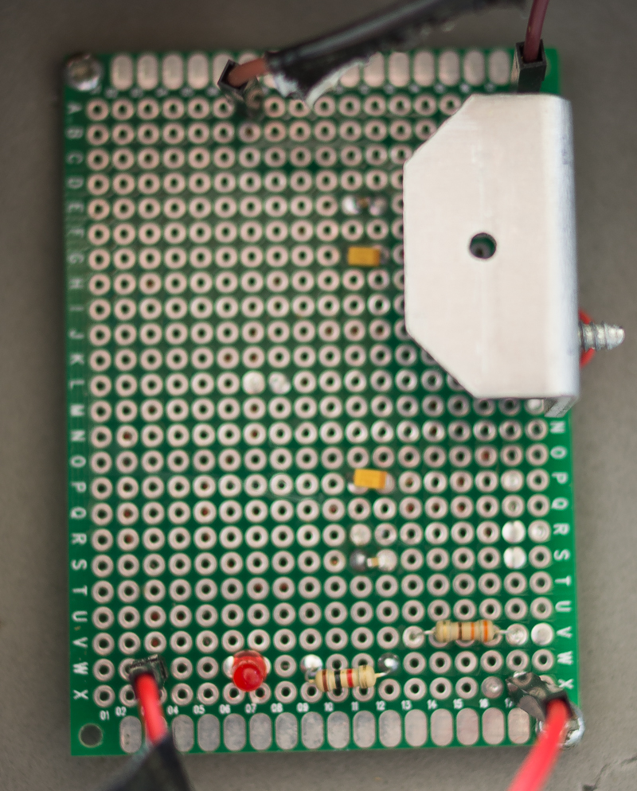
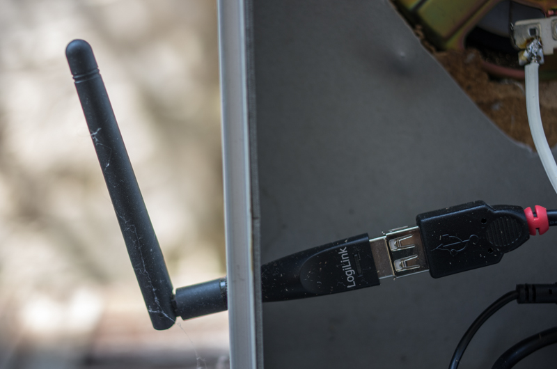
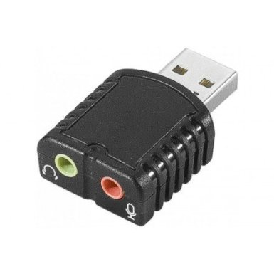

Valise Ghetto Blaster
=====================

:date: 2013-08-01
:category: électronique,informatique
:level: vulgarisation, moyen
:author: Tarek Ziadé
:licence: By-Sa-3.0

   Valise Ghetto Blaster

Après le `Juke Box du premier numéro <http://faitmain.org/volume-1/raspberry-jukebox.html>`_,
j'avais envie de pousser un peu plus le projet pour faire un `Ghetto Blaster
<https://fr.wikipedia.org/wiki/Radiocassette>`_ qui puisse streamer de la musique
via le wifi de la maison, avec un son digne de ce nom.

Il existe des solutions commerciales comme le Bose Soundlink ou le Jawbone JAMBOX -
mais il faut compter un budget de 400 euros - et franchement, quand on sait
ce qu'il y a à l'intérieur de ces enceintes, on paye surtout le design et
la marque. De plus, une enceinte amplifiée à base de Raspberry-PI offre
beaucoup plus de possibilitées vu que c'est programmable.

Enceintes & ampli
-----------------

En fouillant dans ma cave, j'ai trouvé deux enceintes trois voies Panasonic
de 100 Watts (en vrai 25W RMS) qui étaient dans mon ancienne voiture, et
une valise en aluminium qui contenait des outils. C'est la valise
générique qui est souvent vendue avec une perceuse ou d'autres
outils. Elle en jette mais elle est en carton et a juste une
mince couche d'aluminium par dessus. La caisse de résonnance parfaite
pour un prix avoisinant les 10 euros...

Ni une, ni deux, j'ai vidé la valise et retiré sa doublure
caoutchouteuse, puis percé deux trous pour les enceintes à l'aide
d'un gros cutter. La couche d'aluminium est juste comme
il faut pour tenir les enceintes avec des petites vis.

   Enceinte vissée dans la valise

Pour l'amplification j'ai opté pour un petit amplificateur
`Lepai 20 Watts 2 voies <http://www.amazon.fr/Lepai-Tripath-class-T-Amplificateur-acoustique/dp/B009US84UQ/>`_
qui permet quelques réglages basses/medium/aigues,
et dont le panneau frontal se dévisse - Payé 25 euros
sur Amazon.

   Ampli Lepai 20w.

Ca m'a permis de remettre ce panneau sur la valise et de revisser
le corps de l'ampli à l'intérieur. Bien sûr, le top du top
aurait été de fabriquer mon propre ampli, mais je n'en suis
pas encore à ce niveau là.

   Panneau de l'ampli repassé à l'extérieur.

Après deux points de soudures pour relier du fil éléctrique
entre les enceintes et l'ampli, j'ai pu essayer le son avec
un lecteur mp3.

Le choc. *un son excellent, dépassant de loin la qualité
de mes enceintes de salon*. La valise vombrie avec les
basses et les rend bien, sans aucune vibration parasite.

J'ai fais des essais en rembourrant la valise avec de
l'isolant, mais c'est moins bien - ca étouffe le son et
tue les basses.

Alimentation
------------

Avoir une alimentation stable & portative était le gros challenge
de ce projet: comment faire pour fournir les 12v que
l'amplificateur requiert, ainsi que les 5v pour le Raspberry ?

Au début j'ai pensé à équiper la valise d'une `batterie au plomb
<https://fr.wikipedia.org/wiki/Batterie_au_plomb>`_
qui est similaire à celles qui équipent les voitures, mais
j'ai très vite déchanté sur le prix et le poids - et aussi
le coté pas très écologique.

J'ai ensuite pensé à monter moi-même un train de 4 batteries
Li-Po 3.6v, mais ce genre de montage est assez technique car
il faut s'assurer que toutes les batteries sont toujours
chargées au même niveau et aussi ne jamais descendre en
dessous d'une certaine charge. Et puis bon, c'est
`dangeureux tout ça... <https://www.youtube.com/watch?v=ixIOEPnsgbI>`_

Grâce à Jonathan j'ai finalement trouvé une Li-Po de 12v et
6.8A sur AliBaba très compacte et légère. Guère plus grosse que
celle que l'on trouve dans les avions ou voitures radio-commandé,
avec toutes les protections nécessaires.

   Li-Po 12v 6800mA

La batterie se cale parfaitement au dessus de l'ampli,
avec un peu de carton entre les deux pour éviter
une surchauffe.

   L'ampli et la batterie calés dans la valise.

Reste à fabriquer un petit régulateur pour ajouter une deuxième
sortie de 5v à la batterie.

Régulation de tension
---------------------

Pour transformer une tension de 12v
en 5v il y a deux méthodes: utiliser une séries de résistances
pour simplement diviser le voltage, ou utiliser un semi-conducteur
spécialisé comme le `LM1117 <http://hackspark.fr/fr/ld1117-lm1117-5v-ldo-voltage-regulator-1-3a-to220.html>`_
qui, accompagné de quelques condensateurs, va faire tout
le boulot proprement. La deuxième méthode est beaucoup
plus fiable et évite les variations de tension, qui
peuvent être problématiques lorsqu'on alimente un Raspberry.

Le montage, expliqué ci-dessous, est très simple: le régulateur
reçoit les 12 volts sur une patte et renvoie 5v sur l'autre.
La troisième patte est la masse. Attention, bien
lire le `datasheet <http://www.st.com/st-web-ui/static/active/en/resource/technical/document/datasheet/CD00000544.pdf>`_
pour ne pas se tromper de pattes - elles sont différentes
en fonction des modèles.

   Schéma du circuit de régulation de tension.

De chaque côté du montage il y a deux condensateurs,
qui stabilisent le circuit. Si vous montez des condensateurs
céramiques, attention au sens: ils sont polarisés.

Enfin, une LED est placé sur la partie 5v, avec une petite
résistance, histoire de montrer que le circuit tourne.

En utilisation, le régulateur chauffe beaucoup puisqu'il dissipe
l'excès de tension, et il peut être équipé d'un petit radiateur
à visser - j'en ai récupéré un sur une vieille plaque électronique
pour ce montage.

Après quelques soudures, un magnifique régulateur de tension!

   Régulateur 12v -> 5v. Le LM1117 est masqué par le radiateur.

Avec un son assez fort, l'ensemble tient 3 à 4 heures, ce qui
n'est pas mal du tout.

Les deux évolutions possibles pour la partie alimentation sont:

- un afficheur de charge restante, qui peut être réalisé avec
  un chip `LM3914 <http://www.ti.com/lit/ds/symlink/lm3914.pdf>`_
  qui est capable de gérer jusqu'à 10 LEDs, et ce
  `joli afficheur 10 leds <http://uk.rs-online.com/web/p/led-displays/2465689/>`_.

- Un bouton pour éteindre le système sans arrêter brutalement
  le Rapsberry-Pi. Ce petit circuit peut être réalisé en
  pilotant l'extinction du Raspberry via son port GPIO comme
  comme expliqué `ici <http://www.raspberrypi.org/phpBB3/viewtopic.php?f=37&t=42449>`_,
  et un `timer 555 <http://555-timer-circuits.com>`_ pour l'extinction
  finale de la batterie.

Wifi
----

Le but de la valise étant de se connecter au réseau de la maison pour
servir d'enceinte sans fil, il fallait une puce wifi. La puce AirLink
que j'avais utilisé lors du jukebox précedent marchait mal car
il s'agit d'un simple dongle USB. En effet, lorsque je fermais la
valise, le signal se coupait assez vite puisque l'aluminium de la valise
fait office de cage de farraday.

J'ai donc opté pour un dongle `Logilink WL0151 <http://www.amazon.fr/gp/product/B00C1MD0YI>`_
avec une antenne wifi integrée qui dépasse à l'extérieur de la valise.

   Le dongle Wifi avec antenne extérieure.

Vu que c'est du Ralink, cette puce est plug-n-play sur Raspbian.

Carte son
---------

Une autre fonctionnalité de la valise est de pouvoir jouer de la musique
provenant d'une source extérieure comme un lecteur MP3. J'ai donc acheté
une carte son `Dacomex USB <http://www.amazon.fr/gp/product/B002CIDHYE>`_
avec une entrée.

   Carte son Dacomex

Cette carte est reconnue tout de suite sur la Raspbian comme périphérique
audio USB, et en modifiant le fichier **/etc/asound.conf** comme suis:

.. code-block:: bash

    pcm.!default {
        type hw
        card 1
        device 0
    }

Elle sera utilisé comme carte son par défaut.

Logiciels
---------

Coté logiciel, après avoir déployé une Raspbian de base, j'ai suivi la même
installation que pour le précédent Jukebox, `expliquée ici <http://faitmain.org/volume-1/raspberry-jukebox.html#configuration-de-base-et-wifi>`_ puis en lieu et place de l'application JukeBox,
j'ai déployé le logiciel `Mopidy <https://docs.mopidy.com>`_ comme suis:

.. code-block:: bash

    wget -q -O - http://apt.mopidy.com/mopidy.gpg | sudo apt-key add -
    sudo wget -q -O /etc/apt/sources.list.d/mopidy.list http://apt.mopidy.com/mopidy.list
    sudo apt-get update
    sudo apt-get install mopidy

Mopidy est un serveur de musique qui permet de jouer de la musique de
plusieurs sources différentes: fichiers sur le disque, radios internet,
tout type de stream compatible.

Mopidy se base sur un `serveur MPD <http://doc.ubuntu-fr.org/mpd>`_
(Music Player Daemon) et est compatible avec tous les clients MPD du
marché - Il y en a pour Android, Linux, Mac OS X, Windows.

En d'autre termes, la valise pourra être pilotée via un téléphone
une tablette ou un laptop !

J'ai installé l'extension `Mopidy-Spotify <https://mopidy.readthedocs.org/en/latest/ext/spotify.html>`_
qui permet à Mopidy de se connecter à un compte Spotify pour streamer de la musique.

.. code-block:: bash

    sudo apt-get install libspotify12 python-spotify

Il suffit ensuite de configurer Mopidy en ajoutant une section **spotify** dans le
fichier **~/.config/mopidy/mopidy.conf**:

.. code-block:: ini

    [spotify]
    username = myusername
    password = mysecret

Le user et mot de passe s'obtiennent dans l'interface du site de Spotify, en y
ajoutant un nouveau device.

Plug-and-play
-------------

Le seul petit problème du système est qu'il faut connaître l'addresse IP de
la valise sur le réseau de la maison pour pouvoir la piloter.

Le plus simple est de lui attribuer une addresse fixe mais le plus sexy
serait d'avoir en plus un accès hot spot sur la valise, pour que
chacun puisse s'y connecter pour jouer de la musique.

Il paraît qu'il est possible de configurer certaines puces WIFI pour
qu'elles fonctionnent en point d'accès **et** qu'elles se connectent
à une borne wifi aussi. Je n'y suis pas arrivé.

En attendant, j'ai opté pour une solution plus geek: j'ai modifié
le script de démarrage de Mopidy pour que la valise dicte à haute
voix son addresse IP en utilisant `eSpeak <https://fr.wikipedia.org/wiki/ESpeak>`_,
installable avec le nom de paquet éponyme.

Quand j'allume ma valise, elle me dit:

    I am ready to play music, my ip address is 192.168.0.20

Conclusion
----------

La valise fonctionne plutôt bien, mais il manque les petits
détails pour en faire un produit fini, comme l'affichage de la batterie
restante ou le bouton ON/OFF qui respecte la séquence de halt du
Raspberry. Le problème de l'IP est aussi un peu pénible.

Mais tout ces problèmes peuvent être résolus, donc je suis
assez content du résultat.

Peut-être que j'écrirais un prochaine article sur ces upgrades.

