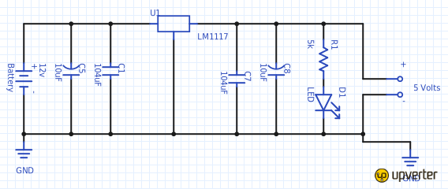

Valise Ghetto Blaster
=====================

:date: 2013-08-01
:category: électronique,informatique
:level: vulgarisation, moyen
:author: Tarek Ziadé

Après le `Juke Box du premier numéro <http://faitmain.org/volume-1/raspberry-jukebox.html>`_,
j'avais envie de pousser un peu plus le projet pour faire un `Ghetto Blaster
<https://fr.wikipedia.org/wiki/Radiocassette>`_ qui puisse streamer de la musique
via le wifi de la maison, avec un son digne de ce nom.

Il existe des solutions commerciales comme le Bose Soundlink ou le Jawbone JAMBOX -
mais il faut compter un budget de 400 euros - et franchement, quand on sait
ce qu'il y a à l'intérieur de ces enceintes, on paye surtout le design et
la marque. De plus, une enceinte amplifiée à base de Raspberry-PI offre
beaucoup plus de possibilitées vu que c'est programmable.

Enceintes & ampli
-----------------

En fouillant dans ma cave, j'ai trouvé deux enceintes trois voies Panasonic
de 100 Watts (en vrai 25W RMS) qui étaient dans mon ancienne voiture, et
une valise en aluminium qui contenait des outils. C'est la valise
générique qui est souvent vendu avec une perceuse ou des outils.
Elle en jette mais elle est en carton et a juste une mince couche
d'aluminium par dessus. La caisse de résonnance parfaite pour
un prix avoisinant les 10 euros...

Ni une, ni deux, j'ai vidé la valise et retiré sa doublure
plastique, puis percé deux trous pour les enceintes à l'aide
d'un gros cutter.

Pour l'amplification j'ai opté pour un petit amplificateur
`Lepai 20 Watts 2 voies <http://www.amazon.fr/Lepai-Tripath-class-T-Amplificateur-acoustique/dp/B009US84UQ/>`_
qui permet quelques réglages basses/medium/aigues,
et dont le panneau frontal se dévisse - Payé 25 euros
sur Amazon.

   Ampli Lepai 20w.

Ca m'a permis de remettre ce panneau sur la valise et de revisser
le corps de l'ampli à l'intérieur. Bien sûr, le top du top
aurait été de fabriquer mon propre ampli, mais je n'en suis
pas encore à ce niveau là.

Après deux points de soudures, les enceintes et l'amplificateur
étaient fonctionels et là, le choc: **un son excellent, dépassant
de loin la qualité de mes enceintes de salon**.

Alimentation
------------

Avoir une alimentation stable & portative était le gros challenge
de ce projet: comment faire pour fournir les 12v que
l'amplificateur requiert, ainsi que les 5v pour le Raspberry ?

Au début j'ai pensé à équiper la valise d'une `batterie au plomb
<https://fr.wikipedia.org/wiki/Batterie_au_plomb>`_
qui est similaire à celles qui équipent les voitures, mais
j'ai très vite déchanté sur le prix et le poids - et aussi
le coté pas très écologique.

J'ai ensuite pensé à monter moi-même un train de 4 batteries
Li-Po 3.6v, mais ce genre de montage est assez technique car
il faut s'assurer que toutes les batteries sont toujours
chargées au même niveau et aussi ne jamais descendre en
dessous d'une certaine charge. Et puis bon, c'est
`dangeureux tout ça... <https://www.youtube.com/watch?v=ixIOEPnsgbI>`_

Grâce à Jonathan j'ai finalement trouvé une Li-Po de 12v et
6.8A sur AliBaba très compacte et légère. Guère plus grosse que
celle que l'on trouve dans les avions ou voitures radio-commandé,
avec toutes les protections nécessaires.

.. figure:: ghetto/batterie.jpg
   :scale: 25
   :figclass: pull-right margin-left
   :align: right

   Li-Po 12v 6800mA

Reste à fabriquer un petit régulateur pour ajouter une deuxième
sortie de 5v à la batterie.

Pour transformer une tension de 12v
en 5v il y a deux méthodes: utiliser une séries de résistances
pour simplement diviser le voltage, ou utiliser un semi-conducteur
spécialisé comme le `LM1117 <http://hackspark.fr/fr/ld1117-lm1117-5v-ldo-voltage-regulator-1-3a-to220.html>`_
qui, accompagné de quelques condensateurs, va faire tout
le boulot proprement. La deuxième méthode est beaucoup
plus fiable et évite les variations de tension, qui
peuvent être problématiques lorsqu'on alimente un Raspberry.

Le montage, expliqué ci-dessous, est très simple: le régulateur
reçoit les 12 volts sur une patte et renvoie 5v sur l'autre.
La troisième patte est la masse. Attention, bien
lire le `datasheet <http://www.st.com/st-web-ui/static/active/en/resource/technical/document/datasheet/CD00000544.pdf>`_
pour ne pas se tromper de pattes - elles sont différentes
en fonction des modèles.

   Schéma du circuit de régulation de tension.

De chaque côté du montage il y a deux condensateurs,
qui stabilisent le circuit. Si vous montez des condensateurs
céramiques, attention au sens: ils sont polarisés.

Enfin, une LED est placé sur la partie 5v, avec une petite
résistance, histoire de montrer que le circuit tourne.

En utilisation, le régulateur chauffe beaucoup puisqu'il dissipe
l'excès de tension, et il peut être équipé d'un petit radiateur
à visser - j'en ai récupéré un sur une vieille plaque électronique
pour ce montage.

Après quelques soudures, un magnifique régulateur de tension!

XXX photo régul.

Logiciels
---------

XXX

Wifi
----

XXX

Conclusion
----------

XXX

he next steps were to plug a Raspberry-Pi with an USB sound card and a wifi
dongle and run Mopidy on it. That allowed me to stream music from my Spotify
account.

When the Raspberry starts, it starts Mopidy, connects to the home Wifi and
speaks out using espeak:

    "I am ready to play music, my IP address is 192.168.0.16"

From there I can start a MPD client like MPDroid and connect to that IP and
queue some music. Powering

Of course the big challenge was to power up the amplifier & the Raspberry so I
could actually walk around freely. I did not want to use lead acid, so I bought
this 12v lipo battery for $20. It comes pre-charged and has a small on/off
button.

Now this battery delivers 12v but I still need 5v for my Raspberry. You can use
a voltage regulator for this, like the LM1117.

I built a small board you can see in the video. It takes the 12v from the
battery and outputs 5v for the Raspberry. It has the LM1117 with a sink, and a
few capacitors for stability.

It's exactly the same design as this one
https://www.youtube.com/watch?v=CKS6zHo5T9k except they use a L7805 in there -
which has a different wiring.

That's it - my 12v LiPO powers up the amplifier & the Raspberry. It's been
playing for hours and the battery still has some juice. Issues & next steps

The wifi dongle loses the signal if I close the suitcase and I am too far from
the wifi router. I need to set up an external antenna.

I am also going to add a battery level indicator, using this schematic

One issue I have yet to solve is the ability to reconfigure the network setup
in case I use the Ghetto blaster in someone else's house. Right now I have to
plug a screen and a keyboard or to plug a network cable and ssh on the
Raspberry to change the network config.

Maybe one way to solve this would be to have a second wifi dongle set as an
access point, and a small web interface to configure the network.

Raspberry-Pis are so fun.

