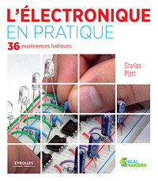
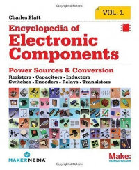
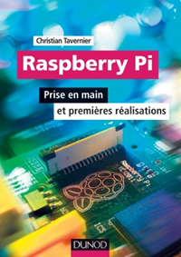

Lectures de l'été
=================

:date: 2013-08-01
:category: électronique,informatique
:level: decouverte
:author: Tarek Ziadé

Voici une petite sélection de livres pour l'été. Dans ce numéro,
beaucoup d'électronique !

L'électronique en pratique
::::::::::::::::::::::::::

   Charles Platt/Eyrolles

Eyrolles lance une nouvelle collection `Serial Makers <http://serialmakers.com/>`_,
dédiée « à l’univers des Fab Labs, de l’électronique, du DIY et de l’impression 3D ».

Un des premiers livres dans cette collection est la traduction du livre
de Charles Platt, intitulé « Make: Electronics (Learning by Discovery) » en anglais.

La version en français est `« L'électronique en pratique » <http://serialmakers.com/livres/decouvrez-lelectronique>`_
et la traduction est de bonne facture et agréable à lire.

Quand au contenu du livre, je pense que c'est l'un des meilleurs livres
actuel pour démarrer en électronique. Il propose de découvrir les principes
fomdamentaux de l'électronique par des petites experiences ludiques et simple
à réaliser. Aucun bagage en physique ou électronique n'est nécessaire,
le livre va réexpliquer simplement les notions de base entre deux
expériences, sans que cela ne devienne barbant.

Je suis moi-même assez novice en électronique et je prend beaucoup de plaisir
à utiliser ce livre, qui prend le temps d'expliquer en détail comment
fonctionne les composants manipulés.

Même si l'on fini par faire la plupart de nos montages complexes avec des
micro-controlleurs, il est très intéressant grâce à ce livre de comprendre
comment faire des montages avec quelques composants passifs et de simples
timers. La section sur les timers 555 est à ce titre extraordinaire.
Elle m'a donné envie de refaire quelques-un des mes montages Arduino en
remplaçant le micro-controlleur par des timers 555 et des transistors.

**L'électronique en pratique** est à acheter les yeux fermés.

Encyclopedia of Electronic Components Vol. 1
::::::::::::::::::::::::::::::::::::::::::::

   Charles Platt / O'Reilly Media

J'ai tellement aimé L'électronique en pratique que lorsque j'ai vu
l'`Encyclopedia of Electronic Components Vol. 1 <//www.amazon.fr/dp/B00DJG6JJ8/>`_
au stand O'Reilly d'Europython en Italie, je me suis jeté dessus.

Ce livre est un recueil de composant eléctroniques regroupés par thèmes :
résistances, condensateurs, inducteurs, interrupteurs, encodeurs, relais
et enfin transistors.

Dans chacun de ces thèmes, une série de composants est présentée.
Platt explique pour chacun comment ils fonctionnent, quelle sont leur
usages et leur limites, via une section nommée « Ce qui peut mal se passer ».

Un bon exemple est la partie sur les différent types de condensateur :
elle est vraiment pédagogique et part du principe que le lecteur n'a
aucune connaissance préalable. On comprend le fonctionnement de ces
composants, leur utilité, et pourquoi il existe des condensateurs
de différent types.

**Encyclopedia of Electronic Components Vol. 1** est un excellent
complément des datasheets que l'on trouve sur le
net, et aussi un bon compagnon du livre précédent.

Je ne crois pas qu'il existe en français par contre, mais j'achèterais
le volume 2, c'est sûr.

Raspberry-Pi — Prise en main et premières réalisations
::::::::::::::::::::::::::::::::::::::::::::::::::::::

   Christian Tavernier/Dunod

Tout comme Eyrolles, Dunod commence à s'intéresser de prêt au mouvement
DIY et sort un ouvrage original sur le Raspberry-Pi intitulé :
**Raspberry-Pi — Prise en main et premières réalisations**, écrit
par Christian Tavernier, auteur prolifique de livres sur les micro-controlleurs
PIC et l'Arduino chez le même éditeur.

Si vous êtes un novice complet, ce livre est parfait pour vous, car
l'auteur va vous guider à travers toutes les étapes de découverte et 
d'installation du Raspberry, et aussi vous donner des notions de 
programmation en Python.

Si vous êtes déjà familier avec Python et le monde de l'Arduino, cet ouvrage
ne vous apportera pas grand chose, si ce n'est la dernière section sur des
idées de montages à brancher sur le GPIO.  

Ceci étant dit, le niveau du livre
est très bon et tout le monde y apprendra quelque chose: 
l'auteur ajoute une bonne valeur ajouté grâce à ces connaissances en 
électronique. J'y ai découvert par exemple que le régulateur de tension
pour mon `ghetto blaster </volume-3/ghetto-blaster.html>`_ pouvait être
remplacé par un régulateur avec un bien meilleur rendement (et qui chauffe moins).

Ca m'a donné envie d'acheter d'autres livres de cet auteur.

Pour débuter avec le Raspberry, je recommande 
**Raspberry-Pi — Prise en main et premières réalisations**

