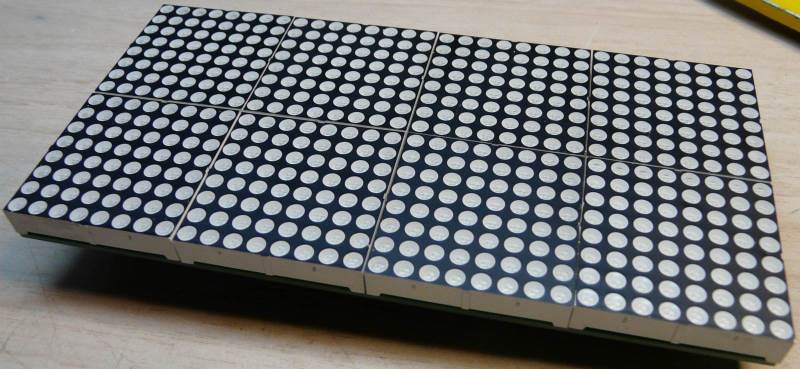

Un cadre numérique pas comme les autres
===================================

:date: 2013-07-15
:category: électronique,informatique
:level: moyen
:author: Fabien Batteix

Pour ce 3ème numéro de Fait Main j'avais le choix entre plusieurs projets tous plus fous les uns que les autres.
Finalement celui qui a été retenu est un projet de cadre numérique, mais pas n'importe quel cadre.

Pour ce projet j'ai décidé d'innover en réalisant mon propre cadre numérique « Do It Yourself ».
Bien sûr celui ci ne sera pas aussi conventionnel qu'un cadre du commerce. Le mien sera réalisé avec des matrices leds bicolores et du bois.
Celui ci aura pour but de servir de base pour des applications temps réel diverses et variées que je vous présenterai par la suite.

Des matrices de leds ? Oui, mais lesquels ?
:::::::::::::::::::::::::::::::::::::::::::

Le choix des matrices de led était bien évidement un point clé pour ce projet.
Mon choix s'est arrêté sur des matrices de leds bicolores (pixels rouge et vert) de 8 x 8 pixels.

Pourquoi ce choix ?

+ Tout simplement parce que de telles matrices ne coutent quasiment rien sur ebay, dealextreme, ... contrairement à des matrices de leds RGB.
+ Il est très simple de trouver des circuits imprimés pour en connecter et contrôler un grand nombre à la fois.
+ Cela donne un côté très DIY au résultat final, ce qui n'est pas négligeable ;)

   Avant d'une matrice de leds une fois montée.

   Arrière d'une matrice de leds une fois montée.

Après quelques heures de recherche je suis tombé sur des kit à monter soi même de 32x16 pixels (8 matrices par kit) du fabricant "DIYTJ" sur DealExtreme (`sku.202393  <http://dx.com/p/diytj-16-x-32-dual-color-dot-matrix-module-kit-green-white-202393>`_).
Ces kit, bien que comportant des composants CMS, sont relativement simple à monter, même sans connaissances poussées en soudure.
De plus leur prix unitaire m'a permis d'en acheter une douzaine et ainsi de former une matrice "géante" de 96x64 pixels au total.

.. note::

   Ces matrices de leds, comme beaucoup de clone chinois, sont fournies sans documentation, schéma ou autre.
   Tout le code réalisé pour ce projet est donc le résultat d'un gros travail de rétro-ingénierie et de recherche.
   Avec ce genre de produits il faut aimer les casses têtes pour arriver à ses fins ;)

.. note::

	Pour ceux qui seraient intéressés, les instructions de montage étape par étape des matrices sont disponibles sur mon blog :
	`ici <http://skyduino.wordpress.com/2013/07/12/montage-info-matrices-de-leds-diytj/>`_

Le cadre
::::::::

Comme précisé plus haut le cadre entourant les matrices de leds est réalisé en bois.

   Sans cadre le résultat ne fait pas très professionnel.

Ce cadre a pour but de maintenir les matrices de leds en place et de donner un aspect visuel plus propre au montage.
Un cadre numérique n'en serait pas un sans cadre :)

   Collage de la base du cadre. Ne vous inquiétez pas mon parquet n'a reçu aucune coulure de colle, ou presque.

   La base du cadre une fois la colle sèche et les matrices en place.

Le fond du cadre est réalisé en bois de pin tout ce qui a de plus classique.
Deux épaisseurs de planches sont collées en chevauchement pour maximiser la résistance du cadre.
Le tout a ensuite était fixé ensemble avec de la colle blanche, des serres joints et un serre-cadre pour l'équerrage.

   La base du cadre avec la plaque de plexiglas.
   
Par dessus la base du cadre vient se poser une plaque de verre synthétique ayant pour but de plaquer les matrices de leds.
Les vis sur les quatre coins du cadre ont elles pour but de fixer par l'arrière deux baguettes de bois servant de pressoir pour maintenir les matrices en place.
Ces vis ont bien évidement été incrustés dans le bois pour éviter rien ne dépasse avant la pose définitive du plexiglas.
   

   Face avant du cadre en medium

La face avant du cadre a été réalisé en medium (une espèce de bois aggloméré au grain très fin).
Cette face avant comporte des chanfreins sur les bords intérieurs et extérieurs pour un meilleur fini. 
De même qu'une rainure cachée sur le dessous pour maintenir la plaque de plexiglas.
(La plaque de plexiglas est maintenu en place par la seul pression de la face avant sur le cadre de base et un peu de joint à baignoire)
   

   Un petit peu de penture et hop !

Après un dernier petit coup de peinture noir satiné le cadre est fini !

Principe de fonctionnement des matrices et câblage
::::::::::::::::::::::::::::::::::::::::::::::::::

   Le rangement est mon maitre mot, ou pas.

Ces matrices de leds sont contrôlées au moyen d'un port SPI un peu spécial.
Le connecteur utilisé par ces matrices est un classique connecteur 2x16 broches au pas 2.54mm.

Sur ce connecteur on retrouve les lignes suivantes :

=====  =====
GND    A
GND    B
GND    C 
OE     D 
R      G
nc     nc
GND    STR
GND    SCK
=====  =====

Détails :

+ GND : masse (0v)
+ nc : Non connecté
+ A, B, C, D : choix de la ligne à afficher (voir plus bas pour plus de détails)
+ R, G : entrée de données pour le rouge et le vert (équivalent MOSI en SPI)
+ STR : Latch (permet de mettre en mémoire les données transmises)
+ SCK : Signal d'horloge commun pour les lignes R et G

.. note::

	Comment marche ces matrices ?

	En réalité ces matrices de leds sont des clones très légèrement modifiés des matrices de leds d'ancienne génération du (très connu) fabricant « SureElectronics ».
	Par chance j'ai pu mettre la main sur un pdf expliquant le fonctionnement de ces "vieilles" matrices de leds, nommé "LCD matrix display driver – DE-DP029~033_Ver1.0_EN".

	Une copie du pdf est disponible `sur ma dropbox <https://dl.dropboxusercontent.com/u/53604363/divers/LCD%20matrix%20display%20driver%20-%20DE-DP029%7E033_Ver1.0_EN.pdf>`_, au cas où la version d’origine disparaitrait.
	
	.. figure:: ledmatrix/schematic.JPG

		Schéma d'origine tiré du pdf de « SureElectronics »
	
	Le principe de fonctionnement est relativement simple :
	
	+ Un décodeur binaire -> décimal (74HC138) permet de sélectionner la ligne (entre 0 ~ 15) à afficher.
	+ Deux séries de 4 registres à décalage (74HC595) permettent d'allumer/éteindre les pixels voulus de la ligne sélectionnée (« 0 » = allumé, « 1 » = éteint).
	+ L'affichage est multiplexé (affichage ligne par ligne) et doit être rafraichi à 960Hz (soit 60 images par secondes) pour un bon rapport scintillement / luminosité / consommation.

	Le problème avec ces matrices c'est qu'il y a deux entrées séries (R et G) pour un seul même signal d'horloge (CK sur le schéma, SCK sur la carte).
	Il est donc impossible d'utiliser un port SPI matériel, la seule solution possible est donc d'utiliser du SPI software, beaucoup plus lent et couteux en ressource CPU …

.. note::

	Concrètement comment je fait pour allumer mes pixels ?
	
	Prenons une seule matrice de 16x32 pixels.
	Cette matrice est constitués de 16 lignes de 32 pixels horizontal, organisés en 4 bloc de 8 pixels.
	Chaque pixel horizontal est un bit que l'on envoie en SPI (communication série avec horloge synchrone).
	Ici pour afficher une ligne il faut donc envoyer 4 octets, que ce soit sur le signal de données R (rouge) et G (vert).
	
	Pour que l'affichage soit correct il faut envoyer les données de chaque ligne tout les 1/60ème de secondes (persistance rétinienne), soit une ligne tout les 1/960ème de seconde (= 16 lignes x 60Hz).
	
	Il faut cependant envoyer les données à l'envers.
	Les matrices en question utilisent des registres à décalage montés ... vers la gauche. Le premier octet envoyé se retrouve donc à droite de la matrice puis est décalé vers la gauche.
	La seule explication logique à cela serait que le concepteur de la carte ait pris un repère (X = 0, Y = 0) en bas à droite, contrairement au reste des développeurs qui utilisent un repère (0, 0) en haut à gauche.
	Ainsi pour envoyer les octets 1, 2, 3, 4 il faut en réalité envoyer 4, 3, 2, 1. Mais ce n'est pas le pire.
	
	Dans le cas où l'on souhaite câbler plusieurs matrices en chaine il faut faire un peu de gymnastique pour envoyer les données dans le bonne ordre tout en conservant un repère (0, 0) classique.
	Tout en envoyant les blocs de 4 octets de chaque matrice à l'envers, il faut aussi commencer par la dernière matrice de la ligne.
	Ainsi pour envoyer les données d'une ligne de 64 pixels (soit 2 matrices chainées) il faut envoyer les octets dans l'ordre 5, 6, 7, 8, 4, 3, 2, 1.
	Quand je vous disais qu'il fallait aimer les casses tête je ne vous avait pas menti ;)

Programme de démonstration
::::::::::::::::::::::::::

   Après tant de réflexion il est grand temps de voir ce que ça donne vous ne trouvez pas ?

.. note::

	Les codes sources des programmes présentés dans ce chapitre sont disponibles `sur mon github <https://github.com/skywodd/DIYTJ_led_matrix/>`_

**Programme n°1 : les bases**

   Programme de base, rempli l'écran pixel par pixel

Avant de courir il faut savoir marcher, ici c'est pareil, avant de vouloir faire des trucs compliqué il faut savoir afficher au moins un pixel.

La première étape pour cela est d'avoir un microcontrôleur pour contrôler la matrice.
Lors de mes premiers essais j'utilisai une carte Arduino UNO mais celle-ci n'étant pas adaptée pour la suite (pas assez de RAM) j'ai du changer mon fusil d'épaule.

   Rien ne vaut une breadboard, des fils et un ATmega !

Bien qu'ayant laissé tomber l'idée d'utiliser une carte Arduino je ne suis pas allé chercher loin.
Pour contrôler ma matrice de led j'ai utilisé un ATmega1284p (tournant à 16MHz), le même microcontrôleur que dans les cadres Sanguino.

Le montage est relativement trivial, celui ci se compose :

+ un ATmega1284p,
+ un quartz à 16MHz + deux condensateurs de 22pF,
+ une résistance de 10K sur la broche RESET
+ un condensateur de découplage (100nF) sur le +5v.

Pour me faciliter la vie j'ai aussi câblé un connecteur ISCP pour breadboard (fabriqué par Sparkfun) et un connecteur 2x16 broches pour la nappe reliant le montage à la matrice.

.. note::

	La diode zener, la résistance et l'interrupteur sur la droite ne sont utile que pour le programme de FFT décrit plus bas.

Le code de base est composé de seulement 6 fonctions et de quelques "define", rien de bien extraordinaire.

Le câblage des différentes lignes de contrôlés est défini dés les premières lignes du code.
Deux ports sont utilisés : le port C et le port B, c'est deux ports sont disponibles sur l'ATMega1284p, mais aussi sur l'ATmega328p que l'on retrouve dans les cartes Arduino UNO.
Et oui j'ai aussi pensé aux Arduinistes ;)

Au niveaux des fonctions bas niveau on trouve :

+ void dualShiftOut(red, green) : cette fonction permet d'envoyer deux octets suivant le même principe que la fonction Arduino "shiftOut" mais sur deux sorties (R et G) simultané.
+ void lineShiftOut(line_red_buffer, line_green_buffer) : cette fonction envoie une ligne compléte en utilisant la fonction ci dessus, elle est aussi responsable de l'ordre d'envoi des blocs de 4 octets.
+ ISR(TIMER2_COMPA_vect) : cette fonction d'interruption est appelée tous les 1/960ème de seconde pour rafraichir l'affichage.

Cette fonction d'interruption fonctionne suivant le principe ci dessous :

   Flowchart réalisé au moyen du logiciel yEd

Vous remarquerez qu'en plus de faire l'affichage des lignes à intervalle régulier je gère aussi la rotation de deux buffer : un d'affichage et un de dessin.
Cette méthode d'affichage s'appelle le « double buffering ».
   
.. note::

	Pourquoi faire du « double buffering » ?
	
	Dessiner et afficher sont deux actions différentes, qui se font à deux vitesses différentes.
	L'affichage se fait à intervalle régulier fixe, le dessin lui se fait à la vitesse du programme de dessin.
	Afficher et dessiner avec le même buffer créerait obligatoirement des artéfacts peu esthétiques, c'est pourquoi le double buffering existe.
	Le dessin se fait dans un buffer dédié et l'affichage depuis un autre, quand le dessin est fini de même que l'affichage du second buffer les deux buffer sont échangés.
	L'affichage du buffer de dessin se fait donc en une seule fois, ce qui est beaucoup plus propre.

Pour les fonctions haut niveau, elles sont au nombre de deux :

+ void setPixelAt(color, x, y, state) : permet de manipuler l'état d'un pixel dans le buffer de dessin.
+ getPixelAt(color, x, y) : permet de lire l'état d'un pixel du buffer d'affichage.

(on écrit dans le buffer de dessin, mais on lit dans le buffer d'affichage)

La fonction main() dans ce programme de base est réduite au strict minimum :

+ Initialisation des entrées / sorties.
+ Initialisation du timer permettant le rafraichissement à 960Hz.
+ Boucle infinie remplissant pixel par pixel l'écran.

**Programme n°2 : Game of life**

   Programme "Game of life"

`Vidéo de démonstration n°1 <http://www.youtube.com/watch?v=GJld3vLDpsY>`_
   
Ce programme est mon préféré, il est très simple et se rapproche énormément du programme de base.
Seule une fonction "getAliveNeighbourCount" (compte le nombre de cellule vivante autour d'une cellule donnée) et une boucle de traitement ont été rajoutées.
Le résultat est cependant extraordinairement complexe.

.. note::

	Qu'est ce que le « jeu de la vie » ?

	Le jeu de la vie est un automate cellulaire imaginé par John Horton Conway en 1970, qui est à l'heure actuelle le plus connu de tous les automates cellulaires.
	Malgré des règles très simples, le jeu de la vie permet le développement de motifs extrêmement complexes.
	
	Le jeu de la vie n'est pas vraiment un jeu au sens ludique, puisqu'il ne nécessite aucun joueur ; il s'agit d'un automate cellulaire, un modèle où chaque état conduit mécaniquement à l'état suivant à partir de règles pré-établies.

	Le jeu se déroule sur une grille à deux dimensions, théoriquement infinie (mais de longueur et de largeur finies et plus ou moins grandes dans la pratique), dont les cases — qu'on appelle des « cellules », par analogie avec les cellules vivantes — peuvent prendre deux états distincts : « vivantes » ou « mortes ».
	
	Source : `wikipedia <http://fr.wikipedia.org/wiki/Jeu_de_la_vie>`_

**Programme n°3 : Transformée rapide de Fourrier (FFT) **

   Programme "FFT", mode linéaire

   Programme "FFT", mode logarithmique (ps : oui il y a bien un pixel mort)

`Vidéo de démonstration n°2 <http://www.youtube.com/watch?v=qfxvMXDwa5I>`_
   
Ce programme est le plus compliqué des trois.
Il réalise en temps réel une transformée rapide de fourrier sur un signal audio et affiche les 96 premières bandes de fréquence résultant du calcul (sur un total de 128 bandes).

À noter que le code associé au calcul de la transformée (écrit en assembleur AVR et optimisé pour travailler sur des nombres réels (transformée connu sous le nom de FHT)) n'est pas de moi mais de `OpenMusicLabs <http://wiki.openmusiclabs.com/wiki/ArduinoFHT>`_.
Ecrire un tel algorithme n'est pas du tout de mon niveau mathématique. Je me suis juste contenté d'y apporter des modifications mineures pour que celle ci compile avec ma version d'AVRGCC bien plus récente que celle fournie avec l'ide Arduino.

Le code reprend celui de base en ajoutant simplement une boucle de traitement / dessin par barre dans la fonction main() et une seconde fonction d'interruption par timer pour l'échantillonnage audio.

.. note::

	Si vous êtes intéressés par le principe de fonctionnement de la transformée de Fourrier ces deux liens vous intéresseront :
	
	+ `Fast Fourier transform — FFT <http://www.librow.com/articles/article-10>`_ (détails sur l'algorithme lui même)
	+ `Fast Hartley Transformation Library for AVR microcontrollers <http://www.waitingforfriday.com/index.php/Fast_Hartley_Transformation_Library_for_AVR_microcontrollers>`_ (implémentation en C de l'algorithme)
	

	Schéma du montage de conversion audio (+/- 1v) vers ADC (0~5v)

	Montage de conversion audio vers ADC sur breadboard
	
Pour fonctionner ce programme à besoin de capturer à intervalle régulier un échantillon audio.
Les sorties de cartes son travaillant sur une plage de tension entre -1v et +1v il est nécessaire d'adapter ce signal avant de l'envoyer sur l'entrée analogique du microcontrôleur.
Pour ce faire j'utilise un classique montage amplificateur non inverse à ampli-op. Ce montage amplifie le signal de 2.5 fois avant d'être recentré sur 2.5v au moyen d'un « bias ».

.. note::

	+ La résistance de 33 ohms sert de charge pour la sortie audio, sans charge la plupart des cartes son ne sortent pas de signal.
	+ La diode zener permet de limiter la tension au niveau de l'entrée analogique du microcontrôleur à 5v par mesure de sécurité.

