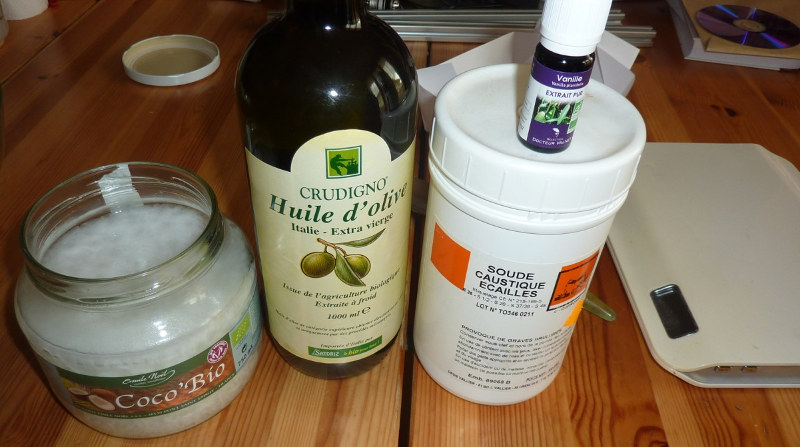

Du savon fait maison
====================

:date: 2013-08-01
:category: ecologie
:level: facile
:author: Nerick

Le savon de marseille... Je suis sûr que vous connaissez tous, mais que
personne ne l'utilise. C'est vrai, souvent on en reste aux blocs infames
trouvés en supermarchés, et qui laissent après utilisation, une désagréable
sensation sur la peau.

Personellement, j'ai (re-)découvert le savon en me
promenant aux pays-bas, en tombant sur une boutique dont j'ai complètement
oublié le nom. Les savons étaient présentés tels des patisseries
psychédéliques, tous plus appétissants les uns que les autres. Le savon était
redevenu fun.

Et après essai, il est aussi tout a fait possible d'en avoir de
beaucoup plus agréables que nos habituels gels douches. Partant de là, l'idée
de faire mon propre savon n'était plus très loin, d'autant que mes souvenirs de
TP de chimie me rappellaient qu'il s'agissait d'une opération très simple.

----

Concrètement, pour obtenir du savon, il faut faire agir une base forte sur une
matière grasse, ce qui produit du savon et de la glycérine. En jouant sur la
ration corps gras/base forte, on obtient un savon plus où moins "sec", que vous
pourrez adapter à votre type de peau. Il est tout à fait possible, voir même
recommandé, d'utiliser différentes huiles, les savons obtenus auront des
propriétés très différentes. Pour se les procurer, sachez déjà que l'on trouve
une grande variété d'huiles différentes en magasin bio, sinon, quelques sites
de vente en ligne se sont spécialisés sur la vente d'ingrédients cosmétiques.

Vous pourrez également ajouter des huiles essentielles pour parfumer votre
savon, ou le laisser nature (certaines huiles ou beurres sentent naturellement
très bon)

Avant de mettre les mains à la patte (façon de parler bien sûr), un petit
rappel de sécurité. La soude est un produit très caustique, qui attaquera sans
problème votre peau, ou pire, vos yeux. Donc, gants et lunettes de protections
obligatoires ! En cas de projection, rincer abondamment à l'eau (s'il s'agit
d'une petite zone sur la main, ça devrait suffire, s'il s'agit du visage ou des
yeux, faites appeller le centre anti-poison pour connaitre la marche à suivre,
pendant que vous rincez abondamment à l'eau. La protection du corps, c'est
bien, mais il faut penser à un autre point important : les récipients et
ustensiles.

En effet, il est possible que certains plastiques soient attaqués
par la soude, donc utilisez de préférence un récipient ne verre, ça évitera les
mauvaises surprises. Pour les ustensiles, évitez l'aluminium, il réagit assez
violemment avec la soude.

Maintenant que ce petit rappel est fait, passons aux travaux pratiques. ---- La
précision requise pour les dosage va fortement dépendre de la quantité de savon
réalisée. La recette suivante vous permettra de réaliser l'équivalent d'une
grosse dizaine de savons, de taille à peu près standard. Liste des ingrédients
: - 200g d'huile de coco - 400g d'huile d'olive - 200ml d'eau - 85g de soude
caustique - huile essentielle de lavande

  Les ingrédients nécessaires

Cette recette vous donnera un savon assez gras, très doux. A l'origine, j'avais
mis de l'huile essentielle de vanille, mais l'huile d'olive ayant une odeur
assez marquée, l'odeur de la vanille s'en trouvait masquée. Je recommande donc
l'utilisation d'huile essentielle de lavande à la place.

Première étape
--------------

Peser les différents ingrédients. Avec un peu de pratique, on se rend compte
que c'est beaucoups plus facile d'avoir tous les ingrédients déjà pesés, prêts
à être utilisés. N'oubliez pas de tarer vos récipents avant de peser !

+-------------------------------------+----------------------------------------+
| .. figure:: savon/2.JPG             | .. figure:: savon/3.JPG                |
+-------------------------------------+----------------------------------------+
|   Le pesage de la soude             |   ...et de l'huile de coco             |
+-------------------------------------+----------------------------------------+

Seconde étape
-------------

Il s'agit maintenant de diluer la soude.

.. warning::

   Attention, pour éviter les risques de
   projections, on ne verse jamais l'eau dans la soude !

Prenez le récipient dans
lequel vous avez prévu de mélanger votre pâte à savon, et versez-y les 200ml
d'eau. Puis ajoutez très progressivement les cristaux de soude, en mélangeant
bien, mais sans faire d'éclaboussures.

Le mélange eau/soude est très
exothermique (dégage de la chaleur), je vous conseille de faire ça à
l'extérieur, ça évitera les vapeurs, et limitera la casse en cas de fausse
manipulation. Si vous y êtes allé trop vite, laissez refroidir un peu (environ
30°), sinon la prise de votre savon sera trop rapide.

Troisième étape
---------------

On va maintenant mélanger les différentes huiles à la soude. Commencez par
mélanger progressivement l'huile d'olive, en mélangeant bien, puis incorporez
l'huile de coco.

  Le mélange des huiles. La saponification va commencer, tout doucement.

Maintenant que vous avez bien mélangé, je vous conseille d'utiliser un mixeur
pour bien mélanger votre pâte. Votre savon sera plus homogène, et, surtout,
vous allez accélérer très fortement la réaction.

En effet, à partir de
maintenant, il va falloir attendre la "trace", c'est à dire que le mélange
commence à durcir suffisamment pour laisser une trace en surface lorsque l'on
en fait couler un peu avec une cuillère. Et pour arriver à la trace, ça peut
prendre beaucoup de temps, selon les proportions que vous avez utilisé, la
température des ingrédients, ainsi que la méthode utilisée pour le mélange. Si
vous brassez à la main, vous êtes partis pour plusieurs heures. Avec un mixeur,
et la recette donnée ci-dessus, la trace apparaitra au bout de 30 minutes
environ.

Au mixeur, mélangez continuellement pendant 15 minutes, puis laissez
reposer 5 minutes, remélangez pendant 5 minutes, etc... Jusqu'à la trace.

Quatrième étape
---------------

Ca y est, vous avez enfin la trace. Vous allez pouvoir ajouter maintenant les
huiles essentielles. Comptez une bonne trentaine de gouttes pour bien parfumer
(l'odeur aura tendance à diminuer avec le séchage)

  La trace

Pourquoi attendre la trace pour ajouter les huiles essentielles ? Et bien parce
que certains parfums vont accélérer très fortement la trace, ce qui fait que
votre savon risque d'être mal mélangé.

Une fois les huiles essentielles
mélangées, vous pouvez mouler vos savons. Personnellement, je fais ça avec des
moules à madeleine en silicone, la taille est pas mal (un poil petit quand
même), et la forme sympatique. Si vous utilisez des moules fait en une autre
matière, graissez les un peu avant de couler le savon, le démoulage en sera
facilité.

  Le moulage

Dernière étape
--------------

Et oui, il y a encore une étape, et c'est la plus
importante. Il s'agit de laisser reposer et sécher nos savons. Au bout de
quelques jours, vos savons auront déjà bien durcis, et vous pourrez les
démouler délicatement (très délicatement, la pâte étant encore molle, si vous
appuyez trop fort, vous laisserez des marques).

Mais vos savons ne seront
toujours pas utilisables, car encore corrosifs ! En effet, cette méthode de
saponification est particulièrement lente, et il vous faudra laisser vos savons
reposer entre 6 et 8 semaines pour que la réaction soit bien terminée, et vos
savons utilisables.

Laissez les donc reposer à température ambiante, en les
entourants éventuellement d'un film alimentaire pour qu'ils ne blanchissent
pas, mais dans ce cas, il seront plus mou et s'useront plus rapidement car ils
serotn moins secs au final.

Pour conclure
-------------

Voilà, j'espère que cette petite introduction à la savonnerie
vous aura plu, n'hésitez pas à expérimenter vos propres mélanges. Vous
trouverez ici un calculateur pour avoir les bons dosages :
http://www.thesage.com/calcs/lyecalc2.php Et pour finir, mon article original :
http://www.rhaaa.fr/diy-du-savon-fait-maison

