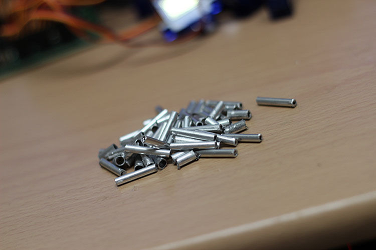

Horloge analogique / digitale - Arduino + papier
################################################

:author: Jacky Mok
:translator: Alexis Métaireau, f4grx
:level: avancé
:category: art,informatique
:date: 2013-08-17
:license: By-NC-SA

.. note::

   Cet article est une traduction adaptée de l'article de alstroemerie
   originalement paru en anglais `sur instructables
   <http://www.instructables.com/id/DigitalAnalog-Clock-Arduino-PaperCraft/>`_.

   Aperçu de l'horloge une fois terminée

Dans ce tutoriel Instructables nous allons recréer une horloge inspirée du
design original d'Alvin Aronson.

Quand j'ai vu cette horloge pour la première fois, j'ai été très impréssionné
par l'élégance et la simplicité de sa conception, et j'ai tout de suite
souhaité recréer cet effet.  J'espère que certains d'entre vous auront la même
impression et que vous pourrez utiliser ce guide pour réussir à vous en
fabriquer une vous même.

   Autre aperçu de l'horloge une fois terminée
 
Globalement, nous avons un horloge à sept segments dans laquelle au lieu
d'avoir des LEDs, les seguements bougent de l'intérieur à l'extérieur de
l'afficheur. L'ombre créée par ces chiffres blancs sur fond blanc permet de
lire l'heure. En utilisant 28 servomoteurs, il est possible d'utiliser un
arduino pour mettre d'abord l'heure en forme et ensuite afficher les bons
chiffres comme il faut, grâce au controleur de servomoteurs. Vous en saurez
plus dans les prochaines étapes.
 
J'ai essayé d'utiliser des composants aussi simples que possible, en utilisant
des éléments facilement trouvables en magasin de bricolage, de manière à ce que
chacun puisse commencer à explorer la création de sa propre horloge, même sans
connaissances approfondies en électronique. Je n'ai pas d'imprimante 3D donc la
structure est faite avec du papier.
  
Étape 1: récupérez des matériaux
================================
Voilà les choses dont vous allez avoir besoin. Mon intention est de participer
au concours de kits, donc je me suis contraint à utiliser des élements simples
qui n'ont pas besoin d'être soudés.

Vous pouvez aussi utiliser un Arduino Mega (qui peut controler 64 servos)
plutôt qu'un arduino uno et un contrôleur de servos. La fabrication coute à peu
près 130$ en pièces détachées.

Gardez en tête que vous pouvez réutiliser les pièces pour d'autres super
projets, comme par exemple un Hexapode.

   Un arduino Uno et un SSC32

Le kit elecronique:
-------------------

- Un arduino Uno
- DS1307 ou une carte breakout pour RTC, pour conserver l'heure
- Un controleur de servomoteurs
- 28 servo - ils peuvent pivoter à 180 degrés (demi tour)

   Des servomoteurs

Construction:
-------------
 
- Carton fin ou bristol
- Tube aluminium pour modélisme* - pour que les seguements puissent se déplacer
  doucement; on a besoin d'un tube interieur et d'un tube extérieur
- Scotch double face
- Carrés de scotch double face épais
- Trombones

 * Ou utilisez un pack de bouchons de stylos bas-prix

.. figure:: horloge-papier/step1-5.jpg
   :alt: Le matériel de dessin
   :target: horloge-papier/step1-5.jpg
 
Outils
------
 
- Un cutter pour papier - Silhouette portrait (optionnel)
- Un pistolet à colle
- Un dremel (perceuse) pour les tubes.
- Un couteau (optionnel)
 
Etape 2: Tester les composants électroniques
============================================

.. figure:: horloge-papier/step2-1.jpg
   :alt: Autre vue sur des servomoteurs.
   :target: horloge-papier/step2-1.jpg

   Nos servomoteurs.
 
Donc maintenant vous avez un joli paquet de servos. Il vaut mieux commencer par
les tester (un des miens était défectueux.)
 
Connectez le SSC-32 à l'arduino, en vous basant sur l'image jointe
http://marc-tetrapod.blogspot.ca/2012/10/arduino-ssc-32-servo.html

    
   Plan de connection entre le SSC-32 et l'Arduino.

   Un RTC.
 
La RTC vous permet de garder l'heure grâce à une petite batterie au lithium.
N'importe quel appareil avec une horloge (votre ordi, votre téléphone) en a
une. C'est la méthode la plus standard pour conserver l'heure sur un appareil
dont l'alimentation est constamment allumée et éteinte. Nous connecterons ce
circuit plus tard dans le tutoriel.

Etape 3: Concevoir l'horloge
============================

Les pièces suivantes ont été conçues dans Adobe Illustrator, avec pour
objectif de les découper das du papier. Si vous utilisez une imprimante 3D, les
méthodes seront différentes, mais les idées de base restent les mêmes.

N'oubliez pas non plus de partager vos designs!
 
Il y a 6 couches:
        
 [01] Face avant  -Coté horloge
 [01] Face avant - Coté Segments
 [02] Masque avvant - Il  tient les tubes
 [03] Base - Elle tient les servos et les tubes 
 [03] Base - Idem
 [04] Masque arrière - Il tient les servos
 
Note: quelques fichiers vont devoir être découpés deux fois. Voir au dessus
pour les détails de commande.

Etape 4: Couper les pièces
==========================

Les pièces  suivantes ont été conçues dans Adobe Illustrator puis coupéées avec
une machine Silouhette Portrait. Si vous avez le temps, vous pouvez aussi
couper ces couches à la main.

Les barres métalliques ont été coupées à la Dremel. Le gros tube a été débité
en morceaux de 1cm et celui qui se déplace dedans a été coupé en morceaux de
2cm.

.. figure:: horloge-papier/step4-7.jpg
   :target: horloge-papier/step4-7.jpg

Etape 5: Assemblage
===================
 
À cette étape vous allez assembler les couches en utilisant du scotch double
face épais pour fabriquer le corps. Guidez vous sur les images.

Note: le tube métallique est inséré dans chaque segment.

 
Etape 6: ajouter les segments
=============================
 
Etapes pour l'avant:

- Placer les petits plats dans les grands ;)
- Coller
- Placer le segment
- Répéter

.. figure:: horloge-papier/step6-4.jpg
   :target: horloge-papier/step6-4.jpg

Etapes pour l'arrière:

- Couper  et plier les trombones comme sur les images
- Coller
- Insérer
- Plier
- Répéter

Etape 7: Ajouter les servomoteurs
=================================

Connecter les servomoteurs aux trombones de l'étape précédente. Le cadre
permettra d'éviter le glissement des servos. Vous pouvez aussi les coller.

 
Etape 8:  Finir la construction
===============================
 
Ajouter la dernière couche (la face arrière)

Etape 9: Connecter l'électronique
=================================

Contrôleur de servos:

Il y a 32 pins sur le SSC-32, connectez-y vos 28 servos en vérifiant leur ordre
Connectez la patte RX au TX de l'arduino
Connectez la patte de masse à la masse de l'arduino

RTC [DS1307]

Pour plus d'infos, consulter http://learn.adafruit.com/ds1307-real-time-clock-breakout-board-kit/overview
 
 Connecter 5V au 5V de l'arduino
 Connecter GND au GND de l'arduino
 Connecter SDA à la patte analogique 4 de l'arduino
 Connecter SCL à la patte analogique 5 de l'arduino

Etape 10: Programmation
=======================

Algorithme
  
Boucle principale:
------------------
 
- Récupérer l'heure du module RTC (heures et minutes)
- Si l'heure a changé, Afficher l'heure
- Répéter

Afficher l'heure:
-----------------

- Séparer l'heure en 4 digits (en utilisant la fonction modulo et division par
  10)
- Pour chaque affichage 7 segments, déplacer le segment pour afficher le
  chiffre.

Afficher un chifre:
-------------------
 
Mettre en place votre logique de décodage. Transformez chaque entier en une
liste de segments à afficher

Déplacer les servos requis pour leur donner l'angle souhaité. Les segments
affichés doivent être mis à l'angle X et les segments éteints doivent être mis
à l'angle Y.

 NDT: a mon avis il faut calibrer ça pour chaque segment

Le code source viendra bientôt. Il a besoin d'être un peu revu et modifié.
 
Autres choses
-------------
 
Vous allez vouloir régler la RTC à l'heure correcte à la première utilisation.
Cela lui donnera l'heure de votre ordinateur. Vous avez besoin de la lib RTC et
d'exécuter le code suivant::
       
   #include <Wire.h>
   #include "RTClib.h"
   
   RTC_DS1307 RTC;
   
   void setup () {
       Serial.begin(57600);
   
       Wire.begin();
   
       RTC.begin();
     
       if (! RTC.isrunning()) {
       Serial.println("RTC is NOT running!");
       RTC.adjust(DateTime(__DATE__, __TIME__));
       }
   }
  
  
Etape 11: Terminer
==================

Donc voila.  J'espère que vous avez appris plein de choses dans cet
instructable, et que votre horloge marche bien. Je mettrai à jour cet
instructable selon les ajustements que je prévois de faire pour mieux afficher
les chiffres. La vidéo arrive bientot.

.. figure:: horloge-papier/step11.jpg
   :target: horloge-papier/step11.jpg

Si vous aimez ce projet, merci de voter pour lui sur instructables:
http://www.instructables.com/id/DigitalAnalog-Clock-Arduino-PaperCraft/step11/Finish/ 
Merci de m'avoir lu!
