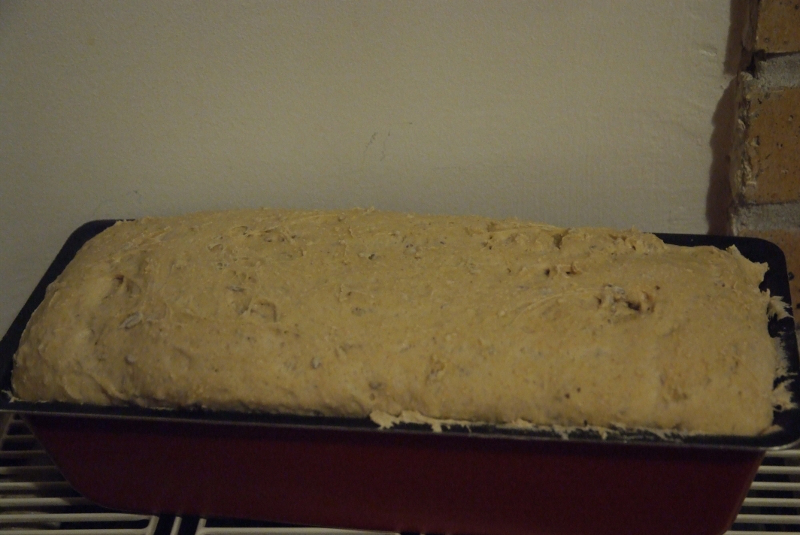
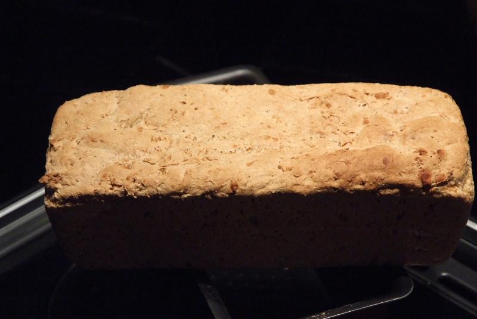

Recettes pour manger et jouer avec les enfants
==============================================

:date: 2013-12-21
:category: cuisine
:level: très facile
:author: Emilie Wright
:licence: By-NC-SA 3.0

Faire son pain
::::::::::::::

La base
-------

Pour faire la base d'un pain il faut :

- 500 grammes de farine (spéciale pour pain),
- 1 grosse cuillère à café de sel,
- 2 sachets de levure de boulanger lyophilisés,
- 330 ml d'eau tiède environ.

La farine spéciale pour pain se trouve dans les rayons "Farines" des grandes surfaces. En ce qui me concerne j'utilise 
les farines Francine, notamment la "multi-céréales".

Mettez tous les ingrédients (sauf l'eau) dans un robot (vous pouvez le faire à la main si vous n'avez pas de robot), 
mélangez et ajoutez l'eau progressivement. Une boule de pâte se forme. Il faut que cette boule ne colle pas aux 
doigts et ne soit pas trop sèche (c'est très rapide avec un robot - moins à la main). 

Je met cette pâte dans un moule à cake pour donner une forme au pain qui permette de faire des tartines pour le
matin. Vous pouvez aussi faire de jolies boules (moins pratique pour obtenir de belles tartines).

Faire lever cette pâte pendant 1h30 à 2h en la couvrant avec un torchon soit sur un radiateur (comme c'est l'hiver) 
ou à 40°C maximum dans un four (certains fours ont un programme spécifique pour faire lever les pâtes).

   Le pain a bien levé... vite au four !

Mettez une lèche frite dans le four et une grille au dessus et faîtes préchauffer le four.
Lorsque la pâte est bien levée (ne la laissez pas trop longtemps, ça fait de grosses bulles qui retombent à la 
cuisson) enfournez à 220°C pendant 25 minutes : Au moment d'enfourner mettez un peu d'eau dans la lèche frite.

Sortez le pain du four et démoulez le. Pour le conserver plus longtemps emballez le dans un torchon.

   Le pain est cuit.

À la farine blanche
-------------------

On peut remplacer la moitié (peut-être plus, je n'ai pas essayé) de la farine spéciale pour pain avec de la 
farine blanche (qui est nettement moins chère). Le pain est légèrement plus blanc et est toujours aussi bon.

Au maïs
-------

Pour faire du pain au maïs il faut utiliser de la farine de maïs (on en trouve dans les magasins bio). Attention 
toutefois de ne pas mettre trop de farine de maïs sinon le pain ne se fera pas : 100 g est une bonne quantité.

A la farine de chataigne
------------------------

Utilisez jusqu'à 200g de farine de chataigne pour faire ce pain. Un pain à la farine de chataigne ne lève pas 
beaucoup et est très dense. Pour l'agrémenter un peu vous pouvez ajouter des raisins secs.

Agréments
---------

Il est possible d'ajouter des ingrédients en fonction du moment auquel vous destinez votre pain. J'ai fait des 
pains :

- aux abricots secs,
- aux oignons et au fromage (oignons rouges ou doux et gruyère rapé),
- aux lardons,
- au cumin.

Laissez votre imagination parler et faites vos propres essais !

La pâte à modeler
:::::::::::::::::

Ingrédients :

- 2 verres de farine
- 2 verres d'eau
- 1/2 verre de maïzena
- 1/2 verre de sel
- 2 cuillères à soupe de poudre d'alun
- 1 cuillère à soupe d'huile
- Une goutte de colorant alimentaire

La poudre d'alun se trouve en pharmarcie.

Mélanger tous les ingrédients dans une casserole, les faire cuire en mélangeant tout le temps. C'est prêt quand le 
mélange forme une pâte qui se décolle des parois de la casserole et se met en boule.
Conservez cette pâte dans une boite en plastique hermétique au réfrigérateur. Elle se conserve sans problème pendant
des mois. Attention, cette pâte n'est pas comestible et ne doit pas être ingérée.

La pâte à sel
:::::::::::::

Ingrédients :

- 2 verres de farine
- 1 verre de sel
- un peu d'eau

Mélanger tous les ingrédients dans un récipient de manière à obtenir une pâte qui ne colle pas aux doigts.

Pour colorer la pâte à sel vous pouvez ajouter un peu de colorant alimentaire (mettez moins d'eau dans ce cas).
Vous pouvez aussi ajouter de l'huile essentielle pour donner un petit parfum à l'objet final (mettez encore
moins d'eau !).

Formez vos objets et faîtes les sécher.

La pâte à sel peut soit se faire sécher à l'air plusieurs jours soit 2h à 150°C au four à chaleur tournante. 
Le temps de séchage réel dépendra de la quantité d'eau utilisée.
