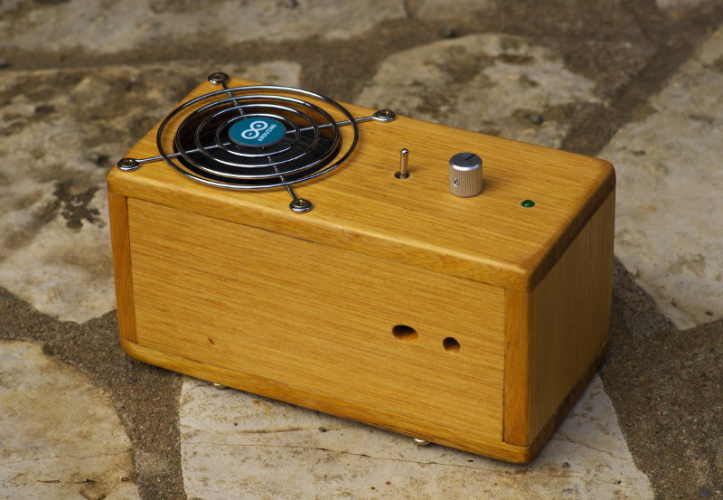

Un Theremin sous Arduino
########################

:date: 2013-11-01
:category: électronique,informatique
:level: vulgarisation, moyen
:author: Vincent Becker
:licence: By-Sa-3.0

   Rendu final du Theremin

Parmi les infinies possibilités de la plate-forme Arduino, la fabrication
d'instruments de musique est une des plus intéressantes. En voici un très
simple à réaliser: un Theremin.

Qu'est-ce qu'un Theremin?
=========================

Le Theremin est un instrument qui se joue sans contact: en approchant les mains
de deux antennes, on fait varier la fréquence et le volume du son, en général
un signal sinusoïde. L'instrument tire son nom de son inventeur, le Russe Lev
Sergueïevitch Termen, qui le mit au point en 1919, créant ainsi le tout premier
instrument de musique électronique.

Il connut son heure de gloire avec les
films de SF des années 50 puis les groupes psychédéliques des années 70. Avec
Arduino, nous n'allons pas faire un vrai Theremin, qui est un petit chef
d’œuvre d’électronique analogique, mais émuler son comportement avec certaines
limites par rapport au modèle mais certains avantages également.

Le concept
==========

Le concept général de l’instrument est très simple : deux télémètres, l’un pour
le volume et l’autre pour la fréquence, détectent la position des mains de
l’opérateur. L’Arduino génère alors le signal correspondant et l’envoie à un
haut-parleur via un amplificateur.

Le facteur principal pour le bon
fonctionnement de l’instrument est la vitesse d’exécution de la boucle loop().
En effet, volume et fréquence sont mis à jour une fois par exécution de la
boucle. Si celle-ci prend trop de temps, il en résulte un effet d’ « escalier »
: fréquence et volume varient par plateaux et non en continu. Cet effet ne peut
être entièrement éliminé mais doit être maintenu au plus faible niveau
possible.

Le code de base
===============

Le Theremin Arduino repose sur la génération d’un signal carré dont on fait
varier la fréquence et la longueur des plateaux. J’ai déniché ce code qui
permet précisément ça avec une grande économie de ressources, en évitant
notamment le « bit-bombing » d’un pin qui monopolise l’Atmel. J’avoue sans
honte que je ne sais pas exactement comment ce code fonctionne ! Ça a à voir
avec les interruptions de timer il me semble. Toujours est-il que ce code a
deux variables : une pour la fréquence, une pour le volume. En résumé, il est
parfaitement adapté au projet.

Matériel
========

Les détecteurs
--------------

Pour mesurer la distance des mains, j’ai tout d’abord fait des tests avec des
sonars. Mais ceux-ci n’ont pas été très concluants : le cycle de lecture de ces
capteurs est trop long (émission du signal – réception – encodage par le
capteur – décodage par l’Arduino) ce qui ralentissait considérablement
l’exécution de la boucle, d’où effet d’escalier mentionné précédemment. J’ai
finalement opté pour des télémètres à infrarouge Sharp qui sont beaucoup plus
réactifs et fonctionnent en continu : ils envoient une tension variable en
fonction de la distance mesurée qu’il suffit de lire sur un port analogique. On
en trouve de toutes sortes de portées, de quelques centimètres à plus de 5
mètres.   Les modèles choisis sont des GP2Y0A021YK d’une portée de 10 à 80cm.
Ce sont ceux qui offrent la meilleure précision de mesure pour l’usage prévu
sans qu’on ait besoin de battre des bras comme un albatros.

Le circuit audio
----------------

Pour l’amplificateur, j’ai fait très simple, reprenant ce que j’avais fait pour
mon horloge à base de Mac Mini (lien) : un simple MOSFET dont la porte est
reliée au pin émettant le signal carré et la source et le drain sur
l’alimentation 5V. Cet amplificateur est extrêmement rudimentaire mais très peu
onéreux et simple à mettre en place. En jouant avec différents condensateurs
pour adoucir un peu le signal de sortie, j’ai fini par rajouter deux
condensateurs électrolytiques de 22uF en parallèle en sortie de MOSFET.  Ce
sont ceux qui offraient le meilleur son et en augmentaient notablement le
volume. Pour mieux faire, il aurait fallu utiliser un véritable circuit
amplificateur et s’assurer d’avoir un décalage de tension de -2,5V. En effet,
le MOSFET donne une variation de tension entre 0 et 5V ; pour que le haut
parleur fonctionne de manière optimale, il vaudrait mieux que cette variation
soit de -2,5 à 2,5v. Il y a un Instructables très intéressant sur le sujet. Il
est possible que mes deux condensateurs fassent plus ou moins cet effet. Avec
un peu de calcul et un oscilloscope, on pourrait s’en assurer. Le circuit audio
se complète d’un potentiomètre de 50 ohms en série entre le MOSFET et le haut
parleur qui assure le contrôle de volume principal. Le haut parleur et un
Visaton FRS7 de 8 ohms d’impédance, infiniment supérieur aux mini haut-parleurs
des « starter kits » et qui offre des performances plus que suffisantes pour
cet usage.

L’alimentation
--------------

Je voulais que cet instrument soit nomade, j’ai donc fait appel à un module
LiPo Rider Pro auquel j’ai associé une batterie LiPo de 2000 mAh. Avec une
telle capacité, on peut jouer bien plus longtemps que ce qu’un être humain
normalement constitué est capable de supporter. Le tout se recharge par USB.

Les composants
--------------

Pour réaliser le montage, nous aurons besoin des composants suivants :

(liste)

Voici le schéma électronique d’ensemble réalisé avec Fritzing . On reconnaît
les éléments mentionnés ci-dessus : la batterie et le module LiPo Rider,
l’Arduino, les deux télémètres, l’amplificateur et le haut-parleur.

Le boîtier
==========

Un instrument de musique, c’est aussi un boîtier. Celui-ci remplit plusieurs
rôles : il protège le matériel, il améliore le son et il fait joli. Après
quelques tests, je me suis basé sur le principe de l’enceinte fermée. Wikipedia
a une page qui résume très bien les différentes options disponibles. Aucun
calcul de forme ou dimensions n’a été fait, je me suis basé sur l’unique
contrainte de la compacité. L’enceinte est donc dimensionnée au plus juste pour
pouvoir accueillir touts les composants. Le bois utilisé est du ramin, un bois
exotique dur à fibres serrées, très rigide et sonore, avec une belle couleur
chaude. Il se travaille très bien. Son principal inconvénient est d’être
responsable d’une part non négligeable de la déforestation de l’Indonésie… Mais
il m’en restait de la fabrication d’une bibliothèque, je l’ai donc utilisé.
Pour le protéger, j’y ai appliqué de l’huile pour bois incolore. C’est bien
mieux que le vernis, car cela protège l’aspect naturel du bois tout en
l’hydrofugeant parfaitement. Le tout est assemblé à la colle vinylique. Le trou
pour le haut parleur a été pratiqué à la scie cloche. Il est protégé par une
grille récupérée sur une alimentation de PC et ornée d’un logo ARduino. Un
petit trou situé à l’arrière permet de brancher le câble USB pour recharger la
batterie. Les orifices des télémètres ont une forme un peu particulière : un
simple trou permet de laisser passer le signal en émission, mais celui situé
devant le capteur de réception a dû être biseauté pour tenir compte de la
parallaxe.

Logiciel
========

La fréquence
------------

Pour convertir la mesure de distance en fréquence , il va falloir établir une
équation. Pour cela, on détermine tout d’abord  les valeurs extrêmes des
fréquences acceptables : après tests je me suis arrêté sur  300 pour la plus
haute fréquence et 10000 pour la plus basse (la fréquence est inverse aux
valeurs envoyées au pin). 300 et 10000 quoi, ça je l’ignore. En tout cas à
l’oreille, ce sont les valeurs limites avant d’arriver à des sons franchement
désagréables. La valeur retournée par le télémètre oscille entre à peu près 100
et 600 (avec une marge de sécurité). Si on regarde les caractéristiques du
signal envoyé par le télémètre, on se rend compte qu’il est plus ou moins
logarithmique en fonction de la distance :

(échelle capteur 1)

Sachant que la progression de la fréquence des notes de musique est
géométrique, si on se contente d’une simple conversion proportionnelle valeur
télémètre - fréquence on combine ces deux progressions et on se retrouve avec
90% de la plage de fréquences sur 10% de la distance utile mesurée par le
    capteur. C’est injouable. Mais si on regarde à nouveau les spécifications
    du capteur, on se rend compte que la distance mesurée est proportionnelle à
    l’inverse du voltage renvoyé par le capteur :

(échelle capteur 2)

Il suffit donc dans l’équation de conversion de prendre l’inverse de la valeur
lue par l’Arduino pour récupérer quelque chose de beaucoup plus utilisable en
n’ayant plus que la progression géométrique des notes. On peut donc, en
fonction des chiffres ci-dessus, établir une équation à deux inconnues qu’il
nous suffit de résoudre pour obtenir notre algorithme de conversion. Il est à
noter que dans les équations les valeurs mini et maxi renvoyées par le capteur
sont doublées (soit de 100 à 1200) car, pour une meilleure stabilité des
mesures, j’additionne deux mesures à la suite. Ce qui nous donne :

x/200+y = 10000 x /1200+y = 300

Ce qui nous donne :

Fréquence = 2328000/valeur-1640

Une mesure des notes en fonction de la distance nous donne alors cette courbe :

Soit environ 3 à 3,5 octaves jouables, ce qui est plutôt bien pour un
instrument de type Theremin !

Le volume
---------

Pour le volume, on procède exactement de la même manière en ayant pour valeurs
extrêmes de 0 à 35 pour les valeurs à retourner et de 300 à 1200 pour les
valeurs mesurées par le capteur. Tout ceci nous donne l’équation suivante :

Volume = 14000/valeur-12

Pour calculer au plus juste, j’ai fait une feuille de calcul OpenDocument
disponible ici.

On a donc toutes les données pour écrire le code.

Les variabes
------------

On commence par définir les variables principales :

int ledPin = 7; // diode témoin int IRPitch = A0; // pin de lecture du
télémètre de fréquence int IRVol = A1; // pin de lecture du télémètre de volume
int lecture_echo;  // variable pour lire la valeur renvoyée par le télémètre
int pitch; // fréquence int vol; // volume #define piezoPin 10 // pin de sortie
du signal son

On définit ensuite les limites en fréquence et volume :

#define minVol 0  // volume minimum (muet) #define maxVol 35  // volume maximum
#define maxPitch 10000 // fréquence mini  (valeur maxi, la fréquence est
inverse) On définit ensuite les constantes pour l’équation de conversion,
calculées précédemment : long xPitch = 2328000; long yPitch = -1640; long xVol
= 14000; long yVol = -12;

Le setup
--------

Dans la fonction setup(), on commence par definir les valeurs de base :

  pinMode(IRPitch, INPUT); // Telemetres pinMode(IRVol, INPUT);
  pinMode(piezoPin,OUTPUT); // pin haut-parleur

Puis la partie “magique” qui définit les fréquence et volume du signal carré:

  TCCR1A = 0x00; // sets timer control bits to PWM Phase and Frequency Correct
  mode TCCR1B = 0x12; // sets timer control bits to Prescaler N = 8

Et enfin l’allumage de la diode témoin en fin d’initialisation du Theremin :

  pinMode (ledPin, OUTPUT); digitalWrite(ledPin, HIGH);

La fonction de conversion convertIR()

Cette fonction a pour but de convertir les valeurs renvoyées par les télémètres
soit en volume, soit en fréquence, selon les équations établies ci-dessus.
Elles acceptent trois paramètres : la valeur mesurée par le télémètre et les
deux constantes. Le résultat calculé est ensuite renvoyé.

 int ConvertIR(int val, long x,int y) { // equation de conversion entre la
 mesure IR et la valeur a envoyer au haut parleur int converti=x/val+y; return
 converti; }

Loop
----

La boucle loop() est très simple : on lit successivement les deux capteurs
(deux fois, voir ci-dessus), on convertit la valeur lue en volume ou fréquence
et on renvoie le tout au pin 10 pour générer le son. Le résultat obtenu est
ensuite écrêté. Pour la fréquence, la valeur est limitée uniquement en minimum
pour ne pas descendre trop bas, ce qui donne un son vraiment affreux. Le
maximum est laissé libre pour éviter un effet de « plateau » en bout de course
particulièrement disgracieux à l’oreille. Pour le volume, la valeur est limitée
en mini et maxi. La limitation en mini est indispensable pour éviter un « plop
» très audible quand le volume atteint 0 (et passe en dessous ?)

La fréquence (pitch)
--------------------

  pitch = analogRead(IRPitch); // on lit le capteur pour la frequence pitch +=
  analogRead(IRPitch); // on additionne deux mesures pour lisser
  pitch=ConvertIR(pitch,xPitch,yPitch); // on convertit la mesure en fréquence
  pitch=min(pitch,maxPitch); // on limite la frequence vers le bas  ICR1 =
  pitch; // on envoie la frequence au pin de sortie

Le volume
---------

Pour le volume, c’est exactement la même chose à une différence près : on «
retourne » l’échelle avec la fonction map() avant de l’envoyer au pin, afin de
faire en sorte que le volume diminue quand on éloigne la main, contrairement à
un vrai Theremin. Ceci permet de couper le son brusquement lorsqu’on retire sa
main, au lieu de le mettre à fond. On peut ainsi « hacher » le son de manière
nette. vol = analogRead(IRVol); // on lit le capteur pour le volume vol +=
analogRead(IRVol); // on additionne deux mesures pour lisser vol =
ConvertIR(vol,xVol,yVol); // on convertit la mesure en volume
vol=constrain(vol,minVol,maxVol); // on limite les valeurs extremes du volume
sinon ça fait plop vol=map(vol,minVol,maxVol,maxVol,minVol); // on "retourne"
l'échelle pour que le son monte quand on approche la main (pas de main = muet)
analogWrite(piezoPin, vol); // on envoie le volume au HP

Les tous premiers essais avec ce code ont été relativement concluants, à
l’exception d’une tendance à grésiller, notamment à haute fréquence.
L’introduction d’un petit délai (10ms) dans la boucle a permis de réduire
notablement, mais pas éliminer, le phénomène.

Utilisation
===========

L’utilisation de l’instrument est on ne peut plus simple. Sur la face avant, un
interrupteur permet de l’allumer. Aussitôt que la LED s’éclaire, l’engin est
opérationnel. Le potentiomètre du volume principal est également placé à cet
endroit. Il suffit alors de déplacer ses mains pour jouer, comme le montre la
vidéo ci-dessous.  Si on regarde attentivement les courbes de réponse des
télémètres, on s’aperçoit que la valeur retournée repart dans l’autre sens
quand on est en dessous de la valeur minimale mesurable (ici 10cm). Lorsqu’on
joue, il faut donc faire attention à ne pas approcher ses mains en-deçà de
cette valeur. Evidemment ce n’est pas avec ça qu’on va remplir le stade de
France, mais c’est jouable avec un peu d’entraînement.
